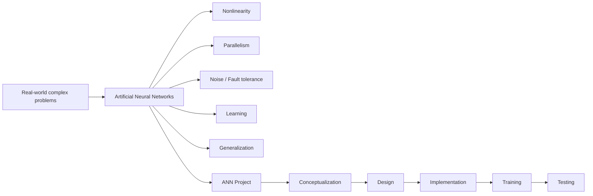
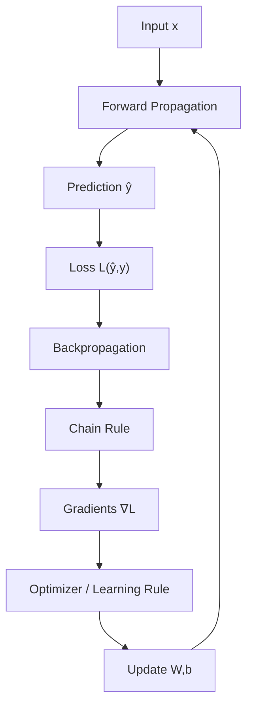
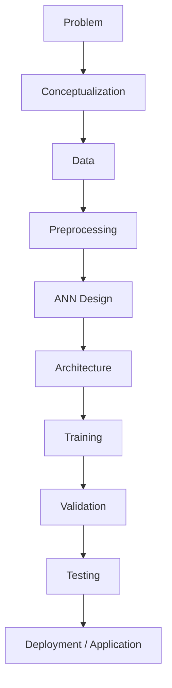

# Mạng nơ-ron nhân tạo (Artificial Neural Networks – ANNs)

Tham khảo từ: [paper](https://www.sciencedirect.com/science/article/abs/pii/S0167701200002013?via%3Dihub) _Artificial neural networks: fundamentals, computing, design, and application._ 

> Sức hấp dẫn của ANNs đến từ những đặc điểm xử lý thông tin nổi bật, chủ yếu là tính phi tuyến (nonlinearity), khả năng xử lý song song cao (high parallelism), khả năng chịu lỗi và nhiễu (fault and noise tolerance), khả năng học (learning) và khả năng tổng quát hóa (generalization).
>
> Cuối cùng, như một ứng dụng thực tế, __BPANNs__ được sử dụng để mô hình hóa đường cong tăng trưởng của vi sinh vật _S. flexneri_. Mô hình được xây dựng đạt độ chính xác tương đối tốt trong việc mô phỏng cả đường cong tăng trưởng phụ thuộc thời gian trên tập huấn luyện và tập kiểm tra, dưới tác động của nhiệt độ và pH.

---

## 1. Tổng hợp ý chính
- Tổng hợp thành Work flow:



> ANN không chỉ là một công thức hay một model. Nó là một phương pháp tính toán có khả năng học từ dữ liệu để giải quyết các bài toán phức tạp

1. Nonlinearity - Tính phi tuyến
    - Xử dụng các activation function để dự đoán các bài toán phức tạp hơn.

2. High parallelism - khả năng xử lý song song
    - Một layer có thể chứa hàng nghìn neuron:

```
             ┌── Neuron 1 ──┐
Input ───────┼── Neuron 2 ──┼──── Output
             ├── Neuron 3 ──┤
             ├── Neuron 4 ──┤
             └── Neuron N ──┘
```

3. Fault and noise tolerance - khả năng chịu lỗi và nhiễu

4. Learning - khả năng học
    - Quy tắc học (learning rule) xác định chính xác cách các trọng số của mạng (network weights) được điều chỉnh (cập nhật) giữa các chu kỳ huấn luyện liên tiếp (epochs)

    - Quy tắc học sửa lỗi (Error-Correction Learning – ECL) được sử dụng trong học có giám sát (supervised learning). Trong đó, sai số số học (error) giữa kết quả mà ANN tạo ra tại một thời điểm bất kỳ trong quá trình huấn luyện và đáp án đúng tương ứng (target) được sử dụng để điều chỉnh các trọng số kết nối, nhằm từng bước làm giảm sai số tổng thể của mạng.

5. Generalization - khả năng tổng quát hóa
    - Mô hình học được quy luật đủ tốt để dự đoán những dữ liệu chưa từng thấy. Chứ không phải là học thuộc n samples được huấn luyện rồi đem ra dùng.

### Learning Rule khác Loss Function như thế nào?
- Loss Function: __Model đang sai bao nhiêu %?__
    - VD: MSE = $\frac {1} {N} \sum^N_{i=1} y_i - \hat{y_i}^2$

- Learning Rule: __Biết model đang sai rồi, phải sửa weights như thế nào ?__
    - VD: Gradient Descent = $w \leftarrow w - \eta \frac {\partial L} {\partial w}$

### 4 loại Learning Rules (Hassoun, 1995; Haykin, 1994).

| Learning rule                 | Ý tưởng                                               |
| ----------------------------- | ----------------------------------------------------- |
| **Error-Correction Learning** | Dựa vào error để sửa weights                          |
| **Memory-Based Learning**     | Học bằng cách lưu/tra cứu các mẫu đã thấy             |
| **Hebbian Learning**          | Connections được củng cố dựa trên hoạt động đồng thời |
| **Competitive Learning**      | Các neuron cạnh tranh để neuron phù hợp nhất học      |

> Learning rule là cơ chế xác định cách weights thay đổi trong quá trình học.

## 2. Paper nhấn mạnh backpropagation
> paper tập chung làm thế nào để ANN học được weights!
>
> Với mục tiêu đó, bài báo trình bày chi tiết hơn về BPANNs (Backpropagation Artificial Neural Networks), bởi chúng có tính phổ biến cao, đồng thời có tính linh hoạt (flexibility) và khả năng thích nghi (adaptability) trong việc mô hình hóa một phạm vi rất rộng các bài toán thuộc nhiều lĩnh vực khác nhau.
>
> Thuật toán học lan truyền xuôi kết hợp lan truyền ngược sai số (feedforward error-backpropagation learning algorithm) là quy trình nổi tiếng nhất để huấn luyện ANN.

- Cách ANN học được Weights
```
              Forward
x ───────────────────────────→ ŷ
                                │
                                ↓
                              Loss
                                │
                                ↓
              Backward       Gradient
                                │
                                ↓
                          Update weights
```

- Toàn bộ BPANN Training


## 3. ANN project

Cấu trúc Project ANN thực tế:



Vậy trước khi xây dựng model ANN ta không chỉ viết `model = ANN()` rồi gọi `fit()` mà còn cấn quyết định:
- Input là gì?
- Output là gì?
- Data có đủ không?
- Architecture thế nào?
- Bao nhiêu layer?
- Bao nhiêu neuron?
- Activation function nào?
- Loss nào?
- Optimizer nào?
- Learning rate bao nhiêu?
- Có overfitting không?
- Validation thế nào?
- Test thế nào?

## 4. Popular ANNs - Các ANN phổ biến
> Simpson (1990) liệt kê 26 loại ANN khác nhau, còn Maren (1991) liệt kê 48 loại. Pham (1994) ước tính rằng có hơn 50 loại ANN tồn tại.
>
> Một số mạng có khả năng tốt hơn trong việc giải quyết các bài toán nhận thức (perceptual problems), trong khi những mạng khác phù hợp hơn với mô hình hóa dữ liệu (data modeling) và xấp xỉ hàm (function approximation).
>
> bài toán khác nhau → cấu trúc dữ liệu khác nhau → architecture phù hợp khác nhau.

- __Perceptual problem__ có thể hiểu đơn giản là bài toán liên quan đến nhận biết/nhận dạng pattern từ dữ liệu cảm giác hoặc tín hiệu phức tạp.

- __Function Approximation__: Giả sử có một hàm $y = f(x)$ nhưng ta không biết chính xác $f$ là gì, ta có dataset: $\{ (x_i, y_i)\}^N_{i=1}$. ANN học một hàm: $\hat{f}(x)$ sao cho $\hat{f}(x) \approx f(x)$

## 5. Example Code Pytorch

```python
import torch
import torch.nn as nn


class ANN(nn.Module):
    """
    Artificial Neural Network for binary classification.

    Architecture:
        Input:  2 features
        Hidden: 16 neurons + ReLU
        Output: 1 neuron + Sigmoid
    """

    def __init__(self, input_dim: int = 2, hidden_dim: int = 16, output_dim: int = 1):
        super().__init__()

        self.network = nn.Sequential(
            nn.Linear(input_dim, hidden_dim),
            nn.ReLU(),
            nn.Linear(hidden_dim, output_dim),
            nn.Sigmoid(),
        )

    def forward(self, x: torch.Tensor) -> torch.Tensor:
        return self.network(x)
```