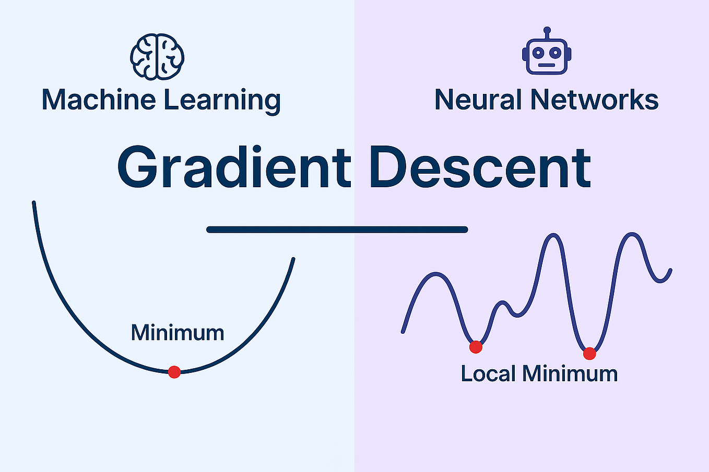
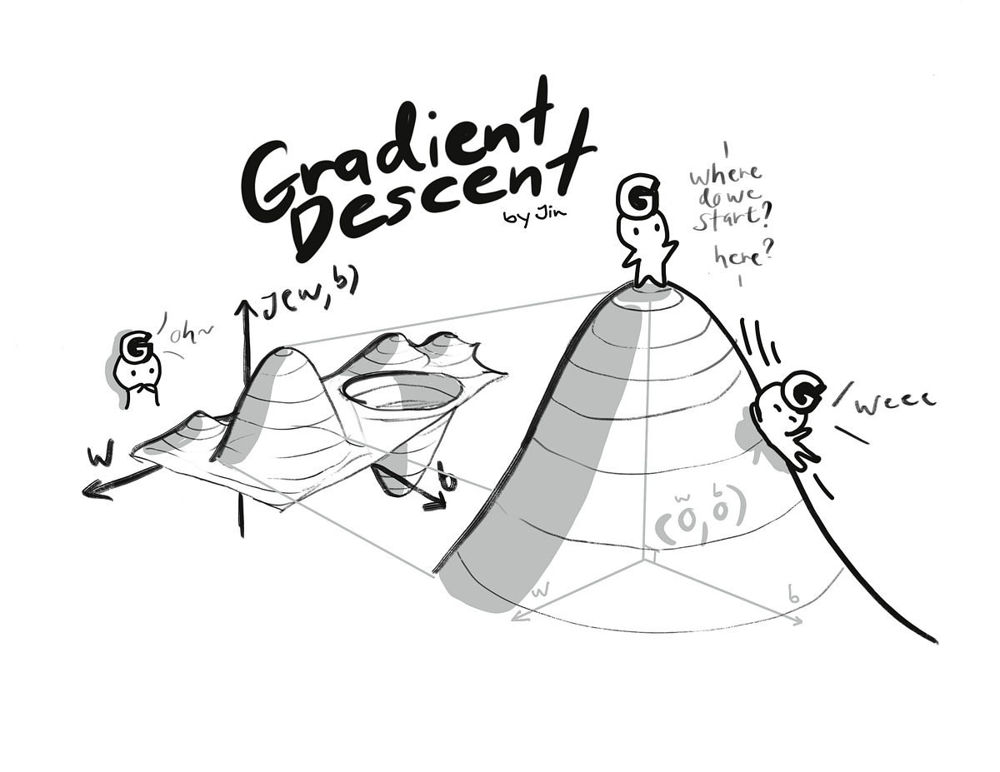
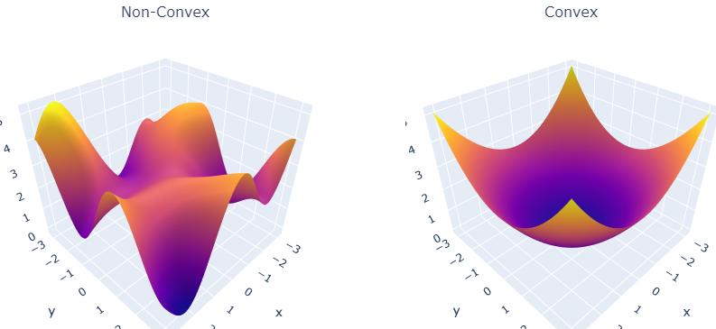
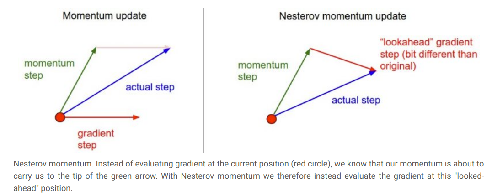

# Optimization



## What - Optimization là gì?

__Optimization__ là quá trình tìm bộ tham số (__weights, biases__) giúp __loss function__ đạt giá trị nhỏ nhất bằng cách cập nhật tham số theo __gradient__.

Mục tiêu của optimization không phải tìm lời giải chính xác tuyệt đối, mà là tìm một nghiệm đủ tốt để mô hình tổng quát hóa (generalize) trên dữ liệu chưa thấy.

- __Input__: Loss function + Gradient
- __Output__: Updated parameters (θ)

## Why - tại sao cần Optimization?

Neural network có hàng nghìn đến hàng tỷ tham số, không thể tìm nghiệm bằng công thức giải tích.

Optimization được sử dụng để:
- Giảm giá trị của __loss function__.
- Tăng tốc độ hội tụ (convergence).
- Giảm dao động khi cập nhật trọng số.
- Tránh kẹt tại __local minima, plateau__ hoặc __saddle point__.
- Giúp mô hình đạt hiệu năng cao với số epoch hợp lý.

Không có optimization, mô hình sẽ không học được từ dữ liệu.


## Where - Optimization được sử dụng ở đâu?

Optimization xuất hiện trong __training loop__, ngay sau bước tính gradient.

```
Input
   │
Forward Pass
   │
Prediction
   │
Loss Function
   │
Backward Pass
   │
Gradient (∂L/∂θ)
   │
Optimizer
   │
Update Parameters
   │
Next Iteration
```

Optimizer __không tính gradient và không tính loss__.

Nó chỉ sử dụng gradient do Backpropagation cung cấp để cập nhật tham số.

## When — Khi nào Optimization được thực hiện?

Optimization được thực hiện sau mỗi lần hoàn thành:
1. Forward Pass
2. Loss Computation
3. Backward Pass

Sau khi gradient đã được tính, optimizer sẽ cập nhật tham số.

Đối với Mini-batch SGD, quá trình này diễn ra sau mỗi batch.

```
for each batch:
    Forward
    Compute Loss
    Backward
    Optimizer Step
```

## Which - Các phương pháp Optimization phổ biến

| Optimizer        | Ý tưởng chính                              | Ưu điểm                         | Hạn chế                                         |
| ---------------- | ------------------------------------------ | ------------------------------- | ----------------------------------------------- |
| Gradient Descent | Cập nhật bằng toàn bộ dataset              | Ổn định                         | Chậm, tốn tài nguyên                            |
| SGD              | Cập nhật theo từng sample hoặc mini-batch  | Nhanh, thoát local minima tốt   | Gradient nhiều nhiễu                            |
| Momentum         | Tích lũy hướng cập nhật trước đó           | Giảm dao động, hội tụ nhanh hơn | Cần điều chỉnh momentum                         |
| RMSProp          | Điều chỉnh learning rate theo từng tham số | Phù hợp gradient thay đổi mạnh  | Có thể hội tụ chậm                              |
| Adam             | Momentum + RMSProp                         | Hội tụ nhanh, ít cần tinh chỉnh | Có thể generalize kém hơn SGD ở một số bài toán |

## How — Optimization hoạt động như thế nào?

Optimization lặp lại quy trình sau cho đến khi mô hình hội tụ:

1. Thực hiện __Forward Pass__ để tạo prediction.
2. Tính __Loss Function__.
3. Dùng __Backpropagation__ để tính gradient.
4. Optimizer sử dụng gradient để cập nhật tham số.
5. Lặp lại cho batch tiếp theo.

Quy tắc cập nhật cơ bản của Gradient Descent:

$$\theta_{t+1} = \theta_t - \eta \nabla_\theta L(\theta_t)$$

Trong đó:
- $\theta$: tham số của mô hình
- $\eta$: Learning rate.
- $\nabla_\theta L$: Gradient của Loss theo tham số

Các optimizer hiện đại (Momentum, RMSProp, Adam) đều mở rộng công thức này bằng cách bổ sung thông tin như:

- __Momentum__: sử dụng hướng cập nhật của các bước trước để tăng tốc.
- __Adaptive Learning Rate__: tự điều chỉnh learning rate cho từng tham số.
- __Moving Average__: làm mượt gradient nhằm giảm dao động và tăng tính ổn định.

## Các khái niệm quan trọng trong Optimization

| Khái niệm               | Ý nghĩa                                                                                                                 |
| ----------------------- | ----------------------------------------------------------------------------------------------------------------------- |
| Convex Loss             | Chỉ có một nghiệm tối ưu toàn cục (Global Minimum).                                                                     |
| Non-convex Loss         | Có nhiều Local Minima và Saddle Points; hầu hết neural network thuộc loại này.                                          |
| Local Minimum           | Điểm cực tiểu trong một vùng nhưng chưa chắc là tốt nhất toàn cục.                                                      |
| Global Minimum          | Giá trị loss nhỏ nhất trên toàn bộ không gian tham số.                                                                  |
| Saddle Point            | Gradient gần bằng 0 nhưng không phải cực tiểu; rất phổ biến trong mô hình nhiều chiều và có thể làm chậm quá trình học. |
| Learning Rate           | Kích thước bước cập nhật của optimizer. Quá lớn gây dao động, quá nhỏ làm hội tụ chậm.                                  |
| Learning Rate Scheduler | Điều chỉnh learning rate theo thời gian (Step Decay, Cosine Annealing, Warmup) để tăng độ ổn định và cải thiện hội tụ.  |

> Optimization là quá trình sử dụng gradient để cập nhật weights nhằm giảm loss function. Mọi optimizer đều giải quyết cùng một bài toán: làm thế nào để mô hình hội tụ nhanh hơn, ổn định hơn và đạt nghiệm tốt hơn trong không gian loss phi lồi (non-convex loss landscape). Gradient Descent là nền tảng, trong khi SGD, Momentum, RMSProp và Adam là các chiến lược cải tiến giúp tăng tốc hội tụ và cải thiện hiệu quả huấn luyện.

## các phương pháp Optimization



### Gradient Descent (Vanilla Gradient Descent)
#### Khái niệm

Gradient Descent là thuật toán tối ưu cơ bản nhất trong Machine Learning và Deep Learning. Thuật toán cập nhật toàn bộ trọng số của mô hình theo hướng ngược với gradient của hàm mất mát nhằm giảm giá trị loss sau mỗi lần lặp.

Công thức cập nhật:

$$w_{t+1} = w_t - \eta \nabla L(w_t)$$

trong đó:
- $w$: trọng số của mô hình.
- $\eta$: learning rate
- $\nabla_\theta L$: Gradient của hàm loss

#### Đặc điểm

- Sử dụng gradient của toàn bộ dataset trước mỗi lần cập nhật.
- Hội tụ ổn định do gradient chính xác.
- Chi phí tính toán lớn khi dữ liệu nhiều.
- Không phù hợp với các mô hình Deep Learning hiện đại.

#### Ưu điểm

- Đơn giản, dễ cài đặt.
- Gradient chính xác.
- Hội tụ ổn định trên bài toán nhỏ.

#### Nhược điểm

- Tốc độ huấn luyện chậm.
- Tiêu tốn nhiều bộ nhớ.
- Không mở rộng tốt với dữ liệu lớn.

---

### Stochastic Gradient Descent (SGD)
#### Khái niệm

SGD là biến thể của Gradient Descent, trong đó gradient được tính từ một mẫu dữ liệu ngẫu nhiên thay vì toàn bộ tập dữ liệu.

Mỗi lần xử lý một sample, mô hình cập nhật trọng số ngay lập tức.

#### Đặc điểm

- Batch size = 1.
- Gradient chứa nhiều nhiễu (noise).
- Cập nhật liên tục sau mỗi sample.

#### Ưu điểm

- Huấn luyện nhanh.
- Ít tốn bộ nhớ.
- Noise giúp thoát khỏi Local Minima và Saddle Point.

#### Nhược điểm

- Dao động mạnh.
- Khó hội tụ ổn định.
- Phụ thuộc nhiều vào Learning Rate.

---

### Mini-batch Gradient Descent
#### Khái niệm

Mini-batch Gradient Descent là phương pháp được sử dụng phổ biến nhất hiện nay. Gradient được tính trên một nhóm nhỏ dữ liệu (mini-batch) trước khi cập nhật trọng số.

#### Đặc điểm

- Cân bằng giữa Batch GD và SGD.
- Gradient đủ chính xác nhưng vẫn có một lượng noise cần thiết.
- Tận dụng khả năng tính toán song song của GPU.

#### Ưu điểm

- Tốc độ huấn luyện cao.
- Hội tụ ổn định.
- Hiệu quả trên GPU.
- Là tiêu chuẩn trong huấn luyện Deep Learning.

#### Nhược điểm

- Cần lựa chọn Batch Size phù hợp.
- Batch quá nhỏ gây nhiễu lớn.
- Batch quá lớn làm giảm khả năng tổng quát hóa.

---

### Momentum
#### Khái niệm

Momentum cải tiến Gradient Descent bằng cách tích lũy hướng di chuyển từ các bước cập nhật trước, thay vì chỉ sử dụng gradient hiện tại.

Công thức:

$$v_t = \beta v_{t-1} + \nabla L(w_t)$$
$$w_{t+1} = w_t + \eta v_t$$

Trong đó:
- $v$: velocity
- $\beta$: hệ số momentum.

#### Ý tưởng

Momentum hoạt động giống như __một quả bóng lăn xuống dốc__.
- Nếu gradient liên tục cùng hướng → tốc độ tăng.
- Nếu gradient dao động → giảm rung lắc.

#### Ưu điểm
- Hội tụ nhanh hơn Gradient Descent.
- Giảm dao động trong các vùng hẹp.
- Giúp vượt qua Saddle Point dễ hơn.

#### Nhược điểm
- Phải lựa chọn hệ số Momentum.
- Momentum quá lớn có thể vượt quá điểm cực tiểu.

---

### Adam (Adaptive Moment Estimation)
Khái niệm

Adam kết hợp hai ý tưởng: __Momentum (First Moment)__ và __Adaptive Learning Rate (Second Moment)__. Adam lưu hai thống kê cho mỗi trọng số:

- First Moment (m): trung bình gradient.
- Second Moment (v): trung bình bình phương gradient.

Công thức:

- First Moment

$$m_t = \beta_1 m_{t-1} + (1-\beta_1) g_t$$

- Second Moment

$$v_t = \beta_2 v_{t-1} + (1-\beta_2) g^2_t$$

Bias Correction:

$$\hat m = \frac {m_t} {1-\beta^t_1}$$

$$\hat v = \frac {v_t} {1-\beta_2^t}$$

Cập nhật trọng số:

$$w = w - \eta \frac {\hat m} {\sqrt{\hat v} + \epsilon}$$

#### Ý tưởng

Mỗi trọng số sẽ có __learning rate riêng__.

- Gradient lớn → bước cập nhật nhỏ.
- Gradient nhỏ → bước cập nhật lớn.

Nhờ đó Adam hội tụ nhanh và ổn định hơn.

#### Hyperparameters mặc định

| Tham số       | Giá trị |
| ------------- | ------- |
| Learning Rate | 0.001   |
| β₁            | 0.9     |
| β₂            | 0.999   |
| ε             | 1e-8    |

#### Ưu điểm

- Hội tụ rất nhanh.
- Ít cần điều chỉnh hyperparameter.
- Phù hợp với hầu hết bài toán Deep Learning.
- Hoạt động tốt khi gradient thưa (Sparse Gradient).

#### Nhược điểm

- Tiêu tốn nhiều bộ nhớ hơn SGD.
- Một số bài toán có khả năng tổng quát hóa kém hơn SGD with Momentum.

---

### Learning Rate Schedule
#### Khái niệm

Learning Rate Schedule là kỹ thuật thay đổi Learning Rate trong quá trình huấn luyện nhằm cân bằng giữa tốc độ học ban đầu và khả năng hội tụ ở giai đoạn cuối.

#### Các phương pháp phổ biến
| Method            | Ý tưởng                              | Khi sử dụng                |
| ----------------- | ------------------------------------ | -------------------------- |
| Step Decay        | Giảm Learning Rate sau mỗi N Epoch   | Huấn luyện thông thường    |
| Exponential Decay | Learning Rate giảm theo hàm mũ       | Hội tụ mượt hơn Step Decay |
| Cosine Annealing  | Learning Rate giảm theo đường Cosine | Deep Learning hiện đại     |
| Warmup + Decay    | Tăng dần Learning Rate rồi giảm      | Transformer và mô hình lớn |

#### Vai trò
- Tăng tốc giai đoạn đầu.
- Giảm dao động gần điểm hội tụ.
- Cải thiện độ ổn định khi huấn luyện.

---

### Convex và Non-convex Optimization



#### Convex Optimization

Là bài toán mà hàm mất mát chỉ có một Global Minimum.

##### Đặc điểm:

- Gradient Descent luôn hội tụ về nghiệm tối ưu.
- Dễ tối ưu.
- Ví dụ: $f(x) = x^2.$

#### Non-convex Optimization

Neural Network có hàm mất mát Non-convex, gồm nhiều:

- Local Minima.
- Saddle Point.
- Flat Region.

Đặc điểm:

- Không đảm bảo tìm được Global Minimum.
- Khó tối ưu hơn Convex.
- Momentum và Mini-batch giúp vượt qua Saddle Point hiệu quả hơn.

---

### Loss Landscape
#### Khái niệm

Loss Landscape là bề mặt biểu diễn mối quan hệ giữa Loss Function và toàn bộ không gian trọng số của mô hình.

Do Neural Network có hàng triệu tham số, Loss Landscape thực tế tồn tại trong không gian nhiều chiều. Khi trực quan hóa, người ta thường chọn hai hướng ngẫu nhiên trong không gian trọng số để biểu diễn thành bề mặt 2D hoặc 3D.

#### Đặc điểm
- __Sharp Minimum__: vùng cực tiểu hẹp, loss tăng nhanh khi trọng số thay đổi nhỏ; thường có khả năng tổng quát hóa (generalization) kém.
- __Flat Minimum__: vùng cực tiểu rộng, loss thay đổi ít khi trọng số dao động; thường mang lại khả năng tổng quát hóa tốt hơn.

Trong thực tế, __SGD with Momentum__ thường tìm được __Flat Minima__ nhờ nhiễu (noise) từ Mini-batch, trong khi __Adam__ có xu hướng hội tụ nhanh hơn nhưng đôi khi rơi vào __Sharp Minima__, dẫn đến độ chính xác trên tập kiểm tra có thể thấp hơn ở một số bài toán. Đây là một trong những lý do SGD with Momentum vẫn được ưu tiên trong nhiều mô hình thị giác máy tính (Computer Vision) khi mục tiêu là tối ưu khả năng tổng quát hóa.

--- 

## Momentum & Nesterov, Adaptive Optimizers



---

### Momentum
#### Khái niệm

__Momentum__ là phương pháp cải tiến __Gradient Descent__ bằng cách sử dụng __lịch sử các gradient trước đó__ để quyết định hướng cập nhật hiện tại, thay vì chỉ dựa trên gradient của bước hiện tại.

Ý tưởng này mô phỏng quán tính của một vật đang lăn xuống dốc: nếu nhiều bước liên tiếp có cùng hướng, tốc độ sẽ tăng lên; nếu hướng thay đổi liên tục, dao động sẽ được giảm bớt.

#### Nguyên lý hoạt động

Momentum lưu một biến __velocity (v)__ để tích lũy gradient.

$$v_t = \beta v_{t-1} + \nabla L(w_t)$$

$$w_{t+1} = w_t - \eta v_t$$

Trong đó:
- $v_t$: vận tốc (velocity)
- $\beta$: Hệ số momentum.
- $\eta$: learning rate
- $\nabla L(w_t)$: gradient tại bước hiện tại

Gradient mới chỉ đóng góp một phần, trong khi hướng di chuyển trước đó vẫn được duy trì.

#### Phân tích

Nếu gradient liên tục cùng chiều:

- Velocity tăng dần.
- Bước cập nhật lớn hơn.
- Hội tụ nhanh hơn.

Nếu gradient liên tục đổi chiều:

- Velocity triệt tiêu một phần.
- Dao động giảm.
- Đường đi mượt hơn.

Điều này đặc biệt hiệu quả trong các __narrow valleys__, nơi Gradient Descent thường zig-zag giữa hai thành của thung lũng.

#### Ưu điểm
- Hội tụ nhanh hơn Gradient Descent.
- Giảm dao động.
- Vượt qua Saddle Point tốt hơn.
- Ít bị mắc kẹt trong vùng phẳng.

#### Nhược điểm
- Có thể vượt quá cực tiểu nếu momentum quá lớn.
- Cần điều chỉnh hệ số $\beta$.

---

### Nesterov Accelerated Gradient (NAG)
#### Khái niệm

Nesterov là phiên bản cải tiến của Momentum.

Khác với Momentum chỉ sử dụng gradient tại vị trí hiện tại, Nesterov __ước lượng trước vị trí sắp đến (Look Ahead)__ rồi mới tính gradient.

Nói cách khác:

> Momentum: __Đi rồi mới quan sát__.
> 
> Nesterov: __Quan sát trước rồi mới đi__.

#### Nguyên lý hoạt động

Momentum:

$$g_t = \nabla L (w_t)$$

Nesterov:

$$g_t = \nabla L(w_t - \eta \beta v_{t-1})$$

Sau đó:

$$v_t = \beta v_{t-1} + g_t$$

$$w_{t+1} = w_t - \eta v_t$$

Gradient được tính tại __điểm dự đoán phía trước__ thay vì điểm hiện tại.

#### Ý tưởng trực quan

Giả sử một quả bóng đang lao xuống núi.

- Momentum chỉ nhìn vị trí hiện tại rồi tiếp tục lăn.
- Nesterov nhìn trước vài mét để xem địa hình phía trước dốc hay bằng phẳng rồi mới quyết định lực đẩy.

Nhờ vậy thuật toán phản ứng sớm hơn khi sắp đến cực tiểu.

#### Phân tích
Ưu điểm lớn nhất của Nesterov là:

- Phanh sớm khi gần Minimum.
- Giảm hiện tượng Overshoot.
- Hội tụ ổn định hơn Momentum.

Đặc biệt hiệu quả với các bài toán có Loss Landscape cong mạnh.

### So sánh Momentum và Nesterov

| Momentum                          | Nesterov                         |
| --------------------------------- | -------------------------------- |
| Gradient tính tại vị trí hiện tại | Gradient tính tại vị trí dự đoán |
| Có thể vượt quá Minimum           | Giảm Overshoot                   |
| Hội tụ nhanh                      | Hội tụ nhanh và ổn định hơn      |
| Dễ cài đặt                        | Phức tạp hơn một bước Look Ahead |

---

### Adaptive Optimizers
#### Khái niệm

Adaptive Optimizer là nhóm thuật toán __tự điều chỉnh Learning Rate cho từng tham số__ thay vì sử dụng một Learning Rate cố định cho toàn bộ mô hình.

Trong Neural Network, mỗi trọng số có tốc độ học khác nhau:

- Có trọng số nhận gradient rất lớn.
- Có trọng số gần như không thay đổi.

Nếu tất cả dùng chung một Learning Rate:

- Gradient lớn → cập nhật quá mạnh.
- Gradient nhỏ → cập nhật quá chậm.

Adaptive Optimizer giải quyết vấn đề này bằng cách cấp Learning Rate riêng cho từng trọng số.

#### Nguyên lý:

Thay vì: $w = w - \eta g$

Adaptive Optimizer sử dụng: $w = w - \eta_i g_i$ với $\eta_i \ne \eta_j$. Mỗi trọng số sẽ có Learning Rate riêng phụ thuộc vào lịch sử gradient của chính nó.

---

### AdaGrad
#### Ý tưởng

AdaGrad cộng dồn bình phương gradient.

$$G_t = G_{t-1} + g^2_t$$

Cập nhật

$$w = w - \frac {\eta} {\sqrt{G_t + \epsilon}} g_t$$

#### Phân tích

Nếu gradient thường xuyên lớn:
- $G_t$ tăng nhanh.
- Learning Rate giảm.

Nếu gradient hiếm xuất hiện:
- Learning Rate vẫn lớn.

AdaGrad đặc biệt phù hợp với __Sparse Features__ (NLP cổ điển, Recommendation).

#### Nhược điểm

- Learning Rate giảm liên tục.
- Sau thời gian dài gần như bằng 0.
- Huấn luyện có thể dừng quá sớm.

---

### RMSProp
#### Ý tưởng

RMSProp khắc phục AdaGrad bằng cách không cộng dồn toàn bộ gradient, mà chỉ giữ __Moving Average__.

$$v_t = \beta v_{t-1} + (1 - \beta) g^2_t$$

$$w = w - \frac {\eta} {\sqrt{v_t + \epsilon}} g_t$$

#### Phân tích

Learning Rate luôn được điều chỉnh nhưng không giảm vô hạn.

Do đó RMSProp:

- Hội tụ nhanh hơn AdaGrad.
- Phù hợp với Deep Learning.
- Hoạt động tốt khi gradient thay đổi liên tục.