# I-JEPA: Self-Supervised Learning from Images with a Joint-Embedding Predictive Architecture

> **Paper:** I-JEPA: Self-Supervised Learning from Images with a Joint-Embedding Predictive Architecture  
> **Authors:** Assran et al., Meta AI  
> **Conference:** CVPR 2024

## Abstract

### Mục tiêu

[I-JEPA](https://arxiv.org/pdf/2301.08243) được đề xuất để __học biểu diễn ngữ nghĩa (semantic representation)__ của ảnh bằng __self-supervised learning__, không cần các kỹ thuật tăng cường dữ liệu (data augmentation) được thiết kế thủ công.

---

### Ý tưởng chính

Thay vì dự đoán pixel hoặc tái tạo toàn bộ ảnh, I-JEPA:

- Quan sát một context block (vùng nhìn thấy).
- Dự đoán __embedding (representation)__ của nhiều __target blocks__ (vùng bị che) trong cùng một ảnh.
- Mục tiêu là dự đoán __biểu diễn trừu tượng__, không phải giá trị pixel.

---

### Điểm quan trọng nhất: Masking Strategy

Theo tác giả, chất lượng biểu diễn phụ thuộc chủ yếu vào cách che ảnh (masking):

- __Target block phải đủ lớn__ để chứa thông tin ngữ nghĩa (semantic), không chỉ là texture hay màu sắc.
- __Context block phải đủ rộng và phân bố trên ảnh__ để cung cấp đủ thông tin suy luận.

Nếu che các vùng quá nhỏ, mô hình chỉ học chi tiết cục bộ thay vì hiểu nội dung của vật thể hoặc cảnh.

---

### Khả năng mở rộng

I-JEPA kết hợp với __Vision Transformer (ViT)__ có khả năng mở rộng rất tốt.

Ví dụ:

- Huấn luyện ViT-Huge/14
- Trên ImageNet
- Chỉ dùng 16 GPU A100
- Trong dưới 72 giờ

---

### Kết quả

Biểu diễn học được từ I-JEPA có thể chuyển sang nhiều tác vụ downstream mà vẫn đạt hiệu quả cao, như:

- Linear Classification
- Object Counting
- Depth Prediction

Điều này cho thấy I-JEPA học được __đặc trưng ngữ nghĩa tổng quát__, thay vì chỉ tối ưu cho một bài toán cụ thể.

> I-JEPA là mô hình self-supervised học biểu diễn ngữ nghĩa bằng cách dùng phần ảnh quan sát được để dự đoán embedding của phần ảnh bị che; chìa khóa là chiến lược masking hợp lý, giúp mô hình hiểu nội dung của cảnh thay vì ghi nhớ chi tiết pixel.

---

# 1. Introduction

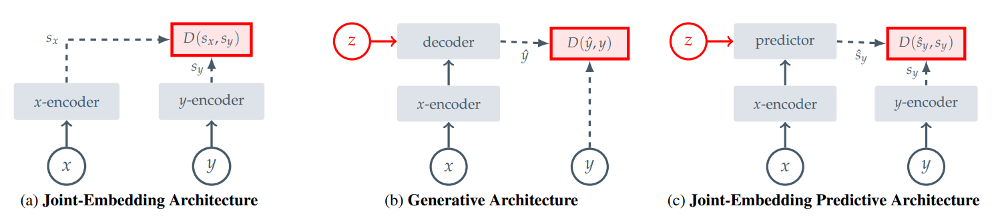

> So sánh ba kiến trúc Self-Supervised Learning: Joint-Embedding học bằng cách đưa embedding của các mẫu tương ứng lại gần nhau; Generative học bằng cách tái tạo dữ liệu gốc (pixel/token); còn JEPA dự đoán embedding của vùng mục tiêu từ vùng ngữ cảnh. Nhờ dự đoán trong representation space thay vì pixel space, JEPA tập trung học đặc trưng ngữ nghĩa (semantic representation) mà không cần tái tạo toàn bộ ảnh.

## 1.1 Motivation

Trong những năm gần đây, **Self-Supervised Learning (SSL)** đã trở thành hướng nghiên cứu quan trọng trong Computer Vision nhờ khả năng học biểu diễn (representation) từ dữ liệu chưa gán nhãn. Thay vì phụ thuộc vào một lượng lớn dữ liệu được gán nhãn thủ công, SSL tận dụng cấu trúc nội tại của dữ liệu để xây dựng các đặc trưng có thể chuyển giao sang nhiều tác vụ downstream như phân loại ảnh, phát hiện đối tượng và phân đoạn ảnh.

Bài báo chỉ ra rằng hầu hết các phương pháp SSL hiện nay thuộc **hai nhóm chính**:

1. **Invariance-based Methods**
2. **Generative Methods**

Mỗi hướng đều đạt được nhiều thành công nhưng vẫn tồn tại những hạn chế ảnh hưởng đến chất lượng biểu diễn ngữ nghĩa (semantic representation).

---

# 1.2 Existing Self-Supervised Learning Paradigms

## 1.2.1 Invariance-based Learning

### What?

Invariance-based Learning học biểu diễn bằng cách tạo nhiều **view** của cùng một ảnh thông qua các phép **data augmentation**, sau đó tối ưu để embedding của các view này gần nhau trong không gian đặc trưng.

Ví dụ các phép biến đổi thường dùng:

- Random Crop
- Random Resize
- Horizontal Flip
- Color Jitter
- Gaussian Blur

Mục tiêu có thể được mô tả bởi:

$$z_1=f(x_1)$$

$$z_2=f(x_2)$$

với

- $x_1,x_2$ là hai view của cùng một ảnh
- $f(\cdot)$ là encoder

Sau đó tối ưu

$$z_1 \approx z_2$$

để hai biểu diễn trở nên giống nhau.

Các phương pháp tiêu biểu gồm:

- SimCLR
- MoCo
- BYOL
- DINO
- VICReg

---

### Advantages

- Học semantic representation mạnh.
- Hiệu quả cao trong nhiều benchmark.
- Chuyển giao tốt sang downstream tasks.

---

### Limitations

Theo bài báo, các phương pháp này phụ thuộc mạnh vào **hand-crafted data augmentations**.

Điều này tạo ra **inductive bias** do con người thiết kế.

Ví dụ:

- Classification cần bỏ qua vị trí.
- Segmentation cần giữ vị trí.

Một augmentation phù hợp với classification có thể không phù hợp với segmentation.

Ngoài ra, các augmentation dành cho ảnh rất khó mở rộng sang các modality khác như audio hoặc tín hiệu cảm biến.

---

## 1.2.2 Generative Learning

### What?

Generative Methods học bằng cách **khôi phục (reconstruct)** phần dữ liệu bị che hoặc bị làm hỏng.

Ví dụ:

Input

```
□□□□■■■■
```

↓

Predict

```
□□□□
```

Thay vì học sự tương đồng giữa hai embedding, mô hình dự đoán trực tiếp:

- Pixel
- Patch
- Token

Một bài toán reconstruction tổng quát có dạng

$$\hat{x}=g(f(x))$$

Trong đó

- $f$: encoder
- $g$: decoder

Loss thường tối ưu

$$L=\|x-\hat{x}\|^2$$

hoặc reconstruction loss tương đương.

Các phương pháp tiêu biểu:

- MAE
- BEiT
- SimMIM

---

### Advantages

- Không cần thiết kế data augmentation.
- Dễ mở rộng sang nhiều loại dữ liệu khác nhau.
- Ý tưởng đơn giản.

---

### Limitations

Theo bài báo, reconstruction trong **pixel space** buộc mô hình học nhiều thông tin mức thấp như:

- texture
- màu sắc
- nhiễu
- ánh sáng

Những thông tin này không phải lúc nào cũng cần thiết cho việc hiểu ngữ nghĩa của ảnh.

Do đó semantic representation thường yếu hơn các phương pháp invariance-based trong các bài đánh giá như linear probing hoặc transfer learning.

---

# 1.3 Problem Statement

Bài báo xác định hai vấn đề chính của SSL hiện nay.

## Problem 1

Invariance-based Learning cần:

- Data Augmentation
- Human Prior

Điều này tạo ra các bias phụ thuộc vào người thiết kế.

---

## Problem 2

Generative Learning dự đoán

```
Pixels
```

thay vì

```
Meaning
```

Do đó mô hình dành nhiều năng lực để khôi phục chi tiết không cần thiết thay vì học semantic representation.

---

Mục tiêu của bài báo là trả lời câu hỏi:

> **Làm thế nào để học semantic representation mà không cần hand-crafted data augmentation và cũng không cần pixel reconstruction?**

---

# 1.4 Proposed Solution: Image-JEPA

Để giải quyết các hạn chế trên, bài báo đề xuất:

> **Image-based Joint-Embedding Predictive Architecture (I-JEPA).**

Ý tưởng cốt lõi là:

Thay vì dự đoán

```
Pixel
```

I-JEPA dự đoán

```
Representation
```

Cụ thể:

- Chỉ quan sát **Context Block**.
- Dự đoán **Embedding** của nhiều **Target Blocks** trong cùng ảnh.

Pipeline tổng quát:

```
Context Block
        │
        ▼
Context Encoder
        │
        ▼
Context Embedding
        │
        ▼
Predictor
        │
        ▼
Predicted Target Embedding

                ≈

Target Encoder(Target Block)
```

Điểm khác biệt quan trọng là mô hình **không sinh lại ảnh**, mà học dự đoán **latent representation** của vùng bị che. Điều này giúp tập trung vào thông tin ngữ nghĩa thay vì chi tiết pixel. 

---

# 1.5 Key Design Choices

Bài báo nhấn mạnh hai lựa chọn thiết kế quyết định chất lượng của I-JEPA:

### Large Target Blocks

Target block phải đủ lớn để chứa:

- object
- scene
- semantic information

Nếu target quá nhỏ, mô hình chỉ học texture hoặc cạnh của vật thể.

---

### Informative Context Block

Context block phải đủ rộng và phân bố trên ảnh để cung cấp đủ thông tin cho việc suy luận.

Nhờ đó mô hình có thể dự đoán các đặc trưng ngữ nghĩa thay vì ghi nhớ chi tiết cục bộ.

---

# 1.6 Main Contributions

Bài báo đưa ra bốn đóng góp chính:

1. Đề xuất **I-JEPA**, một kiến trúc self-supervised mới dự đoán trong **representation space** thay vì **pixel space**.

2. Loại bỏ nhu cầu sử dụng **hand-crafted view augmentations** trong quá trình pretraining.

3. Giới thiệu **multi-block masking strategy**, trong đó context block và target blocks được thiết kế để khuyến khích mô hình học biểu diễn ngữ nghĩa.

4. Chứng minh bằng thực nghiệm rằng I-JEPA vượt các phương pháp pixel reconstruction như **MAE** trên nhiều benchmark và đạt hiệu năng cạnh tranh với các phương pháp invariance-based trong khi hội tụ nhanh và sử dụng ít giả định thủ công hơn.

---

# 1.7 Key Takeaways

- SSL hiện nay chủ yếu gồm **Invariance-based Learning** và **Generative Learning**.
- Invariance-based phụ thuộc vào **data augmentation**, còn Generative tập trung vào **pixel reconstruction**.
- I-JEPA đề xuất hướng tiếp cận mới: **Representation Prediction**, tức dự đoán embedding thay vì pixel.
- Multi-block masking và prediction trong representation space là hai yếu tố cốt lõi giúp I-JEPA học được **semantic representation** mạnh mà không cần hand-crafted augmentations.

---

# 2. Background

## 2.1 Self-Supervised Learning

### What is Self-Supervised Learning?

**Self-Supervised Learning (SSL)** là phương pháp **Representation Learning** trong đó mô hình học trực tiếp từ **dữ liệu chưa gán nhãn** bằng cách khai thác mối quan hệ nội tại giữa các mẫu dữ liệu. Thay vì sử dụng nhãn (label), mô hình tự tạo ra tín hiệu học (self-supervision) từ chính dữ liệu đầu vào.

Mục tiêu của SSL là học một **biểu diễn (representation)** có khả năng chuyển giao tốt sang nhiều downstream tasks như:

- Image Classification
- Object Detection
- Semantic Segmentation
- Depth Estimation

Trong bài báo, SSL được diễn giải dưới góc nhìn của **Energy-Based Models (EBMs)**.

---

## 2.2 Energy-Based Models (EBMs)

### What?

Bài báo xem Self-Supervised Learning như một bài toán **Energy-Based Learning**.

Ý tưởng là học một **hàm năng lượng (Energy Function)** để đánh giá mức độ tương thích giữa hai đầu vào.

Cho hai tín hiệu:

- $x$: Context (thông tin quan sát được)
- $y$: Target (thông tin cần dự đoán)

Hàm năng lượng:

$$E(x,y)$$

trả về một giá trị vô hướng biểu diễn mức độ tương thích giữa $x$ và $y$.

---

### Learning Objective

Mục tiêu của EBMs là:

- **Compatible inputs** → Energy thấp
- **Incompatible inputs** → Energy cao

Hay nói cách khác

$$E(x,y)\rightarrow \text{minimum}$$

nếu

$$x,y$$

là một cặp tương thích.

Ngược lại

$$E(x,y)\rightarrow \text{maximum}$$

nếu hai tín hiệu không liên quan.

---

### Intuition

Có thể hình dung Energy như một "điểm số phù hợp".

| Input Pair | Energy |
|------------|---------|
| Same Image | Low |
| Same Object | Low |
| Different Images | High |
| Different Objects | High |

Mô hình học sao cho các cặp có quan hệ ngữ nghĩa sẽ có năng lượng thấp hơn các cặp không liên quan.

---

### Why Energy-Based Learning?

Thay vì học trực tiếp nhãn hoặc xác suất, EBMs chỉ cần học **mối quan hệ giữa các tín hiệu**.

Điều này phù hợp với mục tiêu của Self-Supervised Learning là học **representation** thay vì học một tác vụ cụ thể.

Theo bài báo, nhiều phương pháp SSL hiện nay đều có thể được mô tả dưới góc nhìn của Energy-Based Models, bao gồm:

- Joint-Embedding Architectures
- Generative Architectures
- Joint-Embedding Predictive Architectures (JEPA)

---

# 2.3 Joint-Embedding Architectures (JEA)

## What?

**Joint-Embedding Architecture (JEA)** là kiến trúc học biểu diễn bằng cách đưa **embedding** của hai đầu vào tương thích lại gần nhau trong không gian đặc trưng.

Kiến trúc này là nền tảng của các phương pháp **Invariance-based Self-Supervised Learning**.

---

## Architecture

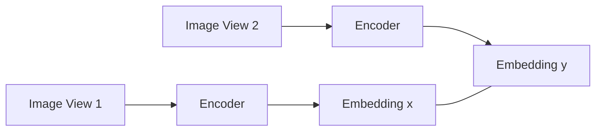

Hai đầu vào thường được tạo từ cùng một ảnh thông qua các phép **data augmentation**.

Ví dụ:

- Random Crop
- Resize
- Color Jitter
- Gaussian Blur

---

## Learning Objective

Giả sử

$$z_x=f(x)$$

$$z_y=f(y)$$

Trong đó

- $f(\cdot)$ là encoder.
- $z_x,z_y$ là embedding.

Mục tiêu là

$$z_x \approx z_y$$

đối với hai ảnh tương thích.

Đồng thời

$$z_x \neq z_y$$

đối với hai ảnh khác nhau.

---

## Representation Collapse

### What?

Thách thức lớn nhất của JEA là **Representation Collapse**.

Đây là hiện tượng encoder luôn sinh ra cùng một embedding cho mọi đầu vào.

Ví dụ

$$f(x)=c$$

với mọi ảnh.

Khi đó

$$z_x=z_y=c$$

cho tất cả các mẫu dữ liệu.

Mặc dù loss có thể rất nhỏ nhưng mô hình hoàn toàn không học được thông tin hữu ích.

---

## Các phương pháp tránh Collapse

Bài báo chia thành bốn hướng chính.

### 1. Contrastive Learning

Ý tưởng:

Đưa embedding của positive pair lại gần.

Đẩy embedding của negative pair ra xa.

Ví dụ:

- SimCLR
- MoCo

---

### 2. Non-Contrastive Learning

Không cần negative samples.

Giảm sự dư thừa thông tin giữa các embedding.

Ví dụ

- BYOL
- VICReg

---

### 3. Clustering-based Learning

Tối đa entropy của embedding trung bình.

Ví dụ

- DINO
- SwAV

---

### 4. Asymmetric Architecture

Sử dụng hai encoder không hoàn toàn đối xứng.

Ví dụ:

- Stop-gradient
- Momentum Encoder
- EMA

Điều này giúp hạn chế Representation Collapse.

---

## Advantages

- Semantic representation mạnh.
- Hiệu quả cao trên Image Classification.
- Representation dễ chuyển giao.

---

## Limitations

Theo bài báo:

- Phụ thuộc vào **hand-crafted data augmentation**.
- Data augmentation tạo **inductive bias**.
- Khó tổng quát sang các modality khác.

---

# 2.4 Generative Architectures

## What?

**Generative Architectures** học bằng cách **khôi phục (reconstruct)** tín hiệu mục tiêu từ tín hiệu đầu vào.

Khác với JEA, mô hình không so sánh embedding mà sinh lại dữ liệu gốc.

---

## Architecture

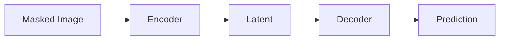

Trong Vision, đầu vào thường được tạo bằng **masking**.

- $y$: ảnh gốc.
- $x$: ảnh đã che một phần.

Biến phụ

$$z$$

lưu thông tin về:

- Mask Tokens
- Position Tokens

để decoder biết cần khôi phục vùng nào.

---

## Learning Objective

Encoder tạo latent representation

$$h=f(x)$$

Decoder tái tạo ảnh

$$\hat{y}=g(h,z)$$

Loss thường tối ưu

$$L=\|y-\hat{y}\|^2$$

hoặc reconstruction loss tương đương.

---

## Why Representation Collapse is not a concern?

Khác với JEA, decoder phải tái tạo ảnh.

Nếu encoder sinh ra một hằng số

$$f(x)=c$$

decoder sẽ không thể khôi phục chính xác ảnh.

Do đó Representation Collapse khó xảy ra miễn là biến điều kiện

$$z$$

không chứa quá nhiều thông tin so với tín hiệu gốc.

---

## Advantages

- Không cần data augmentation.
- Dễ áp dụng cho nhiều modality.
- Kiến trúc đơn giản.

---

## Limitations

Theo bài báo:

- Reconstruction trong **pixel space** khiến mô hình học nhiều chi tiết mức thấp.
- Semantic representation thường yếu hơn các phương pháp invariance-based.

---

# 2.5 Joint-Embedding Predictive Architectures (JEPA)

## What?

**Joint-Embedding Predictive Architecture (JEPA)** kết hợp ý tưởng của Joint-Embedding và Generative Architectures.

Điểm khác biệt quan trọng là:

- Không dự đoán pixel.
- Không ép hai embedding giống nhau.
- Thay vào đó dự đoán **embedding của target**.

---

## Architecture

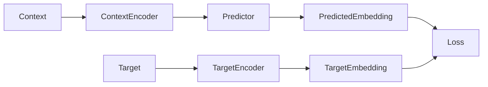

---

## Learning Objective

Cho

$$z_c=f(x)$$

là Context Embedding.

Predictor

$$p(\cdot)$$

dự đoán

$$\hat{z}_t=p(z_c,z)$$

Target Encoder tạo

$$z_t=g(y)$$

Loss

$$L=\|\hat{z}_t-z_t\|_2^2$$

Mô hình học bằng cách đưa **Predicted Embedding** gần với **Target Embedding** trong **representation space**.

---

## Why JEPA?

Theo bài báo, thay vì tái tạo pixel, JEPA dự đoán **biểu diễn ngữ nghĩa (semantic representation)** của vùng bị che.

Điều này giúp mô hình:

- Bỏ qua các chi tiết pixel không cần thiết.
- Tập trung vào cấu trúc, đối tượng và mối quan hệ trong ảnh.
- Học representation có khả năng chuyển giao tốt hơn.

---

## Representation Collapse

JEPA vẫn có nguy cơ gặp **Representation Collapse**, tương tự Joint-Embedding Architectures.

Để tránh hiện tượng này, bài báo sử dụng **kiến trúc bất đối xứng (asymmetric architecture)** giữa:

- Context Encoder
- Target Encoder

Target Encoder được cập nhật bằng **Exponential Moving Average (EMA)** thay vì cập nhật trực tiếp bằng gradient, giúp tạo mục tiêu học ổn định và hạn chế collapse.

---

# Key Takeaways

- Self-Supervised Learning được bài báo diễn giải dưới góc nhìn **Energy-Based Models**.
- **Joint-Embedding Architectures** học bằng cách đưa embedding của các mẫu tương thích lại gần nhau nhưng có nguy cơ **representation collapse**.
- **Generative Architectures** học bằng cách tái tạo dữ liệu gốc trong **pixel space**, ít gặp collapse nhưng thường học nhiều đặc trưng mức thấp.
- **JEPA** kết hợp ưu điểm của cả hai hướng: dự đoán **embedding** thay vì **pixel**, đồng thời sử dụng **asymmetric architecture** và **EMA** để giảm nguy cơ representation collapse và học được **semantic representation** mạnh hơn.
---

# 3. Method

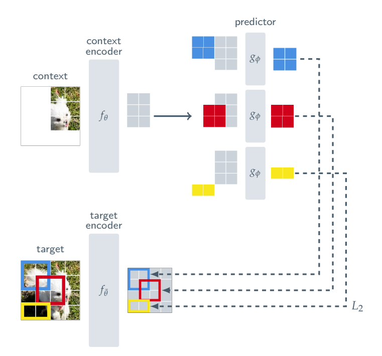

> Kiến trúc __I-JEPA__ gồm ba thành phần: __Context Encoder, Predictor và Target Encoder__. Context Encoder chỉ xử __lý vùng ảnh quan sát được (context block)__ để tạo embedding; Predictor sử dụng embedding này cùng thông tin vị trí (positional tokens) để dự đoán embedding của target block; Target Encoder tạo target embedding làm nhãn học. Target Encoder được cập nhật bằng __Exponential Moving Average (EMA)__ từ Context Encoder, giúp mô hình học __semantic representation__ thay vì tái tạo pixel.

## 3.1 Overview

### What is I-JEPA?

**Image-based Joint-Embedding Predictive Architecture (I-JEPA)** là kiến trúc **Self-Supervised Learning** học biểu diễn (representation) bằng cách **dự đoán embedding của các vùng bị che (target blocks)** từ **một vùng quan sát được (context block)** trong cùng một ảnh.

Khác với **Masked Autoencoders (MAE)**, I-JEPA **không tái tạo ảnh (pixel reconstruction)** mà dự đoán trực tiếp trong **representation space**, giúp mô hình tập trung vào thông tin ngữ nghĩa thay vì chi tiết mức thấp.

---

## 3.2 Overall Architecture

Kiến trúc I-JEPA gồm ba thành phần chính:

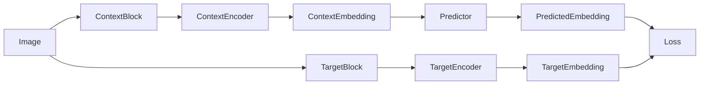

Bao gồm:

- **Context Encoder**
- **Target Encoder**
- **Predictor**

Mục tiêu là đưa **Predicted Embedding** gần với **Target Embedding**.

---

# 3.3 Target Representation

## What?

Trong I-JEPA, **target không phải là pixel**, mà là **embedding của các vùng ảnh (target blocks)**.

Điều này giúp mô hình học được đặc trưng ngữ nghĩa thay vì học cách tái tạo chi tiết ảnh.

---

## Step 1: Image to Patches

Cho ảnh đầu vào

$$y$$

Ảnh được chia thành

$$N$$

patch không chồng lắp.

```text
Image

↓

Patch 1
Patch 2
...
Patch N
```

---

## Step 2: Target Encoder

Toàn bộ ảnh được đưa qua **Target Encoder**

$$f_{\bar{\theta}}$$

để thu được biểu diễn từng patch

$$s_y=f_{\bar{\theta}}(y)$$

trong đó

$$s_y=\{s_{y_1},s_{y_2},...,s_{y_N}\}$$

với

$$s_{y_k}$$

là embedding của patch thứ

$$k$$

---

## Step 3: Target Blocks

Sau khi có embedding của toàn bộ ảnh, mô hình **không mask ảnh đầu vào**.

Thay vào đó,

**mask được áp dụng trên output của Target Encoder**.

Từ

$$s_y$$

mô hình lấy ngẫu nhiên

$$M$$

target blocks

$$s_y^{(i)}$$

với

$$i=1,...,M$$

Thông thường

$$M=4$$

---

## Sampling Strategy

Theo bài báo

Target Block được lấy với:

Aspect Ratio

$$0.75 \sim 1.5$$

Scale

$$0.15 \sim 0.20$$

Điều này đảm bảo target đủ lớn để chứa thông tin ngữ nghĩa.

---

## Why Mask after Encoder?

Đây là điểm khác biệt quan trọng.

Không làm

```text
Image
↓
Mask
↓
Encoder
```

Mà làm

```text
Image
↓
Encoder
↓
Embedding
↓
Mask
```

Nhờ đó

Target Embedding vẫn chứa đầy đủ semantic information.

Nếu mask trước encoder, embedding sẽ bị thiếu thông tin và mục tiêu học kém chất lượng hơn.

---

# 3.4 Context Representation

## What?

Context là phần ảnh duy nhất mà mô hình được phép quan sát.

Mục tiêu là dùng context để dự đoán embedding của các target blocks.

---

## Sampling Context

Context Block

được lấy ngẫu nhiên từ ảnh.

Scale

$$0.85 \sim 1.0$$

Aspect Ratio

$$1:1$$

---

## Remove Overlap

Target và Context được lấy độc lập.

Do đó có thể xảy ra

```text
Context

██████

Target

████
```

Nếu có vùng chồng lên nhau

↓

Loại bỏ phần giao nhau khỏi Context.

Điều này giúp bài toán dự đoán trở nên khó hơn.

Nếu không,

mô hình chỉ cần "copy" thông tin.

---

## Context Encoder

Context được đưa vào

$$f_\theta$$

để tạo

$$s_x$$

$$s_x=f_\theta(x)$$

Trong đó

$$s_x=\{s_{x_j}\}$$

là embedding của các patch thuộc Context.

---

# 3.5 Predictor

## What?

Predictor có nhiệm vụ

dự đoán embedding của từng Target Block.

Khác với Target Encoder,

Predictor không nhìn thấy Target.

Nó chỉ biết:

- Context Embedding
- Target Position

---

## Input

Predictor nhận

$$s_x$$

và

Mask Tokens

$$m_j$$

Mask Token gồm

- Learnable Vector
- Positional Embedding

để Predictor biết

Target nằm ở đâu.

---

## Prediction

Với mỗi Target Block

Predictor sinh

$$\hat{s}_y^{(i)}$$

$$\hat{s}_y^{(i)}=g_\phi(s_x,m_j)$$

với

$$g_\phi$$

là Predictor.

Quá trình này lặp

$$M$$

lần

để dự đoán

$$M$$

Target Blocks.

---

# 3.6 Loss Function

## Learning Objective

Mục tiêu là

Predicted Embedding

gần

Target Embedding.

Loss được định nghĩa

$$L=\frac{1}{M}\sum_{i=1}^{M}D(\hat{s}_y^{(i)},s_y^{(i)})$$

Trong đó

$$D$$

là khoảng cách

L2

$$D=\sum_{j\in B_i}\|\hat{s}_{y_j}-s_{y_j}\|_2^2$$

---

## Meaning

Loss đo khoảng cách giữa

- Embedding dự đoán

và

- Embedding mục tiêu.

Khác với MAE,

Loss **không tính trên pixel**.

Toàn bộ quá trình học diễn ra trong

**representation space**.

---

# 3.7 Parameter Update

Có ba tập tham số.

## Context Encoder

$$\theta$$

Được cập nhật bằng Backpropagation.

---

## Predictor

$$\phi$$

Được cập nhật bằng Gradient Descent.

---

## Target Encoder

$$\bar{\theta}$$

Không cập nhật bằng gradient.

Thay vào đó

$$\bar{\theta}\leftarrow\tau\bar{\theta}+(1-\tau)\theta$$

đây là

**Exponential Moving Average (EMA).**

---

## Why EMA?

EMA giúp

- Target ổn định.
- Tránh Representation Collapse.
- Làm quá trình học hội tụ tốt hơn.

Bài báo cho biết EMA là thành phần thiết yếu khi huấn luyện JEPA với Vision Transformer.

---

# 3.8 Complete Pipeline

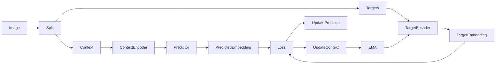

---

# Key Takeaways

- I-JEPA học bằng **Representation Prediction**, không phải **Pixel Reconstruction**.
- Target được lấy từ **embedding của Target Encoder**, không phải trực tiếp từ ảnh.
- Context chỉ chứa vùng ảnh quan sát được; mọi vùng chồng lấp với target đều bị loại bỏ.
- Predictor sử dụng **Context Embedding** và **Positional Mask Tokens** để dự đoán embedding của từng target block.
- Loss được tính bằng **L2 distance trong representation space**.
- Target Encoder được cập nhật bằng **Exponential Moving Average (EMA)** thay vì gradient, giúp tạo mục tiêu học ổn định và giảm nguy cơ representation collapse.

---

# 4. Related Work

## 4.1 Overview

Trong phần **Related Work**, bài báo đặt **I-JEPA** trong bối cảnh các phương pháp **Self-Supervised Learning (SSL)** hiện có và so sánh với ba hướng nghiên cứu chính:

1. **Generative / Reconstruction-based Learning**
2. **Representation Prediction**
3. **Joint-Embedding Learning**

Mục tiêu là làm rõ những hạn chế của từng phương pháp và lý do I-JEPA được đề xuất.

---

# 4.2 Generative Reconstruction Methods

## Motivation

Một hướng nghiên cứu lâu đời trong Self-Supervised Learning là học biểu diễn bằng cách **dự đoán hoặc tái tạo (reconstruct)** những phần dữ liệu bị mất hoặc bị làm hỏng.

Ý tưởng chung là:

> Nếu mô hình có thể khôi phục phần thông tin bị che, nó buộc phải hiểu cấu trúc của dữ liệu.

---

## Denoising Autoencoder

Denoising Autoencoder (DAE) là một trong những phương pháp SSL đầu tiên.

### Idea

Đầu vào bị làm nhiễu

$$\tilde{x}$$

Mô hình học cách tái tạo lại dữ liệu gốc

$$x$$

$$\hat{x}=f(\tilde{x})$$

Loss

$$L=\|x-\hat{x}\|_2^2$$

### Limitation

Mô hình chủ yếu học cách loại bỏ nhiễu thay vì học biểu diễn ngữ nghĩa.

---

## Context Encoder

Context Encoder mở rộng ý tưởng trên bằng cách:

- Che một vùng ảnh.
- Dự đoán vùng bị che từ các vùng xung quanh.

```text
████ □□□□ ████

↓

Predict

□□□□
```

Mô hình học mối quan hệ không gian (spatial context) giữa các vùng ảnh.

---

## Image Colorization

Một số nghiên cứu khác coi **Image Colorization** là bài toán self-supervised.

Input

Ảnh xám

↓

Predict

Ảnh màu

Mục tiêu là học được semantic information thông qua việc suy luận màu sắc.

---

# 4.3 Masked Image Modeling (MIM)

Sự xuất hiện của **Vision Transformer (ViT)** đã thúc đẩy hướng **Masked Image Modeling (MIM)**.

Ý tưởng:

- Mask một phần patch.
- Dự đoán patch bị che.

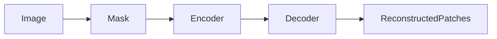

---

## MAE (Masked Autoencoder)

### Core Idea

MAE chỉ đưa **visible patches** vào encoder.

Các patch bị che chỉ được xử lý ở decoder.

Điều này giúp giảm đáng kể chi phí tính toán.

---

### Learning Objective

Encoder

$$z=f(x)$$

Decoder

$$\hat{x}=g(z)$$

Loss

$$L=\|x-\hat{x}\|_2^2$$

---

### Advantages

- Kiến trúc đơn giản.
- Tính toán hiệu quả.
- Khả năng mở rộng tốt (Scalability).
- Fine-tuning tốt trên tập dữ liệu lớn.

---

### Limitation

Theo bài báo,

MAE vẫn học bằng **pixel reconstruction**.

Điều này khiến mô hình phải học:

- texture
- edge
- illumination
- color

những đặc trưng không nhất thiết phản ánh ý nghĩa ngữ nghĩa của ảnh.

---

## BEiT

BEiT không tái tạo pixel trực tiếp.

Thay vào đó,

mỗi patch được chuyển thành một **discrete token** thông qua một **frozen discreteVAE**.

```text
Image

↓

Discrete VAE

↓

Visual Tokens

↓

Predict Missing Tokens
```

---

### Advantages

- Reconstruction trong token space.
- Giảm phụ thuộc vào pixel.

---

### Limitation

Theo bài báo,

MAE vẫn đạt kết quả fine-tuning tốt hơn BEiT.

Ngoài ra,

BEiT phụ thuộc vào một **discreteVAE** đã được huấn luyện trước trên khoảng **250 triệu ảnh**, làm tăng độ phức tạp của hệ thống.

---

## SimMIM

SimMIM nghiên cứu các mục tiêu tái tạo khác ngoài pixel.

Thay vì reconstruction trực tiếp trong pixel space,

SimMIM sử dụng đặc trưng **Histogram of Oriented Gradients (HOG)** làm mục tiêu học.

Điều này giúp cải thiện chất lượng biểu diễn so với reconstruction pixel thuần túy.

---

# 4.4 Representation Prediction Methods

## Motivation

Các phương pháp trên đều có điểm chung:

> **Reconstruction xảy ra trong input space.**

I-JEPA lựa chọn hướng khác:

> **Prediction trong representation space.**

Điều này giúp mô hình tập trung vào thông tin ngữ nghĩa thay vì chi tiết mức thấp.

---

## data2vec

### Core Idea

data2vec dự đoán **embedding** của các patch bị che.

Target embedding được tạo bởi một **online target encoder**.

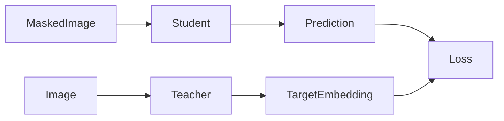

---

### Advantages

- Không cần handcrafted augmentation.
- Áp dụng được cho:
  - Vision
  - Text
  - Speech

---

### Difference from I-JEPA

Theo bài báo,

I-JEPA:

- hiệu quả tính toán cao hơn,
- học được semantic representation mạnh hơn,
- không cần fine-tuning quá nhiều trên downstream tasks.

---

## Context Autoencoder

Context Autoencoder kết hợp hai mục tiêu:

1. Reconstruction Loss
2. Representation Alignment Loss

Nhờ đó mô hình vừa học tái tạo vừa học dự đoán biểu diễn.

I-JEPA chỉ tối ưu **representation prediction**, không cần reconstruction decoder.

---

## data2vec-v2

Bài báo cũng đề cập đến **data2vec-v2**, một nghiên cứu đồng thời (concurrent work), tập trung vào việc xây dựng các kiến trúc hiệu quả hơn cho nhiều modality.

Chi tiết kỹ thuật không được phân tích thêm trong bài báo.

---

# 4.5 Joint-Embedding Methods

Một hướng nghiên cứu khác là **Joint-Embedding Architectures (JEA)**.

Các phương pháp tiêu biểu:

- DINO
- MSN
- iBOT

---

## DINO

DINO học biểu diễn bằng cách đưa embedding của hai view khác nhau của cùng một ảnh lại gần nhau.

Mô hình phụ thuộc vào:

- Random Crop
- Color Jitter
- Blur
- Multi-Crop

để tạo các view khác nhau.

---

## MSN

MSN mở rộng DINO bằng cách sử dụng **masking** như một dạng **data augmentation** bổ sung.

Masking ở đây không nhằm reconstruction mà nhằm tạo thêm các góc nhìn khác nhau của cùng một ảnh.

---

## iBOT

iBOT kết hợp hai mục tiêu học:

- **View-Invariance Loss** (tương tự DINO)
- **Patch-Level Reconstruction Loss** (tương tự data2vec)

Nhờ đó mô hình vừa học biểu diễn toàn cục vừa học đặc trưng cục bộ.

---

# 4.6 Limitations of Previous Joint-Embedding Methods

Theo bài báo,

điểm chung của DINO, MSN và iBOT là:

- phụ thuộc vào **hand-crafted data augmentations**,
- cần tạo nhiều **view** của cùng một ảnh,
- mỗi view phải được encoder xử lý riêng.

Điều này làm tăng đáng kể chi phí tính toán và hạn chế khả năng mở rộng (scalability).

---

# 4.7 Why I-JEPA?

I-JEPA được thiết kế để khắc phục các hạn chế trên.

## Single View Learning

Khác với các phương pháp Joint-Embedding truyền thống,

I-JEPA chỉ cần xử lý **một view duy nhất** của mỗi ảnh.

Điều này giúp giảm đáng kể số lần chạy qua encoder.

---

## Representation Prediction

Thay vì:

$$Image \rightarrow Pixel$$

I-JEPA học:

$$Context \rightarrow Representation$$

Mục tiêu là dự đoán embedding của các vùng bị che, không phải tái tạo chi tiết ảnh.

---

## Better Computational Efficiency

Theo bài báo,

một mô hình **ViT-Huge/14** được huấn luyện bằng **I-JEPA** yêu cầu **ít chi phí tính toán hơn** so với **ViT-Small/16** được huấn luyện bằng **iBOT**, đồng thời vẫn học được các biểu diễn ngữ nghĩa mạnh.

Điều này cho thấy I-JEPA có khả năng mở rộng (scalability) và hiệu quả tính toán cao hơn so với nhiều phương pháp Joint-Embedding trước đó.

---

# 4.8 Summary Comparison

| Method | Learning Target | Need Augmentation | Prediction Space | Main Limitation |
|----------|----------------|------------------|------------------|-----------------|
| Denoising AE | Pixel | Không | Pixel | Học đặc trưng mức thấp |
| Context Encoder | Pixel Region | Không | Pixel | Reconstruction |
| MAE | Pixel | Không | Pixel | Thiên về texture |
| BEiT | Visual Token | Không | Token | Cần pretrained discreteVAE |
| SimMIM | HOG Feature | Không | Feature | Vẫn là reconstruction |
| data2vec | Representation | Không | Representation | Hiệu quả thấp hơn I-JEPA |
| DINO | Embedding | Có | Representation | Phụ thuộc augmentation |
| MSN | Embedding | Có | Representation | Multi-view training |
| iBOT | Embedding + Patch | Có | Hybrid | Chi phí tính toán cao |
| **I-JEPA** | **Representation** | **Không** | **Representation** | Chỉ cần một view, hiệu quả tính toán cao |

---

# Key Takeaways

- Các phương pháp **Generative** học bằng **reconstruction** trong pixel hoặc token space.
- **Masked Image Modeling** (MAE, BEiT, SimMIM) cải thiện hiệu quả SSL nhưng vẫn phụ thuộc vào mục tiêu tái tạo dữ liệu.
- **data2vec** và **Context Autoencoder** chuyển sang dự đoán trong **representation space**, gần với hướng tiếp cận của I-JEPA.
- **Joint-Embedding Methods** như DINO, MSN và iBOT học biểu diễn ngữ nghĩa mạnh nhưng cần nhiều **data augmentations** và **multi-view training**.
- **I-JEPA** kết hợp ưu điểm của các hướng trước đó bằng cách **dự đoán representation từ một view duy nhất**, giảm chi phí tính toán và hướng tới học các đặc trưng ngữ nghĩa có khả năng chuyển giao tốt.

---

# 5. Image Classification

## 5.1 Overview

Sau khi đề xuất **I-JEPA**, bài báo đánh giá chất lượng của biểu diễn (representation) thông qua các **nhiệm vụ phân loại ảnh (Image Classification)**.

Khác với nhiều phương pháp Self-Supervised Learning (SSL) khác, mục tiêu của I-JEPA là chứng minh rằng mô hình có thể học được **semantic representation** mạnh **mà không cần sử dụng hand-crafted data augmentations** trong giai đoạn pretraining.

Các thí nghiệm được thực hiện trên **ImageNet-1K** với ba giao thức đánh giá:

1. **Linear Evaluation**
2. **Low-Shot Image Classification (1% Labels)**
3. **Transfer Learning**

Toàn bộ các mô hình I-JEPA được pretrain trên **ImageNet-1K** ở độ phân giải **224 × 224**, trừ khi có ghi chú khác.

---

# 5.2 Linear Evaluation on ImageNet-1K

## What is Linear Evaluation?

**Linear Evaluation (Linear Probing)** là giao thức phổ biến để đánh giá chất lượng của representation trong Self-Supervised Learning.

Ý tưởng là:

1. Giữ nguyên toàn bộ encoder đã pretrain (**freeze weights**).
2. Chỉ huấn luyện một **Linear Classifier** trên tập dữ liệu có nhãn.

Nếu representation tốt, chỉ cần một bộ phân loại tuyến tính cũng có thể đạt độ chính xác cao.

---

## Evaluation Pipeline

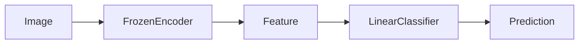

---

## Learning Objective

Giả sử encoder tạo đặc trưng

$$z=f_\theta(x)$$

Trong đó:

- $f_\theta$ là encoder đã được pretrain.
- $z$ là feature representation.

Encoder **không được cập nhật** trong quá trình đánh giá.

Linear classifier học:

$$\hat{y}=Wz+b$$

với:

- $W$ là trọng số của classifier.
- $b$ là bias.

Loss sử dụng:

$$L=-\sum_{i}y_i\log(\hat{y}_i)$$

Chỉ có $W$ và $b$ được tối ưu.

---

## Why Linear Evaluation?

Linear probing phản ánh trực tiếp chất lượng của representation.

Nếu encoder đã học được đặc trưng ngữ nghĩa tốt, các lớp dữ liệu sẽ gần như tuyến tính trong không gian embedding và chỉ cần một classifier đơn giản để phân loại.

---

## Experimental Results

Bài báo so sánh I-JEPA với nhiều phương pháp SSL không sử dụng nhiều data augmentation trong giai đoạn pretraining, bao gồm:

- MAE
- Context Autoencoder (CAE)
- data2vec

Kết quả cho thấy:

- I-JEPA đạt **độ chính xác Linear Probing cao hơn** các phương pháp trên.
- Đồng thời **chi phí tính toán thấp hơn**, nhờ kiến trúc chỉ xử lý một view của ảnh.

Ngoài ra, khi tăng kích thước mô hình lên **ViT-H/16** và sử dụng độ phân giải **448 × 448**, I-JEPA đạt hiệu năng tương đương các phương pháp **view-invariant** như **iBOT**, mặc dù **không sử dụng hand-crafted data augmentations** trong pretraining.

---

## Analysis

Điều này cho thấy:

- Representation của I-JEPA có tính ngữ nghĩa cao.
- Việc dự đoán trong **representation space** hiệu quả hơn reconstruction trong pixel space.
- Không cần nhiều phép biến đổi dữ liệu để học được đặc trưng mạnh.

---

# 5.3 Low-Shot ImageNet-1K

## Motivation

Trong thực tế, dữ liệu có nhãn thường rất hạn chế.

Do đó bài báo đánh giá khả năng **few-shot adaptation** của I-JEPA bằng bài toán **1% ImageNet**.

---

## Experimental Setup

Chỉ sử dụng:

- **1% số lượng nhãn** của ImageNet.

Tương đương khoảng:

- **12–13 ảnh mỗi lớp**.

Mục tiêu là kiểm tra liệu representation đã học có thể thích nghi tốt với rất ít dữ liệu gán nhãn hay không.

---

## Adaptation Strategy

Tùy theo từng phương pháp, mô hình được thích nghi bằng:

- **Linear Probing**
- hoặc **Fine-Tuning**

Phương pháp nào cho kết quả tốt hơn sẽ được sử dụng.

---

## Results

Bài báo cho thấy:

- I-JEPA vượt **MAE** với số epoch pretraining ít hơn khi sử dụng cùng kiến trúc encoder.
- I-JEPA với **ViT-H/14** đạt hiệu năng tương đương **ViT-L/16** của **data2vec**, nhưng yêu cầu **ít tài nguyên tính toán hơn**.
- Khi tăng độ phân giải đầu vào, I-JEPA vượt qua nhiều phương pháp mạnh như:
  - MSN
  - DINO
  - iBOT

Các phương pháp trên đều cần **hand-crafted data augmentations** trong giai đoạn pretraining.

---

## Analysis

Kết quả cho thấy representation học bởi I-JEPA:

- tổng quát tốt,
- thích nghi nhanh với rất ít dữ liệu có nhãn,
- giảm phụ thuộc vào lượng lớn dữ liệu huấn luyện.

Điều này đặc biệt quan trọng trong các bài toán mà dữ liệu được gán nhãn rất hạn chế.

---

# 5.4 Transfer Learning

## Motivation

Một representation tốt không chỉ hoạt động trên ImageNet mà còn phải có khả năng **chuyển giao (transfer)** sang các tập dữ liệu và nhiệm vụ khác.

---

## Evaluation Protocol

Sau khi pretrain trên ImageNet-1K:

- Encoder được **freeze**.
- Chỉ huấn luyện một **Linear Probe** trên các downstream datasets.

Điều này giúp đánh giá trực tiếp khả năng tổng quát hóa của representation.

---

## Results

Theo bài báo:

I-JEPA:

- vượt **MAE**,
- vượt **data2vec**,

trên nhiều bộ dữ liệu phân loại ảnh mà **không cần data augmentation** trong pretraining.

Đồng thời, khoảng cách với các phương pháp **view-invariant** được thu hẹp đáng kể.

Đặc biệt:

I-JEPA vượt **DINO** trên:

- CIFAR-100
- Places205

khi sử dụng **Linear Probe**.

---

## Analysis

Điều này cho thấy representation của I-JEPA:

- chứa nhiều thông tin ngữ nghĩa,
- dễ chuyển giao,
- không cần fine-tuning phức tạp để đạt hiệu năng cao trên downstream tasks.

---

# 5.5 Comparison with Previous Methods

| Method | Data Augmentation | Linear Probe | Low-Shot | Transfer Learning |
|----------|-------------------|--------------|-----------|-------------------|
| MAE | ✗ | Thấp hơn I-JEPA | Thấp hơn | Thấp hơn |
| CAE | ✗ | Thấp hơn | Không nổi bật | Thấp hơn |
| data2vec | ✗ | Thấp hơn | Tương đương nhưng tốn compute hơn | Thấp hơn |
| DINO | ✓ | Cao | Cao | Bị I-JEPA vượt trên CIFAR100 và Places205 |
| MSN | ✓ | Cao | Thấp hơn khi tăng độ phân giải | Không nổi bật |
| iBOT | ✓ | Cao | Cao | Cạnh tranh |
| **I-JEPA** | **✗** | **Cao** | **Cao** | **Cao** |

---

# 5.6 Key Findings

Từ các thí nghiệm Image Classification, bài báo rút ra ba kết luận chính:

### 1. Strong Linear Representations

I-JEPA học được biểu diễn ngữ nghĩa mạnh, thể hiện qua hiệu năng **Linear Probing** vượt nhiều phương pháp SSL không sử dụng data augmentation.

---

### 2. Better Label Efficiency

Representation của I-JEPA thích nghi tốt với lượng dữ liệu gán nhãn rất nhỏ (1% ImageNet), cho thấy khả năng **few-shot transfer** tốt.

---

### 3. Strong Transferability

Biểu diễn học được có khả năng chuyển giao tốt sang nhiều downstream datasets, thậm chí vượt một số phương pháp dựa trên **view-invariance** như DINO ở một số benchmark.

---

# Key Takeaways

- **Linear Evaluation** chứng minh I-JEPA học được semantic representation mạnh mà không cần fine-tuning encoder.
- Trong **Low-Shot ImageNet**, I-JEPA đạt hiệu năng cao với rất ít dữ liệu gán nhãn và ít chi phí tính toán hơn nhiều phương pháp trước đó.
- Trên các bài toán **Transfer Learning**, I-JEPA vượt các phương pháp không dùng augmentation (MAE, data2vec) và thu hẹp khoảng cách với các phương pháp view-invariant, thậm chí vượt DINO trên một số tập dữ liệu.
- Kết quả thực nghiệm xác nhận rằng **representation prediction** trong I-JEPA có khả năng học đặc trưng ngữ nghĩa hiệu quả mà không cần **hand-crafted data augmentations**.

---

# 6. Local Prediction Tasks

## 6.1 Overview

Ngoài các bài toán **Image Classification**, bài báo tiếp tục đánh giá chất lượng của **I-JEPA** trên các **Local Prediction Tasks** nhằm kiểm tra khả năng học **đặc trưng cục bộ (local features)** của mô hình.

Một câu hỏi quan trọng được đặt ra là:

> **Liệu việc học semantic representation có làm mất đi các đặc trưng mức thấp (low-level features) như vị trí, số lượng hay độ sâu của vật thể?**

Kết quả thực nghiệm cho thấy **I-JEPA không chỉ học tốt semantic representation mà còn bảo toàn được các đặc trưng cục bộ**, từ đó đạt hiệu năng cao trên các bài toán **Object Counting** và **Depth Prediction**.

---

# 6.2 Motivation

Trong Section 5, bài báo đã chứng minh rằng I-JEPA học được các **high-level semantic representations** thông qua các bài toán phân loại ảnh.

Tuy nhiên, nhiều phương pháp **view-invariance** (như DINO hay iBOT) thường tạo ra các biểu diễn **bất biến (invariant)** trước các phép biến đổi dữ liệu (crop, resize, color jitter,...).

Điều này giúp cải thiện phân loại ảnh nhưng có thể làm mất thông tin **không gian (spatial information)** và **chi tiết cục bộ**, vốn rất quan trọng trong các bài toán như:

- Object Counting
- Depth Prediction
- Dense Prediction

Do đó, bài báo đánh giá xem I-JEPA có giữ được các đặc trưng này hay không.

---

# 6.3 Evaluation Protocol

## Dataset

Các thí nghiệm được thực hiện trên **CLEVR Dataset**.

CLEVR là bộ dữ liệu tổng hợp được thiết kế để đánh giá khả năng hiểu cấu trúc hình ảnh, bao gồm:

- số lượng vật thể,
- vị trí,
- khoảng cách,
- quan hệ không gian.

Bài báo sử dụng hai nhiệm vụ:

- **Clevr/Count** (Object Counting)
- **Clevr/Dist** (Depth Prediction)

---

## Evaluation Strategy

Tương tự Image Classification,

sau khi hoàn thành pretraining:

- Encoder được **đóng băng (Frozen Encoder)**.
- Chỉ huấn luyện một **Linear Probe** trên đầu ra của encoder.

Pipeline đánh giá:

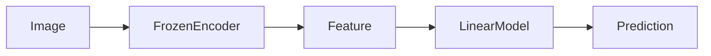

Điều này giúp đánh giá trực tiếp chất lượng của representation mà không bị ảnh hưởng bởi fine-tuning.

---

# 6.4 Object Counting

## Task

**Object Counting** yêu cầu mô hình dự đoán số lượng đối tượng xuất hiện trong ảnh.

Khác với Image Classification,

mô hình phải nhận biết:

- từng đối tượng,
- vị trí của chúng,
- mối quan hệ giữa các vùng ảnh.

Điều này đòi hỏi representation phải giữ được **thông tin cục bộ** thay vì chỉ nắm bắt ý nghĩa tổng quát của toàn ảnh.

---

## Results

Theo **Table 4**,

I-JEPA đạt hiệu năng:

- cao hơn các phương pháp **view-invariance** như:
  - DINO
  - iBOT

trong bài toán **Clevr/Count**.

Điều này cho thấy representation của I-JEPA vẫn bảo toàn được thông tin về cấu trúc và vị trí của các đối tượng trong ảnh.

---

## Analysis

Việc dự đoán embedding của các **target blocks** buộc mô hình phải hiểu:

- vật thể nằm ở đâu,
- có bao nhiêu vật thể,
- mối quan hệ giữa các vùng ảnh.

Do đó, mặc dù I-JEPA hướng tới **semantic representation**, mô hình vẫn học được các đặc trưng cần thiết cho bài toán đếm đối tượng.

---

# 6.5 Depth Prediction

## Task

**Depth Prediction** yêu cầu mô hình ước lượng khoảng cách từ camera đến từng vùng trong ảnh.

Đây là bài toán **dense prediction**, phụ thuộc mạnh vào:

- cấu trúc không gian,
- quan hệ hình học,
- bố cục của cảnh.

Nếu representation mất thông tin không gian, hiệu năng sẽ giảm đáng kể.

---

## Results

Theo **Table 4**,

I-JEPA vượt các phương pháp **view-invariance** như:

- DINO
- iBOT

với khoảng cách đáng kể trong bài toán **Clevr/Dist**.

Đây là một trong những kết quả nổi bật của bài báo.

---

## Analysis

Kết quả này cho thấy:

- I-JEPA không chỉ học đặc trưng ngữ nghĩa,
- mà còn duy trì được các thông tin hình học và không gian cần thiết cho việc dự đoán độ sâu.

Điều này khác với một số phương pháp học biểu diễn bất biến, vốn có xu hướng loại bỏ các đặc trưng cục bộ trong quá trình học.

---

# 6.6 Why Does I-JEPA Perform Well?

Theo bài báo, có hai nguyên nhân chính.

## Representation Prediction

I-JEPA dự đoán **embedding** thay vì **pixel**.

Do đó mô hình học các đặc trưng biểu diễn có ý nghĩa, thay vì tập trung vào chi tiết mức thấp như màu sắc hay kết cấu.

---

## Context-Based Prediction

Mỗi **Target Block** được dự đoán từ **Context Block**.

Để thực hiện được điều này, mô hình phải hiểu:

- cấu trúc của cảnh,
- vị trí của các đối tượng,
- quan hệ giữa các vùng ảnh.

Nhờ vậy, representation học được vẫn giữ được nhiều thông tin cục bộ cần thiết cho các bài toán dense prediction.

---

# 6.7 Comparison with Previous Methods

| Method | View Augmentation | Object Counting | Depth Prediction |
|----------|-------------------|-----------------|------------------|
| data2vec | ✗ | Tốt | Tốt |
| MAE | ✗ | Rất tốt | Tốt |
| DINO | ✓ | Thấp hơn I-JEPA | Thấp hơn nhiều |
| iBOT | ✓ | Thấp hơn I-JEPA | Thấp hơn nhiều |
| **I-JEPA** | **✗** | **Cạnh tranh** | **Tốt nhất trong nhóm view-invariance** |

> **Lưu ý:** Bảng trên phản ánh xu hướng kết quả được bài báo mô tả. Để biết giá trị chính xác của từng benchmark, cần tham khảo **Table 4** trong bài báo.

---

# 6.8 Main Findings

Bài báo rút ra ba kết luận chính:

### 1. Semantic và Local Features có thể cùng tồn tại

I-JEPA học được **semantic representation** mạnh mà **không đánh đổi** khả năng biểu diễn các đặc trưng cục bộ.

---

### 2. Better Spatial Understanding

Representation của I-JEPA giữ được:

- vị trí,
- cấu trúc,
- quan hệ không gian,

giúp mô hình hoạt động tốt trên các bài toán **Object Counting** và **Depth Prediction**.

---

### 3. Strong Generalization

Mặc dù không sử dụng **hand-crafted data augmentations**, I-JEPA vẫn vượt các phương pháp **view-invariance** trên nhiều bài toán dự đoán mức thấp.

Điều này cho thấy việc dự đoán trong **representation space** giúp mô hình học được biểu diễn vừa mang tính ngữ nghĩa vừa giàu thông tin không gian.

---

# Key Takeaways

- **Local Prediction Tasks** được sử dụng để đánh giá khả năng học **đặc trưng cục bộ** của I-JEPA.
- Các thí nghiệm được thực hiện trên **CLEVR** với hai nhiệm vụ:
  - **Object Counting (Clevr/Count)**
  - **Depth Prediction (Clevr/Dist)**
- Sau pretraining, encoder được **đóng băng** và chỉ huấn luyện **Linear Probe**, giúp đánh giá trực tiếp chất lượng representation.
- I-JEPA vượt các phương pháp **view-invariance** như **DINO** và **iBOT** trên cả hai nhiệm vụ, đặc biệt nổi bật ở **Depth Prediction**.
- Kết quả cho thấy **representation prediction** không chỉ học được **semantic features** mà còn bảo toàn **spatial information** và **local image features**, rất quan trọng cho các bài toán dense prediction.

---

# 7. Scalability

## 7.1 Overview

Một trong những đóng góp quan trọng của **I-JEPA** là **khả năng mở rộng (Scalability)**.

Bài báo không chỉ đánh giá độ chính xác của mô hình mà còn xem xét:

- Hiệu quả tính toán (Computational Efficiency)
- Khả năng mở rộng theo dữ liệu (Data Scaling)
- Khả năng mở rộng theo kích thước mô hình (Model Scaling)

Kết quả cho thấy I-JEPA vừa **học được representation chất lượng cao**, vừa **giảm đáng kể chi phí huấn luyện** so với nhiều phương pháp Self-Supervised Learning trước đó.

---

# 7.2 Model Efficiency

## Motivation

Một mô hình Self-Supervised Learning không chỉ cần đạt độ chính xác cao mà còn phải:

- huấn luyện nhanh,
- tiêu tốn ít tài nguyên,
- dễ mở rộng lên các mô hình lớn.

Do đó, bài báo so sánh **I-JEPA** với các phương pháp SSL khác theo **GPU Hours**, thay vì chỉ so sánh Accuracy.

---

## Evaluation Metric

Hiệu quả tính toán được đánh giá bằng:

**GPU Hours**

Đây là tổng thời gian sử dụng GPU trong suốt quá trình huấn luyện.

GPU Hours càng thấp

↓

Chi phí huấn luyện càng nhỏ.

---

## Comparison with MAE

MAE học bằng

```
Pixel Reconstruction
```

trong khi

I-JEPA học bằng

```
Representation Prediction
```

Do phải tính **Target Representation**, mỗi vòng lặp của I-JEPA chậm hơn khoảng $7\%$ so với MAE.

---

## Why is I-JEPA Still Faster?

Mặc dù mỗi iteration chậm hơn, I-JEPA **hội tụ nhanh hơn rất nhiều**. Theo bài báo, I-JEPA cần khoảng $5\times$ **ít iteration hơn** để đạt hiệu năng tương đương.

Do đó:

$$ \text{Total Compute} = \text{Iteration Cost} \times \text{Number of Iterations}$$

Mặc dù chi phí mỗi iteration tăng nhẹ, tổng chi phí huấn luyện vẫn **thấp hơn đáng kể**.

---

## Comparison with iBOT

Các phương pháp như **iBOT** thuộc nhóm **View-Invariance Learning**. Trong mỗi bước huấn luyện, một ảnh phải được tạo thành nhiều **views** thông qua:

- Random Crop
- Color Jitter
- Blur
- Flip

Mỗi view đều phải đi qua encoder.

```text
Image

↓

View 1 → Encoder

↓

View 2 → Encoder

↓

View 3 → Encoder
```

Điều này làm tăng đáng kể chi phí tính toán.

---

Ngược lại,

I-JEPA chỉ xử lý

```
Một View
```

cho mỗi ảnh.

```text
Image
↓
Context
↓
Encoder
```

Do đó, chi phí tính toán giảm đáng kể.

---

## Main Finding

Theo bài báo, một mô hình **ViT-H/14** được huấn luyện bằng **I-JEPA** vẫn yêu cầu **ít GPU Hours hơn** so với **ViT-S/16** được huấn luyện bằng **iBOT**. Đây là minh chứng rõ ràng cho hiệu quả tính toán của I-JEPA.

---

# 7.3 Scaling Dataset Size

## Motivation

Một đặc điểm quan trọng của các mô hình nền tảng (Foundation Models) là:

> **Hiệu năng có tiếp tục tăng khi dữ liệu huấn luyện lớn hơn hay không?**

Bài báo đánh giá điều này bằng cách thay đổi tập dữ liệu pretraining.

---

## Experimental Setup

Hai tập dữ liệu được sử dụng:

- **ImageNet-1K (IN1K)**
- **ImageNet-22K (IN22K)**

Trong đó:

- **IN22K** lớn hơn nhiều và đa dạng hơn **IN1K**.

---

## Results

Theo **Table 5**,

khi chuyển từ:

```
IN1K
↓
IN22K
```

hiệu năng downstream đều được cải thiện trên:

- Semantic Tasks
- Low-Level Tasks

Điều này chứng tỏ I-JEPA có khả năng khai thác hiệu quả lượng dữ liệu lớn hơn.

---

## Analysis

Dữ liệu đa dạng hơn giúp mô hình học được:

- nhiều đối tượng hơn,
- nhiều bối cảnh hơn,
- nhiều quan hệ hình ảnh hơn.

Do đó representation trở nên tổng quát và dễ chuyển giao hơn sang các downstream tasks.

---

# 7.4 Scaling Model Size

## Motivation

Ngoài dữ liệu, bài báo còn nghiên cứu khả năng mở rộng theo kích thước mô hình.

Mục tiêu là trả lời câu hỏi:

> **Model lớn hơn có giúp representation tốt hơn không?**

---

## Experimental Setup

Các kiến trúc Vision Transformer được mở rộng từ:

- ViT-H/14

đến

- ViT-G/16

sau khi pretrain trên **ImageNet-22K**.

---

## Results

Theo **Table 5**,

ViT-G/16 cải thiện đáng kể hiệu năng trên các bài toán phân loại ảnh như:

- Places205
- iNaturalist 2018 (INat18)

Điều này cho thấy I-JEPA vẫn tiếp tục hưởng lợi khi tăng quy mô mô hình.

---

## Limitation

Tuy nhiên, ViT-G/16 **không cải thiện** các bài toán:

- Object Counting
- Depth Prediction

Nguyên nhân được bài báo chỉ ra là:

ViT-G/16 sử dụng **patch size lớn hơn**. Patch lớn làm giảm độ chi tiết của biểu diễn cục bộ, ảnh hưởng đến các bài toán cần thông tin không gian và cấu trúc chi tiết.

Do đó, việc tăng kích thước mô hình không phải lúc nào cũng cải thiện mọi downstream task.

---

# 7.5 Scalability Summary

Bài báo cho thấy I-JEPA có khả năng mở rộng theo ba khía cạnh:

### 1. Compute Scaling

- Chi phí huấn luyện thấp.
- Hội tụ nhanh.
- Ít GPU Hours.

---

### 2. Data Scaling

- Hiệu năng tiếp tục tăng khi sử dụng tập dữ liệu lớn hơn.
- Representation tổng quát hơn.

---

### 3. Model Scaling

- Model lớn hơn cải thiện các bài toán semantic.
- Không phải mọi bài toán đều hưởng lợi, đặc biệt là các bài toán local prediction.

---

# 7.6 Comparison

| Aspect | MAE | iBOT | I-JEPA |
|----------|-----|-------|---------|
| Prediction Space | Pixel | Embedding + Multi-view | Representation |
| Views per Image | 1 | Nhiều | 1 |
| Need Data Augmentation | ✗ | ✓ | ✗ |
| Iteration Cost | Thấp | Cao | Cao hơn MAE (~7%) |
| Convergence Speed | Trung bình | Trung bình | Nhanh (~5× ít iteration) |
| GPU Hours | Trung bình | Cao | Thấp |
| Scale with Data | Có | Có | Có |
| Scale with Model | Có | Có | Có |

---

# 7.7 Key Findings

Bài báo rút ra ba kết luận quan trọng:

### 1. Better Computational Efficiency

Mặc dù mỗi iteration của I-JEPA tốn thêm khoảng **7% thời gian** so với MAE do phải tính target representation, mô hình **hội tụ nhanh hơn khoảng 5 lần**, dẫn đến tổng chi phí huấn luyện thấp hơn.

---

### 2. Better Data Scaling

Khi tăng quy mô dữ liệu từ **ImageNet-1K** lên **ImageNet-22K**, hiệu năng của I-JEPA tiếp tục được cải thiện trên cả các bài toán ngữ nghĩa và các bài toán mức thấp.

---

### 3. Better Model Scaling

Việc mở rộng từ **ViT-H/14** lên **ViT-G/16** giúp cải thiện các bài toán phân loại ảnh, nhưng **không mang lại lợi ích rõ rệt cho các nhiệm vụ local prediction**, do patch size lớn làm giảm khả năng biểu diễn chi tiết cục bộ.

---

# Key Takeaways

- **I-JEPA** là một kiến trúc Self-Supervised Learning có **khả năng mở rộng cao** cả về **chi phí tính toán**, **quy mô dữ liệu** và **kích thước mô hình**.
- Mặc dù mỗi iteration chậm hơn MAE khoảng **7%**, I-JEPA **hội tụ nhanh hơn khoảng 5 lần**, giúp giảm tổng GPU Hours.
- So với các phương pháp **view-invariance** như **iBOT**, I-JEPA chỉ cần xử lý **một view của mỗi ảnh**, từ đó giảm đáng kể chi phí huấn luyện.
- I-JEPA tiếp tục cải thiện hiệu năng khi được pretrain trên **ImageNet-22K** và khi tăng kích thước mô hình, đặc biệt đối với các bài toán **semantic image classification**.
- Tuy nhiên, **patch size lớn** ở các mô hình rất lớn có thể làm giảm hiệu quả trên các bài toán yêu cầu **đặc trưng cục bộ** như **Object Counting** và **Depth Prediction**.

---

# Key Contributions

- Đề xuất **I-JEPA** cho Self-Supervised Learning.
- Dự đoán **latent representation** thay vì pixel.
- Không sử dụng hand-crafted data augmentation.
- Giới thiệu **multi-block masking strategy**.
- Học semantic representation mạnh.
- Khả năng mở rộng tốt trên Vision Transformer.
- Đạt hiệu năng cạnh tranh hoặc vượt các phương pháp SSL hiện có trên nhiều benchmark.
