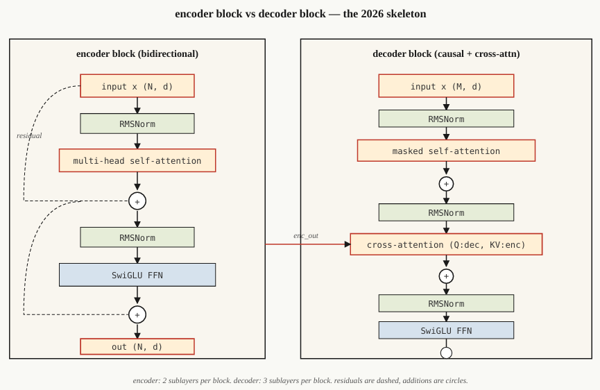

# The Full Transformer - Encoder + Decoder

**Attention là thành phần trung tâm.** Các thành phần còn lại — **residual connection, normalization, feed-forward, cross-attention** — là phần “khung” giúp Transformer có thể **xếp chồng nhiều layer** một cách ổn định.

* **Type:** Build
* **Ngôn ngữ:** Python
* **Prerequisites:** Self-Attention → Multi-Head Attention → Positional Encoding

## The Problem

Một **attention layer đơn lẻ** chủ yếu là một **feature extractor**, chưa phải một mô hình đủ mạnh. Một phép `matmul` cho mỗi layer không cung cấp đủ năng lực biểu diễn cho bài toán ngôn ngữ.

Muốn tăng năng lực, cần **xếp chồng nhiều layer (depth)**. Nhưng khi mạng sâu hơn, việc huấn luyện sẽ trở nên khó khăn nếu thiếu các thành phần ổn định hóa.

Paper **Vaswani et al. (2017)** đã kết hợp 6 thiết kế chính để biến một attention layer thành một **block có thể stack**:

* Attention
* Residual connection
* Normalization
* Feed-Forward Network
* Multi-layer stacking
* Cross-attention trong encoder-decoder

Kiến trúc này trở thành **skeleton chung** cho:

| Kiểu Transformer | Ví dụ |
| ---------------- | ----- |
| Encoder-only     | BERT  |
| Decoder-only     | GPT   |
| Encoder-Decoder  | T5    |

Các Transformer hiện đại đã thay đổi một số chi tiết như **RMSNorm, SwiGLU, Pre-Norm, RoPE**, nhưng **skeleton cơ bản vẫn giữ nguyên**.

> **Attention tạo khả năng tương tác giữa các token; residual + normalization + feed-forward giúp block ổn định và đủ mạnh để stack sâu.**

Bài này tập trung vào **skeleton của Full Transformer**. Các bài sau sẽ đi sâu riêng vào **Encoder → Decoder → Encoder-Decoder**.

## 6 thành phần chính của Transformer

### 1. Embedding + Positional Signal

Chuyển **token → vector**.

* Transformer cần biết **vị trí** của token.
* Cách cổ điển: **Sinusoidal Positional Encoding**.
* Cách hiện đại: **RoPE**.

---

### 2. Self-Attention

Mỗi vị trí có thể **attend đến các vị trí khác** để lấy thông tin ngữ cảnh.

* Encoder: mọi vị trí nhìn thấy mọi vị trí → **bidirectional**.
* Decoder: dùng **causal/masked attention** → không được nhìn token tương lai.

---

### 3. Feed-Forward Network (FFN)

Sau attention, mỗi token đi qua một MLP riêng:

$$\text{FFN}(x)=W_2,\sigma(W_1x)$$

Mục đích: **biến đổi feature** sau khi attention đã trộn thông tin giữa các vị trí.

---

### 4. Residual Connection

Dạng cơ bản:

$$x' = x + \text{sublayer}(x)$$

Giúp thông tin và gradient **đi xuyên qua nhiều layer**, cho phép Transformer stack sâu.

---

### 5. Normalization

Giữ residual stream ổn định trong quá trình training.

* 2017: **LayerNorm**
* Modern: **RMSNorm**

Kiến trúc hiện đại thường dùng **Pre-Norm**:

$$x \rightarrow \text{Norm} \rightarrow \text{Sublayer} \rightarrow +x$$

---

### 6. Cross-Attention — chỉ có ở Encoder-Decoder

Decoder dùng:

* **Query:** từ decoder
* **Key, Value:** từ output của encoder

Nó là cơ chế để **decoder lấy thông tin từ encoder**.

---

## Encoder Block



```text
x → LN → MHA(self) → + → LN → FFN → + → out
                     ^              ^
                     |              |
                     └── residual ──┘
```

Encoder **không masking**, nên mỗi token nhìn được toàn bộ sequence.

---

## Decoder Block

```text
x → LN → MHA(masked self) → + → LN → MHA(cross to encoder) → + → LN → FFN → + → out
```

Decoder có **3 sublayer**:

1. Masked Self-Attention
2. Cross-Attention
3. FFN

Với **decoder-only như GPT**, bỏ Cross-Attention:

```text
Masked Self-Attention → FFN
```

### Ý chính

> **Self-Attention trộn thông tin giữa các token → Residual truyền thông tin qua các layer → FFN biến đổi feature → Normalization giữ quá trình ổn định. Cross-Attention kết nối Encoder với Decoder.**

**Transformer hiện đại** thay đổi các chi tiết như **LayerNorm → RMSNorm, ReLU → SwiGLU, Sinusoidal → RoPE, MHA → GQA/MLA**, nhưng **skeleton của block vẫn giữ nguyên**.

## Pre-Norm vs Post-Norm

Đây là cách đặt **Normalization** trong Transformer block.

### 1. Post-Norm — Transformer 2017

$$x' = LN(x + \text{Sublayer}(x))$$

Tức là:

```text
x → Sublayer → + Residual → LayerNorm
```

Vấn đề: khi stack rất sâu, **khó train ổn định**, thường cần warmup cẩn thận.

---

### 2. Pre-Norm — kiến trúc hiện đại

$$x' = x + \text{Sublayer}(LN(x))$$

Tức là:

```text
x → LayerNorm → Sublayer → + Residual
↘─────────────────────────↗
```

**Norm được đặt trước sublayer.**

Đây là lựa chọn phổ biến trong các Transformer hiện đại vì **dễ tối ưu hơn khi mạng sâu**.

> **Điểm cần nhớ:**
> **Post-Norm:** `Sublayer → Residual → Norm`
> **Pre-Norm:** `Norm → Sublayer → Residual`

---

# Transformer 2017 vs Modern Transformer

| Thành phần     | Vaswani 2017 | Transformer hiện đại |
| -------------- | ------------ | -------------------- |
| Normalization  | LayerNorm    | **RMSNorm**          |
| FFN activation | ReLU         | **SwiGLU**           |
| FFN expansion  | 4×           | **~2.6×**            |
| Position       | Sinusoidal   | **RoPE**             |
| Attention      | Full MHA     | **GQA / MLA**        |
| Bias terms     | Có           | **Không**            |

### RMSNorm

RMSNorm bỏ bước **mean-centering** của LayerNorm. → Ít phép tính hơn nhưng vẫn giữ được sự ổn định của residual stream.

### SwiGLU

Thay FFN ReLU bằng:

$$\text{SwiGLU}(x)=\text{Swish}(W_1x)\odot W_3x$$

Sau đó chiếu về dimension ban đầu bằng $W_2$.

Điểm quan trọng: **SwiGLU dùng 3 projection matrices**, vì vậy expansion ratio giảm từ 4× xuống khoảng **2.6×** để giữ số parameter tương đương.

---

## Parameter của một Transformer Block

Với:

$$d_{\text{model}}=d$$

### Attention

Có 4 projection: $W_Q,W_K,W_V,W_O$ nên xấp xỉ: $\boxed{4d^2}$

### SwiGLU FFN

Có 3 projection: $\boxed{3rd^2}$ với $r$ là expansion ratio. Norm có số parameter rất nhỏ so với hai phần trên.

### Ý chính

> **Pre-Norm là thay đổi về cách tổ chức block để training sâu ổn định hơn. Còn RMSNorm, SwiGLU, RoPE và GQA/MLA là các thay đổi hiện đại nhằm cải thiện hiệu quả và khả năng mở rộng.**

## Built It

### Step 1: Các thành phần cơ bản

Sử dụng lớp `Matrix` nhỏ (được sao chép vào file này để độc lập):

* `layer_norm(x, eps=1e-5)` — trừ trung bình, chia cho độ lệch chuẩn.
* `rms_norm(x, eps=1e-6)` — chia cho RMS. Không trừ trung bình.
* `gelu(x)` và `silu(x) * W3 x` (SwiGLU).
* `ffn_swiglu(x, W1, W2, W3)`.
* `encoder_block(x, params)` và `decoder_block(x, enc_out, params)`.

### Step 2: Kết nối Encoder 2 lớp và Decoder 2 lớp

Xếp chồng chúng. Truyền output của encoder vào **cross-attention của mọi decoder**. Thêm một **LayerNorm cuối cùng** trước output projection.

```python
def encode(tokens, params):
    x = embed(tokens, params.emb) + sinusoidal(len(tokens), params.d)
    for block in params.encoder_blocks:
        x = encoder_block(x, block)

    return x


def decode(target_tokens, encoder_out, params):
    x = embed(target_tokens, params.emb) + sinusoidal(len(target_tokens), params.d)
    for block in params.decoder_blocks:
        x = decoder_block(x, encoder_out, block)

    return x
```

### Step 3: Chạy forward với ví dụ đơn giản

Đưa một **source gồm 6 token** và một **target gồm 5 token** qua mô hình.

Kiểm tra output có shape:

```text
(5, vocab)
```

Không thực hiện training — bài học này tập trung vào **kiến trúc**, không phải loss.

### Step 4: Thay bằng RMSNorm + SwiGLU

Thay **LayerNorm** và **ReLU-FFN** bằng **RMSNorm** và **SwiGLU**.

Xác nhận rằng các shape vẫn khớp.

Đây là phiên bản **hiện đại hóa theo kiến trúc 2026**, chỉ cần thay thế các function tương ứng.


## Key Terms

| Thuật ngữ           | Cách mọi người thường nói          | Ý nghĩa thực tế                                                                                        |
| ------------------- | ---------------------------------- | ------------------------------------------------------------------------------------------------------ |
| **Block**           | “Một transformer layer”            | Một stack gồm **norm + attention + norm + FFN**, được bao quanh bởi residual connections.              |
| **Residual**        | “Skip connection”                  | $x + f(x)$; giúp gradient truyền qua các stack sâu.                                                    |
| **Pre-norm**        | “Normalize before, not after”      | Hiện đại: $x + \text{sublayer}(\text{LN}(x))$. Giúp train mạng sâu mà không cần warmup phức tạp.       |
| **RMSNorm**         | “LayerNorm without the mean”       | Chia cho RMS, không trừ mean; giảm một phép tính và vẫn có độ ổn định thực nghiệm tương đương.         |
| **SwiGLU**          | “The FFN everyone switched to”     | $\text{Swish}(W_1x)\odot W_3x \rightarrow W_2$; tốt hơn ReLU/GELU về LM perplexity.                    |
| **Cross-Attention** | “How the decoder sees the encoder” | MHA với **Q từ decoder**, **K/V từ encoder output**.                                                   |
| **FFN expansion**   | “How wide the middle MLP is”       | Tỷ lệ giữa hidden size và $d_{\text{model}}$, thường là **4×** với LayerNorm hoặc **2.6×** với SwiGLU. |
| **Bias-free**       | “Drop the +b terms”                | Bỏ các bias $+b$ trong linear layers; giảm nhẹ perplexity và kích thước model.                         |
