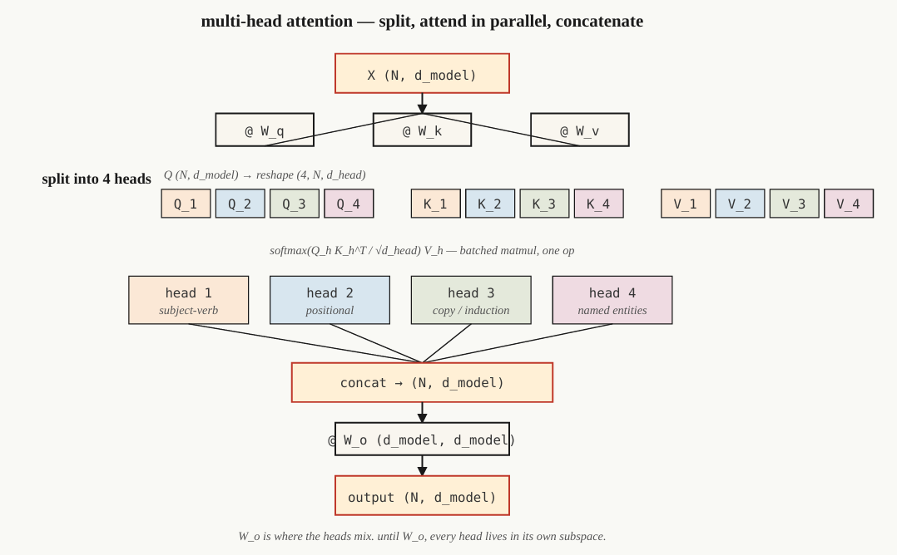

# Multi-Head Attetion

**Một attention head** chỉ học một loại quan hệ tại một thời điểm.
**Tám heads** có thể học tám loại quan hệ khác nhau. Các head hoạt động độc lập với nhau, vì vậy có thể sử dụng nhiều head hơn.

* **Type:** Build
* **Language:** Python
* **Prerequisites:** Phase 7 · 02 — Self-Attention from Scratch

---

## The Problem

Một **single self-attention head** tạo ra **một attention matrix**.

Attention matrix này phải biểu diễn các loại quan hệ trong dữ liệu thông qua cùng một cơ chế attention. Ví dụ, trong ngôn ngữ có thể đồng thời tồn tại:

* **Subject–verb agreement:** quan hệ giữa chủ ngữ và động từ.
* **Co-reference:** xác định các từ/cụm từ cùng tham chiếu đến một đối tượng.
* **Long-range discourse:** quan hệ giữa các thành phần ở xa nhau trong chuỗi.
* **Syntactic chunking:** nhận biết các cấu trúc hoặc cụm cú pháp.

Nếu tất cả các quan hệ này cùng được xử lý bởi **một attention head**, chúng có thể bị trộn vào **một softmax distribution duy nhất**. Khi đó, head phải phân bổ attention cho nhiều loại quan hệ khác nhau và có thể làm mất một phần thông tin quan trọng.

### Giải pháp: Multi-Head Attention

Giải pháp được giới thiệu trong **Vaswani et al. (2017)** là chạy **nhiều attention function song song**.

Mỗi head có các projection riêng:

$$Q_i = XW_i^Q$$

$$K_i = XW_i^K$$

$$V_i = XW_i^V$$

Sau đó mỗi head thực hiện self-attention độc lập:

$$head_i =\operatorname{Attention}(Q_i,K_i,V_i)$$

Các output của tất cả các head được **concatenate**:

$$\operatorname{MultiHead}(Q,K,V)=\operatorname{Concat}(head_1,\ldots,head_h)W^O$$

---

### Không gian của mỗi Head

Thay vì để mỗi head hoạt động trên toàn bộ không gian $d_{model}$, Multi-Head Attention chia không gian đó thành các **subspace nhỏ hơn**.

Nếu có (h) heads:

$$d_{head}=\frac{d_{model}}{h}$$

Ví dụ:

$$d_{model}=512,\qquad h=8$$

thì:

$$d_{head}=64$$

Mỗi head hoạt động trong một không gian 64 chiều và có thể tập trung vào những đặc trưng/quan hệ khác nhau.

---

### Tại sao dùng nhiều Head?

Ý tưởng cốt lõi:

> **Single-head:** một attention function phải biểu diễn nhiều loại quan hệ.
> **Multi-head:** nhiều attention function có thể học các quan hệ khác nhau song song.

Do mỗi head có **Q, K, V projections riêng**, các head không bị buộc phải học cùng một pattern.

Sau khi các head hoàn thành attention, output của chúng được concatenate để tạo lại representation có kích thước $d_{model}$.

Theo mô tả của tài liệu, việc chia thành nhiều head được thiết kế sao cho **tổng số parameter không tăng đáng kể so với một attention duy nhất trên toàn bộ $d_{model}$**, trong khi khả năng biểu diễn được tăng lên.

---

### Multi-Head Attention trong Transformer hiện đại

Multi-Head Attention trở thành cơ chế attention mặc định trong kiến trúc Transformer.

Điểm cần lựa chọn không chỉ là **số lượng attention heads**, mà còn là cách xử lý **Key và Value projections**.

Một số biến thể được đề cập:

* **Multi-Head Attention (MHA):** mỗi head có Q, K, V riêng.
* **Multi-Query Attention (MQA):** nhiều query heads nhưng chia sẻ K/V.
* **Grouped-Query Attention (GQA):** các query heads được chia thành nhóm và mỗi nhóm chia sẻ K/V.
* **Multi-Head Latent Attention (MLA):** sử dụng latent representations để giảm chi phí lưu trữ và tính toán K/V.

**Ý chính của phần The Problem:** Single-head attention bị giới hạn khi phải học nhiều loại quan hệ cùng lúc. **Multi-Head Attention giải quyết bằng cách chạy nhiều attention head song song, mỗi head có projection riêng và hoạt động trong một subspace nhỏ hơn.**

## The Concept

### 1. Split

Cho đầu vào:

$$X \in \mathbb{R}^{N \times d_{model}}$$

Chiếu $X$ thành ba ma trận:

$$Q,K,V \in \mathbb{R}^{N \times d_{model}}$$

Sau đó reshape thành:

$$(N,n_{heads},d_{head})$$

với:

$$d_{head}=\frac{d_{model}}{n_{heads}}$$

Cuối cùng transpose thành:

$$(n_{heads},N,d_{head})$$

Mục đích là tách representation thành nhiều **attention heads**, để mỗi head hoạt động trên một subspace riêng.

---

### 2. Attend in Parallel

Trong mỗi head, thực hiện **Scaled Dot-Product Attention** độc lập:

$$Attention(Q_i,K_i,V_i)=softmax\left(\frac{Q_iK_i^T}{\sqrt{d_{head}}} \right)V_i$$

Mỗi head tạo ra output có shape:

$$(N,d_{head})$$

Các head được tính **song song**.

Điểm quan trọng:

> Các head hoạt động trên những subspace khác nhau và **không trao đổi thông tin với nhau trong quá trình attention**.

---

### 3. Concatenate and Project

Sau khi tất cả heads hoàn thành:

$$head_1,\ldots,head_{n}$$

concatenate chúng lại:

$$Concat(head_1,\ldots,head_n) \in \mathbb{R}^{N\times d_{model}}$$

Sau đó nhân với ma trận output đã học:

$$W_O\in\mathbb{R}^{d_{model}\times d_{model}}$$

$$Output =Concat(head_1,\ldots,head_n)W_O$$

**$W_O$ là nơi thông tin giữa các heads được trộn lại.**

---

## Why It Works

Mỗi head có thể **specialize** vào một loại quan hệ khác nhau mà không phải cạnh tranh với các head khác cho cùng một representational budget.

Các nghiên cứu probing giai đoạn **2019–2024** được tài liệu đề cập cho thấy có thể quan sát những vai trò khác nhau của attention heads, chẳng hạn:

* **Positional heads:** tập trung vào thông tin vị trí.
* **Previous-token heads:** chú ý đến token ngay trước đó.
* **Copy heads:** hỗ trợ sao chép thông tin.
* **Named-entity heads:** tập trung vào named entities.
* **Induction heads:** liên quan đến khả năng **in-context learning**.

Điểm cốt lõi:

> **Multi-Head Attention không chỉ tạo nhiều attention matrix; nó cho phép các head học các kiểu quan hệ khác nhau trong những subspace khác nhau.**

---

## Các biến thể Attention

| Variant | Q heads |         K/V heads | Ý tưởng                                                  |
| ------- | ------: | ----------------: | -------------------------------------------------------- |
| **MHA** |     $N$ |               $N$ | Mỗi Q head có K/V riêng                                  |
| **MQA** |     $N$ |               $1$ | Tất cả Q heads chia sẻ K/V                               |
| **GQA** |     $N$ |               $G$ | Các Q heads được chia thành nhóm và mỗi nhóm chia sẻ K/V |
| **MLA** |     $N$ | Latent compressed | Nén K/V vào latent space                                 |

### MHA — Multi-Head Attention

Mỗi head có:

$$Q_i,\ K_i,\ V_i$$

riêng.

Đây là dạng Multi-Head Attention tiêu chuẩn.

---

### MQA — Multi-Query Attention

Có nhiều Q heads nhưng chỉ có **một nhóm K/V dùng chung**:

$$N\ Q\text{ heads},\quad 1\ K/V\text{ head}$$

Mục tiêu chính là giảm chi phí **KV cache**.

---

### GQA — Grouped-Query Attention

Có:

$$N\ Q\text{ heads},\quad G\ K/V\text{ heads}$$

với:

$$G \lt N$$

Các Q heads được chia thành nhóm; mỗi nhóm chia sẻ K/V.

Theo tài liệu, **GQA là lựa chọn hiện đại phổ biến** vì giảm bộ nhớ KV cache khoảng:

$$\frac{N}{G}$$

trong khi vẫn giữ chất lượng gần với MHA.

Các model được tài liệu nêu: **Llama 2 70B, Llama 3+, Qwen 2+, Mistral**.

---

### MLA — Multi-Head Latent Attention

MLA đi xa hơn GQA bằng cách **nén K/V vào một latent space**.

Thay vì lưu trực tiếp toàn bộ K/V, chúng được biểu diễn trong không gian latent có kích thước thấp hơn, sau đó được project trở lại khi tính toán.

Đánh đổi:

* **Tốn thêm FLOPs khi compute**
* **Tiết kiệm nhiều memory hơn**

Tài liệu nêu **DeepSeek-V2 và DeepSeek-V3** là các model sử dụng MLA.

---

### Tóm tắt luồng

$$X \rightarrow Q,K,V \rightarrow Split\ into\ Heads \rightarrow Attention\ independently \rightarrow Concat \rightarrow W_O \rightarrow Output$$

**Ba ý cần nhớ:**

1. **Split:** chia $d_{model}$ thành nhiều subspace.
2. **Attend:** mỗi head attention độc lập.
3. **Mix:** $W_O$ trộn thông tin giữa các heads.

---

## Built It

### Step 1 — split heads from the single-head attention we already have

Dựa trên `SelfAttention` từ Lesson 02, thêm hai bước **split** và **concat** để chuyển từ single-head sang multi-head.

```python
def split_heads(X, n_heads):
    n, d = X.shape
    d_head = d // n_heads

    return X.reshape(n, n_heads, d_head).transpose(1, 0, 2)
    # (heads, n, d_head)


def combine_heads(H):
    h, n, d_head = H.shape

    return H.transpose(1, 0, 2).reshape(n, h * d_head)
```

* `split_heads()`:

  * Input: `(N, d_model)`
  * `reshape()` chia `d_model` thành `n_heads × d_head`.
  * `transpose()` đưa số head lên đầu.
  * Output: `(n_heads, N, d_head)`.

* `combine_heads()`:

  * Nhận output của các head: `(n_heads, N, d_head)`.
  * `transpose()` đưa về `(N, n_heads, d_head)`.
  * `reshape()` ghép các head lại thành `(N, d_model)`.

Toàn bộ quá trình chỉ cần **1 `reshape` + 1 `transpose` cho mỗi chiều**, **không cần vòng lặp**. Đây chính là cách tổ chức tensor tương ứng với cơ chế multi-head attention trong PyTorch.

---

### Step 2 — Run Scaled Dot-Product Attention per Head

Mỗi head nhận một phần riêng của (Q, K, V) và thực hiện **Scaled Dot-Product Attention**. Vì các head được xếp thành một batch, phép tính attention được thực hiện bằng **batched matrix multiplication**.

```python
def mha_forward(X, W_q, W_k, W_v, W_o, n_heads):
    # 1. Tạo (Q,K,V):
    Q = X @ W_q
    K = X @ W_k
    V = X @ W_v

    # 2. Chia thành các head: 
    Qh = split_heads(Q, n_heads)  # (heads, n, d_head)
    Kh = split_heads(K, n_heads)
    Vh = split_heads(V, n_heads)

    # 3. Tính attention scores: Đây chính là **Scaled Dot-Product Attention** được thực hiện đồng thời cho tất cả heads.
    scores = Qh @ Kh.transpose(0, 2, 1) / np.sqrt(Qh.shape[-1])
    # 4. Softmax: Chuyển scores thành attention weights.
    weights = softmax(scores, axis=-1)

    # 5. Weighted sum với (V):
    out = weights @ Vh  # (heads, n, d_head)

    # 6. Ghép các head và output projection:
    concat = combine_heads(out) # (N, d_model)
    return concat @ W_o, weights # nhân với (W_o) để trộn thông tin giữa các heads.
```

#### Ý quan trọng về GPU

Trên hardware thực tế, phép:

```python
Qh @ Kh.transpose(0, 2, 1)
```

được thực hiện dưới dạng **một batched matrix multiplication (BMM)**:

$$(heads,N,d_{head}) \times (heads,d_{head},N) \rightarrow (heads,N,N)$$

GPU xử lý toàn bộ heads như **một batch**, thay vì phải chạy một vòng lặp Python cho từng head. Vì vậy, việc thêm heads **không có nghĩa là phải viết thêm loop để tính attention từng head**.




> Figure 22: Multi-head attention splits, attends, concatenates

### Step 3 — Grouped-Query Attention (GQA)

Trong **GQA**, chỉ có cách tạo **Key và Value** thay đổi.

* $Q$ vẫn có $n_{heads}$ heads.
* $K,V$ chỉ có $n_{kv_heads}$ heads.
* Điều kiện:

$$n_{kv_heads}<n_{heads}$$

Sau đó các K/V heads được **lặp lại (repeat)** để khớp với số lượng Q heads.

```python
def gqa_project(X, W, n_kv_heads, n_heads):
    kv = split_heads(X @ W, n_kv_heads)
    repeat = n_heads // n_kv_heads

    return np.repeat(kv, repeat, axis=0)
```

Shape:

```text
kv:
(kv_heads, N, d_head)

return:
(n_heads, N, d_head)
```

#### Cách hoạt động

Giả sử:

$$n_{heads}=64,\qquad n_{kv_heads}=8$$

thì mỗi K/V head được dùng chung cho:

$$64/8=8$$

Q heads.

Vì vậy:

$$8\ KV\ heads \rightarrow 64\ KV\ heads\ \text{(sau khi repeat)}$$

để thực hiện attention với 64 Q heads.

#### Lợi ích chính

Điểm quan trọng của GQA nằm ở **inference**:

KV cache chỉ cần lưu:

$$n_{kv_heads}$$

thay vì:

$$n_{heads}$$

Do đó giảm lượng memory cần cho KV cache theo tỷ lệ:

$$\frac{n_{heads}}{n_{kv_heads}}$$

Theo tài liệu, **Llama 3 70B** sử dụng:

$$64\ Q\ heads,\quad 8\ KV\ heads$$

nên KV cache giảm khoảng:

$$64/8=8\times$$

---

### Step 4 — Probe What Each Head Learned

Chạy **Multi-Head Attention** trên một câu ngắn với **4 heads**.

Với mỗi head, in ra attention matrix có shape:

$$(N,N)$$

Mục đích là quan sát **mỗi head đang tập trung vào những vị trí nào trong sequence**.

Các head có thể tạo ra những attention pattern khác nhau, cho thấy chúng đang biểu diễn những cấu trúc khác nhau.

Tuy nhiên, tài liệu lưu ý rằng ngay cả khi **random initialization**, các head vẫn có thể xuất hiện pattern khác nhau. Sự khác biệt này một phần đến từ **signal**, và một phần liên quan đến **rotational symmetry trong các subspace**.

## KeyTerm

| Term                | Người ta thường nói                      | Thực chất là gì                                                                                                                                  |
| ------------------- | ---------------------------------------- | ------------------------------------------------------------------------------------------------------------------------------------------------ |
| **Head**            | “Một attention circuit”                  | Một Q/K/V projection có kích thước $d_{head}$, đi kèm với attention matrix riêng.                                                                |
| **$d_{head}$**      | “Head dimension”                         | Chiều rộng hidden representation của mỗi head: $\displaystyle d_{head}=\frac{d_{model}}{n_{heads}}$. Trong production thường là **64 hoặc 128**. |
| **Split / Combine** | “Mấy thủ thuật reshape”                  | Chuyển tensor giữa $(N,d_{model})$ và $(n_{heads},N,d_{head})$ bằng `reshape + transpose` trước/sau attention.                                   |
| **$W_o$**           | “Output projection”                      | Ma trận $(d_{model},d_{model})$ được áp dụng sau khi concatenate các heads; đây là nơi **các heads được trộn thông tin**.                        |
| **MQA**             | “One KV head”                            | **Multi-Query Attention:** nhiều Q heads dùng chung một K/V projection. Giảm KV cache mạnh nhưng có thể mất một phần chất lượng.                 |
| **GQA**             | “The default since Llama 2”              | **Grouped-Query Attention:** $n_{kv_heads} \lt n_{heads}$; K/V heads được lặp để khớp với Q heads.                                                   |
| **MLA**             | “DeepSeek’s trick”                       | **Multi-Head Latent Attention:** K/V được nén vào một **latent space có low-rank**, sau đó giải nén khi thực hiện attention.                     |
| **Induction head**  | “The circuit behind in-context learning” | Một cặp attention heads có khả năng phát hiện **lần xuất hiện trước đó của một pattern** và sao chép thông tin xuất hiện sau pattern đó.         |
