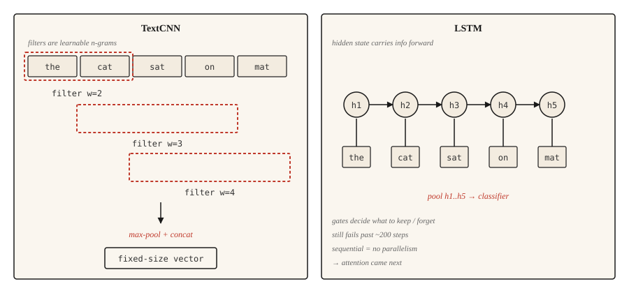
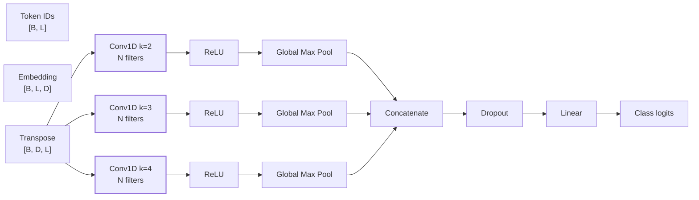
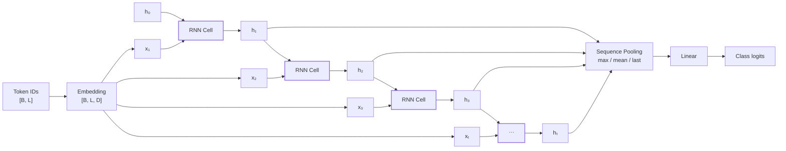
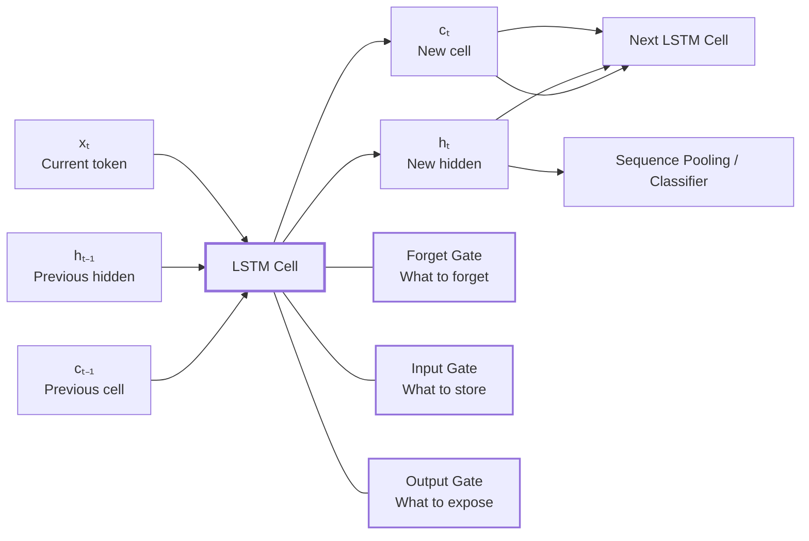
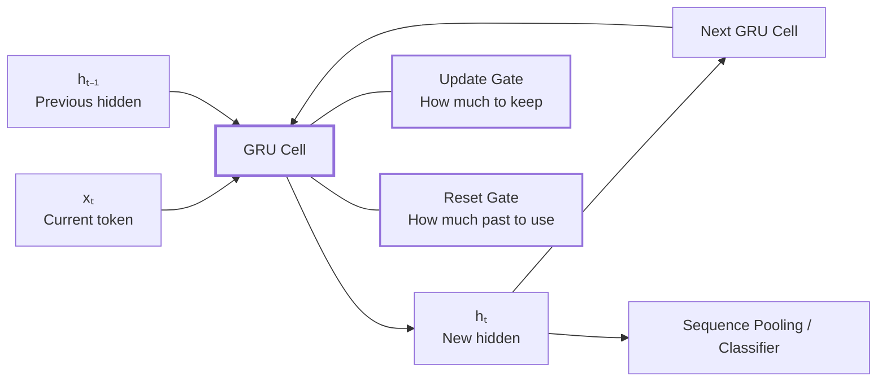

# CNNs and RNNs for Text
> **Convolution học n-gram. Recurrence ghi nhớ. Cả hai đã được attention thay thế trong nhiều bài toán, nhưng vẫn quan trọng trên phần cứng bị giới hạn.**



## The Problem

> TF-IDF và Word2Vec tạo ra các vector phẳng, không thể hiện **thứ tự của từ**. Vì vậy, một classifier sử dụng chúng không thể phân biệt:
>
> `dog bites man` ≠ `man bites dog`
>
> Trong nhiều bài toán, **word order mang thông tin quan trọng**. Trước khi Transformer xuất hiện, có hai nhóm kiến trúc giải quyết vấn đề này:
>
> **1. TextCNN**
>
> * Áp dụng **1D convolution** trên chuỗi word embeddings.
> * Kernel width = 3 có thể học các mẫu tương ứng với **trigram**.
> * Dùng nhiều kernel width `(2, 3, 4, 5)` để bắt các pattern ở nhiều kích thước.
> * **Max-pooling** để đưa chuỗi về vector kích thước cố định.
> * Đặc trưng: **song song, nhanh, đơn giản**.
>
> **2. RNN / LSTM / GRU**
>
> * Xử lý token **tuần tự**, từng token một.
> * Duy trì **hidden state** để truyền thông tin từ các token trước sang token sau.
> * Có khả năng xử lý sequence có độ dài khác nhau.
> * Đặc trưng: **tuần tự, có memory, linh hoạt**.
>
> RNN/LSTM/GRU từng thống trị sequence modeling khoảng **2014–2017**, sau đó attention trở thành hướng chính.

Vấn đề cốt lõi là:

$$\boxed{\text{TF-IDF / Word2Vec không mô hình hóa word order}}$$

Ví dụ:

```text
dog bites man
man bites dog
```

Nếu chỉ biểu diễn bằng tập/vector các từ, hai câu có thể chứa **cùng các từ** nhưng mang **ý nghĩa khác nhau**.

Do đó cần một kiến trúc có khả năng mô hình hóa:

$$\text{Token embeddings} \rightarrow \text{word order / local dependencies} \rightarrow \text{sequence representation}$$

Hai hướng trước Transformer:

| Kiến trúc   | Cách xử lý thứ tự                                |
| ----------- | ------------------------------------------------ |
| **TextCNN** | Convolution quét qua các **local n-gram**        |
| **RNN**     | Hidden state truyền thông tin **theo thời gian** |

**Khác biệt bản chất:**

$$\text{CNN} \rightarrow \text{local pattern}$$

$$\text{RNN} \rightarrow \text{sequential memory}$$

Sau này **Attention** giải quyết dependency giữa các token linh hoạt hơn, trở thành nền tảng của Transformer.


## The Concept

### 1. Text CNN

**TextCNN** (Kim, 2014) áp dụng **1D convolution** trên chuỗi word embeddings.

Quy trình:

$$\text{Tokens} \rightarrow \text{Embeddings} \rightarrow \text{1D Conv} \rightarrow \text{Feature Map} \rightarrow \text{Global Max-Pooling} \rightarrow \text{Classifier}$$

* Kernel có **width = (k)** quét qua từng nhóm (k) từ liên tiếp → học một **n-gram detector**.
* Dùng nhiều kích thước kernel, ví dụ (2,3,4,5), để phát hiện pattern ở nhiều độ dài.
* **Global max-pooling** lấy activation mạnh nhất → không phụ thuộc vị trí của pattern.
* Ví dụ: một filter học pattern `"not good"` sẽ phát hiện được nó dù xuất hiện ở đầu hay giữa câu.
* Các filter có thể chạy **song song**, không có phụ thuộc tuần tự.

Ví dụ:

$$3\text{ widths}\times100\text{ filters}=300$$

→ **300 bộ phát hiện n-gram học được**.

**Ý chính:**
$$\boxed{\text{TextCNN} \rightarrow \text{học local n-gram patterns}}$$

#### Kiến trúc



> __Control__: `Conv1D` học local n-gram → `Max Pool` chọn activation mạnh nhất → concatenate → classifier.

---

### 2. RNN

RNN xử lý sequence **từng token theo thời gian**.

Tại bước $t$:

$$h_t=f(Wx_t+Uh_{t-1}+b)$$

Trong đó:

* $x_t$: token embedding tại thời điểm $t$
* $h_{t-1}$: hidden state từ bước trước
* $h_t$: hidden state mới
* $W,U,b$: **được dùng chung qua tất cả time step**.

Hidden state $h_T$ chứa thông tin tóm tắt **prefix từ $x_1$ đến $x_T$**.

Đối với classification, có thể lấy representation bằng:

* `last hidden state`
* `mean pooling`
* `max pooling`

**Vấn đề:** Plain RNN dễ gặp **vanishing gradients**, khiến việc học dependency dài trở nên khó khăn.

$$\boxed{\text{RNN} \rightarrow \text{duy trì thông tin qua hidden state}}$$

#### Kiến trúc



> Thông tin đi tuần tự từ $h_{t-1} \rightarrow h_t$

#### 2.1. LSTM

**LSTM** thêm các **gates** để kiểm soát:

* thông tin nào cần **quên**
* thông tin nào cần **lưu**
* thông tin nào cần **output**

Mục tiêu chính trong concept này là **ổn định gradient qua các sequence dài**, khắc phục hạn chế của plain RNN.

$$\boxed{\text{LSTM} \rightarrow \text{RNN + gates để duy trì long-term information}}$$

##### Kiến trúc



> LSTM thêm cell state + gates để kiểm soát thông tin và giúp gradient truyền ổn định hơn qua sequence dài.

#### 2.2. GRU

**GRU** đơn giản hóa LSTM bằng cách sử dụng **2 gates**.

* Ít tham số hơn LSTM.
* Có hiệu năng tương tự trong nhiều trường hợp theo concept này.

$$\boxed{\text{GRU} \rightarrow \text{phiên bản đơn giản hơn của LSTM}}$$

##### Kiến trúc



> GRU có 2 gates, đơn giản hơn LSTM và không có cell state riêng.

---

### 3. Bidirectional RNNs

**Bidirectional RNN** sử dụng **hai RNN**:

$$\text{Forward: } x_1\rightarrow x_2\rightarrow...\rightarrow x_T$$

$$\text{Backward: } x_T\rightarrow x_{T-1}\rightarrow...\rightarrow x_1$$

Sau đó **concatenate** hidden states từ hai hướng.

Do đó, representation của mỗi token có cả:

$$\boxed{\text{Left Context + Right Context}}$$

Tức là token có thể "nhìn thấy" **ngữ cảnh trước và sau nó**.

Điều này đặc biệt quan trọng với các **sequence tagging tasks**, nơi representation của từng token cần cả hai phía ngữ cảnh.

## Build It

### Step 1: TextCNN in PyTorch

```python
import torch
import torch.nn as nn
import torch.nn.functional as F

class TextCNN(nn.Module):

    def __init__(self, vocab_size, embed_dim, n_classes, filter_widths=(2, 3, 4), n_filters=64, dropout):
        super().__init__()

        self.embed = nn.Embedding(vocab_size, embed_dim, padding_idx=0)

        self.convs = nn.ModuleList($$            nn.Conv1d(embed_dim, n_filters, kernel_size=k)
            for k in filter_widths
        ])

        self.dropout = nn.Dropout(dropout)
        self.fc = nn.Linear(n_filters * len(filter_widths), n_classes)

    def forward(self, token_ids):

        x = self.embed(token_ids).transpose(1, 2)

        pooled = []

        for conv in self.convs:

            c = F.relu(conv(x))
            p = F.max_pool1d(c, c.size(2)).squeeze(2)

            pooled.append(p)

        h = torch.cat(pooled, dim=1)

        return self.fc(self.dropout(h))
```

`transpose(1, 2)` chuyển:

```text
[batch, seq_len, embed_dim]
        ↓
[batch, embed_dim, seq_len]
```

vì `nn.Conv1d` xem chiều giữa là **channels**.

Mỗi convolution tạo một feature map, sau đó global max-pooling lấy activation mạnh nhất. Vì vậy output sau pooling có **kích thước cố định**, không phụ thuộc `seq_len`.

---

### Step 2: LSTM classifier

```python
class LSTMClassifier(nn.Module):

    def __init__(self, vocab_size, embed_dim, hidden_dim, n_classes, bidirectional=True, dropout):
        super().__init__()

        self.embed = nn.Embedding(vocab_size, embed_dim, padding_idx=0)

        self.lstm = nn.LSTM(
            embed_dim,
            hidden_dim,
            batch_first=True,
            bidirectional=bidirectional
        )

        factor = 2 if bidirectional else 1

        self.dropout = nn.Dropout(dropout)
        self.fc = nn.Linear(hidden_dim * factor, n_classes)

    def forward(self, token_ids):

        x = self.embed(token_ids)

        out, _ = self.lstm(x)

        pooled = out.max(dim=1).values

        return self.fc(self.dropout(pooled))
```

Ở đây sử dụng **max-pooling trên toàn bộ sequence** thay vì chỉ lấy hidden state cuối.

Ý tưởng:

$$h_1,h_2,\ldots,h_T \rightarrow \operatorname{maxpool} \rightarrow \text{fixed-size representation}$$

Điều này giúp giữ lại activation mạnh nhất xuất hiện ở bất kỳ vị trí nào trong sequence, thay vì để thông tin ở cuối sequence chi phối representation.

---

### Step 3: The vanishing gradient demo (intuition)

Một plain RNN không có gating khó học **long-range dependencies**.

Ví dụ toy task:

> Dự đoán token `A` có xuất hiện ở đâu đó trong sequence hay không.

Nếu `A` nằm ở vị trí 1 và sequence dài 100 token, gradient phải truyền ngược qua khoảng 99 recurrent steps.

```python
def vanishing_gradient_sim(seq_len, recurrent_weight=0.9):
    import math
    return math.pow(recurrent_weight, seq_len)

# At weight=0.9 over 100 steps:

# 0.9 ^ 100 ≈ 2.7e-5

# The gradient from step 100 to step 1 is effectively zero.
```

Nếu recurrent weight:

$$w \lt 1$$

thì gradient có xu hướng giảm theo:

$$w^T$$

Ví dụ:

$$0.9^{100}\approx2.7\times10^{-5}$$

→ gradient gần như biến mất.

Nếu weight lớn hơn 1, gradient có thể **explode**.

**LSTM** giải quyết vấn đề này bằng cell state với các tương tác cộng, tạo ra một "highway" cho gradient. GRU cũng cung cấp cơ chế tương tự nhưng với ít tham số hơn.

---

### Step 4: why this still was not enough

Ngay cả LSTM vẫn còn ba vấn đề chính:

#### 1. Sequential bottleneck

RNN phải xử lý tuần tự:

$$x_1\rightarrow x_2\rightarrow\cdots\rightarrow x_{1000}$$

Sequence dài 1000 cần 1000 bước forward/backward tuần tự. → Không thể song song hóa theo chiều thời gian như convolution hoặc attention.

#### 2. Fixed-size context vector

Trong encoder-decoder, decoder chỉ nhận **final hidden state** của encoder. Toàn bộ input dài phải được nén vào một vector cố định. → Với input dài, thông tin chi tiết có thể bị mất.

#### 3. Distant-dependency accuracy ceiling

LSTM tốt hơn plain RNN nhưng vẫn gặp khó khăn khi phải truyền một thông tin cụ thể qua khoảng cách rất dài, ví dụ **200+ steps**.

### Kết luận

Ba vấn đề trên thúc đẩy sự xuất hiện của **Attention**:

$$\boxed{ \text{RNN} \rightarrow \text{LSTM/GRU} \rightarrow \text{Attention} \rightarrow \text{Transformer}}$$

Attention giải quyết cả ba hạn chế trên; Transformer sau đó loại bỏ hoàn toàn recurrence.

Nếu muốn, phần tiếp theo có thể nối trực tiếp sang **Attention: vì sao nó giải quyết từng vấn đề của RNN/LSTM**.

## Use It

`nn.LSTM`, `nn.GRU` và `nn.Conv1d` của PyTorch đều đã sẵn sàng cho production. Code training nhìn chung là tiêu chuẩn.

Hugging Face cung cấp các pretrained embeddings có thể dùng làm **input layer**:

```python
from transformers import AutoModel

encoder = AutoModel.from_pretrained("bert-base-uncased")

for param in encoder.parameters():
    param.requires_grad = False

class BertCNN(nn.Module):

    def __init__(self, n_classes, filter_widths=(2, 3, 4), n_filters=64):
        super().__init__()

        self.encoder = encoder

        self.convs = nn.ModuleList([
            nn.Conv1d(768, n_filters, kernel_size=k)
            for k in filter_widths
        ])

        self.fc = nn.Linear(n_filters * len(filter_widths), n_classes)

    def forward(self, input_ids, attention_mask):

        with torch.no_grad():
            out = self.encoder(
                input_ids=input_ids,
                attention_mask=attention_mask
            ).last_hidden_state

        x = out.transpose(1, 2)

        pooled = [
            F.max_pool1d(
                F.relu(conv(x)),
                kernel_size=conv(x).size(2)
            ).squeeze(2)
            for conv in self.convs
        ]

        return self.fc(torch.cat(pooled, dim=1))
```

Ở đây, BERT được dùng như **encoder cố định**, sau đó các `Conv1d` học các pattern trên contextual embeddings của BERT.

---

## Use-when-it-fits-the-constraint checklist

### 1. Edge / on-device inference

TextCNN với GloVe embeddings nhỏ hơn transformer rất nhiều, khoảng **10–100×** theo tài liệu.

→ Phù hợp khi target là **phone hoặc edge device**.

### 2. Streaming / online classification

RNN xử lý **từng token một**, trong khi transformer cần sequence đầu vào.

→ Với text đến liên tục theo thời gian thực, **LSTM vẫn có lợi thế**.

### 3. Tiny models for baselines

TextCNN phù hợp để xây dựng baseline nhanh cho task mới.

→ Có thể train một TextCNN trong vài phút trên CPU.

### 4. Sequence labeling with limited data

**BiLSTM-CRF** vẫn là một kiến trúc production-grade cho NER khi dữ liệu gán nhãn hạn chế, khoảng **1k–10k câu** theo tài liệu.

### 5. General rule

> **Everything else goes to a transformer.**

Tức là ngoài các trường hợp bị ràng buộc bởi kích thước model, streaming hoặc dữ liệu nhỏ, **Transformer thường là lựa chọn mặc định**.

---

## Key Terms

| Term                   | What people say      | What it actually means                                                                                              |
| ---------------------- | -------------------- | ------------------------------------------------------------------------------------------------------------------- |
| **TextCNN**            | CNN for text         | Stack các 1D convolution trên word embeddings với global max-pooling. Kim (2014).                                   |
| **RNN**                | Recurrent net        | Hidden state được cập nhật tại mỗi time step: $h_t = f(W x_t + U h_{t-1})$.                                         |
| **LSTM**               | Gated RNN            | Thêm input / forget / output gates cùng với cell state. Giúp training ổn định trên sequence dài.                    |
| **GRU**                | Simpler LSTM         | Sử dụng hai gates thay vì ba gates. Độ chính xác tương tự với ít parameters hơn.                                    |
| **Bidirectional**      | Both directions      | Kết hợp forward RNN và backward RNN bằng cách concatenate hidden states. Mỗi token nhìn thấy context ở cả hai phía. |
| **Vanishing gradient** | Training signal dies | Việc nhân lặp lại với các weights nhỏ hơn 1 trong plain RNN khiến gradient ở các bước đầu gần như bằng 0.           |
