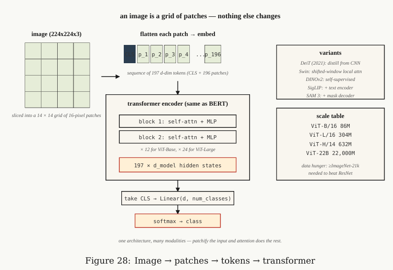

# Vision Transformers (ViT)

**Vision Transformer (ViT)** xem một ảnh như một **lưới các patch**. Tương tự, một câu được xem như một **chuỗi token**. Cả hai đều có thể được đưa vào cùng một kiến trúc Transformer.

* **Type:** Build
* **Language:** Python
* **Prerequisites:** Full Transformer, CNNs, Vision Transformers intro

## Vấn đề

Trước năm 2020, phần lớn Computer Vision hiện đại dựa trên **CNN**. Các mô hình SOTA trên ImageNet, COCO và các bài toán detection chủ yếu sử dụng CNN làm backbone.

Năm 2020, **Dosovitskiy et al.** với bài báo *An Image is Worth 16×16 Words* chỉ ra rằng có thể **loại bỏ convolution**:

1. Chia ảnh thành các **patch kích thước cố định**.
2. Biến mỗi patch thành một vector.
3. **Linear projection** mỗi patch thành một embedding.
4. Ghép các embedding thành một sequence.
5. Đưa sequence vào **Transformer Encoder**.

Với quy mô pretraining đủ lớn, ViT có thể đạt hoặc vượt các mô hình dựa trên ResNet.

### Ý tưởng cốt lõi

```text
Image
  ↓
Split into patches
  ↓
Patch embeddings
  ↓
+ Positional information
  ↓
Transformer Encoder
  ↓
Image representation
  ↓
Prediction
```

Điểm quan trọng nhất:

> **ViT biến bài toán xử lý ảnh thành bài toán xử lý sequence.**

Transformer không cần biết input là ảnh hay văn bản; nó chỉ cần nhận một **sequence of embeddings**.

### ViT trong hệ sinh thái Vision

Theo tài liệu, ý tưởng này mở rộng thành một pattern chung:

| Modality | Input được token hóa  |
| -------- | --------------------- |
| Language | Text tokens           |
| Image    | Image patches         |
| Audio    | Audio tokens          |
| Robotics | Action tokens         |
| Video    | Pixel / visual tokens |

Các kiến trúc như **DeiT, Swin, DINOv2, ViT-22B, SAM 3** tiếp tục phát triển hướng này.

**CNN vẫn có lợi thế** trong các môi trường yêu cầu **latency thấp, tài nguyên hạn chế hoặc edge deployment**.

### Tóm tắt trọng tâm

**CNN:** xây dựng biểu diễn ảnh thông qua convolution và local receptive fields.

**ViT:**
$$Image \rightarrow Patches \rightarrow Embeddings \rightarrow Transformer$$

→ Ý tưởng quan trọng của ViT là **patch của ảnh đóng vai trò tương tự token của ngôn ngữ**, cho phép Transformer xử lý trực tiếp dữ liệu thị giác.

## Concept — ViT

### Step 1 — Patchify

Chia ảnh kích thước $H \times W \times C$ thành các **patch** kích thước $P \times P \times C$.

Ví dụ:

$$224 \times 224 \times 3 \rightarrow 14 \times 14 = 196\ patches$$

Mỗi patch có:

$$16 \times 16 \times 3 = 768\ values$$

→ Input của Transformer trở thành **196 token**, mỗi token có 768 chiều.

**Patch size là trade-off quan trọng:**

* Patch nhỏ → nhiều token → giữ chi tiết tốt hơn → **attention tốn chi phí $O(N^2)$ hơn**.
* Patch lớn → ít token → rẻ hơn → nhưng mất nhiều thông tin không gian hơn.

---

### Step 2 — Linear Embedding

Mỗi patch được **flatten** rồi chiếu tuyến tính vào không gian $d_{model}$:

$$x_p \in \mathbb{R}^{P^2C} \rightarrow z_p \in \mathbb{R}^{d_{model}}$$

Trong PyTorch, phép này tương đương:

```python
nn.Conv2d(C, d_model, kernel_size=P, stride=P)
```

Điểm quan trọng: **patch embedding có thể được thực hiện bằng một convolution với kernel = patch size và stride = patch size.**

---

### Step 3 — `[CLS]` + Positional Embedding

Sau patch embedding:

1. Thêm một **learnable `[CLS]` token** ở đầu sequence.
2. Thêm thông tin **vị trí** cho các token.

`[CLS]` sẽ tổng hợp thông tin của toàn bộ ảnh và hidden state cuối cùng của nó được dùng cho classification.



Các cách biểu diễn vị trí được đề cập:

* ViT gốc: **learnable positional embeddings**.
* Một số biến thể: **2D sinusoidal positional encoding**.
* Các hướng mới hơn: mở rộng **RoPE sang 2D**.

---

### Step 4 — Standard Transformer Encoder

Sau đó không còn thành phần convolution đặc biệt nào.

Mỗi block:

$$LN \rightarrow Self\text{-}Attention \rightarrow + \rightarrow LN \rightarrow MLP \rightarrow +$$

Đây chính là **Transformer Encoder tiêu chuẩn**, tương tự BERT.

> **Điểm cốt lõi của ViT:** sau khi biến ảnh thành sequence of patch embeddings, Transformer xử lý ảnh gần như giống cách nó xử lý text.

---

### Step 5 — Head

Với **classification**:

$$[CLS] \rightarrow Linear \rightarrow Softmax$$

Nhưng với các mô hình như **DINOv2 hoặc SAM**, có thể bỏ `[CLS]` và sử dụng trực tiếp **patch embeddings** để lấy feature không gian.

---

## Các biến thể quan trọng

| Model       |  Năm | Ý tưởng chính                                           |
| ----------- | ---: | ------------------------------------------------------- |
| **ViT**     | 2020 | Patch cố định + global attention                        |
| **DeiT**    | 2021 | Knowledge distillation, giúp train ViT với ImageNet-1K  |
| **Swin**    | 2021 | Hierarchical + shifted windows → giảm chi phí attention |
| **DINOv2**  | 2023 | Self-supervised → học feature vision tổng quát          |
| **ViT-22B** | 2023 | Scale ViT lên 22B parameters                            |
| **SigLIP**  | 2023 | Vision-language + sigmoid contrastive loss              |
| **SAM 3**   | 2025 | ViT + promptable mask decoder cho segmentation          |

---

## Vì sao ViT ban đầu cần rất nhiều dữ liệu?

CNN có **inductive bias** sẵn:

* **Locality:** ưu tiên quan hệ giữa các pixel lân cận.
* **Translation-related inductive bias:** cùng một pattern có thể được nhận diện ở các vị trí khác nhau.

ViT không có những bias này ở mức kiến trúc.

→ Vì vậy ViT cần **rất nhiều dữ liệu hoặc pretraining/self-supervised learning mạnh** để học được các đặc tính mà CNN có sẵn.

### Tiến trình quan trọng

$$\text{ViT} \rightarrow \text{DeiT} \rightarrow \text{DINOv2}$$

* **ViT:** chứng minh Transformer có thể thay CNN.
* **DeiT:** giải quyết phần nào vấn đề dữ liệu bằng **distillation**.
* **DINOv2:** sử dụng **self-supervised learning** để học visual features mạnh mà không phụ thuộc trực tiếp vào label.

### Cốt lõi cần nhớ

$$\boxed{\text{Image} \rightarrow \text{Patches} \rightarrow \text{Embeddings} \rightarrow \text{Transformer}}$$

ViT thực chất là **Transformer Encoder được áp dụng cho sequence của image patches**.


## Build It

### Step 1 — Fake Image

Tạo ảnh RGB kích thước `24 × 24` dưới dạng danh sách các hàng gồm các tuple `(R, G, B)`.

Sử dụng patch `6 × 6`:

- `16` patches.
- Mỗi patch có `6 × 6 × 3 = 108` giá trị.

### Step 2 — Patchify

```python
def patchify(image, P):
    H = len(image)
    W = len(image[0])
    patches = []

    for i in range(0, H, P):
        for j in range(0, W, P):
            patch = []

            for di in range(P):
                for dj in range(P):
                    patch.extend(image[i + di][j + dj])

            patches.append(patch)

    return patches
```

Raster order: duyệt các patch theo **row-major order** trên grid.

## Step 3 — Linear Embedding

Nhân mỗi flat patch với một ma trận ngẫu nhiên có kích thước:

```text
(patch_flat_size, d_model)
```

Sau khi thêm `[CLS]`, output có shape:

```text
(N_patches + 1, d_model)
```

## Step 4 — Parameter Count

ViT-Base:

* 12 layers
* 12 heads
* `d = 768`
* Patch `16 × 16`
* ≈ `86M` parameters

So sánh:

* ResNet-50: ≈ `25M`
* ViT-Large: ≈ `307M`
* ViT-Huge: ≈ `632M`

## Use It

```python
from transformers import ViTImageProcessor, ViTModel
import torch
from PIL import Image

processor = ViTImageProcessor.from_pretrained(
    "google/vit-base-patch16-224-in21k"
)

model = ViTModel.from_pretrained(
    "google/vit-base-patch16-224-in21k"
)

img = Image.open("cat.jpg")

inputs = processor(img, return_tensors="pt")

out = model(**inputs).last_hidden_state
# (1, 197, 768): [CLS] + 196 patches

cls_emb = out[:, 0]
# image representation
```

### DINOv2

DINOv2 embeddings được dùng để lấy **image features**.

Quy trình:

```text
DINOv2 backbone
      ↓
Freeze
      ↓
Tiny head
```

Ứng dụng:

* Classification
* Retrieval
* Detection
* Captioning

### Patch Size

* Small models: `16 × 16` — ví dụ ViT-B/16.
* Dense prediction: `8 × 8` hoặc `14 × 14`.
* Very large models: `14 × 14`.

## Key Terms

| Term                | What people say                | What it actually means                                                                                            |
| ------------------- | ------------------------------ | ----------------------------------------------------------------------------------------------------------------- |
| **Patch**           | “The vision-transformer token” | Vector phẳng chứa giá trị pixel của một vùng $P \times P \times C$ trong ảnh.                                     |
| **Patchify**        | “Chop + flatten”               | Chia ảnh thành các patch không chồng lấn và flatten mỗi patch thành một vector.                                   |
| **[CLS] token**     | “The image summary”            | Learnable token được thêm vào đầu sequence; embedding cuối của nó biểu diễn toàn bộ ảnh.                          |
| **Inductive bias**  | “What the model assumes”       | ViT có ít prior hơn CNN, nên cần nhiều dữ liệu hơn để bù khoảng cách này.                                         |
| **DINOv2**          | “Self-supervised ViT”          | ViT được train **không dùng label**, sử dụng image augmentation + momentum teacher; tạo image features tổng quát. |
| **SigLIP**          | “CLIP’s successor”             | ViT + text encoder được train bằng **sigmoid contrastive loss**.                                                  |
| **Swin**            | “Windowed ViT”                 | ViT phân cấp với **local attention + shifted windows**, giúp giảm chi phí attention xuống dưới bậc hai.           |
| **Register tokens** | “2023 trick”                   | Một số learnable token bổ sung để hấp thụ **attention sinks**, giúp cải thiện DINOv2 features.                    |
