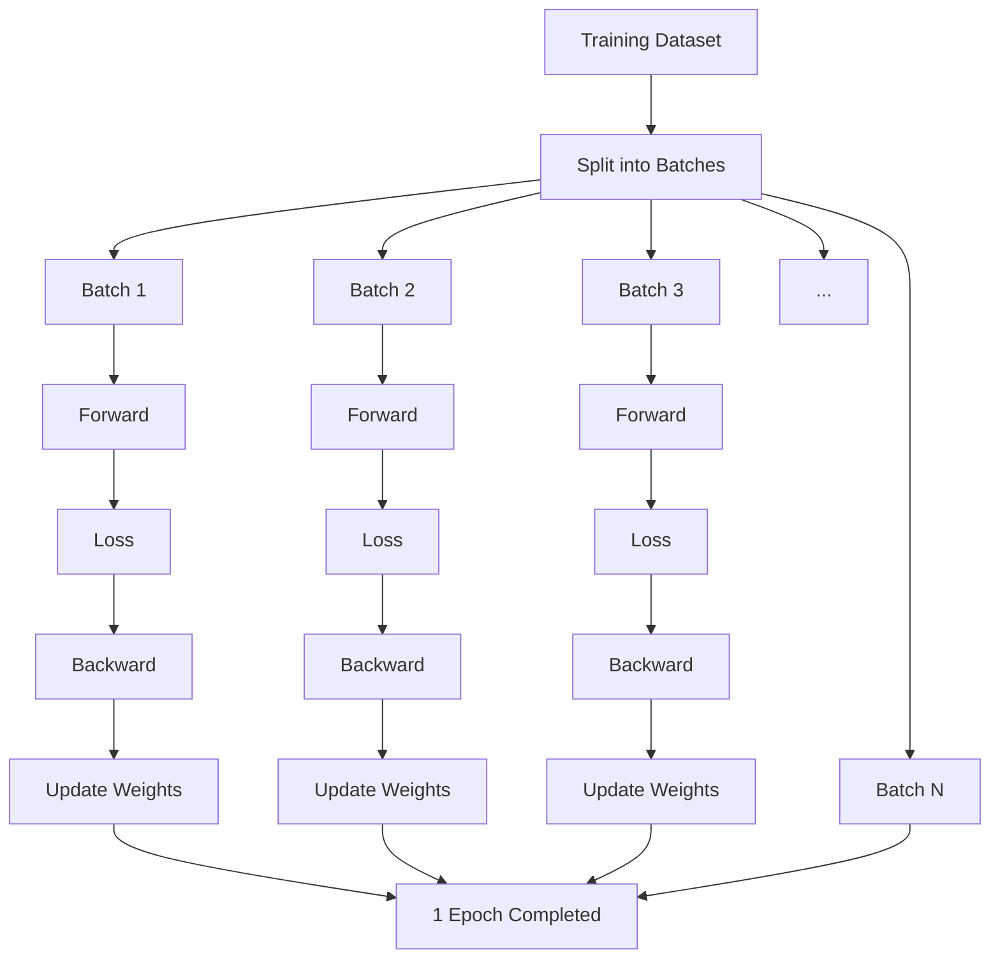

# Iteration và Epoch

> Epoch = Model đã học hết toàn bộ dataset 1 lần
>
> Iteration = Model thực hiện 1 lần cập nhật trọng số trên 1 batch dữ liệu

## Minh họa
Ta có Dataset: 10,000 sample, `batch_size = 100` thì 10,000 / 100 = 100 batches

Mỗi epoch sẽ chạy qua toàn bộ 100 bacthes:

```
Dataset: 10,000 samples

┌──────────┐
│ Batch 1  │ ──> Forward ──> Loss ──> Backward ──> Update weights
├──────────┤
│ Batch 2  │ ──> Forward ──> Loss ──> Backward ──> Update weights
├──────────┤
│ Batch 3  │ ──> Forward ──> Loss ──> Backward ──> Update weights
│    ...   │
├──────────┤
│ Batch 100│ ──> Forward ──> Loss ──> Backward ──> Update weights
└──────────┘
                  ↑
              1 EPOCH
```

- 1 batch -> 1 iteration
- 100 iterations -> 1 epoch

## Itertaion 
> Là một lần model xử lý một batch và cập nhật parameters.

```python
for X_batch, y_batch in dataloader:

    # 1. Forward
    y_pred = model(X_batch)

    # 2. Calculate loss
    loss = criterion(y_pred, y_batch)

    # 3. Backward
    optimizer.zero_grad()
    loss.backward()

    # 4. Update parameters
    optimizer.step()
```

> 1 iteration = 1 lần uodate weights

## Epoch
> Là một lần model đi qua toàn bộ training dataset.

```
Epoch 1
├── Iteration 1
├── Iteration 2
├── Iteration 3
├── ...
└── Iteration 100

Epoch 2
├── Iteration 101
├── Iteration 102
├── ...
└── Iteration 200
```

$$\text{Iterations / Epoch} = \frac {N} {B}$$

- $N$: samples
- $B$: batch size

## Batch size
> Batch size không thay đổi số sample model cần học trong một epoch, nhưng thay đổi số lần model cập nhật weights trong epoch đó.

Ví dụ:

| Dataset | Batch size | Iterations / epoch |
| ------: | ---------: | -----------------: |
|  10,000 |          1 |             10,000 |
|  10,000 |         10 |              1,000 |
|  10,000 |        100 |                100 |
|  10,000 |        500 |                 20 |
|  10,000 |      1,000 |                 10 |
|  10,000 |     10,000 |                  1 |


## Trực quan hóa mô hình:




# Activation Function & Batch Normalization

> Activation Function quyết định cách neuron biến đổi tín hiệu và tạo ra phi tuyến tính.
>
> Batch Normalization (BN) điều chỉnh phân phối activation trong quá trình training để việc tối ưu ổn định và dễ hơn.

pipeline:

```
Input x
  │
  ▼
Linear / Conv
  │
  ▼
Batch Normalization
  │
  ▼
Activation Function
  │
  ▼
Output
```

## Activation Function

1. Activation Function là gì?

> Activation Function là hàm được áp dụng lên đầu ra của một neuron/layer để biến đổi tín hiệu trước khi truyền sang layer tiếp theo.

```
x1 ──w1──┐
x2 ──w2──┤
x3 ──w3──┼──> z = Wx + b ──> f(z) ──> a
x4 ──w4──┤
         │
         b
```

2. Tại sao cần Activation?

Nếu không có activation thì nhiều hàm y = ax + b liên tiếp chỉ là một đường thẳng không thể giải quyết được những bài toán có đường cong phức tạp. Và việc xếp nhiều Linear Layer liên tiếp nhưng không có Activation vẫn chỉ tương đương một phép biến đổi tuyến tính.

> Activation Function tồn tại để đưa non-linearity vào Neural Network. Nếu không có nó, dù mạng có nhiều Linear Layer, toàn bộ mạng vẫn chỉ biểu diễn một phép biến đổi tuyến tính và không thể học được các quan hệ phi tuyến phức tạp.

3. Where?

- Activation function ở cuối cùng của một block Neural Network theo pipeline ở trên. với mục đính tạo tính non-linearity

4. When?

- Gần như mọi Neural Network có hidden layers đều cần có activation function

- mô hình thông thường thì sẽ là: linear -> ReLU/GELU/SiLU/... -> Linear để tạo tính phi tuyến tính cho mô hình.

- Nếu bỏ đi activation: linear -> linear -> linear thì khả năng biểu diễn của mạng bị giới hạn bởi tính tuyến tính.

- Mô hình Regression không cần activation ở output: linear -> linear -> y predict

- Binary classification sử dụng sigmoid để đưa về so sánh với ngưỡng chuẩn hóa về 0 và 1: linear -> sigmoid -> P(y=1).

5. Which

- Ở hidden Layer:

| Activation   | Khi nào thường gặp? | Điểm chính                               |
| ------------ | ------------------- | ---------------------------------------- |
| ReLU         | MLP, CNN            | Đơn giản, nhanh                          |
| Leaky ReLU   | Khi lo Dying ReLU   | Giữ gradient nhỏ ở vùng âm               |
| GELU         | Transformer         | Smooth, phổ biến                         |
| SiLU / Swish | Modern DL           | Smooth, thường dùng trong model hiện đại |

- Ở Output model

| Bài toán                   | Output activation         |
| -------------------------- | ------------------------- |
| Regression                 | Không activation / Linear |
| Binary classification      | Sigmoid                   |
| Multi-class classification | Softmax                   |
| Multi-label classification | Sigmoid cho từng class    |

6. How?

Sau khi qua Linear hàm tính: $z = Wx + b$, Activation sẽ nhận $z$ và đưa qua một hàm kính hoạt: $a = f(z)$ có thể là ReLU, Sigmoid, ... để tạo tính phi tuyến.

> Activation không chỉ là một phép biến đổi số. Nó là thứ làm cho toàn bộ mạng có khả năng biểu diễn hàm phi tuyến.

## Batch Normalization

1. Batch Normalization là gì?

> Batch Normalization (BN) là một kỹ thuật/layer dùng để chuẩn hóa activation của mini-batch trong quá trình training, sau đó cho phép mạng học lại scale và shift thông qua $\gamma,\beta$.

Với batch $B$:

$$\mu_B = \frac {1} {m} \sum^m_{i=1} x_i$$

$$\sigma^2_B = \frac {1} {m} \sum^m_{i=1} (x_i - \mu_B)^2$$

Normalize:

$$\hat{x}_i = \frac {x_i -\mu_B} {\sqrt{\sigma^2_B + \epsilon}}$$

Sau đó:

$$y_i = \gamma \hat x_i + \beta$$

Trong đó:

- $\mu_B$: mean của batch.
- $\sigma_B^2$: variance của batch.
- $\epsilon$: tránh chia cho 0.
- $\gamma$: learnable scale.
- $\beta$: learnable shift.

> BN không tạo nonlinear. Nó điều chỉnh distribution của activation để optimization ổn định hơn.

2. Why?

> Batch Norm được phát minh ra Vì activation giữa các layer có thể thay đổi scale trong quá trình training

Qua trình training: $x \rightarrow Linear_1 \rightarrow Activation_1 \rightarrow Linear_2 \rightarrow Activation_2 \rightarrow ...$

Khi weights của `linear1` thay đổi, phân phối output của nó cũng thay đổi. thì layer tiếp theo liên tục nhận input với các scale khác nhau. Vậy BN giúp đưa activation về một scale ổn định hơn

- Một vấn đề mới được đề cập: làm sao để tối ưu gradient:
    - Nếu activation quá lớn gradient khó kiểm soát thì optimization khó ổn định.
    - Nếu activation quá nhỏ gradient nhỏ thì learning chậm
- BN giúp activation nằm trong một vùng scale dễ tối ưu hơn.

> Nhưng Lưu ý: không nên đơn giản hóa thành "BN giải quyết hoàn toàn vanishing/exploding gradient". Nó hỗ trợ ổn định optimization, nhưng không phải thuốc chữa mọi vấn đề gradient.

```
Training step 1:
mean = 0.5
std  = 1.2

Training step 100:
mean = 5.8
std  = 7.3

Training step 500:
mean = -2.1
std  = 4.8
```


3. Where?

- batch normalization nằm giữa linear (kết hợp feature) và Activation với mục đích điều chỉnh scale/distribution

4. When?

BN thường hữu ích khi:

- Neural Network sâu.
- Training khó ổn định.
- Activation có scale thay đổi mạnh.
- Muốn optimization ổn định hơn.
- Muốn sử dụng learning rate tương đối lớn hơn trong một số trường hợp.

VD trong MLP: Linear -> BatchNorm -> ReLU , hay CNN: Conv -> BatchNorm -> ReLU. Đặc biệt trong Transformer thường dùng LayerNorm hoặc RMSNorm thay vì BatchNorm

5. Which?

| Layer         | Dùng phổ biến cho        |
| ------------- | ------------------------ |
| `BatchNorm1d` | MLP / tabular / vector   |
| `BatchNorm2d` | CNN / image              |
| `BatchNorm3d` | 3D CNN / volumetric data |

6. How?

Cách BatchNorm hoạt động: Ta có một bộ mini-batch: $x = [2, 4, 6, 8]$

- Bước 1: tính Mean: $\mu_B = \frac {2 + 4 + 6 + 8} {4} = 5$

- Bước 2: Tính Variance: $\sigma^2_B = \frac {(2-5)^2 + (4-5)^2 + (6-5)^2 + (8-5)^2} {4} = 5$

- Bước 3: Normalize: $\hat x_i = \frac {x_i -5} {\sqrt{5 + \epsilon}}$

    - Khi đó activation được đưa về một scale ổn định hơn

- Bước 4: Scale & Shift: $y_i = \gamma \hat x_i + \beta$

> BN không ép activation vĩnh viễn phải có mean = 0 và variance = 1.
>
> Vì $\gamma$ và $\beta$ là learnable parameters, model có thể tự học scale/shift phù hợp.