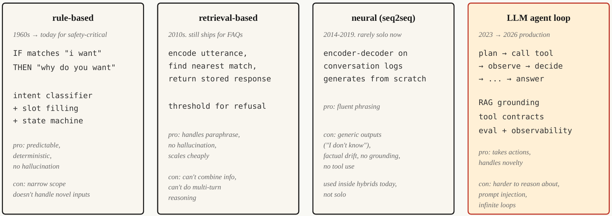

# Chatbots — Rule-Based to Neural to LLM Agents

## The Problem — Vấn đề cốt lõi của Chatbot

Một chatbot không chỉ cần **trả lời câu hỏi**, mà phải xử lý một chuỗi quyết định trong hội thoại:

> **Hiểu người dùng muốn gì → xác định thông tin còn thiếu → lấy thông tin → thực hiện hành động → duy trì trạng thái qua nhiều lượt.**

Ví dụ:

> User: *“Tôi muốn đổi chuyến bay.”*
> → Hệ thống phải hiểu **intent** là đổi chuyến.
> → Biết cần thêm thông tin gì (mã chuyến, ngày, chuyến mới...).
> → Lấy dữ liệu cần thiết.
> → Thực hiện việc đổi chuyến.

Sau đó:

> User: *“Khoan, nếu tôi hủy thì sao?”*

Hệ thống phải **nhớ context trước đó**, chuyển từ *change flight* sang *cancel flight* mà **không làm mất state của cuộc hội thoại**.

### Tại sao đây là bài toán khó?

Có 4 vấn đề chính:

1. **Open-ended input**
   Người dùng có thể diễn đạt cùng một ý theo rất nhiều cách.

2. **Multi-turn coherence**
   Hệ thống phải duy trì ngữ cảnh và trạng thái qua nhiều lượt hội thoại.

3. **Action / tool execution**
   Chatbot có thể phải tác động ra thế giới thật: đổi chuyến, hoàn tiền, thanh toán...

4. **Error visibility**
   Một bước sai không chỉ làm sai output mà người dùng **nhìn thấy ngay và chịu hậu quả**.

### Ý nghĩa của 4 thế hệ

| Thế hệ                        | Giải quyết vấn đề chính                                |
| ----------------------------- | ------------------------------------------------------ |
| **Rule-based (ELIZA)**        | Phản hồi dựa trên pattern cố định                      |
| **Intent-based (DialogFlow)** | Hiểu intent và slot/thông tin cần thiết                |
| **Neural / LLM (GPT)**        | Hiểu và sinh ngôn ngữ tự nhiên linh hoạt hơn           |
| **LLM Agent (Claude)**        | Hiểu → lập kế hoạch → dùng tools → kiểm tra → tiếp tục |

**Cốt lõi của Problem:** Chatbot hiện đại phải chuyển từ **“generate a response”** sang **“manage a stateful interaction and safely complete a task.”**


## The Concept — Scripted Chatbot (1950–2001)



    Fig: Chatbot evolution: rule-based → retrieval → neural → agent

**Ý tưởng cốt lõi:** Trong khoảng 1950–2001, chatbot chủ yếu hoạt động theo một cơ chế cố định:

> **Match input → chọn rule/script → tạo canned response → cập nhật một ít state**

### Diễn tiến chính

* **ELIZA (1966):** pattern matching + template. Gần như không có state và không thực sự hiểu ngôn ngữ.
* **PARRY (1972):** bổ sung **internal state** → phản hồi phụ thuộc vào lịch sử hội thoại.
* **ALICE (1995):** mở rộng cách tiếp cận bằng hàng chục nghìn rule AIML → tăng **coverage**, nhưng vẫn không có **generality**.
* **SmarterChild (2001):** thêm backend lookup như thời tiết, chứng khoán → tiền thân của **tool calling**.

### Vấn đề cốt lõi

Rule-based chatbot có thể **rất tốt trong phạm vi hẹp**, nhưng thất bại khi người dùng đi ngoài những gì đã được lập trình.

> **Thêm rule → tăng coverage, nhưng không tạo ra khả năng hiểu tổng quát.**

Vì vậy, giới hạn lớn nhất không phải là chatbot **không đủ nhiều rule**, mà là **chi phí duy trì state machine và hand-written rules tăng theo coverage**, trong khi cách người dùng nói chuyện là mở và không giới hạn.

**Kết luận:** Paradigm này đặt nền móng cho **intent, state, slot-filling và tool lookup**, nhưng giới hạn về tính tổng quát là lý do các paradigm neural và LLM xuất hiện.

## Build It

### Step 1: Rule-Based Pattern Matching

```python
import re

class RulePattern:
    def __init__(self, pattern, response_template):
        self.regex = re.compile(pattern, re.IGNORECASE)
        self.template = response_template

PATTERNS = [
    RulePattern(r"my name is (\w+)", "Nice to meet you, {0}."),
    RulePattern(r"i (need|want) (.+)", "Why do you {0} {1}?"),
    RulePattern(r"i feel (.+)", "Why do you feel {0}?"),
    RulePattern(r"(.*)", "Tell me more about that."),
]

def rule_based_respond(user_input):
    for pattern in PATTERNS:
        m = pattern.regex.match(user_input.strip())
        if m:
            return pattern.template.format(*m.groups())
    return "I don't understand."
```

* `RulePattern`: lưu **regex pattern** và **response template**.
* `PATTERNS`: tập các luật để nhận diện input.
* `rule_based_respond()`: duyệt từng rule, nếu `regex` khớp thì lấy các nhóm `groups()` và đưa vào template.
* `r"(.*)"`: rule cuối cùng, hoạt động như **fallback**, khớp mọi input chưa được xử lý.
* Đây là mô hình ELIZA cơ bản: **pattern matching → lấy fragment → ghép vào response**.
* Reflection đơn giản: `"I feel sad"` → `"Why do you feel sad?"`.

### Step 2: Retrieval-Based (FAQ)

```python
from sentence_transformers import SentenceTransformer
import numpy as np

FAQ = [
    ("how do i reset my password", "Go to Settings > Security > Reset Password."),
    ("how do i cancel my order", "Go to Orders, find the order, click Cancel."),
    ("what is your return policy", "30-day returns on unused items, original packaging."),
]

encoder = SentenceTransformer("sentence-transformers/all-MiniLM-L6-v2")

faq_questions = [q for q, _ in FAQ]
faq_embeddings = encoder.encode(faq_questions, normalize_embeddings=True)

def faq_respond(user_input, threshold=0.5):
    q_emb = encoder.encode([user_input], normalize_embeddings=True)[0]
    sims = faq_embeddings @ q_emb
    best = int(np.argmax(sims))

    if sims[best] < threshold:
        return None

    return FAQ[best][1]
```

* `FAQ`: lưu các cặp **câu hỏi → câu trả lời** đã biết.
* `SentenceTransformer`: biến câu hỏi thành **embedding vector**.
* `faq_embeddings`: embedding của toàn bộ câu hỏi trong FAQ.
* `sims = faq_embeddings @ q_emb`: tính độ tương đồng giữa câu hỏi người dùng và các câu hỏi FAQ.
* `best`: chọn FAQ có độ tương đồng cao nhất.
* `threshold=0.5`: chỉ trả lời nếu mức tương đồng **đủ cao**.
* Nếu không đạt threshold → `return None` → **không đoán**, mà để hệ thống chuyển sang cơ chế khác/escalate.

**Concept chính:** Retrieval-based chatbot không tự sinh câu trả lời; nó **tìm câu trả lời gần nhất trong knowledge base**, nên giảm hallucination.

### Step 3 — Neural Generation

```python
from transformers import pipeline

chatbot = pipeline("text2text-generation", model="google/flan-t5-small")

response = chatbot(
    "Respond politely to: Hi there!",
    max_new_tokens=40
)

print(response[0]["generated_text"])
```

**Concept:** Mô hình neural **tự sinh câu trả lời** thay vì chọn một response có sẵn.

* **FLAN-T5**: encoder-decoder instruction-tuned model.
* Input → model → generated response.
* Ưu điểm: diễn đạt tự nhiên, linh hoạt hơn rule/retrieval.
* Nhược điểm: có thể **off-topic, mâu thuẫn hoặc sinh thông tin sai**.
* Vì vậy, trong production 2026, neural generation **không nên đứng một mình**, mà thường nằm trong **hybrid system** để xử lý phần diễn đạt tự nhiên.

---

### Step 4 — LLM Agent Loop

```python
def agent_loop(user_message, tools, llm, max_steps=5):
    history = [{"role": "user", "content": user_message}]

    for _ in range(max_steps):
        response = llm(history, tools=tools)

        tool_call = response.get("tool_call")

        if tool_call:
            tool_name = tool_call.get("name")
            args = tool_call.get("arguments")

            if not isinstance(tool_name, str) or tool_name not in tools:
                history.append({"role": "assistant", "tool_call": tool_call})
                history.append({
                    "role": "tool",
                    "name": str(tool_name),
                    "content": "error: unknown tool"
                })
                continue

            if not isinstance(args, dict):
                history.append({"role": "assistant", "tool_call": tool_call})
                history.append({
                    "role": "tool",
                    "name": tool_name,
                    "content": f"error: arguments must be a dict, got {type(args).__name__}"
                })
                continue

            fn = tools[tool_name]
            result = fn(**args)

            history.append({"role": "assistant", "tool_call": tool_call})
            history.append({
                "role": "tool",
                "name": tool_name,
                "content": result
            })

        else:
            return response["content"]

    return "I could not complete the task in the step budget."
```

#### Concept cốt lõi

LLM Agent không chỉ **generate text**, mà chạy một vòng lặp:

> **Plan → Call Tool → Observe Result → Decide Next Step**

Ba thành phần quan trọng:

1. **Tools** — các function mà LLM có thể gọi để thực hiện hành động.
2. **Termination** — khi LLM trả về final answer thay vì `tool_call`, loop kết thúc.
3. **Step budget** — giới hạn số bước để tránh loop vô hạn khi task mơ hồ.

#### Production cần thêm

* **Retrieval-first grounding** → đưa tài liệu liên quan vào trước mỗi LLM call.
* **Guardrails** → không thực hiện destructive action nếu chưa có confirmation.
* **Observability** → log toàn bộ các bước.
* **Evaluation** → kiểm tra tự động agent có hoạt động đúng specification hay không.

**Điểm chuyển đổi quan trọng:**
Neural chatbot chủ yếu **sinh câu trả lời** → LLM Agent có khả năng **suy luận qua nhiều bước, sử dụng công cụ và hoàn thành task**.

### Step 5 — Hybrid Routing

```python
def hybrid_chat(user_input):
    if is_destructive_action(user_input):
        return structured_flow(user_input)

    faq_answer = faq_respond(user_input, threshold=0.6)

    if faq_answer:
        return faq_answer

    return agent_loop(user_input, tools, llm)


def is_destructive_action(text):
    danger_words = ["delete", "cancel", "charge", "refund", "transfer"]
    return any(w in text.lower() for w in danger_words)
```

#### Concept

**Hybrid routing** = không dùng một kiến trúc cho mọi request, mà **route request đến kiến trúc phù hợp**:

> **Destructive action → Rule-based / structured flow**
> **FAQ → Retrieval**
> **Open-ended request → LLM Agent**

Lý do: mỗi loại request có yêu cầu khác nhau về **độ chính xác, khả năng sinh ngôn ngữ và khả năng thực hiện hành động**.

> **Routing layer quyết định request nào nên được xử lý bằng deterministic rules, retrieval hay LLM agent.**

---

## 2026 Production Stack

| Use case                         | Architecture                            |
| -------------------------------- | --------------------------------------- |
| Booking, payment, authentication | Rule-based state machine + slot filling |
| Customer-support FAQ             | Retrieval over curated answers          |
| Open-ended help chat             | LLM agent + RAG + tool calls            |
| Internal tools / IDE assistants  | LLM agent + tool calls                  |
| Companion / character chatbot    | Tuned LLM + persona + retrieval         |

**Nguyên tắc:** Production chatbot nên dùng **hybrid routing**, thay vì cố dùng một architecture cho toàn bộ request.

---

## Key Terms

| Term                 | Ý nghĩa thực tế                                                           |
| -------------------- | ------------------------------------------------------------------------- |
| **Intent**           | Người dùng muốn làm gì, ví dụ `book_flight`, `reset_password`             |
| **Slot**             | Một thông tin cần thiết cho task, ví dụ `date`, `destination`             |
| **RAG**              | Retrieve tài liệu liên quan rồi dùng chúng để ground LLM response         |
| **Tool call**        | LLM tạo structured call gồm `name + arguments`; runtime thực thi function |
| **Agent loop**       | Vòng lặp **plan → act → verify** cho đến khi task hoàn thành              |
| **Prompt injection** | Input độc hại cố gắng ghi đè hoặc phá vỡ system prompt                    |
