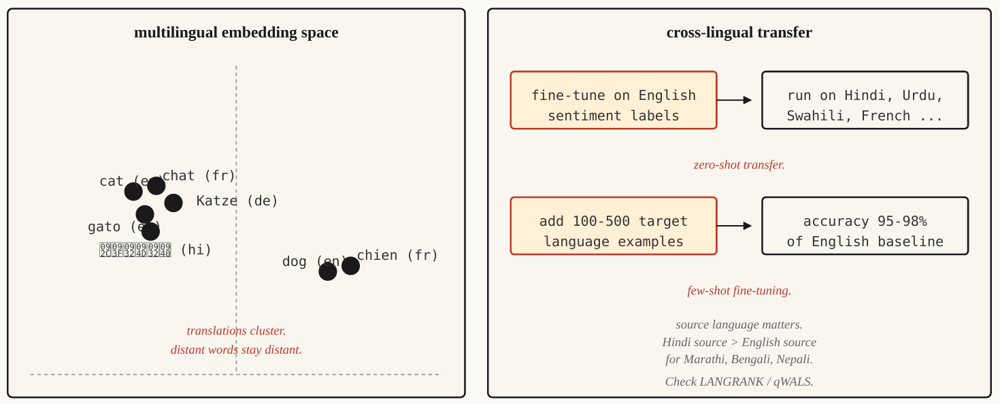

# Multilingual NLP

## The Problem

Tiếng Anh có **hàng tỷ mẫu dữ liệu được gán nhãn**, trong khi Urdu chỉ có **hàng nghìn**, còn Maithili gần như **không có dữ liệu**.

Một hệ thống NLP phục vụ người dùng toàn cầu phải hoạt động được với **nhóm ngôn ngữ ít tài nguyên (low-resource languages)**, nơi hầu như không tồn tại dữ liệu huấn luyện riêng cho từng tác vụ.

**Multilingual models** giải quyết vấn đề này bằng cách:

* Huấn luyện **một mô hình duy nhất trên nhiều ngôn ngữ**.
* Học một **shared representation** giữa các ngôn ngữ.
* Tận dụng kiến thức học được từ **ngôn ngữ giàu tài nguyên (high-resource)** để chuyển sang **ngôn ngữ ít tài nguyên (low-resource)**.

Ví dụ: fine-tune mô hình trên **sentiment analysis bằng tiếng Anh**, sau đó mô hình có thể dự đoán sentiment trên **Urdu** mà không cần huấn luyện thêm trên dữ liệu Urdu.

Đây gọi là **zero-shot cross-lingual transfer**: mô hình thực hiện một tác vụ trên ngôn ngữ chưa được huấn luyện trực tiếp bằng cách **chuyển kiến thức từ ngôn ngữ khác**.

> Dữ liệu NLP không phân bố đều giữa các ngôn ngữ. Multilingual models giải quyết khoảng cách này bằng **cross-lingual transfer**, cho phép ngôn ngữ ít tài nguyên hưởng lợi từ kiến thức học được ở ngôn ngữ giàu tài nguyên.


## The Concept



    Figure 9: Cross-lingual transfer via shared multilingual embedding space

### 1. Shared Vocabulary — Từ vựng dùng chung

Multilingual model dùng tokenizer như **SentencePiece** hoặc **WordPiece**, được huấn luyện trên văn bản của nhiều ngôn ngữ.

→ Các ngôn ngữ **chia sẻ cùng một vocabulary**, đặc biệt các **subword unit** có thể được dùng chung giữa những ngôn ngữ có quan hệ.

**Ý nghĩa:** tạo điểm chung ở cấp độ token để mô hình có thể xử lý nhiều ngôn ngữ trong cùng một không gian biểu diễn.

---

### 2. Shared Representation — Biểu diễn dùng chung

Transformer được pretrained trên nhiều ngôn ngữ bằng các objective như **Masked Language Modeling**.

Mô hình học cách đưa các câu có **ý nghĩa tương tự nhưng khác ngôn ngữ** vào những vùng tương tự trong **hidden representation space**.

Ví dụ:

`cat` (English) ↔ `chat` (French) ↔ `gato` (Spanish)

→ Không chỉ token embedding mà **sentence representation** cũng có xu hướng được căn chỉnh giữa các ngôn ngữ.

---

### 3. Zero-shot Cross-lingual Transfer

Fine-tune model bằng **labeled data ở một ngôn ngữ nguồn**, thường là English.

Sau đó:

`English labeled data → Fine-tune → Multilingual model → Language khác`

Không cần labeled data của ngôn ngữ đích.

Đây là **zero-shot transfer**.

**Điểm quan trọng:** hiệu quả thường tốt hơn với các ngôn ngữ **typologically related** và giảm khi ngôn ngữ đích khác biệt lớn.

---

### 4. Few-shot Fine-tuning

Thay vì hoàn toàn zero-shot, thêm một lượng nhỏ dữ liệu có nhãn ở ngôn ngữ đích, khoảng **100–500 examples** theo nội dung đã cho.

→ Hiệu suất có thể tăng mạnh, tiến gần baseline của ngôn ngữ nguồn.

**Ý chính:** trong multilingual NLP, một lượng rất nhỏ target-language data có thể mang lại mức cải thiện lớn.

## The Models

| Model        |  Năm |                                Coverage | Đặc điểm chính                                                                                                                                       |
| ------------ | ---: | --------------------------------------: | ---------------------------------------------------------------------------------------------------------------------------------------------------- |
| **mBERT**    | 2018 |                           104 languages | Pretrained trên **Wikipedia**. Là multilingual LM thực tiễn đầu tiên, nhưng yếu với low-resource languages.                                          |
| **XLM-R**    | 2019 |                           100 languages | Pretrained trên **CommonCrawl**, dữ liệu lớn hơn Wikipedia nhiều. Trở thành baseline mạnh cho cross-lingual NLP. Có **Base 270M** và **Large 550M**. |
| **XLM-V**    | 2023 |                           100 languages | Mở rộng XLM-R với **vocabulary 1M tokens** thay vì 250k, cải thiện khả năng xử lý low-resource languages.                                            |
| **mT5**      | 2020 |                           101 languages | Dựa trên kiến trúc **T5**, phù hợp với **multilingual generation**.                                                                                  |
| **NLLB-200** | 2022 |                           200 languages | Mô hình dịch của Meta, tập trung mạnh vào **low-resource translation**, hỗ trợ 55 ngôn ngữ low-resource.                                             |
| **BLOOM**    | 2022 | 46 languages + 13 programming languages | LLM mở, pretrained đa ngôn ngữ, hướng đến các tác vụ **LLM-style generation**.                                                                       |
| **Aya-23**   | 2024 |                            23 languages | Multilingual LLM của Cohere, nổi bật trên **Arabic, Hindi, Swahili**.                                                                                |

### Chọn model theo Use Case

* **Classification:** → **XLM-R-base** là lựa chọn mặc định hợp lý.
* **Multilingual generation:** → **mT5**.
* **Machine Translation:** → **NLLB-200**.
* **LLM-style tasks:** → **Aya-23** hoặc các LLM như Claude với **multilingual prompting**.

**Điểm cần nhớ:** Không chọn multilingual model chỉ dựa trên số lượng ngôn ngữ. Quyết định chính phụ thuộc vào **task**: classification, generation hay translation.

## Build It

### Step 1 — Zero-shot Cross-lingual Classification

```python
from transformers import AutoTokenizer, AutoModelForSequenceClassification
import torch

tok = AutoTokenizer.from_pretrained("joeddav/xlm-roberta-large-xnli")
model = AutoModelForSequenceClassification.from_pretrained(
    "joeddav/xlm-roberta-large-xnli"
)

def classify(text, candidate_labels, hypothesis_template="This text is about {}."):
    scores = {}

    for label in candidate_labels:
        hypothesis = hypothesis_template.format(label)
        inputs = tok(text, hypothesis, return_tensors="pt", truncation=True)

        with torch.no_grad():
            logits = model(**inputs).logits[0]

        entail_score = torch.softmax(logits, dim=-1)[2].item()
        scores[label] = entail_score

    return dict(sorted(scores.items(), key=lambda x:-x[1]))


print(
    classify(
        "I love this product!",
        ["positive", "negative", "neutral"]
    )
)

print(
    classify(
        "J'adore ce produit !",
        ["positive", "negative", "neutral"]
    )
)
```

* **XLM-R** được fine-tune trên **NLI (Natural Language Inference)** nên có thể dùng cho classification thông qua **entailment**.
* Với mỗi `candidate_label`, tạo một **hypothesis** từ `hypothesis_template`.
* Model đánh giá mức độ **entailment** giữa `text` và hypothesis.
* `softmax(...)[2]` lấy **entailment score**.
* Chọn label có score cao nhất.
* **Không cần training lại trên ngôn ngữ đích** → đây là **zero-shot cross-lingual classification**.

**Core flow:**

`Text + Candidate Label → NLI Entailment → Score → Highest-score Label`

**Ý nghĩa:** một multilingual model có thể dùng **cùng một API và cùng một classifier** cho nhiều ngôn ngữ nhờ cross-lingual transfer.

### Step 2 — Multilingual Embedding Space

```python
from sentence_transformers import SentenceTransformer
import numpy as np

model = SentenceTransformer("sentence-transformers/paraphrase-multilingual-MiniLM-L12-v2")

pairs = [
    ("The cat is sleeping.", "Le chat dort."),
    ("The cat is sleeping.", "El gato está durmiendo."),
    ("The cat is sleeping.", "Die Katze schläft."),
    ("The cat is sleeping.", "The dog is barking."),
]

for eng, other in pairs:
    emb_eng = model.encode([eng], normalize_embeddings=True)[0]
    emb_other = model.encode([other], normalize_embeddings=True)[0]
    sim = float(np.dot(emb_eng, emb_other))

    print(f"{eng!r} <-> {other!r}: cos={sim:.3f}")
```

* `SentenceTransformer` chuyển mỗi câu thành một **embedding vector** trong cùng một không gian.
* `normalize_embeddings=True` chuẩn hóa vector để có thể dùng **dot product ≈ cosine similarity**.
* Hai câu **khác ngôn ngữ nhưng cùng ý nghĩa** được biểu diễn gần nhau trong embedding space.
* Hai câu có **ý nghĩa khác nhau** sẽ có similarity thấp hơn.

**Core concept:**

`Multilingual text → Shared embedding space → Semantic similarity`

Đây là nền tảng cho **cross-lingual retrieval, clustering và semantic similarity** mà không cần dịch tất cả văn bản về một ngôn ngữ trung gian.

### Step 3 — Few-shot Fine-tuning Strategy

```python
from transformers import TrainingArguments, Trainer
from datasets import Dataset


def few_shot_finetune(base_model, base_tokenizer, examples):
    ds = Dataset.from_list(examples)

    def tokenize_fn(ex):
        out = base_tokenizer(ex["text"], truncation=True, max_length=128)
        out["labels"] = ex["label"]
        return out

    ds = ds.map(tokenize_fn)

    args = TrainingArguments(
        output_dir="out",
        per_device_train_batch_size=8,
        num_train_epochs=5,
        learning_rate=2e-5,
        save_strategy="no",
    )

    trainer = Trainer(
        model=base_model,
        args=args,
        train_dataset=ds
    )

    trainer.train()

    return base_model
```

* **Few-shot fine-tuning:** dùng khoảng **100–500 examples có nhãn** của ngôn ngữ đích để thích nghi model.
* `Dataset.from_list()` chuyển dữ liệu few-shot thành Hugging Face Dataset.
* `tokenize_fn()` tokenize text và gán `label` cho từng sample.
* `Trainer` thực hiện fine-tuning với các hyperparameter chính:

  * `batch_size = 8`
  * `epochs = 5`
  * `learning_rate = 2e-5`
* Theo nội dung đã cho, **5 epochs + learning rate `2e-5`** là thiết lập mặc định an toàn cho 100–500 examples.
* Learning rate quá cao có thể làm **suy giảm multilingual alignment**, khiến model mất khả năng chuyển giao tốt giữa các ngôn ngữ.

**Core concept:**

`Multilingual pretrained model + 100–500 target-language labels → Few-shot fine-tuning → Adapted model`

Mục tiêu không phải học lại ngôn ngữ, mà là **điều chỉnh model cho task/ngôn ngữ đích trong khi giữ lại multilingual representation**.

## Evaluation — Đánh giá Multilingual Model

### 1. Per-language Accuracy

Đánh giá **accuracy riêng cho từng ngôn ngữ** trên held-out set.

Không chỉ dùng accuracy tổng hợp, vì aggregate metric có thể **che khuất hiệu suất kém ở các low-resource languages**.

### 2. So sánh với Monolingual Baseline

Với ngôn ngữ có đủ dữ liệu:

**Multilingual model vs. Monolingual model**

→ Monolingual model đôi khi vẫn tốt hơn multilingual model.

Vì vậy cần benchmark thực tế thay vì mặc định multilingual luôn tốt hơn.

### 3. Entity-level Tests

Kiểm tra **named entities** trong ngôn ngữ đích.

Multilingual model có thể gặp vấn đề với **tokenization của các script khác xa Latin**, dẫn đến hiệu suất kém trên tên riêng và thực thể.

### 4. Cross-lingual Consistency

Cùng một ý nghĩa được viết ở hai ngôn ngữ khác nhau nên tạo ra **cùng prediction**.

Đo **prediction gap** giữa hai phiên bản ngôn ngữ.

> Mục tiêu không chỉ là accuracy cao, mà còn phải đảm bảo model hoạt động **nhất quán giữa các ngôn ngữ**.

---

## Use It — Multilingual Stack

| Use case                         | Model khuyến nghị                                                              |
| -------------------------------- | ------------------------------------------------------------------------------ |
| Classification, ~100 languages   | **XLM-R-base (~270M)**                                                         |
| Zero-shot text classification    | **joeddav/xlm-roberta-large-xnli**                                             |
| Multilingual sentence embeddings | **paraphrase-multilingual-MiniLM-L12-v2**                                      |
| Translation, ~200 languages      | **facebook/nllb-200-distilled-600M**                                           |
| Generative multilingual          | **Claude, GPT-4, Aya-23, mT5-XXL**                                             |
| Low-resource language NLP        | **XLM-V** hoặc fine-tune theo domain trên ngôn ngữ liên quan có tài nguyên cao |

### Nguyên tắc quan trọng

**Zero-shot chỉ là điểm bắt đầu, không phải điểm kết thúc.**

Nếu performance thực sự quan trọng:

`Multilingual pretrained model`
→ `Zero-shot evaluation`
→ `Target-language fine-tuning`
→ `Evaluate per-language`

Luôn nên **dự trù fine-tuning bằng dữ liệu của ngôn ngữ đích** khi yêu cầu chất lượng cao.

## The Tokenization Tax — Vấn đề Tokenization với Low-resource Languages

Multilingual model dùng **một tokenizer chung cho nhiều ngôn ngữ**. Vocabulary thường được xây dựng từ corpus bị chi phối bởi các ngôn ngữ có nhiều dữ liệu. Với ngôn ngữ nằm ngoài nhóm này, xuất hiện 3 loại **tokenization tax**:

### 1. Fertility Tax

Một từ trong low-resource language có thể bị tách thành **nhiều token hơn đáng kể** so với tiếng Anh.

→ Làm tăng:

* số token cần xử lý;
* mức sử dụng context window;
* chi phí/độ trễ;
* giảm hiệu quả training.

### 2. Variant Recovery Tax

Các khác biệt như:

* typo;
* biến thể dấu/diacritics;
* Unicode normalization;
* khác biệt chữ hoa/chữ thường

có thể tạo ra các chuỗi token ít gặp hoặc chưa quen thuộc với model.

→ Model khó học được quan hệ giữa các biến thể chính tả mà người bản ngữ dễ nhận ra.

### 3. Capacity Spillover Tax

Hai loại tax trên tiêu tốn thêm **context positions và năng lực biểu diễn** của model.

→ Phần capacity còn lại dành cho **semantic understanding và reasoning** bị giảm tương đối so với ngôn ngữ được tokenizer hỗ trợ tốt.

### Triệu chứng thực tế

Model có thể vẫn:

* train bình thường;
* loss curve trông hợp lý;
* perplexity không bất thường.

Nhưng output production vẫn sai một cách tinh vi:

* morphology bị xử lý sai giữa câu;
* rare inflections khó phục hồi;
* chất lượng không tăng tương ứng dù tiếp tục tăng data.

**Core insight:**

> Nếu tokenizer không phù hợp với target language, chỉ tăng dữ liệu không nhất thiết giải quyết được vấn đề.

### Mitigation

1. Chọn tokenizer có **coverage tốt cho target language**.
2. Đo **tokenization fertility** trên held-out target text trước khi training.
3. Dùng **byte-level fallback** như `SentencePiece byte_fallback=True` hoặc byte-level BPE để giảm vấn đề OOV đối với các script long-tail.

---

## Key Terms

| Term                       | Ý nghĩa thực tế                                                                                                                     |
| -------------------------- | ----------------------------------------------------------------------------------------------------------------------------------- |
| **Multilingual model**     | Một model dùng chung **parameters và vocabulary** cho nhiều ngôn ngữ.                                                               |
| **Cross-lingual transfer** | Fine-tune trên **source language**, sau đó transfer sang **target language**.                                                       |
| **Zero-shot**              | Transfer sang target language **không có target-language labels** và không fine-tune trên target.                                   |
| **Few-shot**               | Dùng khoảng **100–500 target-language examples** để fine-tune.                                                                      |
| **mBERT**                  | Multilingual BERT, hỗ trợ **104 languages**, pretrained trên Wikipedia.                                                             |
| **XLM-R**                  | Multilingual RoBERTa, hỗ trợ **100 languages**, pretrained trên CommonCrawl; baseline quan trọng cho cross-lingual NLP.             |
| **NLLB**                   | *No Language Left Behind*, mô hình machine translation của Meta hỗ trợ **200 languages**, trong đó có nhiều low-resource languages. |
