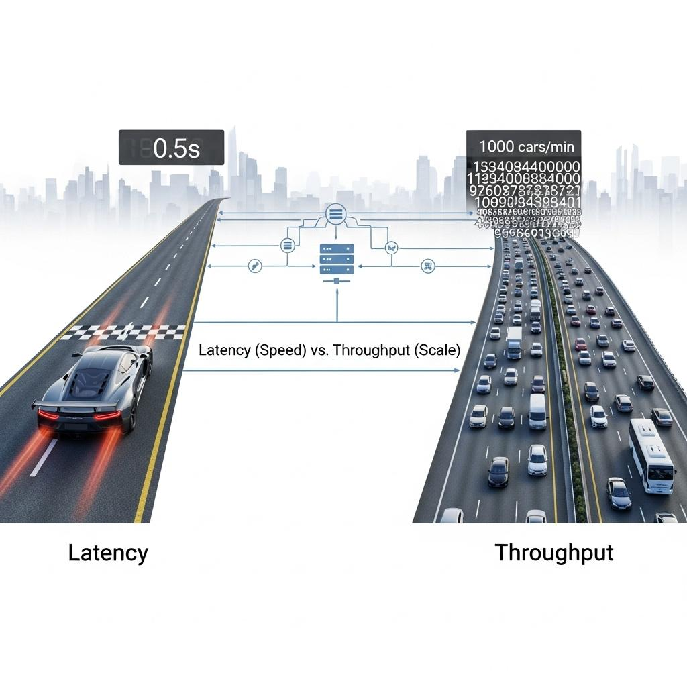
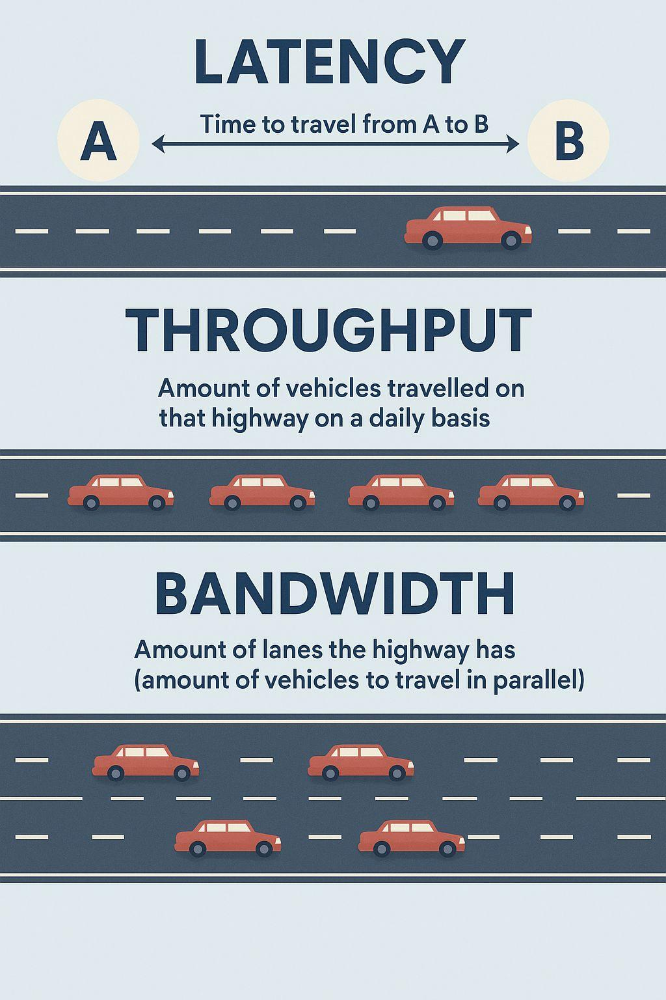
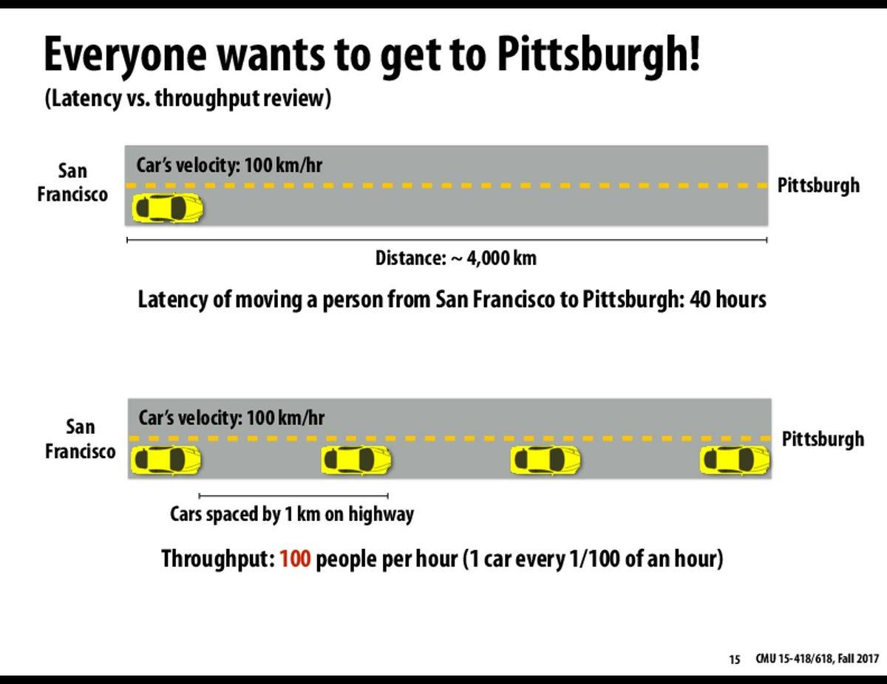
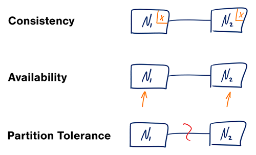

# Một số high-level trade-offs trong thiết kế hệ thống

- Performance vs scalability
- Latency vs throughput
- Availability vs consistency

## Performance vs scalability

Một service được gọi là __scalable (có khả năng mở rộng)__ nếu khi bổ sung thêm tài nguyên, __performance của hệ thống tăng lên tương ứng với lượng tài nguyên được bổ sung__.

Thông thường, tăng performance có nghĩa là hệ thống có thể xử lý nhiều đơn vị công việc hơn. Tuy nhiên, nó cũng có thể có nghĩa là hệ thống có __khả năng xử lý những đơn vị công việc lớn hơn__, chẳng hạn như khi kích thước dataset tăng lên.

Có thể nhìn nhận sự khác biệt giữa __performance__ và __scalability__ theo cách khác:

- Nếu bạn gặp vấn đề về performance, hệ thống của bạn __chậm ngay cả khi chỉ có một user__.
- Nếu bạn gặp vấn đề về scalability, hệ thống của bạn __nhanh khi chỉ có một user nhưng trở nên chậm khi phải chịu tải lớn__.

Đây là một phần **rất quan trọng trong System Design Interview**, vì `performance` và `scalability` thường bị dùng lẫn với nhau. Ý chính của đoạn này là: **một hệ thống nhanh chưa chắc đã scalable, và một hệ thống scalable chưa chắc đã nhanh ở quy mô nhỏ**.

### Performance là gì?

**Performance = hệ thống thực hiện một công việc nhanh đến mức nào.**

Ví dụ bạn có API:

```text
GET /user/123
```

Một request mất:

```text
100 ms
```

thì có thể nói API có latency khoảng 100 ms.

Các metric thường dùng để đánh giá performance:

```text
Latency
Throughput
Response time
CPU time
Memory usage
I/O time
```

Ví dụ:

```text
User
  │
  ▼
API Server
  │
  ▼
Database
  │
  ▼
Response
```

Nếu database query mất 2 giây:

```text
Request
   │
   ├── API processing: 50 ms
   ├── DB query:      1950 ms
   └── serialization: 20 ms
                       ─────
                       2020 ms
```

thì đây là **performance problem**.

Dù hệ thống chỉ có **1 user**, request vẫn mất hơn 2 giây.

---

### Scalability là gì?

**Scalability = khả năng hệ thống tiếp tục đáp ứng tốt khi quy mô tăng lên.**

Quy mô có thể tăng theo nhiều chiều:

```text
Users
Requests/sec
Data size
Concurrent connections
File size
Number of services
Geographical regions
```

Ví dụ ban đầu:

```text
100 users
10 requests/sec
→ hệ thống chạy tốt
```

Sau đó:

```text
10,000 users
1,000 requests/sec
→ hệ thống vẫn chạy tốt
```

thì hệ thống có khả năng scale tốt.

Nhưng nếu:

```text
100 users
    ↓
10 req/s
    ↓
Latency = 100 ms

10,000 users
    ↓
1,000 req/s
    ↓
Latency = 8 seconds
```

thì hệ thống có **scalability problem**.

---

### Ví dụ dễ hiểu nhất

Hãy tưởng tượng một nhà hàng.

#### Trường hợp 1 — Performance problem

Nhà hàng chỉ có:

```text
1 đầu bếp
1 khách
```

Nhưng món ăn mất:

```text
60 phút
```

Đây là **performance problem**.

Vì chỉ có một khách mà hệ thống đã chậm.

---

#### Trường hợp 2 — Scalability problem

Ban đầu:

```text
1 đầu bếp
10 khách
→ mỗi món 10 phút
```

Nhà hàng hoạt động rất tốt.

Nhưng khi có:

```text
1,000 khách
```

thì:

```text
→ mỗi món mất 2 giờ
```

Đây là **scalability problem**.

Hệ thống **nhanh ở quy mô nhỏ nhưng không chịu được tải lớn**.

---

### Điểm quan trọng nhất: Performance ≠ Scalability

Có thể hình dung:

```text
                 HỆ THỐNG
                    │
          ┌─────────┴─────────┐
          │                   │
      Performance         Scalability
          │                   │
     "Nhanh không?"       "Scale được không?"
          │                   │
     1 user/request       Nhiều users
          │                   │
      Latency             Load growth
      Throughput          Resource growth
```

Một hệ thống có thể:

#### A. Performance tốt + Scalability tốt

```text
10 users       → 100 ms
1,000 users    → 120 ms
100,000 users  → 150 ms
```

Đây là hệ thống rất tốt.

---

#### B. Performance tốt + Scalability kém

```text
10 users       → 50 ms
1,000 users    → 60 ms
100,000 users  → 10 seconds
```

Ban đầu cực nhanh nhưng khi scale thì sụp.

Đây là trường hợp **scalability bottleneck**.

---

#### C. Performance kém + Scalability tốt

Ví dụ:

```text
10 users       → 2 seconds
1,000 users    → 2.1 seconds
100,000 users  → 2.5 seconds
```

Hệ thống có thể scale khá tốt, nhưng bản thân một request đã chậm.

---

### "Performance tăng proportional với resources" nghĩa là gì?

Đây là phần quan trọng nhất trong định nghĩa của System Design Primer.

Giả sử server có:

```text
1 CPU
→ 100 req/s
```

Nếu tăng lên:

```text
2 CPU
→ 200 req/s
```

thì khá lý tưởng.

Ta có:

$$Performance \propto Resources$$

Hay:

$$P(R) \approx kR$$

với:

* $P$: performance
* $R$: resources
* $k$: hiệu suất sử dụng resource

Ví dụ:

```text
Resources        Throughput

1 server   →     1,000 req/s
2 servers  →     2,000 req/s
4 servers  →     4,000 req/s
8 servers  →     8,000 req/s
```

Đây là **horizontal scalability rất tốt**.

---

### Nhưng thực tế không bao giờ hoàn toàn tuyến tính

Đây chính là nơi **trade-off** bắt đầu xuất hiện.

Ví dụ:

```text
1 server   → 1,000 req/s
2 servers  → 1,900 req/s
4 servers  → 3,500 req/s
8 servers  → 5,500 req/s
```

Tại sao?

Bởi vì khi thêm server, chúng ta phát sinh overhead:

```text
                ┌─────────────┐
                │ Load Balancer│
                └──────┬──────┘
                       │
             ┌─────────┼─────────┐
             ▼         ▼         ▼
          Server 1  Server 2  Server 3
             │         │         │
             └─────────┼─────────┘
                       │
                 Database
```

Các server phải:

* communicate với nhau
* access database
* synchronize state
* network communication
* cache coordination
* distributed locking
* replication
* consistency management

Do đó:

$$P(R) \neq kR$$

trong hệ thống thực tế.

---

### Đây mới là bản chất của Scalability

Một hệ thống scalable không đơn giản là:

> "Có thể thêm server."

Mà là:

> **Khi thêm resource, hệ thống có thể tận dụng resource đó để xử lý thêm workload một cách hiệu quả.**

Ví dụ:

```text
              Workload
                 │
                 ▼
        ┌─────────────────┐
        │ Load Balancer   │
        └────────┬────────┘
                 │
       ┌─────────┼─────────┐
       ▼         ▼         ▼
    Server 1  Server 2  Server 3
       │         │         │
       └─────────┼─────────┘
                 ▼
             Database
```

Nếu thêm 10 application servers nhưng tất cả đều phải chờ **một database duy nhất**, database có thể trở thành bottleneck:

```text
10 Application Servers
          │
          ▼
      ┌────────┐
      │   DB   │  ← BOTTLENECK
      └────────┘
```

Thêm server lúc này **không giải quyết được scalability**.

---

### Bottleneck là khái niệm cần nhớ

Trong System Design, scalability thường bị giới hạn bởi **bottleneck**.

Ví dụ:

```text
Client
  │
  ▼
Load Balancer
  │
  ▼
10 API Servers
  │
  ▼
1 Database
  │
  ▼
Disk
```

Application layer:

```text
10 servers
→ 100,000 req/s
```

Nhưng database:

```text
→ 10,000 req/s
```

thì toàn hệ thống chỉ có thể xử lý khoảng:

```text
10,000 req/s
```

Bởi vì:

$$Throughput_{system} \leq Throughput_{bottleneck}$$

Đây là một trong những tư duy quan trọng nhất khi thiết kế hệ thống.

---

### Performance optimization và Scalability optimization khác nhau

Ví dụ database query:

```sql
SELECT *
FROM users
WHERE email = 'abc@example.com';
```

Nếu query mất:

```text
2 seconds
```

Bạn có thể tạo index:

```sql
CREATE INDEX idx_users_email
ON users(email);
```

Sau đó:

```text
2 seconds
↓
10 ms
```

Đây là **performance optimization**.

---

Nhưng nếu:

```text
1,000 req/s
```

đổ vào database thì dù query chỉ mất 10 ms, database vẫn có thể quá tải.

Lúc này bạn cần những kỹ thuật scalability:

```text
Read Replica
Database Sharding
Caching
Partitioning
Load Balancing
Horizontal Scaling
Async Processing
```

---

### Một trade-off rất quan trọng: Performance vs Scalability

Trong System Design, tối ưu một thứ đôi khi làm thứ khác phức tạp hơn.

Ví dụ:

#### Single server

```text
Client
  │
  ▼
Server
  │
  ▼
Database
```

Ưu điểm:

* đơn giản
* latency thấp
* dễ debug
* dễ triển khai

Nhược điểm:

* không scale tốt
* single point of failure
* giới hạn CPU/RAM

---

#### Distributed system

```text
             Load Balancer
             /     |     \
            /      |      \
        Server   Server   Server
           \       |       /
            \      |      /
              Database
```

Ưu điểm:

* horizontal scalability
* high availability
* chịu được nhiều traffic hơn

Nhược điểm:

* network latency
* distributed consistency
* synchronization
* operational complexity
* debugging khó hơn

Do đó:

> **Scalability thường phải đánh đổi với complexity.**

---

### Ví dụ thực tế: YouTube

Giả sử hệ thống chỉ có một server:

```text
User
 │
 ▼
YouTube Server
 │
 ▼
Video Storage
```

Khi có:

```text
100 users
```

có thể vẫn ổn.

Nhưng khi:

```text
100 million users
```

thì không thể đơn giản tăng CPU của một server mãi được.

Ta bắt đầu phân tách:

```text
                    Users
                      │
                      ▼
                Load Balancer
                      │
       ┌──────────────┼──────────────┐
       ▼              ▼              ▼
   API Server     API Server     API Server
       │              │              │
       └──────────────┼──────────────┘
                      │
              ┌───────┴───────┐
              ▼               ▼
          Cache            Database
                              │
                              ▼
                        Object Storage
```

Và video delivery còn có thể sử dụng:

```text
User
 │
 ▼
CDN
 │
 ├── Edge Server
 ├── Edge Server
 └── Edge Server
```

Đây chính là tư duy **scaling out**.

---

### Vertical Scaling vs Horizontal Scaling

Đây cũng là phần thường đi ngay sau Performance vs Scalability.

#### Vertical Scaling — Scale Up

Tăng sức mạnh một máy:

```text
Before:

CPU: 4 cores
RAM: 16 GB

       ↓

After:

CPU: 32 cores
RAM: 128 GB
```

Ưu điểm:

* đơn giản
* ít thay đổi architecture
* thường latency thấp

Nhược điểm:

* có giới hạn phần cứng
* expensive
* có thể vẫn là single point of failure

---

#### Horizontal Scaling — Scale Out

Thêm nhiều máy:

```text
Before:

        Server 1


After:

      ┌──────────┐
      │   Load   │
      │ Balancer │
      └────┬─────┘
       ┌───┼───┐
       ▼   ▼   ▼
      S1  S2  S3
```

Ưu điểm:

* scale lớn
* fault tolerance tốt hơn
* có thể tiếp tục thêm nodes

Nhược điểm:

* architecture phức tạp
* network overhead
* distributed-system problems

Trong các hệ thống web lớn, **horizontal scaling thường là hướng quan trọng hơn**.

---

### Khi đi System Design Interview, nên tư duy như thế nào?

Nếu interviewer hỏi:

> "How would you scale this system?"

Đừng lập tức trả lời:

> "Add more servers."

Hãy suy nghĩ theo chuỗi:

```text
Workload
   ↓
Traffic
   ↓
Throughput
   ↓
Latency
   ↓
Bottleneck
   ↓
Scaling strategy
   ↓
Trade-offs
```

Ví dụ:

> Hiện tại API server xử lý được 1,000 req/s. Khi traffic tăng lên 10,000 req/s, CPU của application servers trở thành bottleneck. Tôi sẽ scale horizontally bằng cách thêm stateless application servers phía sau load balancer. Tuy nhiên, database có thể trở thành bottleneck tiếp theo, vì vậy cần xem xét caching, read replicas hoặc partitioning tùy workload.

Câu trả lời như vậy thể hiện **system-design thinking**, thay vì chỉ biết các keyword.

---

### Một cách ghi nhớ cực kỳ quan trọng

Bạn có thể nhớ:

```text
PERFORMANCE
    │
    └── "Một request có nhanh không?"

SCALABILITY
    │
    └── "Nhiều request hơn thì hệ thống còn hoạt động tốt không?"
```

Hoặc:

```text
Performance
     ↓
Speed

Scalability
     ↓
Growth
```

Và:

```text
Performance problem
→ slow under small load

Scalability problem
→ fast under small load
→ slow under large load
```

---

#### Liên hệ với các phần tiếp theo của System Design Primer

Phần này không đứng độc lập. Nó là nền tảng để hiểu các pattern phía sau:

```text
Performance vs Scalability
          │
          ├── Vertical Scaling
          │
          ├── Horizontal Scaling
          │
          ├── Load Balancer
          │
          ├── Caching
          │
          ├── Database Replication
          │
          ├── Database Sharding
          │
          ├── Asynchronous Processing
          │
          └── CDN
```

Tất cả những kỹ thuật này đều nhằm giải quyết một câu hỏi lớn:

> **Khi workload tăng, làm thế nào để hệ thống tiếp tục đáp ứng được workload mà không làm performance suy giảm nghiêm trọng?**

Đó chính là mối liên hệ giữa **performance** và **scalability**.


## Latency vs throughput

Trong thiết kế hệ thống phân tán, **Latency** và **Throughput** là hai chỉ số nền tảng để đánh giá hiệu năng của một hệ thống. Hai khái niệm này có liên quan chặt chẽ nhưng **không đồng nghĩa**. Một hệ thống có throughput cao chưa chắc có latency thấp, và ngược lại.

---

### Latency là gì?

**Latency** là khoảng thời gian cần thiết để hệ thống thực hiện một hành động hoặc tạo ra một kết quả.

Có thể biểu diễn đơn giản:

$$\boxed{
Latency = t_{\text{response}} - t_{\text{request}}
}$$

Ví dụ một client gửi request lúc:

$$t_0 = 10:00:00.000$$

và nhận được response lúc:

$$t_1 = 10:00:00.150$$

thì:

$$Latency = 150ms$$

Điều này có nghĩa là **một request cần 150 ms để hoàn thành**.

#### Ví dụ trong Web API

```text
Client
   │
   │ Request
   ▼
API Server
   │
   ▼
Database
   │
   │ Response
   ▼
Client
```

Latency của request có thể bao gồm:

$$L_{total}= L_{network} + L_{processing} + L_{database} + L_{serialization}$$

Trong hệ thống thực tế, latency không chỉ đến từ CPU mà còn có thể đến từ:

* Network
* Database
* Disk I/O
* Cache miss
* Queue
* Lock contention
* Serialization/deserialization
* External API

Vì vậy, khi tối ưu latency, cần xác định **bottleneck nằm ở đâu** thay vì chỉ tăng CPU.

---

### Throughput là gì?

**Throughput** là số lượng hành động hoặc kết quả mà hệ thống có thể xử lý trong một đơn vị thời gian.

Công thức:

$$\boxed{
Throughput = \frac{\text{Number of completed operations}}{\text{Time}}
}$$

Trong hệ thống Web/API, throughput thường được biểu diễn bằng:

$$\text{requests/second}$$

hay:

$$\boxed{RPS}$$

Ví dụ:

```text
System xử lý:

10,000 requests
trong
10 seconds
```

thì:

$$Throughput= \frac{10,000}{10} 1,000\ requests/s$$

Có thể gặp các đơn vị khác:

| Hệ thống      | Throughput |
| ------------- | ---------: |
| Web API       | requests/s |
| Database      |  queries/s |
| Message Queue | messages/s |
| File system   |       MB/s |
| ML inference  |  samples/s |
| Network       |       Gbps |

---

### Latency và Throughput khác nhau như thế nào?

Đây là điểm quan trọng nhất cần phân biệt.

#### Latency

Trả lời câu hỏi:

> **Một request mất bao lâu để hoàn thành?**

#### Throughput

Trả lời câu hỏi:

> **Trong một đơn vị thời gian, hệ thống xử lý được bao nhiêu request?**

Có thể hình dung:

```text
                    SYSTEM
                       │
          ┌────────────┴────────────┐
          │                         │
       LATENCY                   THROUGHPUT
          │                         │
    Time / request            Requests / second
          │                         │
       "Nhanh?"                 "Nhiều?"
```

Ví dụ:

```text
Request A ────────────────► 100 ms
Request B ────────────────► 100 ms
Request C ────────────────► 100 ms
```

Nếu mỗi request mất 100 ms, latency là:

$$L=100ms$$

Nhưng hệ thống có thể xử lý nhiều request đồng thời, chẳng hạn:

$$T=1,000\ requests/s$$

Do đó, **latency và throughput đo hai khía cạnh khác nhau của hệ thống**.

---

### Ví dụ trực quan: đường cao tốc

Một cách rất dễ hiểu để phân biệt hai khái niệm là sử dụng ví dụ **đường cao tốc**.







Giả sử một chiếc xe đi từ A đến B mất:

$$30\ minutes$$

Đây là **latency** của một chiếc xe.

Nhưng đường cao tốc có thể cho phép:

$$10,000\ cars/hour$$

Đây là **throughput**.

Hai đại lượng này không giống nhau.

#### Tình huống A

Đường ít xe:

```text
A ───────────────────── B
       🚗
```

Một xe đi rất nhanh:

$$Latency = 30min$$

---

#### Tình huống B

Có rất nhiều xe:

```text
A 🚗🚗🚗🚗🚗🚗🚗🚗🚗 B
```

Đường vẫn có thể đưa:

$$10,000\ cars/hour$$

nhưng do congestion, một chiếc xe có thể mất:

$$Latency = 60min$$

Như vậy:

$$\boxed{
Throughput\ cao \not\Rightarrow Latency\ thấp
}$$

---

### Mối quan hệ giữa Latency và Throughput

Trong hệ thống thực tế, latency và throughput thường có mối quan hệ phức tạp.

Khi workload thấp:

```text
Load thấp
    ↓
Ít contention
    ↓
Latency thấp
```

Khi workload tăng:

```text
Load tăng
    ↓
CPU / Memory / DB / Network tăng
    ↓
Contention tăng
    ↓
Queue tăng
    ↓
Latency tăng
```

Có thể hình dung:

```text
Latency
   │
   │                         /
   │                       /
   │                    __/
   │                 __/
   │______________ _/
   │
   └──────────────────────────► Load
```

Ban đầu hệ thống hoạt động khá ổn định. Nhưng khi utilization tiến gần giới hạn tài nguyên, latency có thể **tăng rất nhanh**.

Đây là một hiện tượng cực kỳ quan trọng trong system design.

---

### Queue là nguyên nhân quan trọng làm latency tăng

Giả sử server chỉ xử lý được:

$$1,000\ requests/s$$

Nhưng hệ thống nhận:

$$1,200\ requests/s$$

Khi đó:

```text
Incoming
1200 req/s
    │
    ▼
┌─────────────┐
│    Queue    │
└──────┬──────┘
       │
       ▼
Server
1000 req/s
```

Mỗi giây có:

$$1,200 - 1,000 = 200$$

request không được xử lý ngay.

Chúng phải chờ trong queue.

Do đó:

$$Latency= Processing\ Time + Waiting\ Time$$

Đây là lý do một hệ thống có thể vẫn **throughput khá cao nhưng latency trở nên rất lớn**.

---

### Little's Law — mối liên hệ rất quan trọng

Trong hệ thống queueing, một công thức đặc biệt hữu ích là **Little's Law**:

$$\boxed{
L = \lambda W
}$$

Trong đó:

* $L$: số lượng request trung bình đang tồn tại trong hệ thống
* $\lambda$: throughput / arrival rate
* $W$: thời gian trung bình một request tồn tại trong hệ thống

Hay:

$$\boxed{
W=\frac{L}{\lambda}
}$$

Ví dụ:

Hệ thống có trung bình:

$$L=500\ requests$$

và throughput:

$$\lambda=1,000\ requests/s$$

thì:

$$W=
\frac{500}{1000}=0.5s$$

hay:

$$\boxed{Latency \approx 500ms}$$

Little's Law rất hữu ích khi phân tích **queue, worker pool, message processing và distributed systems**.

---

### Vì sao System Design Primer nói "Maximal Throughput với Acceptable Latency"?

Đây là câu quan trọng nhất của section:

> **Generally, you should aim for maximal throughput with acceptable latency.**

Ý nghĩa:

> Không phải lúc nào cũng cần giảm latency xuống mức thấp nhất bằng mọi giá. Mục tiêu thực tế là đạt **throughput cao nhất có thể**, đồng thời giữ latency trong **ngưỡng chấp nhận được**.

Ví dụ hệ thống có ba cấu hình:

| Configuration |  Throughput | Latency |
| ------------- | ----------: | ------: |
| A             | 1,000 req/s |   20 ms |
| B             | 5,000 req/s |   50 ms |
| C             | 8,000 req/s |  500 ms |
| D             | 9,000 req/s |     5 s |

Nếu yêu cầu business là:

$$Latency < 100ms$$

thì:

* A: đạt
* B: đạt
* C: không đạt
* D: không đạt

Do đó, **B có thể là lựa chọn tốt hơn C**, mặc dù C có throughput cao hơn.

Đây chính là ý nghĩa của:

$$\boxed{
Maximize\ Throughput
\quad subject\ to \quad
Latency \leq SLO
}$$

Trong đó SLO là **Service Level Objective**.

---

### Đây chính là một bài toán optimization

Ta có thể mô hình hóa mục tiêu thiết kế:

$$\max Throughput$$

với constraint:

$$Latency \leq L_{max}$$

Ví dụ:

$$\max T$$

subject to:

$$P95(Latency) \leq 200ms$$

Điều này thực tế hơn nhiều so với việc nói:

> "Latency càng thấp càng tốt."

Bởi vì việc giảm latency có thể yêu cầu thêm rất nhiều resource.

---

### P50, P95, P99 — không chỉ nhìn Average Latency

Trong system design thực tế, **average latency thường chưa đủ**.

Ví dụ 1,000 requests:

```text
950 requests → 50 ms
40 requests  → 100 ms
10 requests  → 5,000 ms
```

Average latency có thể không quá tệ, nhưng 1% user cuối cùng phải chờ tới 5 giây.

Vì vậy thường sử dụng percentile:

#### P50

50% requests có latency ≤ giá trị này.

#### P95

95% requests có latency ≤ giá trị này.

#### P99

99% requests có latency ≤ giá trị này.

Ví dụ:

```text
P50 = 50 ms
P95 = 120 ms
P99 = 500 ms
```

Có nghĩa:

```text
50% requests → ≤ 50 ms
95% requests → ≤ 120 ms
99% requests → ≤ 500 ms
```

Trong các hệ thống lớn, **P95/P99 thường có ý nghĩa hơn average latency** khi đánh giá trải nghiệm người dùng và SLO.

---

### Một trade-off điển hình: Batch Processing

Latency và throughput đôi khi có thể đánh đổi cho nhau.

Ví dụ hệ thống ML inference.

#### Xử lý từng request

```text
Request
   │
   ▼
Model
   │
   ▼
Response
```

Latency thấp:

$$Latency = 20ms$$

nhưng GPU không được sử dụng tối ưu.

---

#### Batching

```text
Request 1 ─┐
Request 2 ─┤
Request 3 ─┼──► Batch ──► GPU
Request 4 ─┘
```

GPU có thể xử lý nhiều sample cùng lúc.

Throughput tăng:

$$1,000 \rightarrow 5,000\ requests/s$$

nhưng request phải chờ batch được hình thành.

Do đó:

$$Throughput \uparrow$$

nhưng:

$$Latency \uparrow$$

Đây là một **trade-off thực tế giữa latency và throughput**.

---

### Ví dụ trong Database

Giả sử database xử lý query.

#### Index

Index giúp giảm thời gian tìm kiếm:

$$Latency:
100ms \rightarrow 5ms$$

Nhưng index cũng tiêu tốn:

* Storage
* Memory
* CPU khi update
* thời gian INSERT/UPDATE

Do đó:

```text
Read latency ↓
       │
       ▼
Additional index
       │
       ├── Storage ↑
       └── Write cost ↑
```

Đây lại là một trade-off khác trong system design.

---

### Liên hệ với Performance vs Scalability

Section trước và section này liên kết trực tiếp:

```text
Performance vs Scalability
          │
          ▼
  Performance metrics
          │
     ┌────┴────┐
     ▼         ▼
 Latency    Throughput
     │         │
     │         │
 "Bao lâu?"  "Bao nhiêu?"
     │         │
     └────┬────┘
          ▼
     System Design
          │
          ▼
  Scaling / Optimization
```

Có thể hiểu:

> **Performance** là khái niệm rộng.

Trong đó:

* **Latency** đo thời gian hoàn thành một operation.
* **Throughput** đo số operation hoàn thành trong một đơn vị thời gian.

Còn:

> **Scalability** đặt câu hỏi: khi workload tăng, latency và throughput thay đổi như thế nào?

---

### Khi trả lời System Design Interview

Giả sử interviewer hỏi:

> "How would you improve the performance of this system?"

Không nên chỉ nói:

> "Use caching."

Nên phân tích:

```text
Current workload
       ↓
Current throughput
       ↓
Current latency
       ↓
Find bottleneck
       ↓
Choose optimization
       ↓
Measure impact
```

Ví dụ:

> "The API currently handles 2,000 requests per second with a P95 latency of 300 ms. Profiling shows that 70% of the latency comes from repeated database reads. I would introduce a cache for frequently accessed data. The goal is to reduce P95 latency while maintaining or increasing throughput. However, I would also monitor cache hit rate, memory usage, and consistency requirements."

Đây là cách tư duy **định lượng** thay vì chỉ liệt kê technology.

---

### Tổng kết

Có thể ghi nhớ section này bằng bảng sau:

| Khái niệm       | Câu hỏi                                                      | Đơn vị thường gặp            |
| --------------- | ------------------------------------------------------------ | ---------------------------- |
| **Latency**     | Một operation mất bao lâu?                                   | ms, s                        |
| **Throughput**  | Một giây xử lý được bao nhiêu operation?                     | req/s, ops/s                 |
| **Performance** | Hệ thống nhanh/hiệu quả đến mức nào?                         | Latency, throughput...       |
| **Scalability** | Khi workload tăng, hệ thống có tiếp tục hoạt động tốt không? | capacity, throughput scaling |

Công thức nền tảng:

$$\boxed{
Latency = Completion\ Time - Start\ Time
}$$

$$\boxed{
Throughput =
\frac{Completed\ Operations}{Time}
}$$

Và trong queueing:

$$\boxed{
L=\lambda W
}$$

Cuối cùng, tư tưởng quan trọng nhất của phần này là:

$$\boxed{
\text{Maximize Throughput}
\quad\text{while keeping}\quad
\text{Latency within an acceptable bound}
}$$

Hay nói theo ngôn ngữ System Design:

> **Không tối ưu một metric một cách độc lập. Mục tiêu là tìm điểm cân bằng giữa throughput, latency, resource utilization, cost và các yêu cầu của hệ thống.**

Phần **Latency vs Throughput** này sẽ là nền tảng rất trực tiếp để hiểu các phần tiếp theo như **Load Balancer, Caching, Asynchronous Processing, Database Scaling và Message Queue**, bởi vì hầu hết các kiến trúc đó đều được đưa vào để **tăng throughput, giảm latency, hoặc giữ latency ổn định khi workload tăng**.


## Availability vs consistency

Trong thiết kế hệ thống phân tán, **Availability** và **Consistency** là hai thuộc tính quan trọng nhưng đôi khi có thể xung đột với nhau khi xảy ra sự cố mạng.

Đây là nền tảng để hiểu **CAP Theorem**, replication, distributed database, eventual consistency và các trade-off trong hệ thống phân tán.

---

### Bối cảnh: Tại sao Availability và Consistency trở thành vấn đề?

Trong một hệ thống đơn máy, dữ liệu thường có thể được lưu ở một nơi:

```text
Client
   │
   ▼
┌──────────┐
│ Database │
└──────────┘
```

Khi chuyển sang hệ thống phân tán, dữ liệu thường được **replicate** trên nhiều node:

```text
                  ┌─────────┐
                  │ Client  │
                  └────┬────┘
                       │
                 ┌─────┴─────┐
                 │   System  │
                 └─────┬─────┘
                       │
             ┌─────────┼─────────┐
             ▼         ▼         ▼
          Node A    Node B    Node C
             │         │         │
           Data      Data      Data
```

Mục đích của replication là:

* tăng availability;
* tăng khả năng chịu lỗi;
* tăng throughput;
* giảm latency bằng cách đưa dữ liệu gần client hơn.

Nhưng replication tạo ra một vấn đề:

> **Điều gì xảy ra nếu các node không thể liên lạc với nhau?**

Đây chính là vấn đề mà **CAP Theorem** giúp chúng ta phân tích.

---

### CAP Theorem là gì?



CAP Theorem phát biểu rằng trong một **distributed system**, khi xảy ra **network partition**, hệ thống không thể đồng thời đảm bảo đầy đủ cả ba thuộc tính:

$$\boxed{C + A + P}$$

trong đó:

* **C — Consistency**
* **A — Availability**
* **P — Partition Tolerance**

Điểm quan trọng cần hiểu:

> CAP không đơn giản có nghĩa là "chỉ được chọn 2 trong 3" trong mọi trường hợp.

Cách hiểu chính xác hơn là:

> **Khi network partition xảy ra, một hệ thống phân tán phải lựa chọn giữa Consistency và Availability nếu muốn tiếp tục phục vụ request.**

Vì network failure là điều không thể loại bỏ hoàn toàn trong distributed system, **Partition Tolerance thường được xem là yêu cầu bắt buộc**.

Do đó, lựa chọn thực tế thường là:

$$\boxed{CP}$$

hoặc:

$$\boxed{AP}$$

---

### Consistency — Tính nhất quán

Theo định nghĩa của CAP:

> **Consistency** nghĩa là mỗi read nhận được **giá trị mới nhất của write**, hoặc nhận được lỗi.

Ví dụ có hai replica:

```text
Node A              Node B
Balance = $100      Balance = $100
```

Client thực hiện:

```text
WRITE Balance = $50
```

Nếu hệ thống đảm bảo consistency mạnh:

```text
Node A              Node B
Balance = $50       Balance = $50
```

Sau khi write thành công, mọi read hợp lệ phải nhìn thấy:

$$Balance = \$50$$

hoặc hệ thống phải trả về lỗi.

Không được phép:

```text
Node A → $50
Node B → $100
```

nếu client đọc từ B mà hệ thống vẫn tuyên bố request thành công theo guarantee consistency đó.

---

### Availability — Tính sẵn sàng

**Availability** nghĩa là mỗi request gửi đến một node không bị lỗi sẽ nhận được một response.

Điều quan trọng là:

> Response **không nhất thiết phải chứa dữ liệu mới nhất**.

Ví dụ:

```text
Node A
Balance = $50

Node B
Balance = $100
```

Nếu replication chưa hoàn tất, client đọc từ Node B có thể nhận:

```text
$100
```

Trong hệ thống ưu tiên availability, request vẫn được trả lời thay vì chờ Node A hoặc trả về lỗi.

Do đó:

$$Availability \neq Latest\ Data$$

Đây là điểm rất dễ nhầm.

---

### Partition Tolerance — Khả năng chịu phân vùng mạng

**Partition** xảy ra khi các node trong distributed system không thể giao tiếp với nhau do network failure.

Ví dụ:

```text
           Network Partition
                 X
                 X
                 X

        ┌───────┐       ┌───────┐
        │Node A │       │Node B │
        └───────┘       └───────┘
```

Node A và Node B vẫn hoạt động nhưng:

$$Node_A \not\leftrightarrow Node_B$$

Đây chính là **network partition**.

Partition Tolerance nghĩa là:

> Hệ thống vẫn có cơ chế hoạt động khi xảy ra network partition thay vì giả định rằng mạng luôn đáng tin cậy.

Trong distributed system thực tế:

```text
Network failure
    ↓
Packet loss
    ↓
Timeout
    ↓
Node unreachable
```

là những sự cố hoàn toàn có thể xảy ra.

Do đó:

$$\boxed{P\text{ thường không thể loại bỏ}}$$

---

### Một ví dụ rất trực quan

Giả sử có hệ thống ngân hàng:

```text
              Bank System
                   │
          ┌────────┴────────┐
          ▼                 ▼
      Server A           Server B
      Balance=$100       Balance=$100
```

Client gửi:

```text
Withdraw $50
```

Request đến Server A.

Server A cập nhật:

```text
Balance = $50
```

Nhưng ngay lúc đó network partition xảy ra:

```text
Server A        X        Server B
Balance=$50              Balance=$100
```

Bây giờ có một câu hỏi:

> Client đọc balance từ Server B thì hệ thống nên làm gì?

Có hai lựa chọn.

---

### CP — Consistency + Partition Tolerance

Trong mô hình **CP**, hệ thống ưu tiên:

$$\boxed{Consistency + Partition\ Tolerance}$$

Khi partition xảy ra:

```text
Server A        X        Server B
   │                       │
   │       Network         │
   │      partition        │
   X                       X
```

Server B không chắc dữ liệu của mình là mới nhất.

Nếu trả lời request:

```text
Balance = $100
```

thì có nguy cơ vi phạm consistency.

Do đó hệ thống có thể:

```text
Client
  │
  ▼
Server B
  │
  ├── Cannot confirm latest data
  │
  ▼
ERROR / TIMEOUT
```

Thay vì trả về dữ liệu cũ.

Đây chính là ý trong System Design Primer:

> Waiting for a response from the partitioned node might result in a timeout error.

---

### CP phù hợp khi nào?

CP phù hợp với các hệ thống mà **dữ liệu sai nguy hiểm hơn việc request thất bại**.

Ví dụ:

#### Banking

```text
Balance = $100
```

Nếu hệ thống cho phép hai node đồng thời tin rằng:

```text
Balance = $100
```

và mỗi node thực hiện một withdrawal $80 thì có thể xảy ra:

```text
$100 - $80 = $20
```

ở Node A và:

```text
$100 - $80 = $20
```

ở Node B.

Sau khi merge dữ liệu có thể dẫn đến trạng thái không hợp lệ.

Trong trường hợp này:

$$Consistency > Availability$$

Nếu không thể xác nhận trạng thái mới nhất:

```text
→ reject request
```

có thể tốt hơn:

```text
→ trả về dữ liệu sai
```

---

### AP — Availability + Partition Tolerance

Trong mô hình **AP**, hệ thống ưu tiên:

$$\boxed{Availability + Partition\ Tolerance}$$

Khi partition xảy ra:

```text
Server A        X        Server B
Data = v2                Data = v1
```

Node B vẫn có thể trả về:

```text
v1
```

thay vì:

```text
ERROR
```

Sau khi network được khôi phục:

```text
Server A
   │
   │ replication
   ▼
Server B
```

Dữ liệu sẽ được đồng bộ.

Đây là ý tưởng của:

$$\boxed{Eventual\ Consistency}$$

---

### Eventual Consistency

**Eventual consistency** có nghĩa là:

> Nếu không có write mới và hệ thống có đủ thời gian để đồng bộ, tất cả các replica cuối cùng sẽ hội tụ về cùng một giá trị.

Ví dụ:

#### Tại thời điểm $t_0$

```text
Node A = v2
Node B = v1
Node C = v1
```

Hệ thống đang inconsistent.

Sau replication:

##### $t_1$

```text
Node A = v2
Node B = v2
Node C = v1
```

Sau đó:

#### $t_2$

```text
Node A = v2
Node B = v2
Node C = v2
```

Cuối cùng:

$$\boxed{
A=B=C=v2
}$$

Đây là **eventual consistency**.

---

### CP vs AP

Có thể tóm tắt như sau:

| Đặc điểm      | CP                                          | AP                                 |
| ------------- | ------------------------------------------- | ---------------------------------- |
| Consistency   | Ưu tiên                                     | Có thể tạm thời yếu                |
| Availability  | Có thể giảm khi partition                   | Ưu tiên                            |
| Partition     | Chịu được                                   | Chịu được                          |
| Khi partition | Có thể reject/timeout                       | Vẫn trả response                   |
| Dữ liệu cũ    | Không chấp nhận trong guarantee consistency | Có thể chấp nhận                   |
| Phù hợp       | Banking, distributed locking                | Social feed, cache, recommendation |

Cách ghi nhớ:

```text
CP
Consistency > Availability

AP
Availability > Immediate Consistency
```

---

### Một ví dụ rất rõ: Social Media Feed

Giả sử bạn đăng:

> "Hello World"

Hệ thống có:

```text
User A
   │
   ▼
Server 1
   │
   ▼
Database Replica A

Database Replica B
```

Do network partition, Replica B chưa nhận được bài viết.

Một user khác request feed từ Replica B.

#### Nếu hệ thống ưu tiên consistency

Có thể:

```text
→ chờ synchronization
→ hoặc trả lỗi
```

User không nhận được feed.

#### Nếu hệ thống ưu tiên availability

Có thể:

```text
→ trả feed hiện tại
→ bài viết mới chưa xuất hiện
```

Sau khi replication hoàn thành:

```text
→ bài viết xuất hiện
```

Đối với social media, việc bài viết xuất hiện chậm vài giây thường có thể chấp nhận.

Do đó:

$$Availability \gt Immediate\ Consistency$$

thường là lựa chọn hợp lý.

---

### CAP không có nghĩa là AP luôn "không consistency"

Đây là một điểm **rất quan trọng khi viết báo cáo**.

Không nên hiểu:

```text
AP = No Consistency
```

Sai.

AP thường có:

$$\boxed{Eventual\ Consistency}$$

Tức là:

```text
Immediately:
Replica A ≠ Replica B

Eventually:
Replica A = Replica B
```

Vì vậy:

> **AP đánh đổi consistency mạnh trong thời gian partition để duy trì availability.**

Không phải AP từ bỏ consistency hoàn toàn.

---

### CAP chỉ thực sự thể hiện trade-off khi có Partition

Đây cũng là điểm thường bị đơn giản hóa thành:

> "CAP = chọn 2 trong 3."

Cách diễn đạt chính xác hơn:

```text
Normal operation
       │
       ▼
No partition
       │
       ├── Có thể đạt C + A
       │
       ▼
Network partition
       │
       ▼
Phải lựa chọn
       │
       ├───────────────┐
       ▼               ▼
      CP              AP
       │               │
Consistency        Availability
   ↑                   ↑
Partition            Partition
Tolerance            Tolerance
```

Trong điều kiện mạng bình thường, hệ thống có thể vừa có consistency vừa có availability.

**Trade-off CAP trở nên rõ ràng khi partition xảy ra.**

---

### CAP và Database Replication

Để hiểu CAP tốt hơn, cần liên hệ với replication.

Giả sử:

```text
             Primary
                │
       ┌────────┴────────┐
       ▼                 ▼
   Replica A          Replica B
```

Khi write xảy ra:

```text
Write
  │
  ▼
Primary
  │
  ├──────────► Replica A
  │
  └──────────► Replica B
```

Nếu replication synchronous:

```text
Write
  │
  ▼
Primary
  │
  ├── wait ──► Replica A
  │
  └── wait ──► Replica B
  │
  ▼
ACK
```

Consistency cao hơn nhưng latency có thể tăng và availability giảm khi replica/network gặp vấn đề.

Ngược lại, asynchronous replication:

```text
Write
  │
  ▼
Primary
  │
  ▼
ACK immediately
  │
  ├────────► Replica A
  └────────► Replica B
```

Availability và latency tốt hơn, nhưng replica có thể **stale** trong một khoảng thời gian.

Đây chính là một trade-off thực tế giữa:

$$Consistency \leftrightarrow Latency \leftrightarrow Availability$$

---

### CAP không phải toàn bộ câu chuyện

Trong system design hiện đại, không nên dùng CAP để giải thích mọi trade-off của distributed database.

CAP tập trung vào:

$$\boxed{Consistency,\ Availability,\ Partition\ Tolerance}$$

Trong thực tế còn có:

* Latency
* Throughput
* Durability
* Fault tolerance
* Cost
* Operational complexity
* Data model
* Replication strategy
* Recovery time

Ví dụ một hệ thống có thể chọn consistency mạnh nhưng phải chấp nhận:

```text
Latency ↑
Availability ↓ khi partition
```

Trong khi hệ thống khác chọn eventual consistency:

```text
Availability ↑
Latency ↓
Consistency delay ↑
```

Do đó CAP nên được xem là **một framework để suy nghĩ về trade-off**, không phải một công thức quyết định toàn bộ architecture.

---

### Cách phân tích trong System Design Interview

Khi interviewer hỏi:

> "Should this system prioritize consistency or availability?"

Không nên trả lời ngay:

> "Use AP."

Hãy bắt đầu từ **business requirement**.

Đặt câu hỏi:

#### Nếu dữ liệu cũ xuất hiện thì hậu quả thế nào?

Nếu:

```text
Data stale
   ↓
Business damage lớn
```

→ ưu tiên **Consistency**.

Nếu:

```text
Data stale
   ↓
Business impact nhỏ
```

→ có thể ưu tiên **Availability**.

Ví dụ:

```text
Bank balance
→ stale data rất nguy hiểm
→ Strong consistency

Social media feed
→ stale data có thể chấp nhận
→ Eventual consistency

Product recommendation
→ stale data thường chấp nhận
→ Availability

Inventory / stock
→ stale data có thể gây overselling
→ Stronger consistency
```

Đây là tư duy quan trọng:

$$\boxed{Architecture\ Decision \leftarrow Business\ Requirement}$$

chứ không phải:

$$Architecture \leftarrow Technology\ Preference$$

---

### Mối liên hệ với các phần trước

Các section trong System Design Primer đang tạo thành một chuỗi tư duy:

```text
Performance vs Scalability
          │
          ▼
Latency vs Throughput
          │
          ▼
Availability vs Consistency
          │
          ▼
CAP Theorem
          │
     ┌────┴────┐
     ▼         ▼
    CP        AP
     │         │
     │         └── Eventual Consistency
     │
     └── Strong Consistency
```

Sau đó mới đi đến những thành phần kiến trúc như:

```text
Load Balancer
      ↓
Caching
      ↓
Database
      ↓
Replication
      ↓
Sharding
      ↓
Message Queue
      ↓
Distributed Systems
```

---

### Tổng kết để ghi nhớ

Ba khái niệm của CAP:

$$\boxed{C = Consistency}$$

> Mọi read nhận được dữ liệu mới nhất hoặc lỗi.

$$\boxed{A = Availability}$$

> Mọi request đều nhận được response, nhưng response có thể chứa dữ liệu chưa mới nhất.

$$\boxed{P = Partition\ Tolerance}$$

> Hệ thống tiếp tục hoạt động khi network giữa các node bị partition.

Vì network partition là một failure mode không thể loại bỏ hoàn toàn trong distributed system:

$$\boxed{P\text{ thường được xem là bắt buộc}}$$

nên trade-off thực tế là:

$$\boxed{CP \quad \text{vs} \quad AP}$$

#### CP

```text
Partition
    ↓
Không chắc dữ liệu mới nhất
    ↓
Reject / Timeout
    ↓
Consistency được bảo vệ
```

#### AP

```text
Partition
    ↓
Node vẫn phục vụ request
    ↓
Có thể trả dữ liệu cũ
    ↓
Sau đó đồng bộ
    ↓
Eventual Consistency
```

Và nguyên tắc quan trọng nhất để đưa vào báo cáo:

> **CAP Theorem không đơn thuần yêu cầu hệ thống "chọn hai trong ba". Trong một hệ thống phân tán, khi network partition xảy ra, kiến trúc phải lựa chọn giữa việc duy trì consistency mạnh và việc tiếp tục cung cấp availability. Lựa chọn này phải xuất phát từ yêu cầu nghiệp vụ: nếu dữ liệu không nhất quán gây hậu quả nghiêm trọng, hệ thống nên ưu tiên consistency; nếu việc sử dụng dữ liệu tạm thời cũ có thể chấp nhận được, hệ thống có thể ưu tiên availability và eventual consistency.**

Đây chính là **trade-off cốt lõi của distributed system**: không có lựa chọn tuyệt đối tốt hơn, mà phải chọn guarantee phù hợp với **business requirement, failure model và workload**.
