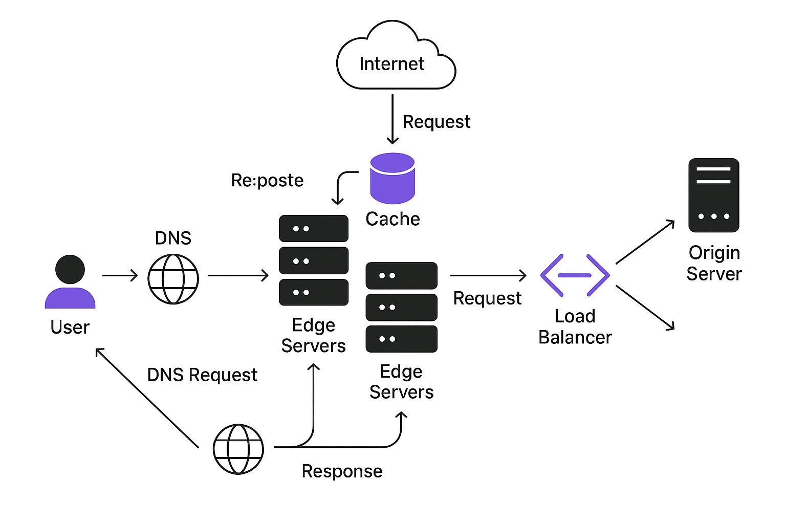
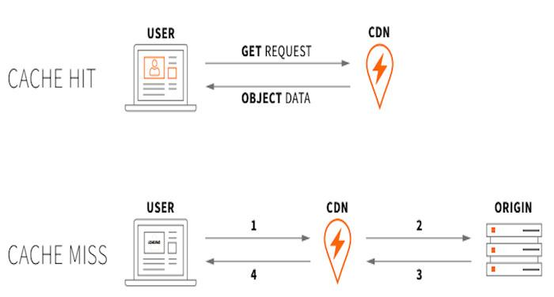
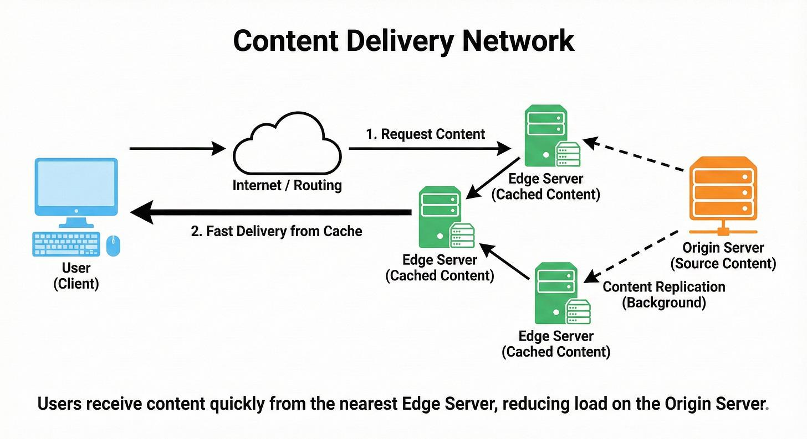
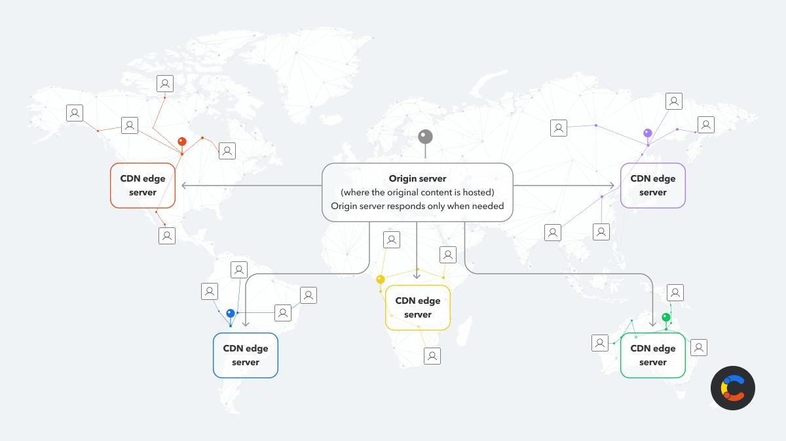
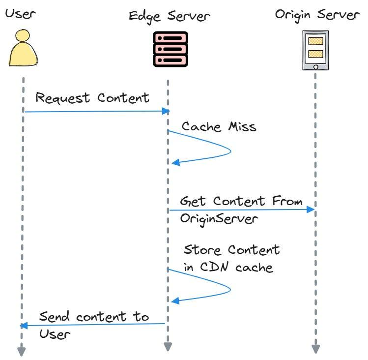
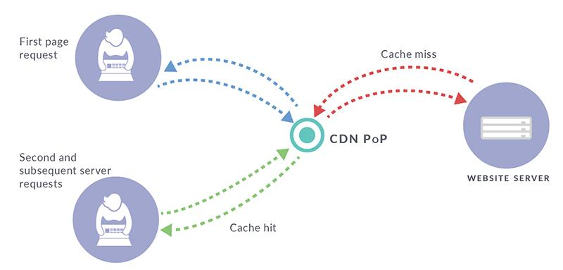

Phần **Content Delivery Network (CDN)** trong `system-design-primer` đang mô tả một pattern rất quan trọng để giải quyết bài toán **latency, throughput và tải lên origin server**. Mình sẽ phân tích theo đúng logic của GitHub, nhưng bổ sung phần lý thuyết và công thức để bạn có thể đưa vào báo cáo học thuật.

## 1. CDN là gì?

CDN (**Content Delivery Network**) là một mạng lưới gồm nhiều **edge server / proxy server** được phân bố tại nhiều vị trí địa lý.

Ý tưởng cốt lõi:

$$
\text{User}
\rightarrow
\text{Nearest CDN Edge}
\rightarrow
\text{Origin Server}
$$

thay vì:

$$
\text{User}
\rightarrow
\text{Origin Server}
$$

Trong hệ thống không có CDN, nếu origin server đặt tại Mỹ nhưng user ở Việt Nam, request phải đi qua một khoảng cách địa lý lớn.

Khi có CDN, nội dung có thể được cache tại một edge server gần Việt Nam:

$$
\text{User}*{VN}
\rightarrow
\text{CDN Edge}*{VN}
$$

Do đó giảm **network latency**.














---

# 2. Kiến trúc cơ bản của CDN

Một kiến trúc đơn giản có thể biểu diễn:

```text
                         ┌─────────────────┐
                         │  Origin Server  │
                         └────────┬────────┘
                                  │
                    ┌─────────────┼─────────────┐
                    │             │             │
                    ▼             ▼             ▼
              ┌──────────┐  ┌──────────┐  ┌──────────┐
              │ CDN Edge │  │ CDN Edge │  │ CDN Edge │
              │   Asia   │  │  Europe  │  │   USA    │
              └────┬─────┘  └────┬─────┘  └────┬─────┘
                   │             │             │
                   ▼             ▼             ▼
                Users         Users         Users
```

Origin server chứa **nguồn dữ liệu gốc**.

CDN edge server chứa các bản **cached copies** của content.

Ví dụ:

```text
Origin:
    /images/logo.png

CDN Asia:
    /images/logo.png  ← cached

CDN Europe:
    /images/logo.png  ← cached

CDN USA:
    /images/logo.png  ← cached
```

User không nhất thiết phải lấy file trực tiếp từ origin.

---

# 3. CDN giải quyết vấn đề gì?

GitHub đề cập hai lợi ích chính.

## 3.1. Giảm latency

Giả sử:

$$
T_{response}=

T_{DNS}
+
T_{network}
+
T_{server}
+
T_{transfer}
$$

CDN chủ yếu giúp giảm:

$$
T_{network}
$$

và trong nhiều trường hợp giảm cả:

$$
T_{server}
$$

vì request không cần đi đến origin.

Ví dụ:

```text
Không CDN:

User Vietnam
     │
     │ 200 ms
     ▼
Origin USA
```

với CDN:

```text
User Vietnam
     │
     │ 20 ms
     ▼
CDN Asia
```

Do đó:

$$
T_{CDN} \ll T_{origin}
$$

đặc biệt đối với user ở xa origin.

---

# 4. Giảm tải cho Origin Server

Giả sử có:

$$
R = 100,000
$$

requests/s.

Nếu tất cả request đều tới origin:

$$
R_{origin} = 100,000
$$

requests/s.

Nhưng nếu CDN cache được phần lớn content và cache hit ratio là:

$$
H = 0.95
$$

thì chỉ còn:

$$
R_{origin}=

R(1-H)
$$

hay:

$$
R_{origin}= 100,000(1-0.95)

5,000
$$

requests/s.

Như vậy CDN đã giảm khoảng:

$$
95%
$$

request tới origin.

Đây là một điểm rất quan trọng khi thiết kế hệ thống:

> **CDN không chỉ giảm latency cho client mà còn hoạt động như một lớp giảm tải cho backend/origin.**

---

# 5. Cache Hit và Cache Miss

Đây là khái niệm quan trọng nhất để hiểu CDN.

## Cache Hit

Nếu CDN đã có content:

```text
User
 │
 ▼
CDN Edge
 │
 │ Cache HIT
 ▼
Content
```

Origin không cần xử lý request.

---

## Cache Miss

Nếu CDN chưa có content:

```text
User
 │
 ▼
CDN Edge
 │
 │ Cache MISS
 ▼
Origin
 │
 ▼
CDN Edge
 │
 ▼
User
```

CDN lấy content từ origin rồi lưu lại:

```text
Origin
   │
   ▼
CDN Cache
   │
   ▼
User
```

Các request tiếp theo có thể trở thành cache hit.

---

# 6. Cache Hit Ratio

Có thể định nghĩa:

$$
H =
\frac{N_{hit}}
{N_{total}}
$$

trong đó:

* $N_{hit}$: số request được CDN phục vụ trực tiếp từ cache.
* $N_{total}$: tổng số request tới CDN.

Cache miss ratio:

$$
M =
1-H
$$

Do đó:

$$
R_{origin}=

R_{total}(1-H)
$$

Đây là một công thức rất hữu ích trong **capacity planning**.

---

# 7. Push CDN

GitHub chia CDN thành hai loại:

1. **Push CDN**
2. **Pull CDN**

## 7.1. Ý tưởng

Với Push CDN, application/server **chủ động upload content lên CDN**.

```text
Origin
   │
   │ PUSH
   ▼
CDN
   │
   ▼
Users
```

Khi file thay đổi:

```text
New file
   │
   ▼
Upload to CDN
   │
   ▼
CDN stores new version
```

Ví dụ:

```text
/images/logo-v1.png
/images/logo-v2.png
```

Application có thể thay URL:

```html

```

---

## 7.2. Đặc điểm Push CDN

Push CDN cho phép developer/application kiểm soát:

* file nào được upload;
* thời điểm upload;
* expiration;
* version;
* cache lifecycle.

Điều này làm giảm traffic giữa CDN và origin vì CDN không cần thường xuyên pull lại file.

### Ưu điểm

$$
\text{Predictable CDN content}
$$

và:

$$
\text{Less origin traffic}
$$

### Nhược điểm

Application phải quản lý việc upload content.

Do đó:

$$
\text{Operational complexity} \uparrow
$$

---

# 8. Khi nào sử dụng Push CDN?

Push CDN phù hợp khi:

* content ít thay đổi;
* lượng traffic không quá lớn;
* content có thể được chuẩn bị trước;
* muốn kiểm soát chính xác lifecycle của content.

Ví dụ:

```text
Static website
Documentation
Software binaries
Versioned assets
Large media files
```

---

# 9. Pull CDN

Pull CDN hoạt động ngược lại.

Application giữ content tại origin:

```text
Origin
  │
  │ content remains here
  ▼
CDN
```

CDN chỉ lấy content khi có request đầu tiên.

---

## 9.1. Cache miss

Ví dụ user request:

```text
https://cdn.example.com/video.mp4
```

CDN chưa có file:

```text
User
 │
 ▼
CDN
 │
 │ MISS
 ▼
Origin
 │
 ▼
CDN Cache
 │
 ▼
User
```

Sau đó:

```text
User 1 → CDN → Origin
                    ↓
                 Cache

User 2 → CDN → Cache
User 3 → CDN → Cache
User 4 → CDN → Cache
```

Origin không cần phục vụ toàn bộ request.

---

# 10. TTL — Time To Live

Pull CDN phụ thuộc rất nhiều vào **TTL**.

TTL xác định thời gian content được phép tồn tại trong cache.

Ví dụ:

$$
TTL = 3600s
$$

nghĩa là cache entry có thể được giữ trong:

$$
3600s = 1\text{ hour}
$$

Sau khi TTL hết hạn:

```text
Cache
  │
  │ expired
  ▼
CDN requests origin
```

---

# 11. Trade-off của TTL

TTL càng dài:

$$
TTL \uparrow
$$

thì:

$$
Origin\ Load \downarrow
$$

nhưng:

$$
Staleness\ Risk \uparrow
$$

Ngược lại:

$$
TTL \downarrow
$$

thì:

$$
Freshness \uparrow
$$

nhưng:

$$
Origin\ Traffic \uparrow
$$

Có thể biểu diễn:

```text
                TTL
                 │
       ┌─────────┴─────────┐
       │                   │
       ▼                   ▼
    TTL thấp            TTL cao
       │                   │
       ▼                   ▼
 Fresh content        Stale content
       │                   │
       ▼                   ▼
Origin load ↑         Origin load ↓
```

Đây là một **trade-off kinh điển giữa freshness và performance**.

---

# 12. Push vs Pull CDN

| Đặc điểm               | Push CDN             | Pull CDN         |
| ---------------------- | -------------------- | ---------------- |
| Upload                 | Chủ động             | CDN tự lấy       |
| Origin giữ content     | Có                   | Có               |
| CDN lấy khi request    | Không nhất thiết     | Có               |
| Cache miss             | Ít phụ thuộc request | Có               |
| Operational complexity | Cao hơn              | Thấp hơn         |
| Storage                | Có thể lớn           | Tối ưu hơn       |
| Phù hợp                | Content ít thay đổi  | Traffic lớn      |
| Quản lý freshness      | Chủ động             | TTL/cache policy |

Có thể ghi nhớ:

$$
\boxed{\text{Push} = \text{You push content}}
$$

$$
\boxed{\text{Pull} = \text{CDN pulls content}}
$$

---

# 13. CDN và DNS

Một phần quan trọng trong đoạn GitHub là:

> "The site's DNS resolution will tell clients which server to contact."

DNS có thể được sử dụng để đưa user tới CDN/edge phù hợp.

Ví dụ:

```text
www.example.com
       │
       ▼
      DNS
       │
       ├──── User Asia ────► CDN Asia
       │
       ├──── User Europe ──► CDN Europe
       │
       └──── User USA ─────► CDN USA
```

Về mặt khái niệm:

$$
DNS
\rightarrow
\text{Endpoint selection}
$$

Trong hệ thống CDN thực tế, quyết định endpoint có thể dựa trên:

* geographic location;
* network topology;
* latency;
* availability;
* load;
* routing policy.

Vì vậy DNS là một thành phần quan trọng trong quá trình **traffic steering**.

---

# 14. CDN không chỉ dành cho static content

Các loại content phổ biến:

```text
HTML
CSS
JavaScript
Images
Fonts
Videos
Software binaries
```

Đặc biệt CDN rất hiệu quả với các file lớn:

$$
\text{Video}
\rightarrow
\text{CDN}
$$

vì nhiều user có thể request cùng một object.

Ví dụ:

```text
100,000 users
       │
       ▼
   CDN Cache
       │
       │
       ▼
video.mp4
```

Thay vì:

```text
100,000 users
       │
       ▼
Origin Server
```

---

# 15. CDN cho Dynamic Content

GitHub cũng đề cập rằng một số CDN hỗ trợ dynamic content.

Điểm cần phân biệt:

### Static content

Cùng một URL thường trả về cùng một object:

$$
f(request) = content
$$

Ví dụ:

```text
/logo.png
/app.js
/video.mp4
```

Rất dễ cache.

### Dynamic content

Response có thể phụ thuộc vào:

```text
User
Cookie
Authorization
Location
Query parameters
Real-time state
```

Ví dụ:

```text
GET /profile
Authorization: User-A
```

không thể đơn giản cache giống:

```text
GET /logo.png
```

Do đó dynamic CDN cần các cơ chế cache policy phức tạp hơn.

---

# 16. CDN và Availability

CDN cũng có thể cải thiện khả năng chịu lỗi.

Thay vì:

```text
Users
  │
  ▼
One Origin
```

ta có:

```text
              Origin
                 │
       ┌─────────┼─────────┐
       ▼         ▼         ▼
    CDN Asia  CDN EU    CDN US
       │         │         │
     Users     Users     Users
```

Nếu một edge node gặp vấn đề, traffic có thể được chuyển sang edge khác tùy kiến trúc/routing.

Tuy nhiên cần lưu ý:

> **CDN không tự động biến origin thành highly available.**

Nếu origin là single point of failure:

```text
CDN
 │
 ▼
Single Origin
```

thì CDN vẫn có thể gặp vấn đề khi cần fetch content mới.

Do đó CDN nên kết hợp với:

* replication;
* multiple origins;
* load balancing;
* health checks;
* failover.

---

# 17. Nhược điểm của CDN

GitHub nêu ba nhược điểm chính.

## 17.1. Cost

CDN thường tính phí dựa trên:

$$
\text{Cost}
\approx
\text{Data Transfer}
+
\text{Requests}
+
\text{Storage}
+
\text{Additional Features}
$$

Nếu traffic cực lớn:

$$
Traffic \uparrow
\Rightarrow
CDN\ Cost \uparrow
$$

Vì vậy phải so sánh:

$$
C_{CDN}
\quad \text{vs.} \quad
C_{origin}
$$

---

## 17.2. Stale Content

Nếu:

$$
TTL = 1\ hour
$$

và origin update file ngay sau khi CDN cache file, CDN vẫn có thể trả version cũ cho đến khi cache hết hạn.

```text
Origin
  │
  │ version 2
  ▼

CDN
  │
  │ version 1 cached
  ▼
User
```

Đây chính là **cache staleness**.

Một giải pháp phổ biến là **cache invalidation**.

```text
Update content
      │
      ▼
Invalidate cache
      │
      ▼
CDN fetches new version
```

---

# 18. Cache Invalidation

Một trong những vấn đề nổi tiếng trong distributed systems là:

> **Cache invalidation is hard.**

Có ba chiến lược phổ biến:

### TTL-based

```text
Cache
  │
  ▼
TTL expires
  │
  ▼
Refresh
```

### Explicit invalidation

```text
Update origin
      │
      ▼
Invalidate CDN cache
```

### Versioned URL

Ví dụ:

```text
/app.js?v=1
```

sau khi update:

```text
/app.js?v=2
```

hoặc tốt hơn:

```text
/app.a81f3c.js
/app.b72d91.js
```

Khi URL thay đổi:

$$
URL_{old} \neq URL_{new}
$$

CDN coi đây là object mới.

Đây là một pattern rất phổ biến cho static assets.

---

# 19. CDN trong System Design Interview

Khi thiết kế một hệ thống có:

* image;
* video;
* static files;
* downloads;
* frontend assets;
* large files;

thì có thể đặt CDN phía trước origin:

```text
                    ┌──────────────┐
                    │    Users     │
                    └──────┬───────┘
                           │
                           ▼
                    ┌──────────────┐
                    │     DNS      │
                    └──────┬───────┘
                           │
                           ▼
                    ┌──────────────┐
                    │     CDN      │
                    │ Edge Servers │
                    └──────┬───────┘
                           │
                    Cache Miss
                           │
                           ▼
                    ┌──────────────┐
                    │ Load Balancer│
                    └──────┬───────┘
                           │
                           ▼
                    ┌──────────────┐
                    │    Origin    │
                    └──────────────┘
```

Luồng request:

$$
User
\rightarrow DNS
\rightarrow CDN
\rightarrow Origin
$$

nhưng khi cache hit:

$$
User
\rightarrow DNS
\rightarrow CDN
$$

---

# 20. Cách phân tích CDN trong interview

Một cách trả lời có cấu trúc:

### Step 1 — Xác định content

```text
Static?
Dynamic?
Large media?
User-specific?
```

### Step 2 — Xác định caching

```text
Can this content be cached?
```

### Step 3 — Chọn Push hoặc Pull

```text
Rarely changed
    → Push

Frequently requested / large traffic
    → Pull
```

### Step 4 — Thiết kế TTL

Cần cân bằng:

$$
Freshness
\leftrightarrow
Origin\ Load
$$

### Step 5 — Thiết kế invalidation

```text
TTL
+
Explicit invalidation
+
Versioned URLs
```

### Step 6 — Xử lý failure

```text
CDN failure
    ↓
Fallback / another edge
    ↓
Origin
```

---

# 21. Ý nghĩa quan trọng nhất

Có thể cô đọng toàn bộ CDN thành:

$$
\boxed{
CDN=

Geographically\ Distributed
+
Caching
+
Traffic\ Offloading
}
$$

Ba tác động chính:

$$
\boxed{
Latency \downarrow
}
$$

$$
\boxed{
Origin\ Load \downarrow
}
$$

$$
\boxed{
Scalability \uparrow
}
$$

nhưng phải đánh đổi với:

$$
\boxed{
Cost \uparrow
}
$$

và:

$$
\boxed{
Cache\ Staleness\ Risk \uparrow
}
$$

---

## 22. Liên kết học từ GitHub

Phần này nằm trong **System Design Primer – Content Delivery Network** của Donne Martin:

[System Design Primer – CDN trên GitHub](https://github.com/donnemartin/system-design-primer?utm_source=chatgpt.com#content-delivery-network)

Bạn cũng nên đọc trực tiếp các phần liên quan:

* **Push CDNs / Pull CDNs** trong cùng mục CDN.
* **Caching** để hiểu cơ chế cache phía sau CDN.
* **Load Balancing** để hiểu CDN kết hợp với origin như thế nào.
* **Availability patterns** để hiểu CDN kết hợp với replication/fail-over.
* **DNS** để hiểu cách request được định tuyến tới endpoint phù hợp.

[System Design Primer – Caching](https://github.com/donnemartin/system-design-primer?utm_source=chatgpt.com#caching)

[System Design Primer – Load Balancing](https://github.com/donnemartin/system-design-primer?utm_source=chatgpt.com#load-balancing)

[System Design Primer – Availability Patterns](https://github.com/donnemartin/system-design-primer?utm_source=chatgpt.com#availability-patterns)

[System Design Primer – DNS](https://github.com/donnemartin/system-design-primer?utm_source=chatgpt.com#domain-name-system)

**Nếu đặt CDN vào toàn bộ kiến trúc system design**, hãy nhớ chuỗi:

$$
\boxed{
User
\rightarrow
DNS
\rightarrow
CDN
\rightarrow
Load\ Balancer
\rightarrow
Application
\rightarrow
Database
}
$$

Trong đó CDN chủ yếu giải quyết **network latency + static-content delivery + origin offloading**, chứ **không thay thế database, load balancer hay application server**.
