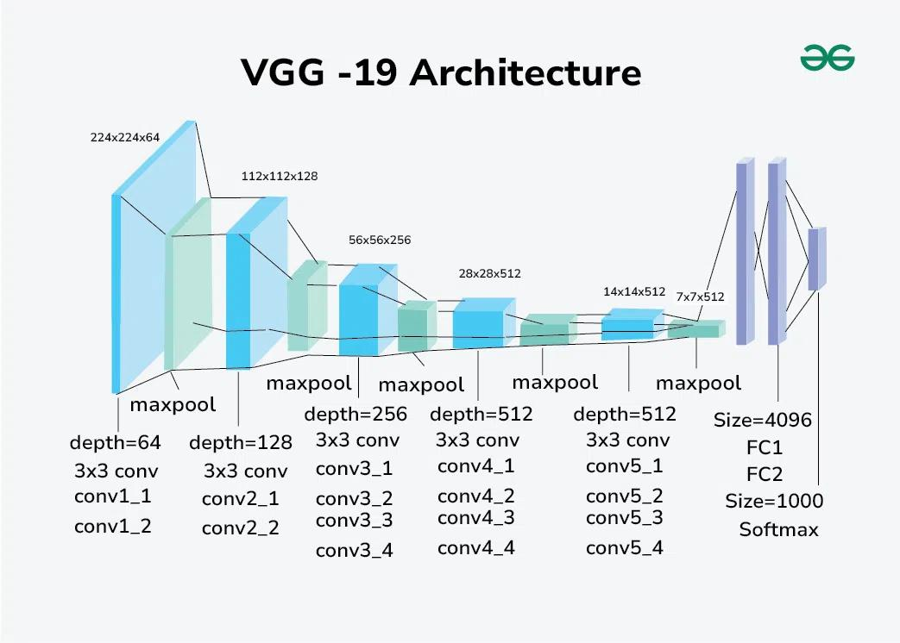
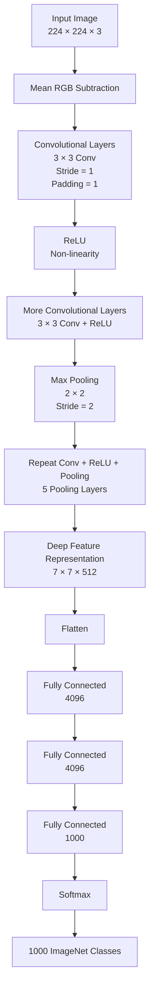

# Deep Neural Networks

So sánh giữa Artificial Neural Network và Deep Neural Network


## Giải thích đơn giản về mạng nơ-ron nhân tạo ANN

Mạng nơ-ron nhân tạo (Artificial Neural Network – ANN), hay còn gọi là mạng nơ-ron truyền thống đơn giản, được sử dụng để giải quyết những bài toán tương đối đơn giản với cấu trúc mạng không quá phức tạp. ANN được lấy cảm hứng một cách khái quát từ mạng nơ-ron sinh học. Đây là một tập hợp các layer (tầng) được tổ chức để thực hiện một nhiệm vụ cụ thể. Mỗi layer bao gồm một tập hợp các node (nút/neuron) cùng hoạt động với nhau.

Các mạng này thường bao gồm input layer (tầng đầu vào), từ một đến hai hidden layer (tầng ẩn) và output layer (tầng đầu ra). Mặc dù chúng có thể giải quyết các bài toán toán học đơn giản và một số bài toán máy tính, bao gồm các cấu trúc cổng logic cơ bản cùng với các bảng chân trị tương ứng, nhưng những mạng này gặp nhiều khó khăn khi giải quyết các bài toán phức tạp như xử lý ảnh (image processing), thị giác máy tính (computer vision) và xử lý ngôn ngữ tự nhiên (natural language processing – NLP).

Đối với những bài toán này, chúng ta sử dụng Deep Neural Network (DNN), thường có cấu trúc các hidden layer phức tạp hơn với nhiều loại layer khác nhau, chẳng hạn như convolutional layer (layer tích chập), max-pooling layer, dense layer và nhiều layer đặc thù khác. Những layer bổ sung này giúp mô hình hiểu dữ liệu tốt hơn và đưa ra lời giải phù hợp cho các bài toán phức tạp. Deep Neural Network có nhiều layer hơn (độ sâu lớn hơn) so với ANN và mỗi layer làm tăng mức độ phức tạp của mô hình, đồng thời cho phép mô hình xử lý input theo nhiều bước biến đổi để tạo ra output phù hợp.

> Mạng nơ-ron đơn giản → ít tầng → khả năng biểu diễn hạn chế hơn
>
> Deep Neural Network → nhiều tầng → có thể học các biểu diễn phức tạp hơn.

## Tìm hiểu về các mô hình Deep Learning

> Trả lời cho câu hỏi: Tại sao không dùng một Neural Network duy nhất cho mọi loại dữ liệu? -> Bởi vì dữ liệu có cấu trúc khác nhau.

```
Image
│
├── Có cấu trúc không gian (spatial structure)
├── Pixel gần nhau thường liên quan
└── Có patterns cục bộ
       ↓
      CNN

trong khi

Text / Speech / Time Series
│
├── Có thứ tự
├── Có phụ thuộc theo thời gian
└── Thông tin hiện tại phụ thuộc quá khứ
       ↓
      RNN / LSTM
```

Để thực hiện một bài toán Machine Learning cụ thể, chúng ta cần lựa chọn một Deep Neural Network (DNN) phù hợp để thực hiện những nhiệm vụ cần thiết. Hai mô hình Deep Learning được sử dụng phổ biến là Convolutional Neural Network (CNN) và Recurrent Neural Network (RNN). Convolutional Neural Network được sử dụng rất rộng rãi trong các bài toán xử lý ảnh (image processing) và thị giác máy tính (computer vision).

Trong các Deep Neural Network này, thay vì thực hiện phép toán ma trận thông thường tại các hidden layer, chúng ta thực hiện phép tích chập (convolution operation). Điều này cho phép mạng có cách tiếp cận có khả năng mở rộng tốt hơn, mang lại hiệu quả tính toán và độ chính xác cao hơn. Trong các bài toán image classification và object detection, có rất nhiều dữ liệu và hình ảnh cần được xử lý. Convolutional Neural Network giúp giải quyết hiệu quả những vấn đề này.

Đối với các bài toán Natural Language Processing (NLP) và các bài toán liên quan đến ngữ nghĩa, Recurrent Neural Network (RNN) thường được sử dụng để cải thiện kết quả. Một biến thể phổ biến của RNN là Long Short-Term Memory (LSTM), thường được sử dụng trong nhiều bài toán như machine translation, text classification, speech recognition và các nhiệm vụ tương tự.

Các mạng này duy trì những thông tin quan trọng từ các bước trước và truyền chúng sang bước tiếp theo, đồng thời lưu giữ những thông tin cần thiết nhằm cải thiện hiệu quả của mô hình.

## What DNN?

Deep Neural Network (DNN) là một một Neural Network có nhiều tầng biến đổi giữa input và output, trong đó mỗi tầng học một biểu diễn mới của dữ liệu. 

Điểm quan trọng của chữ Deep không đơn giản là “có nhiều neuron”, mà chủ yếu liên quan đến độ sâu của chuỗi biến đổi/representation. LeCun, Bengio và Hinton nhấn mạnh rằng các tầng khác nhau có thể học các mức biểu diễn khác nhau.

## Why Need DNN?

> DNN có khả năng học các biểu diễn phân cấp và các hàm ánh xạ phức tạp trực tiếp từ dữ liệu.

Một chú ý khá hay: Một neural network đơn giản có thể học một mapping: $x \rightarrow y$. Nhưng DNN cho phép DNN: $x \rightarrow h_1 \rightarrow ... \rightarrow y$, mỗi tầng có thể học một abstraction khác nhau.

- VD Computer vision: pixel -> edges -> Textures -> Parts -> Objects -> Class.

- VD về NLP: Token -> Embedding -> Local patterns -> Semantic representation -> Context -> prediction

> Đây chính là representation learning
>
> Thay vì con người phải tự thiết kế pipeline: Raw data -> Hand-crafted features -> Machine Learning -> Prediction
>
> Thì DNN cố gắng học trực tiếp: 

```
Raw Data
   ↓
Low-level features
   ↓
Intermediate features
   ↓
High-level features
   ↓
Prediction
```

Đây là một trong những lý do Deep Learning tạo ra bước tiến lớn trong __speech recognition, image recognition, object detection__ và nhiều lĩnh vực khác. 

LeCun, Bengio & Hinton mô tả deep learning thông qua các mô hình có nhiều tầng xử lý, cho phép học các biểu diễn ở nhiều mức độ trừu tượng.


### Kiến trúc BERT

BERT không đơn giản chỉ là một "DNN cho translation" mà là Transformer encoder-based pretrained language model, được thiết kế để học contextual representations từ văn bản.

```
Text
 ↓
Tokenization
 ↓
Token Embeddings
 ↓
Transformer Encoder
 ├── Self-Attention
 ├── Feed Forward
 ├── Residual
 └── LayerNorm
 ↓
Contextual Representations
 ↓
Downstream Task
```

### Kiến trúc VGG-19, ResNet=50, EfficientNet

#### VGG-19

Simonyan & Zisserman giới thiệu VGG trong paper Very Deep Convolutional Networks for Large-Scale Image Recognition.

VGG sử dụng cấu trúc CNN đơn giản, điểm nổi bật là sử dụng nhiều Convolution Layer với kernel nhỏ

```
Conv
 ↓
ReLU
 ↓
Conv
 ↓
ReLU
 ↓
Pooling
 ↓
...
 ↓
Dense
```

#### ResNet-50

He et al. giới thiệu residual learning trong paper Deep Residual Learning for Image Recognition.

ResNetđưa vào __residual connection:__ $y = F(x) + x$ thay vì $x -> layer -> layer -> y$. Điều này giúp việc tối ưu mạng sâu trở nên dễ hơn.

#### EfficientNet

Tan & Le giới thiệu EfficientNet trong paper EfficientNet: Rethinking Model Scaling for Convolutional Neural Networks.

> EfficientNet tập trung vào vấn đề: Làm sao tăng model capacity nhưng vẫn sử dụng computation hiệu quả? Thay vì chỉ tăng Depth, Width hoặc Resolution thì EfficientNet đề xuất compound scaling

> DNN là khái niệm về độ sâu của neural network, còn architecture có thể rất khác nhau.

```
Deep Neural Networks
│
├── Deep MLP
│   └── Dense layers
│
├── CNN
│   └── Convolution
│
├── ResNet
│   └── Residual blocks
│
├── Transformer
│   └── Attention + FFN
│
├── U-Net
│   └── Encoder + Decoder + Skip connections
│
└── ...
```


## Where DNN in Machine Learning?

Cho một Hierarchy như sau:

```
Artificial Intelligence
│
└── Machine Learning
    │
    ├── Classical ML
    │   ├── Linear Regression
    │   ├── Logistic Regression
    │   ├── Decision Tree
    │   ├── Random Forest
    │   └── SVM
    │
    └── Neural Networks
        │
        ├── Shallow Neural Network
        │
        └── Deep Neural Network
            │
            ├── MLP / DNN
            ├── CNN
            ├── RNN / LSTM
            ├── Transformer
            ├── Autoencoder
            └── Diffusion / Deep Generative Models
```

> DNN là một family/modeling paradigm trong Neural Networks, còn Deep Learning là phạm vi rộng hơn.

## When - khi nào một Neural Network trở thành một "Deep"?

Ví dụ: `input -> output` Thường được xem là shallow

trong khi 

```
Input
 ↓
Hidden 1
 ↓
Hidden 2
 ↓
Hidden 3
 ↓
Hidden 4
 ↓
...
 ↓
Output
```

Nhưng khi có nhiều hidden layers và thường được gọi là Deep.

> Không có một ngưỡng giá trị nào để định nghĩa depth vậy khi đọc paper thì ta nên xem tác giả định nghĩa depth như thế nào thay vì đi tìm 1 con số cố định.

## Which

Một DNN không chỉ có: `Data -> Backpropagation -> Adam -> Epoch`

Một pipeline chi tiết hơn:


Bảng thành phần:

| Thành phần      | Vai trò                             |
| --------------- | ----------------------------------- |
| Data            | Cung cấp thông tin để học           |
| Architecture    | Xác định cấu trúc model             |
| Weight/Bias     | Parameters model học                |
| Activation      | Tạo nonlinear representation        |
| Loss            | Đo mức sai prediction               |
| Backpropagation | Tính gradient                       |
| Optimizer       | Cập nhật parameters                 |
| Batch           | Đơn vị dữ liệu dùng cho một update  |
| Epoch           | Một lần đi qua toàn bộ training set |
| Regularization  | Kiểm soát overfitting               |
| Validation      | Kiểm tra generalization             |

# VGG (Visual Geometry Group)

Bài báo gốc: [Karen Simonyan & Andrew Zisserman, “Very Deep Convolutional Networks for Large-Scale Image Recognition”, ICLR 2015.](https://arxiv.org/pdf/1409.1556)

Minh họa đơn kiến trúc VGG-19



> Nếu giữ cách xây dựng CNN tương đối đơn giản nhưng tăng số lượng layer, liệu model có học được biểu diễn tốt hơn không?

Theo Paper nhóm nghiên cứu tập trung vào một khía cạnh quan trọng khác của việc thiết kế kiến trúc ConvNet — đó là độ sâu của mạng (depth).Họ cố định các tham số khác của kiến trúc và tăng dần độ sâu của mạng bằng cách thêm nhiều convolutional layer hơn.

Nếu thay đổi tất cả tham số (kernel size, stride, pooling, channels, FC layers, input size) cùng lúc, khi accuracy tăng thì học không biết nguyên nhân từ đâu nên VGG kiểm tra depth tăng thì Performance tăng không?

Thay vì dùng các convolution lớn như: $11 \times 11$ hoặc $7 \times 7$ thì mỗi layer đã có receptive field lớn, nên VGG thay bằng $3 \times 3$ và stack nhiều layer và một chuỗi nhiều convolution nhỏ đó vẫn tạo ra receptive field lớn.

Giải thích: $3 \times 3$ có receptive field = 3 thì hai $3 \times 3$ có 3 + (3 - 1) = 5 receptive field và ba $3 \times 3$ có 3 + 2 + 2 = 7 receptive field nên: $3\ times 3 \rightarrow 5 \times 5 \rightarrow 7 \times 7$ theo receptive filed.

- Receptive Field (Trường thụ cảm) là vùng kích thước trên ảnh đầu vào (input image) mà một điểm (neuron) ở một lớp sâu hơn có thể "nhìn thấy" và chịu ảnh hưởng trực tiếp.

- Việc đạt được Receptive Field lớn như $7 \times 7$ thông qua việc ghép 3 lớp $3 \times 3$ đem lại những lợi ích:
   - Giảm số lượng tham số giúp mô hình bớt cồng kềnh và giảm Overfit
      - 1 lớp $7 \times 7$: số tham số = $1 \times (7 \times 7 \times C \times C) = 49C^2$
      - 3 lớp $3 \times 3$: số tham số = $3 \times (3 \times 3 \times C \times C) = 27C^2$
   - Tăng tính phi tuyến giúp mạng học được nhiều đặc trưng phức tạp hơn.
      - 1 lớp $7 \times 7$ chỉ đi kèm với 1 hàm kích hoạt ở cuối layer.
      - chuỗi 3 lớp $3 \times 3$ đi kèm với 3 hàm kích hoạt ReLU riêng biệt xen kẽ giữa các layer.

## Kiến trúc ConvNet



| Bước   | Thành phần          | Thiết lập VGG                                  | Giải thích                                                                                     |
| ------ | ------------------- | ---------------------------------------------- | ------------------------------------------------------------------------------------------------------ |
| **1**  | **Input**           | $224\times224\times3$                          | Ảnh RGB kích thước cố định, gồm 3 kênh màu.                                                            |
| **2**  | **Preprocessing**   | Mean RGB Subtraction                           | Trừ giá trị RGB trung bình của training set khỏi từng pixel để đưa dữ liệu về quanh mean.              |
| **3**  | **Convolution**     | $3\times3$, stride=1, padding=1          | Trích xuất đặc trưng cục bộ. $3\times3$ đủ nhỏ để nhìn quan hệ trái–phải, trên–dưới và trung tâm.      |
| **4**  | **ReLU**            | $ReLU(x)=\max(0,x)$                            | Thêm tính phi tuyến, giúp mạng học các biểu diễn phức tạp hơn khi xếp chồng nhiều Conv layer.          |
| **5**  | **$1\times1$ Conv** | Một số configuration                           | Biến đổi tuyến tính giữa các channels tại cùng một vị trí spatial, sau đó qua ReLU.                    |
| **6**  | **Max Pooling**     | $2\times2$, stride=2                        | Giảm kích thước $H,W$, giảm computation và mở rộng receptive field hiệu dụng. Có **5 pooling layers**. |
| **7**  | **Tăng channels**   | $64\rightarrow128\rightarrow256\rightarrow512$ | Khi spatial resolution giảm, số channels tăng để mạng có nhiều khả năng biểu diễn feature hơn.         |
| **8**  | **Lặp Conv Blocks** | Conv $3\times3$ + ReLU → Pool                  | Tăng depth để học feature theo cấp bậc: **edges → textures → patterns → object parts**.                |
| **9**  | **Flatten**         | $7\times7\times512\rightarrow25088$            | Chuyển feature map 3D thành vector để đưa vào Fully Connected layer.                                   |
| **10** | **Fully Connected** | $4096\rightarrow4096\rightarrow1000$           | Kết hợp các high-level features để thực hiện classification.                                           |
| **11** | **Softmax**         | 1000 classes                                   | Chuyển logits thành xác suất của 1000 lớp ImageNet/ILSVRC.                                             |
| **12** | **LRN**             | Hầu như không dùng                             | Thực nghiệm cho thấy không cải thiện đáng kể performance nhưng làm tăng memory và computation.         |
