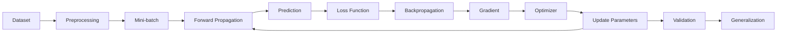

# Deep Neural Networks

So sánh giữa Artificial Neural Network và Deep Neural Network


## What DNN?

Deep Neural Network (DNN) là một một Neural Network có nhiều tầng biến đổi giữa input và output, trong đó mỗi tầng học một biểu diễn mới của dữ liệu. 

Điểm quan trọng của chữ Deep không đơn giản là “có nhiều neuron”, mà chủ yếu liên quan đến độ sâu của chuỗi biến đổi/representation. LeCun, Bengio và Hinton nhấn mạnh rằng các tầng khác nhau có thể học các mức biểu diễn khác nhau.

## Why Need DNN?

Một chú ý khá hay: Một neural network đơn giản có thể học một mapping: $x \rightarrow y$. Nhưng DNN cho phép DNN: $x \rightarrow h_1 \rightarrow ... \rightarrow y$, mỗi tầng có thể học một abstraction khác nhau.

- VD Computer vision: pixel -> edges -> Textures -> Parts -> Objects -> Class.

- VD về NLP: Token -> Embedding -> Local patterns -> Semantic representation -> Context -> prediction

> Đây chính là representation learning
>
> Thay vì con người phải tự thiết kế pipeline: Raw data -> Hand-crafted features -> Machine Learning -> Prediction
>
> Thì DNN cố gắng học trực tiếp: 

```
Raw data
   ↓
Layer 1 → representation 1
   ↓
Layer 2 → representation 2
   ↓
Layer 3 → representation 3
   ↓
...
   ↓
Prediction
```

Đây là một trong những lý do Deep Learning tạo ra bước tiến lớn trong __speech recognition, image recognition, object detection__ và nhiều lĩnh vực khác.

## Where DNN in Machine Learning?

Cho một Hierarchy như sau:

```
Artificial Intelligence
│
└── Machine Learning
    │
    ├── Classical ML
    │   ├── Linear Regression
    │   ├── Logistic Regression
    │   ├── Decision Tree
    │   ├── Random Forest
    │   └── SVM
    │
    └── Neural Networks
        │
        ├── Shallow Neural Network
        │
        └── Deep Neural Network
            │
            ├── MLP / DNN
            ├── CNN
            ├── RNN / LSTM
            ├── Transformer
            ├── Autoencoder
            └── Diffusion / Deep Generative Models
```

> DNN là một family/modeling paradigm trong Neural Networks, còn Deep Learning là phạm vi rộng hơn.

## When - khi nào một Neural Network trở thành một "Deep"?

Ví dụ: `input -> output` Thường được xem là shallow

trong khi 

```
Input
 ↓
Hidden 1
 ↓
Hidden 2
 ↓
Hidden 3
 ↓
Hidden 4
 ↓
...
 ↓
Output
```

Nhưng khi có nhiều hidden layers và thường được gọi là Deep.

> Không có một ngưỡng giá trị nào để định nghĩa depth vậy khi đọc paper thì ta nên xem tác giả định nghĩa depth như thế nào thay vì đi tìm 1 con số cố định.

## Which

Một DNN không chỉ có: `Data -> Backpropagation -> Adam -> Epoch`

Một pipeline chi tiết hơn:



Bảng thành phần:

| Thành phần      | Vai trò                             |
| --------------- | ----------------------------------- |
| Data            | Cung cấp thông tin để học           |
| Architecture    | Xác định cấu trúc model             |
| Weight/Bias     | Parameters model học                |
| Activation      | Tạo nonlinear representation        |
| Loss            | Đo mức sai prediction               |
| Backpropagation | Tính gradient                       |
| Optimizer       | Cập nhật parameters                 |
| Batch           | Đơn vị dữ liệu dùng cho một update  |
| Epoch           | Một lần đi qua toàn bộ training set |
| Regularization  | Kiểm soát overfitting               |
| Validation      | Kiểm tra generalization             |

# VGG

# DenseNet