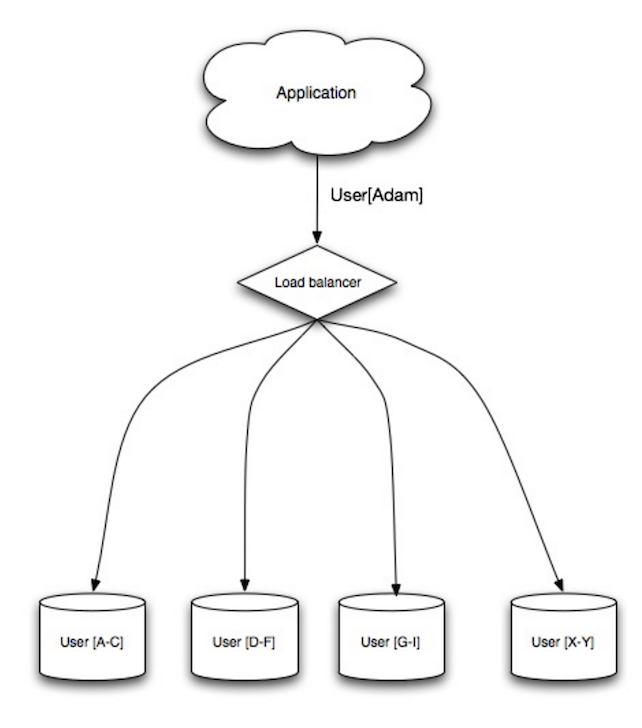
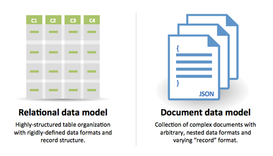

# Database

Database là tầng chịu trách nhiệm **lưu trữ, tổ chức, truy vấn và bảo đảm tính toàn vẹn của dữ liệu**. Trong system design, database thường trở thành một trong những bottleneck quan trọng khi hệ thống tăng trưởng vì cả **read workload**, **write workload**, kích thước dữ liệu và yêu cầu consistency đều tăng.

Một hệ thống database có thể được nhìn dưới hai hướng lớn:

```text
                         Database
                            |
              +-------------+-------------+
              |                           |
            RDBMS                       NoSQL
              |                           |
      +-------+-------+          +--------+--------+
      |       |       |          |        |        |
 Replication Federation Sharding   KV   Document  Wide Column
      |       |       |                              |
 Master-    Master-   ...                         Graph
 Slave      Master
      |
 Denormalization
      |
 SQL Tuning
```


Theo `system-design-primer`, phần Database được chia thành:

* **Relational Database Management System (RDBMS)**

  * Master-slave replication
  * Master-master replication
  * Federation
  * Sharding
  * Denormalization
  * SQL tuning
* **NoSQL**

  * Key-value store
  * Document store
  * Wide column store
  * Graph database
* **SQL or NoSQL** ([GitHub][2])

Điểm quan trọng là **không có database architecture nào luôn tốt nhất**. Mỗi lựa chọn là một trade-off giữa:

$$
\text{Consistency}
\leftrightarrow
\text{Availability}
\leftrightarrow
\text{Latency}
\leftrightarrow
\text{Throughput}
\leftrightarrow
\text{Scalability}
$$

---

## 1. Relational Database Management System

### 1.1. Khái niệm

Relational Database Management System (**RDBMS**) tổ chức dữ liệu thành các **table**, trong đó:

* mỗi row biểu diễn một record;
* mỗi column biểu diễn một thuộc tính;
* quan hệ giữa các bảng được biểu diễn bằng **primary key / foreign key**;
* dữ liệu thường được truy vấn bằng SQL.

Ví dụ:

```text
Users
+----+----------+-------------------+
| id | name     | email             |
+----+----------+-------------------+
| 1  | Alice    | alice@example.com |
| 2  | Bob      | bob@example.com   |
+----+----------+-------------------+

Orders
+----+---------+--------+
| id | user_id | amount |
+----+---------+--------+
| 10 | 1       | 100    |
| 11 | 2       | 250    |
+----+---------+--------+
```

Quan hệ:

$$
Users.id \rightarrow Orders.user\_id
$$

cho phép database thực hiện các phép `JOIN` để kết hợp dữ liệu.

#### Đặc điểm cốt lõi

RDBMS phù hợp khi hệ thống có:

* schema tương đối ổn định;
* dữ liệu có quan hệ;
* yêu cầu transaction;
* cần `JOIN`;
* yêu cầu integrity/constraints;
* truy vấn bằng SQL.

---

## 2. ACID

Một trong những đặc điểm quan trọng nhất của relational transactions là **ACID**. `system-design-primer` mô tả ACID gồm Atomicity, Consistency, Isolation và Durability. ([GitHub][2])

### 2.1. Atomicity

Một transaction phải được thực hiện theo nguyên tắc:

$$
T = \text{ALL operations}
\quad\lor\quad
T = \text{NONE}
$$

Ví dụ chuyển tiền:

```text
A - 100
B + 100
```

Không được xảy ra trạng thái:

```text
A - 100
B + 0
```

Nếu một bước thất bại, toàn bộ transaction phải rollback.

---

### 2.2. Consistency

Transaction phải đưa database từ một **valid state** sang một **valid state**:

$$
S_{valid}
\xrightarrow{T}
S'_{valid}
$$

Các constraint như:

```text
PRIMARY KEY
FOREIGN KEY
UNIQUE
CHECK
NOT NULL
```

giúp duy trì tính hợp lệ của dữ liệu.

---

### 2.3. Isolation

Khi nhiều transaction chạy đồng thời:

$$
T_1 \parallel T_2 \parallel \cdots \parallel T_n
$$

kết quả phải tương đương với một execution tuần tự hợp lệ, tùy isolation level mà hệ quản trị cung cấp.

Mục tiêu là hạn chế các hiện tượng như:

* dirty read;
* non-repeatable read;
* phantom read;
* lost update.

---

### 2.4. Durability

Sau khi:

```text
COMMIT
```

thành công, dữ liệu phải được duy trì ngay cả khi database process hoặc server gặp sự cố.

Về mặt khái niệm:

$$
Commit(T) \Rightarrow T \text{ survives failure}
$$

---

## 3. Scaling RDBMS

Khi database trở thành bottleneck, không nên lập tức chuyển sang NoSQL.

Có nhiều cách scale RDBMS:

```text
RDBMS
 |
 +-- Replication
 |    +-- Master-Slave
 |    +-- Master-Master
 |
 +-- Federation
 |
 +-- Sharding
 |
 +-- Denormalization
 |
 +-- SQL Tuning
```

Đây chính là các scaling patterns được `system-design-primer` liệt kê. ([GitHub][2])

Có thể hiểu chúng theo progression:

```text
Optimize
   ↓
Add indexes / tune SQL
   ↓
Reduce joins / denormalize
   ↓
Scale reads
   ↓
Replication
   ↓
Split database responsibilities
   ↓
Federation
   ↓
Partition data
   ↓
Sharding
```

---

## 4. Master-Slave Replication

### 4.1. Architecture

Master nhận:

```text
READ
WRITE
```

Slave thường nhận:

```text
READ
```

và dữ liệu từ master được replicate sang slave.

```text
                 +----------+
WRITE ---------> |  MASTER  |
                 +----+-----+
                      |
             replication
             +--------+--------+
             |                 |
             v                 v
        +---------+       +---------+
        | SLAVE 1 |       | SLAVE 2 |
        +---------+       +---------+
             |                 |
            READ              READ
```


Ý tưởng cốt lõi:

$$
Write \rightarrow Master
$$

$$
Read \rightarrow Slave
$$

Điều này đặc biệt hữu ích khi:

$$
R \gg W
$$

tức workload read lớn hơn write.

---

### 4.2. Read scalability

Giả sử một database có:

$$
R = 10,000\ requests/s
$$

và:

$$
W = 500\ requests/s
$$

thì việc tạo nhiều read replicas cho phép phân phối workload:

```text
                 Master
                   |
             +-----+-----+
             |     |     |
             v     v     v
            R1    R2    R3
```

Write vẫn tập trung ở master nhưng read được scale horizontally.

---

### 4.3. Replication lag

Một vấn đề quan trọng là:

$$
T_{replication} > 0
$$

Do đó:

```text
Client
  |
  | WRITE
  v
MASTER
  |
  | asynchronous replication
  v
SLAVE
```

có thể xảy ra:

```text
t0: WRITE X = 100 -> Master
t1: READ X        -> Slave
```

Slave vẫn trả về:

```text
X = old value
```

Đây là **replication lag**.

---

### 4.4. Failure

Nếu master failure:

```text
MASTER
   X
   |
   +---- Slave 1
   |
   +---- Slave 2
```

các slave có thể tiếp tục phục vụ read.

Nhưng để phục hồi write:

$$
Slave \rightarrow New\ Master
$$

cần một cơ chế **failover/promotion**.

---

### 4.5. Trade-offs

### Advantages

* Scale read workload.
* Tăng availability.
* Có thể phục vụ read khi master gặp sự cố.
* Backup/replica có thể được sử dụng cho các workload khác.

### Disadvantages

1. Failover phức tạp.
2. Replication lag.
3. Có khả năng mất dữ liệu nếu master failure trước khi dữ liệu được replicate.
4. Replicas phải replay writes.
5. Nhiều replicas có thể làm replication traffic tăng.
6. Tăng infrastructure complexity.

Các trade-off này tương ứng với phần replication trong `system-design-primer`. ([GitHub][2])

---

## 5. Master-Master Replication

Trong master-master:

```text
             +----------+
        +--> | MASTER A | <---+
        |    +----------+     |
        |          ↕          |
        |       replicate     |
        |          ↕          |
        |    +----------+     |
        +--- | MASTER B | <---+
             +----------+
```


Cả hai node đều có thể:

```text
READ
WRITE
```

Nếu:

$$
M_A \downarrow
$$

thì:

$$
M_B
$$

vẫn có thể phục vụ cả read và write.

---

### 5.1. Ưu điểm

So với master-slave:

$$
Availability \uparrow
$$

vì không tồn tại một node duy nhất chịu trách nhiệm write.

---

### 5.2. Conflict

Tuy nhiên, khi hai node cùng write:

```text
Master A:
X = 10

Master B:
X = 20
```

có thể xuất hiện:

$$
Conflict(X)
$$

Do đó cần:

* conflict detection;
* conflict resolution;
* synchronization.

Khi số lượng write nodes tăng, bài toán conflict càng phức tạp. `system-design-primer` cũng nhấn mạnh rằng master-master có thể phải đánh đổi consistency hoặc tăng write latency để đồng bộ. ([GitHub][2])

---

## 6. Federation

### 6.1. Ý tưởng

Federation, hay **functional partitioning**, không chia dữ liệu theo từng user mà chia database theo **business function**.

Ví dụ:

```text
                 Application
                     |
       +-------------+-------------+
       |             |             |
       v             v             v
    Users DB      Forums DB     Products DB
```


Thay vì:

```text
One huge database
```

ta có:

```text
Database
├── Users
├── Forums
└── Products
```

---

### 6.2. Vì sao federation scale được?

Giả sử tổng workload:

$$
W_{total} = W_{users} + W_{forums} + W_{products}
$$

Database monolithic phải xử lý:

$$
W_{total}
$$

Sau federation:

$$
DB_i \approx W_i
$$

với:

$$
W_i \lt W_{total}
$$

Do đó traffic được phân tách.

Ngoài ra, database nhỏ hơn có thể:

* fit nhiều dữ liệu hơn trong memory;
* tăng cache locality;
* giảm contention;
* giảm replication traffic;
* cho phép write song song.

`system-design-primer` mô tả federation chính xác theo hướng functional partitioning này. ([GitHub][2])

---

### 6.3. Nhược điểm

Federation làm application phức tạp hơn:

```text
Application
    |
    +---- Users DB
    |
    +---- Forums DB
    |
    +---- Products DB
```

Application phải biết:

$$
Function \rightarrow Database
$$

Ngoài ra, cross-database join trở nên khó hơn.

Ví dụ:

```sql
SELECT *
FROM users
JOIN orders
ON users.id = orders.user_id;
```

Nếu `users` và `orders` nằm ở hai database khác nhau, việc join không còn đơn giản như trong một RDBMS duy nhất.

---

## 7. Sharding



### 7.1. Federation vs Sharding

Đây là một điểm **rất dễ nhầm**.

#### Federation

Chia theo **function**:

```text
Users
Forums
Products
```

#### Sharding

Chia cùng một loại dữ liệu thành nhiều partition:

```text
Users
 |
 +-- Shard 1
 +-- Shard 2
 +-- Shard 3
 +-- Shard 4
```

Do đó:

$$
Federation = Partition\ by\ function
$$

$$
Sharding = Partition\ by\ data
$$

---

## 8. Sharding Architecture

Ví dụ database `Users`:

```text
                  Users
                    |
          +---------+---------+
          |         |         |
          v         v         v
       Shard 1   Shard 2   Shard 3
       A-H       I-P       Q-Z
```

Mỗi shard chỉ quản lý một subset:

$$
D = D_1 \cup D_2 \cup \cdots \cup D_n
$$

và:

$$
D_i \cap D_j = \emptyset,\quad i \neq j
$$

---

### 8.1. Sharding key

Cần một **sharding key**:

$$
K = f(user)
$$

Ví dụ:

```text
user_id % N
```

hoặc:

```text
geographic region
```

hoặc theo range.

Ví dụ:

$$
shard(user\_id)=user\_id\bmod N
$$

---

## 9. Lợi ích của Sharding

Nếu database có:

$$
N = 1,000,000,000\ records
$$

và chia thành:

$$
10\ shards
$$

thì trung bình mỗi shard chỉ quản lý khoảng:

$$
\frac{N}{10}=100,000,000
$$

records.

Do đó:

* query scope nhỏ hơn;
* index nhỏ hơn;
* memory pressure giảm;
* read/write traffic được phân tán;
* write có thể chạy song song.

Một cách khái quát:

$$
Throughput_{cluster}
\approx
\sum_{i=1}^{n} Throughput_i
$$

nếu workload được phân phối tốt.

---

## 10. Hotspot và Data Skew

Đây là một trong những vấn đề quan trọng nhất của sharding.

Giả sử:

```text
Shard 1 → 10%
Shard 2 → 10%
Shard 3 → 10%
Shard 4 → 70%
```

thì tổng cluster có nhiều capacity nhưng:

```text
Shard 4 = bottleneck
```

Đây gọi là **data skew / hotspot**.

Mục tiêu của sharding key là:

$$
Load_1 \approx Load_2 \approx \cdots \approx Load_n
$$

`system-design-primer` cũng chỉ ra rằng power users có thể làm một shard chịu tải cao hơn đáng kể so với các shard khác. ([GitHub][2])

---

## 11. Rebalancing

Khi thêm shard:

```text
Before:

S1 S2 S3

After:

S1 S2 S3 S4
```

một phần dữ liệu cần được di chuyển.

Nếu naive sharding:

$$
key \bmod N
$$

thay đổi:

$$
N \rightarrow N+1
$$

có thể làm rất nhiều key phải chuyển shard.

Do đó có thể sử dụng **consistent hashing** để giảm lượng dữ liệu phải di chuyển. Đây cũng là một tài liệu được `system-design-primer` liên kết trong phần sharding. ([GitHub][2])

---

## 12. Denormalization

### 12.1. Normalization

Trong normalized schema:

```text
Users
Orders
Products
```

dữ liệu được phân tách để giảm duplication.

Nhưng muốn lấy thông tin hoàn chỉnh có thể cần:

$$
JOIN(Users, Orders, Products)
$$

Khi workload read rất lớn, join có thể trở thành bottleneck.

---

### 12.2. Denormalization

Denormalization chủ động **duplicate data** để giảm số lượng joins.

Ví dụ normalized:

```text
Users
user_id | name

Orders
order_id | user_id | product_id
```

Denormalized:

```text
Orders
order_id | user_id | user_name | product_id | product_name
```

Ta đổi:

$$
Read\ cost \downarrow
$$

đổi lại:

$$
Storage \uparrow
$$

và:

$$
Write\ complexity \uparrow
$$

---

### 12.3. Trade-off

Có thể biểu diễn:

$$
Denormalization:
\quad
Read\ Performance \uparrow
$$

nhưng:

$$
Write\ Complexity \uparrow
$$

$$
Storage \uparrow
$$

$$
Consistency\ Management \uparrow
$$

Điều này đặc biệt có ý nghĩa khi:

$$
R \gg W
$$

Ví dụ:

$$
R:W = 100:1
$$

hoặc:

$$
R:W = 1000:1
$$

`system-design-primer` sử dụng chính trực giác này để giải thích tại sao denormalization có thể phù hợp với read-heavy workloads. ([GitHub][3])

---

## 13. SQL Tuning

Không phải mọi bottleneck đều cần:

```text
Replication
Federation
Sharding
```

Nhiều trường hợp database chỉ đơn giản là **query chưa tối ưu**.

Vì vậy quy trình hợp lý là:

```text
Measure
   ↓
Benchmark
   ↓
Profile
   ↓
Identify bottleneck
   ↓
Optimize
   ↓
Benchmark again
```

`system-design-primer` nhấn mạnh việc **benchmark và profile trước khi tối ưu**. ([GitHub][2])

---

## 14. Index

Index cho phép database tìm dữ liệu mà không cần scan toàn bộ table.

Nếu không có index:

$$
T_{scan}=O(N)
$$

với $N$ là số records.

Với cấu trúc index phù hợp, ví dụ B-tree:

$$
T_{lookup}\approx O(\log N)
$$

Ý tưởng:

```text
Table
 |
 +-- Index
      |
      +-- key → location
```

Các column thường được cân nhắc index khi xuất hiện trong:

```sql
WHERE
JOIN
ORDER BY
GROUP BY
```

Tuy nhiên index không miễn phí.

Nếu có:

```text
Table + Index
```

thì mỗi write phải cập nhật cả table và index:

$$
WriteCost
=
TableUpdate + IndexUpdate
$$

Do đó:

$$
ReadPerformance \uparrow
$$

nhưng:

$$
WriteCost \uparrow
$$

---

## 15. Tighten the Schema

SQL tuning còn bao gồm lựa chọn datatype phù hợp.

Ví dụ:

```text
INT
DECIMAL
CHAR
VARCHAR
TEXT
```

Mục tiêu là tránh:

```text
unnecessarily large rows
```

vì kích thước row ảnh hưởng đến:

* storage;
* memory;
* cache;
* I/O;
* index size.

Một nguyên tắc quan trọng:

> Không tối ưu schema chỉ dựa trên lý thuyết; hãy benchmark workload thực tế.

---

## 16. Avoid Expensive Joins

Một query:

```sql
SELECT ...
FROM A
JOIN B
JOIN C
JOIN D
...
```

có thể trở nên đắt khi:

* bảng lớn;
* thiếu index;
* cardinality cao;
* distributed database;
* network latency xuất hiện.

Có thể giải quyết bằng:

```text
Better indexes
       ↓
Query optimization
       ↓
Partitioning
       ↓
Denormalization
```

Không nên mặc định denormalize ngay từ đầu.

---

## 17. Partition Tables

Partitioning chia một table thành các phần nhỏ hơn.

Ví dụ:

```text
Orders
 |
 +-- 2024
 +-- 2025
 +-- 2026
```

Nếu query chỉ cần:

```sql
WHERE year = 2026
```

database có thể tránh đọc toàn bộ dữ liệu.

Mục tiêu:

$$
Data\ scanned \downarrow
$$

và:

$$
I/O \downarrow
$$

---

## 18. NoSQL

Nếu RDBMS tập trung vào:

```text
Relations
Schema
Transactions
JOIN
ACID
```

thì NoSQL thường ưu tiên:

```text
Horizontal scalability
High throughput
Flexible schema
Availability
Distributed data
```

`system-design-primer` chia NoSQL thành bốn nhóm chính: **key-value, document, wide column và graph database**. ([GitHub][2])

```text
                         NoSQL
                           |
          +----------------+----------------+
          |                |                |
      Key-Value        Document        Wide Column
                                             |
                                          Graph
```

---

## 19. BASE

NoSQL thường được mô tả bằng mô hình **BASE**:

### Basically Available

Hệ thống ưu tiên khả năng phản hồi/availability.

### Soft State

State có thể thay đổi theo thời gian do replication hoặc synchronization.

### Eventual Consistency

Nếu không có update mới trong một khoảng thời gian đủ dài:

$$
t\rightarrow\infty
\Rightarrow
State_i \rightarrow State_{consistent}
$$

Nói cách khác, các replica có thể **tạm thời khác nhau**, nhưng cuối cùng hội tụ.

`system-design-primer` liên hệ BASE với lựa chọn availability trong distributed systems. ([GitHub][2])

---

## 20. Key-Value Store

### Abstraction

$$
Key \rightarrow Value
$$

Ví dụ:

```text
"user:1001" → {...}
"session:abc" → {...}
"cart:1001" → {...}
```

Có thể hình dung như:

$$
HashMap<K,V>
$$

Với hash table lý tưởng:

$$
T_{lookup}\approx O(1)
$$

Key-value store phù hợp với:

* cache;
* session;
* metadata;
* shopping cart;
* rapidly changing data.

Ví dụ phổ biến:

* Redis
* Memcached

`system-design-primer` mô tả key-value store như một abstraction gần với hash table và nhấn mạnh performance cao nhưng operations thường đơn giản. ([GitHub][2])

---

## 21. Document Store

Document store mở rộng ý tưởng key-value:

$$
Key \rightarrow Document
$$

Document có thể là:

```json
{
  "user_id": 1001,
  "name": "Alice",
  "email": "alice@example.com",
  "address": {
    "city": "HCMC",
    "country": "Vietnam"
  }
}
```

Thay vì schema quan hệ:

```text
Users
Addresses
Cities
Countries
```

có thể lưu object gần với application model.

### Đặc điểm

```text
Flexible schema
       ↓
Document-oriented
       ↓
Nested objects
       ↓
Fewer joins
```

Ví dụ:

* MongoDB
* CouchDB

`system-design-primer` cũng dùng MongoDB và CouchDB làm các ví dụ tiêu biểu của document stores. ([GitHub][2])

---

## 22. Wide Column Store


Wide-column database tổ chức dữ liệu theo:

```text
Row Key
   |
   +-- Column Family
          |
          +-- Column
          +-- Column
          +-- Column
```

Một abstraction có thể biểu diễn:

$$
ColumnFamily(RowKey,\ Columns(ColKey,Value,Timestamp))
$$

Khác với relational table truyền thống, schema có thể rất rộng và linh hoạt.

Các hệ thống tiêu biểu:

* Bigtable
* HBase
* Cassandra

Wide-column stores thường phù hợp với:

* dataset rất lớn;
* distributed workloads;
* high availability;
* high write/read throughput.

`system-design-primer` mô tả Bigtable là nền tảng có ảnh hưởng lớn tới HBase và Cassandra. ([GitHub][2])

---

## 23. Graph Database


Graph database mô hình hóa dữ liệu thành:

$$
G=(V,E)
$$

trong đó:

* $V$ = set of nodes;
* $E$ = set of relationships.

Ví dụ:

```text
Alice ──FRIEND──> Bob
  |
  └──FOLLOWS──> Charlie
```

Trong relational database, relationship thường được biểu diễn bằng foreign keys và joins.

Trong graph database:

```text
Node → Edge → Node
```

là primitive operation.

Do đó graph database phù hợp khi:

$$
Relationship\ complexity \gg Data\ simplicity
$$

Ví dụ:

* social network;
* recommendation;
* fraud detection;
* knowledge graph;
* dependency graph.

---

## 24. SQL vs NoSQL



Đây là phần quan trọng nhất về mặt **architectural decision**.

Không nên đặt câu hỏi:

> SQL hay NoSQL cái nào tốt hơn?

Mà nên đặt:

> **Workload và consistency requirements của hệ thống là gì?**

---

### SQL phù hợp khi

```text
Structured data
Strict schema
Relations
JOIN
Transactions
ACID
Strong consistency requirements
```

Ví dụ:

```text
Banking
Payments
Orders
Inventory
Accounting
```

Ở các hệ thống này, correctness thường quan trọng hơn việc tối đa hóa throughput.

---

### NoSQL phù hợp khi

```text
Semi-structured data
Flexible schema
Very large datasets
High throughput
Horizontal scalability
Simple access patterns
High availability
```

Ví dụ:

```text
Logs
Clickstream
Session
Leaderboard
Metadata
Shopping cart
Hot data
```

Những workload này thường không yêu cầu relational joins phức tạp.

Các tiêu chí SQL/NoSQL trên phù hợp với bảng lựa chọn của `system-design-primer`. ([GitHub][2])

---

## 25. Cách tư duy chọn Database

Một flow tốt khi system design là:

```text
                  Database
                     |
                     v
            What is the workload?
                     |
          +----------+----------+
          |                     |
       Structured           Flexible
          |                     |
          v                     v
        SQL?                  NoSQL?
          |                     |
     +----+----+          +-----+------+
     |         |          |            |
   JOIN     Transaction   KV       Document
     |         |                       |
     +----+----+                  +-----+------+
          |                       |            |
       RDBMS                  Wide Column    Graph
          |
          v
   Is database too large?
          |
      +---+---+
      |       |
     No      Yes
      |       |
      v       v
   Tune    Scale
            |
      +-----+-----+
      |     |     |
 Replication Federation Sharding
      |
 Denormalization
```

---

## 26. Database Scaling: Bức tranh tổng thể

Có thể cô đọng toàn bộ chapter thành:

```text
                         DATABASE
                            |
             +--------------+--------------+
             |                             |
           RDBMS                          NoSQL
             |                             |
      +------+------+              +-------+-------+
      |      |      |              |       |       |
 Replication Federation Sharding   KV   Document Wide Column
      |      |      |                              |
 Master    Function  Data                         Graph
 Slave     split    split
      |
 Master-Master
      |
 Denormalization
      |
 SQL Tuning
      |
 Index / Query / Partition
```

Và logic scale:

$$
\boxed{
Optimize
\rightarrow
Replicate
\rightarrow
Partition
\rightarrow
Shard
}
$$

Trong đó:

### 1. Optimize

Giảm cost của query:

$$
QueryCost \downarrow
$$

### 2. Replication

Scale read:

$$
ReadCapacity \uparrow
$$

### 3. Federation

Giảm workload trên mỗi database:

$$
Workload_{DB_i} \downarrow
$$

### 4. Sharding

Scale data và write horizontally:

$$
Capacity_{cluster}
\approx
\sum Capacity_{shard_i}
$$

---

## 27. Những khái niệm không nên nhầm lẫn

| Khái niệm           | Ý tưởng chính                               |
| ------------------- | ------------------------------------------- |
| **Replication**     | Sao chép cùng dữ liệu sang nhiều node       |
| **Master-Slave**    | Một node write chính, replicas phục vụ read |
| **Master-Master**   | Nhiều node có thể read/write                |
| **Federation**      | Chia database theo function/domain          |
| **Sharding**        | Chia cùng dataset thành nhiều partitions    |
| **Denormalization** | Duplicate data để giảm join                 |
| **Indexing**        | Tăng tốc lookup                             |
| **Partitioning**    | Chia table thành các phần nhỏ               |
| **SQL tuning**      | Tối ưu query/schema/index/workload          |
| **Key-value**       | `key → value`                               |
| **Document**        | `key → document`                            |
| **Wide-column**     | Distributed column-oriented model           |
| **Graph**           | `node + relationship`                       |

---

## 28. Các trade-off quan trọng

System design không phải là tối ưu một metric duy nhất.

### Replication

$$
Availability \uparrow
$$

nhưng:

$$
Replication\ Complexity \uparrow
$$

### Federation

$$
Parallelism \uparrow
$$

nhưng:

$$
Cross\text{-}DB\ Join\ Complexity \uparrow
$$

### Sharding

$$
Horizontal\ Scalability \uparrow
$$

nhưng:

$$
Rebalancing + Query\ Complexity \uparrow
$$

### Denormalization

$$
Read\ Performance \uparrow
$$

nhưng:

$$
Storage + Write\ Complexity + Consistency\ Cost \uparrow
$$

### NoSQL

$$
Flexibility + Scalability + Throughput \uparrow
$$

nhưng có thể:

$$
Relational\ Querying + Strong\ Transaction\ Semantics \downarrow
$$

---

## 29. Mental Model cần nhớ

Nếu học phần này để **system design**, không nên học thuộc từng database.

Hãy nhớ chuỗi tư duy:

$$
\boxed{
Workload
\rightarrow
Bottleneck
\rightarrow
Scaling\ Strategy
\rightarrow
Trade\text{-}off
}
$$

Ví dụ:

```text
Database chậm
      |
      v
Profile
      |
      +---- Slow query?
      |        ↓
      |     SQL tuning
      |
      +---- Read-heavy?
      |        ↓
      |     Read replicas
      |
      +---- Too many joins?
      |        ↓
      |     Denormalization
      |
      +---- Different domains?
      |        ↓
      |     Federation
      |
      +---- Dataset too large?
      |        ↓
      |     Sharding
      |
      +---- Data model unsuitable?
               ↓
             NoSQL
```

Đây mới là trọng tâm của phần Database trong system design: **không phải “SQL vs NoSQL”, mà là xác định bottleneck và chọn architecture phù hợp với workload**. `system-design-primer` cũng đặt toàn bộ phần Database trong ngữ cảnh trade-off của system design, cùng với replication, federation, sharding, denormalization và SQL tuning. ([GitHub][2])

### Tài liệu gốc

* [System Design Primer – GitHub](https://github.com/donnemartin/system-design-primer?utm_source=chatgpt.com)
* [System Design Primer – Database section](https://github.com/donnemartin/system-design-primer?utm_source=chatgpt.com#database)
* [System Design Primer – README.md](https://github.com/donnemartin/system-design-primer/blob/master/README.md?utm_source=chatgpt.com)

**Lưu ý học thuật:** phần trên giữ cấu trúc và các ý chính của GitHub `system-design-primer`, nhưng diễn giải lại để phù hợp với báo cáo `.md`. Một số chi tiết trong bản gốc là các quy tắc/heuristic mang tính hệ thống thiết kế hơn là định luật tuyệt đối; khi triển khai thực tế cần kiểm chứng theo RDBMS cụ thể, workload, isolation level, replication mode và query planner.

[1]: https://github.com/donnemartin/system-design-primer/blob/master/README.md?utm_source=chatgpt.com "system-design-primer/README.md at master · donnemartin/system-design-primer · GitHub"
[2]: https://github.com/donnemartin/system-design-primer?utm_source=chatgpt.com "GitHub - donnemartin/system-design-primer: Learn how to design large-scale systems. Prep for the system design interview. Includes Anki flashcards. · GitHub"
[3]: https://github.com/donnemartin/system-design-primer/blob/master/README.md?plain=1&utm_source=chatgpt.com "system-design-primer/README.md at master · donnemartin/system-design-primer · GitHub"
