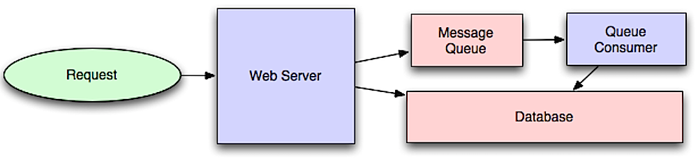

# Asynchronism

**Source:** *Intro to architecting systems for scale* — lethain.com. GitHub sử dụng asynchronous workflows như một cơ chế để giảm thời gian request đối với các operation tốn thời gian nếu thực hiện trực tiếp trong request path, đồng thời cho phép thực hiện trước các công việc tốn thời gian như periodic aggregation. ([GitHub][1])

## 1. Khái niệm

**Asynchronism** là mô hình trong đó request của client **không cần chờ toàn bộ công việc hoàn thành** trước khi server trả response.

Trong synchronous workflow:

```text
Client
  |
  | Request
  v
Application
  |
  | Expensive operation
  v
Database / External service
  |
  | Result
  v
Application
  |
  | Response
  v
Client
```



Thời gian response có thể được biểu diễn gần đúng:

$$
T_{sync}
=
T_{request}
+
T_{processing}
+
T_{dependency}
+
T_{response}
$$

Nếu $T_{dependency}$ hoặc $T_{processing}$ lớn, latency mà client quan sát được cũng lớn.

Với asynchronous workflow, expensive operation được tách khỏi request path:

```text
Client
  |
  | Request
  v
Application
  |
  | Enqueue Job
  v
Message Queue
  |
  | ACK / Job ID
  v
Application
  |
  | Response
  v
Client


             Background
                 |
                 v
              Worker
                 |
                 v
        Expensive Operation
                 |
                 v
              Storage
```

Khi đó:

$$
T_{request}
\approx
T_{enqueue}
+
T_{response}
$$

Trong khi phần xử lý thực tế diễn ra sau:

$$
T_{background}
=
T_{queue}
+
T_{processing}
+
T_{storage}
$$

Điểm quan trọng là **asynchronism không làm cho computation nhanh hơn về bản chất**. Nó chủ yếu **loại computation đó khỏi critical path của user request**.

---

### Message queues

Tác giả định nghĩa message queue là thành phần **nhận, lưu giữ và phân phối message**. Khi một operation quá chậm để thực hiện inline, application đưa job vào queue và worker xử lý job ở background. ([GitHub][1])

## 2. Kiến trúc cơ bản

```text
                    Synchronous
                -------------------
               |                   |
Client ------> Application ------> DB
                  |
                  | slow operation
                  v
               Response
```

Thay bằng:

```text
                         Asynchronous
                    -----------------------

Client
  |
  | Request
  v
Application
  |
  | 1. Create job
  | 2. Publish message
  v
+----------------+
| Message Queue  |
+----------------+
        |
        | 3. Consume
        v
+----------------+
|     Worker     |
+----------------+
        |
        | 4. Process
        v
+----------------+
| DB / Service   |
+----------------+
        |
        | 5. Complete
        v
     Result
```

Có thể xem queue là **buffer giữa producer và consumer**.

* **Producer**: tạo message/job.
* **Queue**: lưu message đang chờ xử lý.
* **Consumer/Worker**: lấy message và xử lý.
* **Backend**: database, API, filesystem hoặc service khác.

---

## 3. Workflow của Message Queue

Theo cấu trúc trong GitHub, workflow cơ bản gồm hai bước:

1. Application publish job vào queue và thông báo trạng thái cho user.
2. Worker lấy job, xử lý rồi signal rằng job đã hoàn thành. ([GitHub][1])

Có thể mô hình hóa:

$$
Producer
\rightarrow
Queue
\rightarrow
Consumer
$$

Ví dụ với chức năng upload video:

```text
POST /videos
      |
      v
API Server
      |
      | Store metadata
      |
      | Publish EncodeVideoJob
      v
Message Queue
      |
      | HTTP 202 Accepted
      v
Client


Message Queue
      |
      v
Video Worker
      |
      +----> Download video
      |
      +----> Encode
      |
      +----> Generate thumbnail
      |
      +----> Update database
```

Client không cần giữ HTTP connection trong toàn bộ quá trình encoding.

Thay vì:

```text
POST /video
       |
       |--------------------------|
       |       Encoding           |
       |--------------------------|
       |
     200 OK
```

ta có:

```text
POST /video
       |
       | enqueue
       v
   202 Accepted
       |
       v
 background processing
       |
       v
   job completed
```

---

## 4. Tại sao Message Queue giúp hệ thống scale?

Giả sử application nhận request với tốc độ:

$$
\lambda = 1000 \ jobs/s
$$

nhưng một worker chỉ xử lý được:

$$
\mu = 200 \ jobs/s
$$

Nếu không có queue, application phải xử lý trực tiếp và rất nhanh chóng bị quá tải.

Queue tạo ra một **buffer**:

```text
Producer
   |
   | 1000 jobs/s
   v
+------------------+
|      QUEUE       |
|  800 jobs/s      |
|  accumulated     |
+------------------+
   |
   | 200 jobs/s
   v
Workers
```

Có thể scale worker:

$$
N_{workers}
\approx
\frac{\lambda}{\mu}
$$

Trong ví dụ:

$$
N_{workers}
\approx
\frac{1000}{200}
=
5
$$

Do đó có thể triển khai khoảng 5 worker để đạt throughput tương đương producer:

$$
\mu_{total}
=
N \times \mu
$$

Tuy nhiên, đây chỉ là mô hình lý tưởng; thực tế còn phụ thuộc CPU, I/O, concurrency, network, database và overhead.

---

## 5. Queue như một lớp decoupling

Một lợi ích quan trọng hơn của queue là **decoupling**.

Không có queue:

```text
Application
     |
     +------> Service A
     |
     +------> Service B
     |
     +------> Service C
```

Application phải biết service nào xử lý công việc.

Có queue:

```text
Application
     |
     v
   Queue
     |
     +------> Worker A
     +------> Worker B
     +------> Worker C
```

Producer và consumer không cần hoạt động cùng tốc độ.

Điều này tạo ra **temporal decoupling**:

$$
Rate_{producer}
\neq
Rate_{consumer}
$$

Queue hấp thụ sự khác biệt này trong một khoảng thời gian.

---

## 6. Ví dụ: Twitter-like system

GitHub sử dụng ví dụ đăng tweet: tweet có thể xuất hiện ngay trên timeline của người dùng, trong khi việc phân phối tweet tới toàn bộ followers có thể xảy ra sau đó. ([GitHub][1])

Một kiến trúc đơn giản:

```text
User
 |
 | POST /tweet
 v
Tweet Service
 |
 +----> Tweet DB
 |
 +----> Fanout Queue
             |
             v
       Fanout Workers
        /     |      \
       /      |       \
Follower A  Follower B  Follower C
```

Request chỉ cần hoàn thành:

$$
CreateTweet
\rightarrow
Persist
\rightarrow
EnqueueFanoutJob
\rightarrow
Response
$$

Còn:

$$
FanoutTweet
\rightarrow
Millions\ of\ followers
$$

được xử lý bất đồng bộ.

Đây chính là lý do asynchronous architecture đặc biệt hữu ích trong các hệ thống có **fan-out lớn**.

---

## 7. Message delivery semantics

Khi thiết kế queue thực tế, không chỉ hỏi:

> "Message có được gửi không?"

mà cần hỏi:

> "Message được đảm bảo xử lý như thế nào?"

Ba mô hình phổ biến:

### At-most-once

Message có thể bị mất nhưng không được xử lý nhiều lần.

$$
P(duplicate) \approx 0
$$

nhưng:

$$
P(loss) \gt 0
$$

### At-least-once

Message có thể được gửi lại:

$$
P(loss) \approx 0
$$

nhưng:

$$
P(duplicate) \gt 0
$$

Vì vậy consumer nên **idempotent**.

Ví dụ:

```text
process_payment(payment_id)
```

thay vì:

```text
charge_credit_card()
```

có thể kiểm tra:

```text
if payment_id already processed:
    return
else:
    process payment
```

### Exactly-once

Mục tiêu:

$$
\text{Process(message)} = 1
$$

trên toàn bộ distributed system.

Đây là mục tiêu khó hơn nhiều so với việc chỉ đảm bảo message delivery. Trong thực tế, nhiều hệ thống sử dụng **at-least-once delivery + idempotent consumer + deduplication** để đạt semantics gần với exactly-once ở mức nghiệp vụ.

---

## 8. Redis, RabbitMQ và Amazon SQS

Tác giả đưa ra ba ví dụ tiêu biểu. ([GitHub][1])

| Công nghệ  | Đặc điểm chính                     | Trade-off                                                                        |
| ---------- | ---------------------------------- | -------------------------------------------------------------------------------- |
| Redis      | Message broker đơn giản, rất nhanh | Cần cẩn thận về durability/message loss tùy cấu hình và cơ chế sử dụng           |
| RabbitMQ   | Message broker phổ biến, AMQP      | Cần vận hành broker/infrastructure                                               |
| Amazon SQS | Managed queue                      | Không phải tự quản lý server, nhưng latency/duplicate delivery cần được tính đến |

### Redis

[Redis](https://redis.io/?utm_source=chatgpt.com)

Redis phù hợp khi cần một in-memory data structure store có khả năng hỗ trợ messaging.

Điểm cần nhớ:

$$
Speed \uparrow
\quad \not\Rightarrow \quad
Durability \uparrow
$$

Không nên mặc định rằng mọi cơ chế queue dựa trên Redis đều có durability giống một dedicated durable messaging system.

---

### RabbitMQ

[RabbitMQ](https://www.rabbitmq.com/?utm_source=chatgpt.com)

RabbitMQ là message broker hỗ trợ AMQP và nhiều messaging patterns.

Kiến trúc điển hình:

```text
Producer
   |
   v
Exchange
   |
   | routing
   v
Queue
   |
   v
Consumer
```

Điểm quan trọng là **exchange** có thể quyết định message được route tới queue nào.

---

### Amazon SQS

[Amazon SQS](https://aws.amazon.com/sqs/?utm_source=chatgpt.com)

SQS là managed queue service.

Ưu điểm lớn:

```text
Application
      |
      v
Amazon SQS
      |
      v
Workers
```

Developer không cần tự vận hành message broker cluster.

Tuy nhiên, như GitHub lưu ý, message có khả năng được deliver nhiều lần, vì vậy application cần được thiết kế phù hợp với duplicate processing. ([GitHub][1])

---

## Task queues

Tác giả phân biệt **task queue** ở mức abstraction cao hơn: task queue nhận task cùng dữ liệu liên quan, thực thi task và trả kết quả; nó cũng hỗ trợ scheduling và computationally-intensive jobs chạy background. Celery được GitHub đưa ra như một ví dụ hỗ trợ scheduling và chủ yếu dùng trong Python. ([GitHub][1])

[Celery Documentation](https://docs.celeryproject.org/en/stable/?utm_source=chatgpt.com)

## 9. Message Queue vs Task Queue

Có thể phân biệt về mặt khái niệm:

### Message queue

Quan tâm chủ yếu đến:

$$
Message\ delivery
$$

Ví dụ:

```text
"User 123 uploaded image.jpg"
```

### Task queue

Quan tâm đến:

$$
Task = Function + Arguments + Execution
$$

Ví dụ:

```text
resize_image(
    image_id=123,
    width=800,
    height=600
)
```

Task queue thường cung cấp abstraction để:

* enqueue task;
* execute task;
* retry;
* schedule;
* track state;
* return result.

Do đó:

```text
Message Queue
       |
       v
"event/message"
```

trong khi:

```text
Task Queue
       |
       v
"execute this operation"
```

Đây là **khác biệt về abstraction**, không phải hai công nghệ hoàn toàn tách biệt. Một task queue thường cần một messaging/broker layer phía dưới.

---

## 10. Task queue cho background computation

Ví dụ hệ thống ML:

```text
Client
   |
   | POST /train
   v
API Server
   |
   | Create training job
   v
Task Queue
   |
   +------------------+
   |                  |
   v                  v
GPU Worker 1      GPU Worker 2
   |                  |
   v                  v
Training          Training
   |                  |
   +--------+---------+
            |
            v
       Artifact Store
```

Request không nên giữ connection:

```text
POST /train
       |
       | 30 minutes
       |
       X
```

Thay vào đó:

```text
POST /train
       |
       v
job_id = 123
       |
       v
202 Accepted
```

Client có thể:

```text
GET /jobs/123
```

để kiểm tra:

```json
{
  "status": "running",
  "progress": 0.63
}
```

---

## Back pressure

Đây là phần quan trọng nhất về mặt **stability**.

Tác giả lưu ý rằng nếu queue tăng quá lớn, queue có thể vượt quá memory, gây cache miss, disk read và khiến performance tiếp tục giảm. Back pressure giới hạn kích thước queue để duy trì throughput và response time; khi queue đầy, client có thể nhận `HTTP 503` và retry với exponential backoff. ([GitHub][1])

## 11. Vấn đề: Producer nhanh hơn Consumer

Giả sử:

$$
\lambda = 1000\ jobs/s
$$

nhưng:

$$
\mu = 500\ jobs/s
$$

Khi đó:

$$
\lambda \gt \mu
$$

Queue sẽ tăng liên tục.

Nếu:

$$
Q(t)
$$

là queue length, một mô hình đơn giản:

$$
\frac{dQ}{dt}
=
\lambda-\mu
$$

Nếu:

$$
\lambda \gt \mu
$$

thì:

$$
\frac{dQ}{dt} \gt 0
$$

và queue tiếp tục tăng.

Ví dụ:

```text
Producer: 1000 jobs/s
Consumer: 500 jobs/s

Queue:
  t0       0
  t1     500
  t2    1000
  t3    1500
  t4    2000
  ...
```

Đây không phải scaling thành công.

Đó chỉ là **đẩy vấn đề từ application server sang queue**.

---

## 12. Back pressure là gì?

**Back pressure** là cơ chế để consumer/downstream system truyền tín hiệu ngược trở lại producer rằng hệ thống đang gần hoặc đã đạt giới hạn xử lý.

```text
             normal
Producer -----------------> Consumer


             overloaded
Producer -----> Queue -----> Consumer
                  ^
                  |
              Back pressure
                  |
                  |
              slow/reject
```

Mục tiêu:

$$
Bounded\ Queue
$$

thay vì:

$$
Unbounded\ Queue
$$

Queue nên có giới hạn:

$$
0 \le Q(t) \le Q_{max}
$$

Khi:

$$
Q(t) \ge Q_{max}
$$

hệ thống có thể:

```text
Reject
Delay
Throttle
Retry
Drop low-priority work
```

---

## 13. HTTP 503 và Retry

GitHub đề cập đến `HTTP 503` khi queue đầy. ([GitHub][1])

`503 Service Unavailable` truyền tải ý nghĩa:

> Server hiện tại chưa thể xử lý request, client nên thử lại sau.

Thay vì:

```text
Client
  |
  | 1000 requests
  v
Server
  |
  X overload
```

ta có:

```text
Client
  |
  v
Server
  |
  | queue full
  v
503
  |
  v
Retry later
```

---

## 14. Exponential Backoff

Retry không nên thực hiện liên tục:

```text
retry
retry
retry
retry
retry
```

vì nó có thể tạo **retry storm**.

Thay vào đó, delay tăng dần:

$$
t_n = \min(t_{max},t_0 2^n)
$$

Ví dụ:

```text
Attempt 1 -> wait 1s
Attempt 2 -> wait 2s
Attempt 3 -> wait 4s
Attempt 4 -> wait 8s
Attempt 5 -> wait 16s
```

Thực tế thường thêm **jitter**:

$$
t_n =
\min(t_{max}, t_0 2^n)
+
U(0,j)
$$

để nhiều client không retry cùng một thời điểm.

[Exponential Backoff — Wikipedia](https://en.wikipedia.org/wiki/Exponential_backoff?utm_source=chatgpt.com)

---

## 15. Little's Law

Một nền tảng lý thuyết quan trọng khi phân tích queue là **Little's Law**.

[Little's Law](https://en.wikipedia.org/wiki/Little%27s_law?utm_source=chatgpt.com)

Công thức:

$$
L = \lambda W
$$

Trong đó:

* $L$: số lượng item trung bình trong system;
* $\lambda$: arrival rate;
* $W$: thời gian trung bình một item ở trong system.

Suy ra:

$$
W = \frac{L}{\lambda}
$$

Ví dụ:

$$
\lambda = 1000\ jobs/s
$$

và queue/system chứa trung bình:

$$
L=5000\ jobs
$$

thì:

$$
W =
\frac{5000}{1000}
=
5s
$$

Điều này cho thấy một insight quan trọng:

> **Queue length và latency có quan hệ trực tiếp.**

Nếu queue tăng nhưng throughput không tăng tương ứng:

$$
L \uparrow
\Rightarrow
W \uparrow
$$

Do đó queue không chỉ là vấn đề memory; nó còn là **latency indicator**.

---

## 16. Queue Stability

Điều kiện cơ bản để queue ổn định trong dài hạn là:

$$
\lambda < \mu
$$

hoặc nếu có $N$ workers:

$$
\lambda < N\mu
$$

Trong đó:

* $\lambda$: arrival rate;
* $\mu$: service rate của một worker;
* $N$: số worker.

Nếu:

$$
\lambda \ge N\mu
$$

queue sẽ có xu hướng tăng.

Do đó autoscaling worker có thể sử dụng queue depth làm một signal:

```text
Queue depth ↑
      |
      v
Scale workers ↑
      |
      v
Processing capacity ↑
      |
      v
Queue depth ↓
```

Nhưng autoscaling cũng có giới hạn: nếu downstream database chỉ chịu được $X$ requests/s thì tăng worker vô hạn chỉ chuyển bottleneck sang database.

---

## 17. Back Pressure và Bulkhead

Một hệ thống lớn có thể có nhiều loại task:

```text
Queue
├── Critical jobs
├── Normal jobs
└── Low priority jobs
```

Nếu một loại task chiếm toàn bộ worker:

```text
Image Processing
      |
      v
All workers busy
      |
      X
Email / Payment / Notification
```

có thể áp dụng **resource isolation**:

```text
Critical Queue
      |
      v
Critical Workers


Batch Queue
      |
      v
Batch Workers
```

Như vậy một workload không dễ dàng làm sập toàn bộ hệ thống.

Đây là tư duy quan trọng khi chuyển từ **asynchronous processing** sang **resilient distributed architecture**.

---

## Disadvantage(s): asynchronism

Tác giả nhấn mạnh rằng các operation đơn giản hoặc realtime workflow có thể phù hợp hơn với synchronous processing, bởi queue tạo thêm delay và complexity. ([GitHub][1])

## 18. Latency không biến mất

Asynchronism làm giảm:

$$
User\ waiting\ time
$$

nhưng không nhất thiết giảm:

$$
Total\ processing\ time
$$

Ví dụ:

```text
Sync:

Request ------------------------------> Response
        10 seconds


Async:

Request --> Queue --> Response
                         |
                         +---- background: 10 seconds
```

User chỉ phải chờ vài milliseconds hoặc seconds để nhận acknowledgement, nhưng job vẫn cần thời gian xử lý.

---

## 19. Eventual consistency

Sau khi request thành công:

```text
POST /tweet
     |
     v
200/202
```

không có nghĩa mọi downstream system đã cập nhật.

Có thể xảy ra:

```text
Tweet DB       = updated
Timeline DB    = updated later
Search Index   = updated later
Notification   = updated later
Analytics      = updated later
```

Do đó:

$$
State_{system}(t_0)
\neq
State_{system}(t_1)
$$

trong một khoảng thời gian.

Đây là **eventual consistency**.

---

## 20. Failure handling phức tạp hơn

Trong synchronous system:

```text
Request
  |
  v
Operation
  |
  +---- success
  |
  +---- failure
```

Trong asynchronous system:

```text
Request
 |
 v
Enqueue
 |
 v
Queue
 |
 +---- message lost?
 |
 +---- duplicate?
 |
 +---- delayed?
 |
 +---- worker crash?
 |
 +---- retry?
 |
 +---- poison message?
 |
 v
Worker
 |
 +---- DB success
 |
 +---- DB failure
```

Vì vậy production system thường cần:

* retry;
* dead-letter queue;
* idempotency;
* timeout;
* visibility timeout;
* monitoring;
* queue depth metrics;
* failure handling;
* job status;
* correlation ID.

---

## 21. Message Queue vs Task Queue vs Back Pressure

Có thể tổng hợp ba khái niệm chính của GitHub:

| Thành phần        | Câu hỏi chính                    | Vai trò                      |
| ----------------- | -------------------------------- | ---------------------------- |
| **Message Queue** | Message được truyền thế nào?     | Buffer + decoupling          |
| **Task Queue**    | Công việc nào cần được thực thi? | Background execution         |
| **Back Pressure** | Làm gì khi hệ thống quá tải?     | Stability + overload control |

Quan hệ:

```text
                 ASYNCHRONISM
                      |
          +-----------+-----------+
          |                       |
    Message Queue            Task Queue
          |                       |
          |                  Background job
          |                       |
          +-----------+-----------+
                      |
                      v
                Back Pressure
                      |
                      v
               Overload control
```

---

## 22. Synchronous vs Asynchronous

| Đặc điểm                | Synchronous      | Asynchronous                    |
| ----------------------- | ---------------- | ------------------------------- |
| Request                 | Chờ kết quả      | Có thể nhận acknowledgement sớm |
| Latency user            | Có thể cao       | Thường thấp hơn                 |
| Complexity              | Thấp hơn         | Cao hơn                         |
| Consistency             | Dễ kiểm soát hơn | Có thể eventual                 |
| Retry                   | Đơn giản hơn     | Phức tạp hơn                    |
| Scaling background work | Hạn chế          | Tốt                             |
| Long-running task       | Không phù hợp    | Phù hợp                         |
| Realtime response       | Phù hợp          | Có thể không phù hợp            |
| Failure handling        | Đơn giản hơn     | Cần queue semantics             |
| Resource isolation      | Hạn chế          | Tốt hơn                         |

---

## 23. Khi nào nên sử dụng Asynchronism?

Một operation thường phù hợp với asynchronous processing khi:

$$
T_{operation} \gg T_{acceptable\ request}
$$

hoặc khi operation:

* computationally expensive;
* I/O intensive;
* có thể xử lý sau;
* không cần kết quả ngay;
* có workload biến động;
* có thể retry;
* cần scale worker độc lập;
* cần scheduling;
* có fan-out lớn.

Ví dụ:

```text
Video encoding
Image processing
Email sending
Push notifications
Report generation
Data aggregation
Log processing
Search indexing
ML inference batch
ML training
Recommendation generation
Analytics
```

---

## 24. Khi nào KHÔNG nên sử dụng?

Không nên đưa queue vào mọi request.

Ví dụ:

```text
GET /user/profile
```

Nếu operation chỉ mất:

$$
T = 5ms
$$

nhưng thêm queue:

$$
T =
T_{enqueue}
+
T_{queue}
+
T_{worker}
+
T_{result}
$$

thì queue có thể làm hệ thống **chậm và phức tạp hơn**.

Đặc biệt với:

* synchronous validation;
* simple CRUD;
* authentication;
* realtime interaction;
* operations cần kết quả ngay;
* operations rất rẻ.

Nguyên tắc:

$$
Benefit_{async}
>
Cost_{complexity}
$$

thì mới nên asynchronous.

---

## 25. Kiến trúc hoàn chỉnh

Một asynchronous system production-grade có thể được mô hình hóa:

```text
                         +----------------+
                         |     Client     |
                         +-------+--------+
                                 |
                                 v
                         +---------------+
                         | API / Gateway |
                         +-------+-------+
                                 |
                       +---------+---------+
                       |                   |
                       v                   v
                Synchronous           Message Queue
                  work                    |
                                           v
                                  +----------------+
                                  |    Workers     |
                                  +-------+--------+
                                          |
                         +----------------+----------------+
                         |                |                |
                         v                v                v
                       DB             Cache          External API
                         |
                         v
                   Object Storage


              Monitoring / Metrics
                       |
                       v
              Queue depth / latency
              worker utilization
              failure rate / retry
```

Đây chính là cách **Asynchronism kết nối với các thành phần khác của System Design Primer**: application layer cung cấp workers để enable asynchronous processing; cache cũng có thể sử dụng worker để xử lý dữ liệu bất đồng bộ. ([GitHub][1])

---

## 26. Cốt lõi cần ghi nhớ

Có thể cô đọng toàn bộ phần **Asynchronism** thành chuỗi:

$$
Expensive\ Operation
\rightarrow
Queue
\rightarrow
Background\ Worker
$$

Sau đó:

$$
Producer\ Rate
\neq
Consumer\ Rate
$$

nên cần:

$$
Queue = Buffer
$$

Nhưng nếu:

$$
\lambda > \mu
$$

thì:

$$
Queue\ Length \uparrow
$$

và theo Little's Law:

$$
L=\lambda W
$$

suy ra:

$$
Queue\ Length \uparrow
\Rightarrow
Waiting\ Time \uparrow
\Rightarrow
Latency \uparrow
$$

Do đó cần:

$$
Back\ Pressure
\rightarrow
Bounded\ Queue
\rightarrow
Controlled\ Load
$$

Cuối cùng:

$$
\boxed{
Asynchronism
=
Decoupling
+
Background\ Processing
+
Load\ Buffering
}
$$

nhưng:

$$
\boxed{
Asynchronism
\neq
Free\ Performance
}
$$

Nó đánh đổi **request latency thấp hơn** lấy **architectural complexity, eventual consistency và failure-handling complexity**.

---

## Source(s) and further reading

Các nguồn dưới đây tương ứng với phần **Source(s) and further reading** của GitHub; repository hiện vẫn giữ ba mục chính **Message queues, Task queues, Back pressure** trong mục Asynchronism. ([GitHub][2])

* [System Design Primer — Asynchronism](https://github.com/donnemartin/system-design-primer?utm_source=chatgpt.com#asynchronism)
* [Intro to architecting systems for scale — lethain.com](https://lethain.com/introduction-to-architecting-systems-for-scale/?utm_source=chatgpt.com)
* [Applying back pressure when overloaded](http://mechanical-sympathy.blogspot.com/2012/05/apply-back-pressure-when-overloaded.html?utm_source=chatgpt.com)
* [Little's Law](https://en.wikipedia.org/wiki/Little%27s_law?utm_source=chatgpt.com)
* [Exponential Backoff](https://en.wikipedia.org/wiki/Exponential_backoff?utm_source=chatgpt.com)
* [Redis](https://redis.io/?utm_source=chatgpt.com)
* [RabbitMQ](https://www.rabbitmq.com/?utm_source=chatgpt.com)
* [Amazon SQS](https://aws.amazon.com/sqs/?utm_source=chatgpt.com)
* [Celery Documentation](https://docs.celeryproject.org/en/stable/?utm_source=chatgpt.com)

[1]: https://github.com/donnemartin/system-design-primer "GitHub - donnemartin/system-design-primer: Learn how to design large-scale systems. Prep for the system design interview. Includes Anki flashcards. · GitHub"
[2]: https://github.com/donnemartin/system-design-primer?utm_source=chatgpt.com "GitHub - donnemartin/system-design-primer: Learn how to design large-scale systems. Prep for the system design interview. Includes Anki flashcards. · GitHub"
