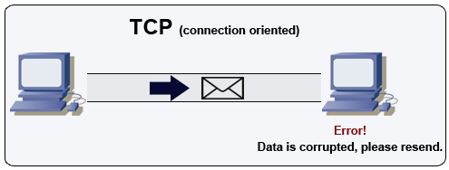
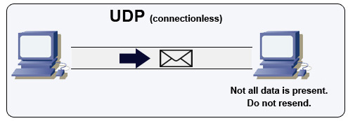
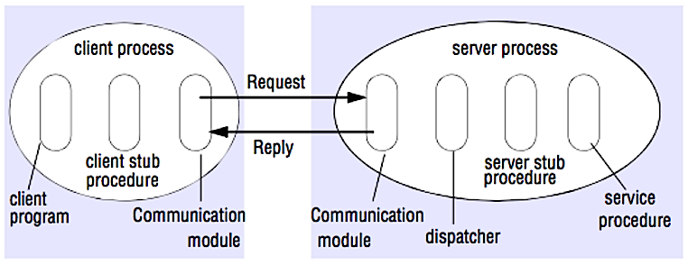

# Communication


Trong System Design, **Communication** mô tả cách các thành phần trong hệ thống trao đổi dữ liệu với nhau. Một hệ thống phân tán không chỉ cần các thành phần như database, cache, load balancer hay application server, mà còn phải xác định:

* Dữ liệu được truyền như thế nào?
* Giao tiếp có cần đảm bảo độ tin cậy tuyệt đối hay không?
* Có cần duy trì connection hay không?
* Độ trễ quan trọng đến mức nào?
* Client giao tiếp với server bằng mô hình nào?
* Các service nội bộ giao tiếp với nhau bằng mô hình nào?

Trong `System Design Primer`, phần Communication tập trung vào:

1. **Hypertext Transfer Protocol (HTTP)**
2. **Transmission Control Protocol (TCP)**
3. **User Datagram Protocol (UDP)**
4. **Remote Procedure Call (RPC)**
5. **Representational State Transfer (REST)**

> **Core idea:** Communication protocol là một trade-off giữa **reliability, latency, throughput, coupling, simplicity và scalability**.

---

## Hypertext Transfer Protocol (HTTP)

[svg](https://github.com/donnemartin/system-design-primer#hypertext-transfer-protocol-http)

HTTP là một giao thức dùng để **encoding và transporting data giữa client và server**.

Mô hình cơ bản của HTTP là:

$$
Client \rightarrow Request \rightarrow Server
$$

và:

$$
Server \rightarrow Response \rightarrow Client
$$

Do đó HTTP được gọi là **request/response protocol**.

Một request có thể đi qua nhiều intermediate components:

$$
Client
\rightarrow
Load\ Balancer
\rightarrow
Reverse\ Proxy
\rightarrow
Web\ Server
\rightarrow
Application\ Server
\rightarrow
Database
$$

Các intermediate components này có thể thực hiện:

* load balancing
* caching
* encryption
* compression
* routing

Điểm quan trọng là HTTP không nhất thiết phải giao tiếp trực tiếp giữa client và application server.

### HTTP request

Một HTTP request cơ bản gồm:

$$
Request = Method + Endpoint + Headers + Body
$$

Trong đó:

* **Method** xác định operation.
* **Endpoint** xác định resource.
* **Headers** chứa metadata.
* **Body** chứa payload nếu cần.

Các HTTP methods phổ biến:

| Verb     | Description                              | Idempotent | Safe |   Cacheable |
| -------- | ---------------------------------------- | ---------: | ---: | ----------: |
| `GET`    | Reads a resource                         |        Yes |  Yes |         Yes |
| `POST`   | Creates a resource or triggers a process |         No |   No | Conditional |
| `PUT`    | Creates or replaces a resource           |        Yes |   No |          No |
| `PATCH`  | Partially updates a resource             |         No |   No | Conditional |
| `DELETE` | Deletes a resource                       |        Yes |   No |          No |

### Idempotency

Một operation là **idempotent** nếu gọi nhiều lần với cùng input vẫn tạo ra cùng trạng thái cuối cùng.

Ví dụ:

$$
PUT\ /users/123
$$

với cùng payload có thể được gọi nhiều lần mà trạng thái cuối cùng của resource vẫn giống nhau.

Trong khi đó:

$$
POST\ /orders
$$

có thể tạo một order mới mỗi lần request được gửi.

Đây là một property rất quan trọng trong distributed systems vì request có thể bị timeout nhưng server vẫn đã xử lý thành công.

Ví dụ:

$$
Client \rightarrow Server
$$

Server xử lý thành công nhưng response bị mất:

$$
Server \rightarrow X
$$

Client không biết request đã thành công hay chưa và retry.

Nếu operation idempotent, retry thường an toàn hơn.

### HTTP và tầng mạng

HTTP thuộc **application layer** và dựa trên các protocol tầng thấp hơn như TCP hoặc UDP.

Có thể hình dung:

$$
HTTP
\rightarrow
TCP/UDP
\rightarrow
IP
\rightarrow
Network
$$

Do đó cần phân biệt:

> HTTP quyết định **cách ứng dụng biểu diễn và trao đổi request/response**, trong khi TCP/UDP quyết định **cách dữ liệu được vận chuyển trên network**.

---

### Source(s) and further reading: HTTP

* [What is HTTP?](https://www.nginx.com/resources/glossary/http/)
* [Difference between HTTP and TCP](https://www.quora.com/What-is-the-difference-between-HTTP-protocol-and-TCP-protocol)
* [Difference between PUT and PATCH](https://laracasts.com/discuss/channels/general-discussion/whats-the-differences-between-put-and-patch?page=1)

---

# Transmission Control Protocol (TCP)



TCP là một **connection-oriented transport protocol** hoạt động trên IP network.

Khác với HTTP, TCP không quan tâm trực tiếp đến resource hay API. TCP tập trung vào việc:

> Làm thế nào để truyền một stream of bytes đáng tin cậy giữa hai endpoints.

---

## TCP connection

Một TCP connection được thiết lập thông qua handshake.

Khái niệm đơn giản:

$$
Client
\rightarrow
Connection\ Establishment
\rightarrow
Server
$$

Sau khi connection được thiết lập, hai bên có thể truyền dữ liệu.

TCP cung cấp các cơ chế đảm bảo:

* packets được truyền đúng thứ tự;
* phát hiện lỗi;
* acknowledgement;
* retransmission;
* flow control;
* congestion control.

### Sequence numbers

Mỗi segment có sequence information để receiver có thể xác định:

$$
Packet_1,\ Packet_2,\ Packet_3,\ldots
$$

Nếu packet đến sai thứ tự:

$$
Packet_1,\ Packet_3,\ Packet_2
$$

TCP có thể sắp xếp lại dữ liệu trước khi đưa lên application layer.

### Acknowledgement

Receiver gửi acknowledgement để xác nhận dữ liệu đã nhận.

Nếu sender không nhận được acknowledgement thích hợp, TCP có thể retransmit dữ liệu.

Mô hình:

$$
Sender
\xrightarrow{Data}
Receiver
$$

$$
Receiver
\xrightarrow{ACK}
Sender
$$

Nếu ACK không đến:

$$
Timeout
\Rightarrow
Retransmission
$$

### Flow control

Flow control bảo vệ receiver khỏi việc sender gửi dữ liệu nhanh hơn khả năng xử lý.

Có thể hình dung:

$$
Sender\ Rate \leq Receiver\ Capacity
$$

### Congestion control

Congestion control xử lý tình trạng network bị quá tải.

Điều này tạo ra trade-off:

$$
Reliability + Control
\Rightarrow
More\ Overhead
\Rightarrow
Potentially\ Higher\ Latency
$$

Do đó TCP thường hiệu quả cho các workload cần reliability cao nhưng không yêu cầu latency thấp nhất có thể.

---

## TCP connection pooling

Một web server có thể phải duy trì nhiều TCP connections.

Ví dụ:

$$
Web\ Server
\rightarrow
Database
$$

Nếu mỗi request đều tạo connection mới:

$$
Request
\rightarrow
Connect
\rightarrow
Query
\rightarrow
Close
$$

chi phí connection establishment có thể lớn.

Connection pooling cho phép:

$$
Connection\ Pool
=
\{C_1,C_2,\ldots,C_n\}
$$

Các request có thể tái sử dụng các connection có sẵn.

Điều này đặc biệt quan trọng trong hệ thống có lượng request lớn.

---

## Khi nào sử dụng TCP?

GitHub System Design Primer đưa ra hai tiêu chí chính:

* Cần **tất cả dữ liệu đến nơi nguyên vẹn**.
* Muốn TCP tự động tận dụng network throughput ở mức phù hợp.

Các workload điển hình:

* Web servers
* Database communication
* SMTP
* FTP
* SSH

---

# User Datagram Protocol (UDP)



UDP là một **connectionless transport protocol**.

Khác với TCP:

$$
TCP = Connection\ Oriented
$$

trong khi:

$$
UDP = Connectionless
$$

UDP gửi datagram mà không cung cấp các guarantee giống TCP.

Một datagram có thể:

* đến nơi;
* đến sai thứ tự;
* không đến nơi.

UDP không cung cấp congestion control giống TCP.

---

## TCP vs UDP: bản chất trade-off

Có thể biểu diễn đơn giản:

$$
TCP
\Rightarrow
Reliability \uparrow
$$

nhưng:

$$
Reliability\ mechanisms
\Rightarrow
Overhead \uparrow
$$

Trong khi:

$$
UDP
\Rightarrow
Overhead \downarrow
\Rightarrow
Latency\ potential \downarrow
$$

nhưng:

$$
Reliability\ guarantee \downarrow
$$

Do đó UDP thường phù hợp với real-time workloads.

Ví dụ:

* VoIP
* Video chat
* Streaming
* Real-time multiplayer games

---

## Tại sao mất dữ liệu đôi khi tốt hơn chờ dữ liệu?

Đây là một trong những insight quan trọng nhất của TCP vs UDP.

Giả sử một video stream có các frame:

$$
F_1,F_2,F_3,F_4,F_5
$$

Nếu $F_3$ bị mất.

TCP có xu hướng đảm bảo dữ liệu được retransmit:

$$
F_1 \rightarrow F_2 \rightarrow F_3 \rightarrow F_4 \rightarrow F_5
$$

Nhưng application có thể phải chờ $F_3$.

Trong real-time streaming, việc chờ frame cũ có thể gây:

* latency;
* stuttering;
* delay.

Một số ứng dụng thích:

$$
F_1 \rightarrow F_2 \rightarrow X \rightarrow F_4 \rightarrow F_5
$$

hơn là:

$$
F_1 \rightarrow F_2 \rightarrow Wait \rightarrow F_3 \rightarrow F_4
$$

Do đó:

> **Late data can be worse than lost data.**

---

## Khi nào sử dụng UDP?

Sử dụng UDP khi:

* cần latency thấp nhất;
* dữ liệu cũ mất giá trị nhanh;
* application muốn tự implement error correction.

Có thể biểu diễn:

$$
If\ Latency > Loss
\Rightarrow
Consider\ UDP
$$

---

## TCP vs UDP

| Property           | TCP                 | UDP                    |
| ------------------ | ------------------- | ---------------------- |
| Connection         | Connection-oriented | Connectionless         |
| Reliability        | High                | Low                    |
| Ordering           | Guaranteed          | Not guaranteed         |
| Retransmission     | Yes                 | No                     |
| Flow control       | Yes                 | No                     |
| Congestion control | Yes                 | No                     |
| Overhead           | Higher              | Lower                  |
| Latency            | Generally higher    | Generally lower        |
| Typical use        | Web, DB, SSH        | VoIP, streaming, games |

> Không nên hiểu rằng **TCP luôn chậm** và **UDP luôn nhanh**. Trade-off thực tế phụ thuộc workload, network condition và application-level requirements.

---

### Source(s) and further reading: TCP and UDP

* [Networking for game programming](https://gafferongames.com/post/udp_vs_tcp/)
* [Key differences between TCP and UDP protocols](http://www.cyberciti.biz/faq/key-differences-between-tcp-and-udp-protocols/)
* [Difference between TCP and UDP](http://stackoverflow.com/questions/5970383/difference-between-tcp-and-udp)
* [Transmission Control Protocol](https://en.wikipedia.org/wiki/Transmission_Control_Protocol)
* [User Datagram Protocol](https://en.wikipedia.org/wiki/User_Datagram_Protocol)
* [Scaling memcache at Facebook](http://www.cs.bu.edu/~jappavoo/jappavoo.github.com/451/papers/memcache-fb.pdf)

---

# Remote Procedure Call (RPC)



RPC cho phép client gọi một procedure đang chạy ở một **remote address space**, thường là một server khác.

Ý tưởng quan trọng:

$$
Local\ Call
\approx
Remote\ Procedure\ Call
$$

về mặt programming model.

Ví dụ local call:

```text
userService.createUser(user)
```

RPC có thể làm cho client sử dụng một interface tương tự:

```text
userService.createUser(user)
```

nhưng thực tế phía sau là:

$$
Client
\rightarrow
Network
\rightarrow
Remote\ Server
$$

Do đó remote call có đặc tính khác local call:

$$
Remote\ Call
\neq
Local\ Call
$$

Remote call thường:

* chậm hơn;
* có thể thất bại;
* phụ thuộc network;
* có timeout;
* cần serialization/deserialization.

---

## RPC request flow

Một RPC request có thể được mô hình hóa:

$$
Client
\rightarrow
Client\ Stub
\rightarrow
Serialization
\rightarrow
Network
\rightarrow
Server\ Stub
\rightarrow
Server\ Procedure
$$

Response đi theo chiều ngược lại:

$$
Server\ Procedure
\rightarrow
Server\ Stub
\rightarrow
Network
\rightarrow
Client\ Stub
\rightarrow
Client
$$

Theo cấu trúc trong System Design Primer:

1. **Client program** gọi client stub.
2. **Client stub** marshal procedure ID và arguments.
3. **Client communication module** gửi message.
4. **Server communication module** nhận message.
5. **Server stub** unmarshal dữ liệu.
6. **Server procedure** được thực thi.
7. Response quay lại theo chiều ngược lại.

---

## Marshalling và Unmarshalling

Giả sử client có:

```text
createUser(name="Khanh", age=22)
```

Client cần biến arguments thành message:

$$
Arguments
\rightarrow
Serialization
\rightarrow
Bytes
$$

Server thực hiện:

$$
Bytes
\rightarrow
Deserialization
\rightarrow
Arguments
$$

Đây là quá trình:

* **Marshalling**: đóng gói dữ liệu.
* **Unmarshalling**: giải mã dữ liệu.

Một số công nghệ được GitHub đề cập:

* [Protocol Buffers](https://developers.google.com/protocol-buffers/)
* [Apache Thrift](https://thrift.apache.org/)
* [Apache Avro](https://avro.apache.org/docs/current/)

---

## RPC tập trung vào behavior

RPC thường expose **behavior/action**.

Ví dụ:

```text
createUser()
deleteUser()
getUser()
updateUser()
```

Tư duy ở đây là:

$$
Client
\rightarrow
"Execute\ this\ operation"
$$

Do đó RPC thường tự nhiên trong internal service-to-service communication.

Ví dụ:

$$
API\ Gateway
\rightarrow
User\ Service
\rightarrow
Payment\ Service
\rightarrow
Order\ Service
$$

Các service có thể gọi procedure của nhau.

---

## Ưu điểm của RPC

RPC phù hợp khi:

* các service nội bộ cần giao tiếp hiệu năng cao;
* interface giữa service được kiểm soát;
* client/server cùng kiểm soát protocol;
* muốn strongly defined contracts;
* cần serialization hiệu quả.

---

## Disadvantage(s): RPC

[svg](https://github.com/donnemartin/system-design-primer#disadvantages-rpc)

### 1. Tight coupling

RPC client có xu hướng phụ thuộc mạnh vào service implementation/interface.

$$
Client
\leftrightarrow
Service\ Contract
$$

Nếu contract thay đổi, client có thể cần thay đổi theo.

### 2. API explosion

Nếu mỗi operation cần một RPC endpoint riêng:

```text
createUser()
deleteUser()
updateUser()
archiveUser()
restoreUser()
...
```

số lượng API có thể tăng nhanh.

### 3. Debugging complexity

Request đi qua nhiều lớp:

$$
Client
\rightarrow
Stub
\rightarrow
Serialization
\rightarrow
Network
\rightarrow
Stub
\rightarrow
Server
$$

Do đó debugging khó hơn local function call.

### 4. Infrastructure integration

Một số infrastructure technologies như generic caching hoặc proxying có thể không hoạt động tự nhiên với RPC như với HTTP/REST.

---

# Representational State Transfer (REST)

[svg](https://github.com/donnemartin/system-design-primer#representational-state-transfer-rest)

REST là một **architectural style**, không phải một network transport protocol.

REST xây dựng communication xung quanh **resources**.

Ví dụ:

```text
/users
/users/123
/users/123/orders
```

Thay vì tư duy:

```text
createUser()
deleteUser()
getUser()
```

REST thường tư duy:

```text
/users
```

và HTTP verbs xác định operation.

---

## REST resource model

Giả sử có resource:

$$
User = \{id,name,email\}
$$

Resource có URI:

```text
/users/123
```

Các operation:

$$
GET\ /users/123
$$

đọc resource.

$$
PUT\ /users/123
$$

replace resource.

$$
DELETE\ /users/123
$$

xóa resource.

REST do đó tập trung vào:

$$
Resource + Representation + HTTP\ Methods
$$

---

## Four qualities of a RESTful interface

Theo System Design Primer, RESTful interface có bốn qualities chính.

### 1. Identify resources

Resource được xác định thông qua URI.

Ví dụ:

```text
/users/123
```

Không nên thay đổi URI chỉ vì operation thay đổi.

Operation được biểu diễn bằng HTTP method.

---

### 2. Change with representations

REST sử dụng:

* HTTP verbs;
* headers;
* body.

Ví dụ:

```http
PUT /users/123
```

```json
{
  "name": "Khanh"
}
```

---

### 3. Self-descriptive error messages

REST tận dụng HTTP status codes.

Ví dụ:

```text
200 OK
201 Created
400 Bad Request
401 Unauthorized
403 Forbidden
404 Not Found
500 Internal Server Error
```

Thay vì tự định nghĩa một error protocol hoàn toàn mới.

---

### 4. HATEOAS

**Hypermedia As The Engine Of Application State (HATEOAS)** cho phép representation chứa các link/action liên quan.

Ý tưởng:

$$
Resource
\rightarrow
Related\ Resources/Actions
$$

Điều này giúp client khám phá API thông qua representation.

---

## Statelessness

Một property quan trọng của REST là **stateless communication**.

Server không nên phụ thuộc vào session state được lưu trong memory của một server cụ thể để hiểu request tiếp theo.

Có thể biểu diễn:

$$
Request_n
\not\text{ depend directly on in-memory state of } Request_{n-1}
$$

Điều này hỗ trợ horizontal scaling.

Ví dụ có:

$$
Server_1,\ Server_2,\ Server_3
$$

Load balancer có thể route:

```text
Request 1 -> Server 1
Request 2 -> Server 3
Request 3 -> Server 2
```

mà không nhất thiết phải route tất cả request của một client vào cùng server.

Do đó:

$$
Statelessness
\rightarrow
Easier\ Horizontal\ Scaling
$$

và:

$$
Horizontal\ Scaling
\rightarrow
More\ Instances
$$

---

## REST tập trung vào data

Có thể phân biệt tư duy:

### RPC

$$
Client
\rightarrow
Execute\ Operation
$$

### REST

$$
Client
\rightarrow
Manipulate\ Resource
$$

Ví dụ RPC:

```http
POST /createUser
```

REST:

```http
POST /users
```

RPC:

```http
POST /deleteUser
{
  "userId": "123"
}
```

REST:

```http
DELETE /users/123
```

---

## Disadvantage(s): REST

### 1. Không phải mọi operation đều tự nhiên biểu diễn thành resource

Ví dụ:

```text
Return all records updated during the last hour
matching a complex set of events.
```

Có thể cần kết hợp:

```text
URI path
+
query parameters
+
request body
```

REST không phải lúc nào cũng là abstraction tự nhiên nhất.

### 2. Limited HTTP verbs

REST chủ yếu sử dụng:

```text
GET
POST
PUT
PATCH
DELETE
```

Một số business operations không map tự nhiên vào các verbs này.

Ví dụ:

```text
archiveExpiredDocuments()
```

không nhất thiết tương ứng trực tiếp với một CRUD operation đơn giản.

### 3. Multiple round trips

Một resource phức tạp có thể yêu cầu nhiều request.

Ví dụ một blog page:

$$
Blog
+
Author
+
Comments
+
Reactions
$$

Client có thể cần:

$$
GET\ /posts/1
$$

$$
GET\ /posts/1/comments
$$

$$
GET\ /users/123
$$

Nhiều round trips làm tăng latency.

### 4. Payload bloat

API có thể phát triển theo thời gian.

Version mới thêm:

```json
{
  "id": 1,
  "name": "...",
  "email": "...",
  "address": "...",
  "preferences": "...",
  "metadata": "...",
  "analytics": "..."
}
```

Client cũ có thể nhận nhiều fields mà nó không cần.

Do đó:

$$
Payload\ Size \uparrow
\Rightarrow
Network\ Cost \uparrow
\Rightarrow
Latency \uparrow
$$

---

# RPC and REST calls comparison

| Operation           | RPC                                     | REST                       |
| ------------------- | --------------------------------------- | -------------------------- |
| Signup              | `POST /signup`                          | `POST /persons`            |
| Resign              | `POST /resign` + `personid`             | `DELETE /persons/1234`     |
| Read a person       | `GET /readPerson?personid=1234`         | `GET /persons/1234`        |
| Read person's items | `GET /readUsersItemsList?personid=1234` | `GET /persons/1234/items`  |
| Add item            | `POST /addItemToUsersItemsList`         | `POST /persons/1234/items` |
| Update item         | `POST /modifyItem`                      | `PUT /items/456`           |
| Delete item         | `POST /removeItem`                      | `DELETE /items/456`        |

Ví dụ quan trọng nhất:

### RPC

```text
GET /readPerson?personid=1234
```

Tên endpoint mô tả **operation**:

$$
readPerson()
$$

### REST

```text
GET /persons/1234
```

URI mô tả **resource**:

$$
Person(1234)
$$

và `GET` mô tả operation.

Đây chính là khác biệt về abstraction:

$$
RPC = Action\ Oriented
$$

$$
REST = Resource\ Oriented
$$

---

# TCP/UDP và RPC/REST nằm ở hai abstraction khác nhau

Một điểm rất dễ nhầm khi học phần Communication là coi TCP, UDP, HTTP, RPC và REST như các lựa chọn cùng một tầng.

Không phải.

Có thể hình dung:

```text
Application
│
├── REST
│    └── HTTP
│
├── RPC
│    └── HTTP / other transport
│
└────────────────────
     Transport
        │
        ├── TCP
        └── UDP
             │
             IP
             │
          Network
```

Do đó:

$$
REST \neq TCP
$$

$$
RPC \neq UDP
$$

$$
HTTP \neq TCP
$$

Chúng giải quyết những vấn đề khác nhau.

Ví dụ một hệ thống có thể sử dụng:

$$
REST
\rightarrow
HTTP
\rightarrow
TCP
\rightarrow
IP
$$

Trong khi một hệ thống real-time có thể sử dụng:

$$
Application\ Protocol
\rightarrow
UDP
\rightarrow
IP
$$

---

# Communication trong System Design

Phần Communication trở nên quan trọng khi hệ thống bắt đầu được phân tách thành nhiều components.

Ví dụ:

```text
                    ┌──────────────┐
                    │    Client    │
                    └──────┬───────┘
                           │
                         HTTP
                           │
                    ┌──────▼───────┐
                    │ Load Balancer│
                    └──────┬───────┘
                           │
                     REST / HTTP
                           │
              ┌────────────▼────────────┐
              │     API / Web Layer     │
              └────────────┬────────────┘
                           │
                         RPC
                           │
          ┌────────────────┼────────────────┐
          │                │                │
      User Service    Order Service   Payment Service
          │                │                │
          └────────────────┼────────────────┘
                           │
                         TCP
                           │
                       Database
```

Một kiến trúc thực tế có thể kết hợp nhiều communication mechanisms.

### External communication

Client thường giao tiếp với hệ thống bằng:

$$
Client
\rightarrow
HTTP/REST
\rightarrow
API
$$

### Internal communication

Các microservices có thể sử dụng:

$$
Service_A
\rightarrow
RPC
\rightarrow
Service_B
$$

Đây cũng chính là trade-off được các solution trong repository nhấn mạnh: **external communication với clients thường dùng HTTP APIs following REST, trong khi internal communication có thể dùng RPC**.

---

# Communication trade-offs

| Requirement             | Possible choice | Reason                            |
| ----------------------- | --------------- | --------------------------------- |
| Public API              | REST/HTTP       | Generic, interoperable            |
| Browser/mobile client   | REST/HTTP       | Mature HTTP ecosystem             |
| Internal microservices  | RPC             | Explicit service contracts        |
| High reliability        | TCP             | Ordering + retransmission         |
| Lowest possible latency | UDP             | Low protocol overhead             |
| Real-time communication | UDP             | Late data may be worse than loss  |
| Resource-oriented API   | REST            | URI + HTTP verbs                  |
| Behavior-oriented API   | RPC             | Procedure/action abstraction      |
| Horizontal scaling      | Stateless REST  | Less server-side session affinity |

Không có protocol nào luôn tốt hơn protocol khác.

System Design cần trả lời:

$$
What\ does\ the\ workload\ require?
$$

sau đó mới chọn:

$$
Protocol
=
f(Latency,\ Reliability,\ Throughput,\ Coupling,\ Scale,\ Complexity)
$$

---

# Core mental model

Có thể cô đọng toàn bộ phần Communication thành bốn câu hỏi:

### 1. HTTP — Application giao tiếp như thế nào?

$$
Request \leftrightarrow Response
$$

### 2. TCP/UDP — Dữ liệu được vận chuyển như thế nào?

$$
TCP = Reliability
$$

$$
UDP = Low\ Overhead / Low\ Latency
$$

### 3. RPC — Service muốn gọi behavior của service khác như thế nào?

$$
Service_A
\rightarrow
execute(Service_B.operation)
$$

### 4. REST — Client muốn thao tác resource như thế nào?

$$
Client
\rightarrow
Resource
\rightarrow
HTTP\ Verb
$$

---

# Summary

Communication trong System Design không đơn thuần là học thuộc HTTP, TCP, UDP, RPC và REST. Mục tiêu chính là hiểu **abstraction và trade-off** giữa chúng.

$$
\boxed{
Communication
=
Application\ Protocol
+
Transport
+
Interaction\ Model
}
$$

Trong đó:

$$
HTTP
\Rightarrow
Request/Response
$$

$$
TCP
\Rightarrow
Reliable\ Ordered\ Delivery
$$

$$
UDP
\Rightarrow
Low\ Overhead\ Datagram\ Delivery
$$

$$
RPC
\Rightarrow
Behavior/Procedure\ Oriented
$$

$$
REST
\Rightarrow
Resource\ Oriented
$$

Một kiến trúc lớn thường không chọn duy nhất một cơ chế communication mà **kết hợp chúng theo từng boundary**:

$$
External\ Client
\rightarrow
REST/HTTP
$$

$$
Internal\ Services
\rightarrow
RPC
$$

$$
Reliable\ Transport
\rightarrow
TCP
$$

$$
Latency\ Sensitive\ Realtime
\rightarrow
UDP
$$

Vì vậy, câu hỏi đúng trong System Design không phải:

> **"TCP hay UDP tốt hơn?"**

hay:

> **"REST hay RPC tốt hơn?"**

mà là:

> **"Workload này yêu cầu reliability, latency, throughput, coupling và scalability ở mức nào?"**

Từ đó mới lựa chọn communication mechanism phù hợp.

---

## Source(s) and further reading: REST and RPC

* [Do you really know why you prefer REST over RPC](https://apihandyman.io/do-you-really-know-why-you-prefer-rest-over-rpc/)
* [When are RPC-ish approaches more appropriate than REST?](http://programmers.stackexchange.com/a/181186)
* [REST vs JSON-RPC](http://stackoverflow.com/questions/15056878/rest-vs-json-rpc)
* [Debunking the myths of RPC and REST](https://web.archive.org/web/20170608193645/http://etherealbits.com/2012/12/debunking-the-myths-of-rpc-rest/)
* [What are the drawbacks of using REST](https://www.quora.com/What-are-the-drawbacks-of-using-RESTful-APIs)
* [Crack the system design interview](http://www.puncsky.com/blog/2016-02-13-crack-the-system-design-interview)
* [Thrift](https://code.facebook.com/posts/1468950976659943/)
* [Why REST for internal use and not RPC](http://arstechnica.com/civis/viewtopic.php?t=1190508)
