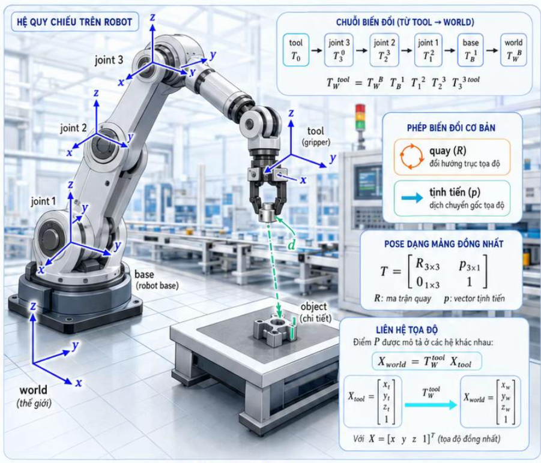
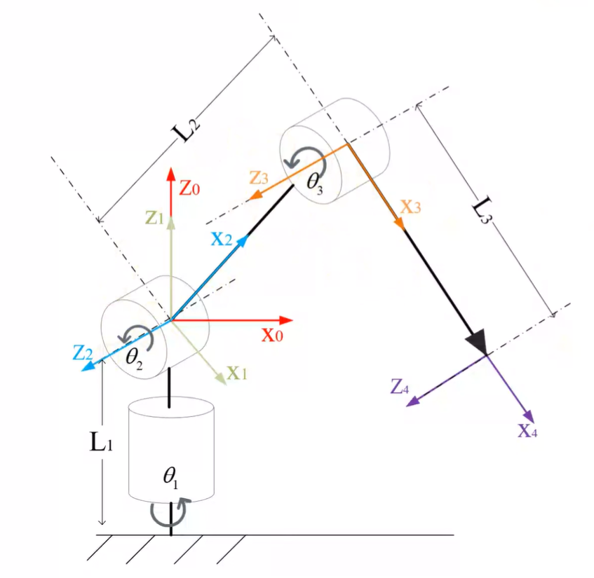

# Robot công nghiệp và hệ quy chiếu

> Robot biết tay gắp đang ở đâu bằng cách nào?

1. __Bài toán thật:__ Tay gắp Robot chuyển động qua nhiều khớp, nhưng nhà máy cần biết chính xác vị trí của nó trong hệ tọa độ thế giới.

2. __Mô hình hình học:__ Mỗi bộ phận có một hệ quy chiếu riêng. Chuyển động robot là chuỗi phép quay và tịnh tiến.

3. __Công thức lõi:__ Ma trận $T$ cho biết cách đổi tọa độ từ tay gắp robot sang hệ tọa độ thế giới.

$$X_{world} = R X_{tool} + p$$

$$T = \begin{bmatrix} R & t\\  0& 1 \end{bmatrix}$$

4. __Minh họa đúng bản chất:__ Các hệ quy chiếu liên kết với nhau bằng phép quay (đổi hướng) và tịnh tiến (đổi vị trí).

5. __Ứng dụng mở rộng:__ Biết chính xác vị trí và hướng của tay gắp để thao tác, đo đạc, lắp ráp và đồng bộ với hệ thống khác

## Một số thuộc tính

- __Space (không gian):__ Điểm, vector, hệ trục, tọa độ, khoảng cách Euclide, afin.
    - Ví dụ: $P(x, y, z)$

- __Transform (biến đổi):__ Quay, tịnh tiến, chuỗi biến đổi, ma trận đồng nhất.
    - Ví dụ: $T = \begin{bmatrix} R & t\\  0& 1 \end{bmatrix}$

- __Metric (Đo lường):__ Khoảng cách, góc, độ dài, định tích.
    - Ví dụ: $d = ||p||$, $\theta = arccos(n \cdot m)$

- __Projection (Chiếu):__ Chiếu điểm, tia camera, điểm ở vô cực, phối cảnh.
    - Ví dụ: $x' = K[R | t]X$

- __Curvature (Độ cong):__ Tiếp tuyến, pháp tuyến, độ cong, mặt cong, định hướng.
    - Ví dụ: $K_1, K_2, H, K$

- __Caution (Lưu ý):__ Mô hình sai $\rightarrow$ kết quả sai. luôn kiểm tra đơn vị, giới hạn và ngoại lệ. Kiểm chứng bằng dữ liệu.

## Nguyên lý hoạt động của cánh tay Robot

Cánh tay robot xác định vị trí công tác nhờ việc __chuỗi hóa các phép biến đổi không gian__ từ gốc (Base) đến điểm tác động cuối (Tool/Gripper).

- __Đo lường góc/khớp:__ Cảm biến (Encoder) tại từng khớp (Joint $1, 2, 3...$) đo chính xác góc quay $\theta_i$ hoặc khoảng cách tịnh tiến $d_i$.

- __Tính toán từng mắt xích:__ Mỗi khớp gắn liền với một hệ quy chiếu riêng. Phép dịch chuyển giữa hai khớp kế tiếp được mô tả qua ma trận biến đổi đồng nhất $T_{i}^{i-1}$, gồm phép quay $R$ (đổi hướng) và tịnh tiến $p$ (đổi vị trí).

- __Nhân chuỗi Ma trận (Forward Kinematics):__ Tọa độ tay gắp so với hệ quy chiếu thế giới ($World$) được tổng hợp bằng tích liên tiếp các ma trận:

$$T_{W}^{tool} = T_{W}^{B} \cdot T_{B}^{1} \cdot T_{1}^{2} \cdot T_{2}^{3} \cdot ... \cdot T_{n}^{tool}$$

- __Chuyển đổi tọa độ:__ Vị trí vật thể $X_{tool}$ trong hệ tay gắp được quy đổi sang $X_{world}$ qua công thức: $X_{world} = T_{W}^{tool} X_{tool}$.

## Chương 1: Động học Thuận và Nghịch (Kinematics)

### 1.1. Động học thuận

- __Động học thuận (Forward Kinematics):__ Cho biết góc quay các khớp ($\theta_1, \theta_2, ..., \theta_n$), tính ra vị trí và hướng $(x, y, z, roll, pitch, yaw)$ của tay gắp trong không gian. Sử dụng quy tắc Denavit-Hartenberg (D-H).

> "Biết góc xoay từng khớp $\rightarrow$ Tìm vị trí bàn tay"

- __Bản chất:__ Bạn ra lệnh trực tiếp cho từng động cơ quay một góc cụ thể (ví dụ: khớp vai quay $30^\circ$, khuỷu tay gập $45^\circ$, cổ tay xoay $10^\circ$). Bài toán đặt ra là: Bàn tay đang đứng ở tọa độ $(x, y, z)$ nào trong phòng?

- __Cách hoạt động:__ Robot sẽ tính từ gốc lên đầu gắp. Nó lấy góc khớp 1 tính vị trí khớp 2, lấy góc khớp 2 tính tiếp khớp 3... cộng dồn qua ma trận toán học (bảng thông số Denavit-Hartenberg - D-H) cho tới khi ra vị trí cuối cùng của tay gắp.

- __Đặc điểm:__
    - __Cực kỳ dễ và luôn có 1 đáp án duy nhất:__ Cứ cho một tập hợp các góc cụ thể, tay gắp chỉ có thể nằm ở đúng một vị trí cố định.
    
- __Ví dụ thực tế:__ Khi bạn duỗi thẳng tay và tự gập khuỷu tay lên $90^\circ$, mắt bạn không cần nhìn cũng biết bàn tay mình đang ở ngay trước ngực.

---

### 1.2. Động học nghịch
- __Động học nghịch (Inverse Kinematics):__ Cho trước vị trí mục tiêu $(x, y, z)$ trong nhà máy, tính ngược lại góc cần quay cho từng khớp. Bài toán này có thể vô nghiệm (ngoài tầm với), 1 nghiệm hoặc đa nghiệm (nhiều tư thế cùng tới 1 điểm).

> "Biết vị trí muốn đến $\rightarrow$ Tính góc xoay cho từng khớp"

- __Bản chất:__ Trong nhà máy, bạn không quan tâm khớp vai hay khuỷu xoay bao nhiêu độ. Bạn chỉ quan tâm: "Gắp con ốc ở tọa độ $X=50, Y=20, Z=10$". Bài toán đặt ra là: Các động cơ phải quay góc $\theta_1, \theta_2, \theta_3...$ bao nhiêu để bàn tay đến đúng tọa độ đó?

- __Cách hoạt động:__ Máy tính phải giải các hệ phương trình lượng giác/đại số phức tạp để tính ngược từ vị trí mong muốn về góc của từng khớp.

- __Đặc điểm:__
    - __Cực kỳ khó và có nhiều trường hợp:__
        - __Đa nghiệm (Nhiều cách đi):__ Để chạm tay vào một điểm trên bàn, bạn có thể gập khuỷu tay hướng lên trên hoặc chĩa khuỷu tay xuống dưới. Cả hai tư thế đều đưa bàn tay đến đúng 1 điểm.
        - __Vô nghiệm (Không tới được):__ Điểm nằm ngoài tầm với của cánh tay, hoặc góc quay đòi hỏi động cơ bị vướng cơ khí.
        
- __Ví dụ thực tế:__ Khi bạn muốn cầm ly nước trên bàn, não bạn tự động tính toán để vai, khuỷu, cổ tay xoay các góc phù hợp sao cho tay chạm đúng ly nước. Bạn chỉ nghĩ về "cái ly" (IK), chứ không nghĩ "phải quay vai $20^\circ$" (FK).

---

### 1.3. Bài toán thực tế:

> Động học thuận

#### Bảng thông số Denavit-Hartenberg (D-H)

    > DH là một quy ước chuẩn hóa cách mô tả quan hệ giữa hai khớp liên tiếp.

| $i$ | $a_{i-1}$ | $\alpha_{i-1}$ | $d_i$ | $\theta_i$ |
| :-: | :-: | :-: | :-: | :-: |
| **1** | $0$ | $0$ | $0$ | $\theta_1$ |
| **2** | $0$ | $90^\circ$ | $0$ | $\theta_2$ |
| **3** | $l_2$ | $0$ | $0$ | $\theta_3$ |
| **4** | $l_3$ | $0$ | $0$ | $0$ |

**Chú thích các ký hiệu:**

* $i$ là thứ tự khớp của robot.
* $a_{i-1}$ là khoảng cách giữa 2 trục $Z_i$ với $Z_{i+1}$ dọc theo trục $X_i$.
* $\alpha_{i-1}$ là góc hợp bởi 2 trục $Z_i$ với $Z_{i+1}$ được đo từ $X_i$.
* $d_i$ là khoảng cách của trục $X_{i-1}$ với $X_i$ dọc theo trục $Z_i$.
* $\theta_i$ là góc hợp bởi 2 trục $X_{i-1}$ với $X_i$ được đo từ $\hat{Z}_i$.
* $l_i$ chiều dài của các Link trong Robot.

#### Các ma trận chuyển đổi

- Quy ước:
    - $c_i = \cos(\theta_i)$, $s_i = \sin(\theta_i)$
    - $c_{23} = \cos(\theta_2 + \theta_3)$, $s_{23} = \sin(\theta_2 + \theta_3)$
    - $\mathbf{P_{EE}}$: Vector vị trí của điểm tác động cuối (End-Effector Position).
    - $\mathbf{R_{EE}}$: Ma trận quay thể hiện hướng của tay gắp (End-Effector Rotation).

Ma trận biến đổi tổng quát từ hệ trục $\{i\}$ sang hệ trục $\{i-1\}$:

$$T_i^{i-1} = \begin{bmatrix} 
c\theta_i & -s\theta_i & 0 & a_{i-1} \\ 
c\alpha_{i-1}s\theta_i & c\alpha_{i-1}c\theta_i & -s\alpha_{i-1} & -d_i s\alpha_{i-1} \\ 
s\alpha_{i-1}s\theta_i & s\alpha_{i-1}c\theta_i & c\alpha_{i-1} & d_i c\alpha_{i-1} \\ 
0 & 0 & 0 & 1 
\end{bmatrix}$$

---

$$T_1^0 = \begin{bmatrix} 
c_1 & -s_1 & 0 & 0 \\ 
s_1 & c_1 & 0 & 0 \\ 
0 & 0 & 1 & 0 \\ 
0 & 0 & 0 & 1 
\end{bmatrix}$$

$$T_2^1 = \begin{bmatrix} 
c_2 & -s_2 & 0 & 0 \\ 
0 & 0 & -1 & 0 \\ 
s_2 & c_2 & 0 & 0 \\ 
0 & 0 & 0 & 1 
\end{bmatrix}$$

$$T_3^2 = \begin{bmatrix} 
c_3 & -s_3 & 0 & L_2 \\ 
s_3 & c_3 & 0 & 0 \\ 
0 & 0 & 1 & 0 \\ 
0 & 0 & 0 & 1 
\end{bmatrix}$$

$$T_4^3 = \begin{bmatrix} 
1 & 0 & 0 & L_3 \\ 
0 & 1 & 0 & 0 \\ 
0 & 0 & 1 & 0 \\ 
0 & 0 & 0 & 1 
\end{bmatrix}$$

---

$$T_0^4 = T_0^1 T_1^2 T_2^3 T_3^4 = \begin{bmatrix} 
\mathbf{R_{EE}} & \mathbf{P_{EE}} \\ 
0 & 1 
\end{bmatrix}$$

$$\mathbf{P_{EE}} = \begin{bmatrix} 
c_1 (L_3 c_{23} + L_2 c_2) \\ 
s_1 (L_3 c_{23} + L_2 c_2) \\ 
L_3 s_{23} + L_2 s_2 
\end{bmatrix}$$

$$\mathbf{R_{EE}} = \begin{bmatrix} 
c_1 c_{23} & -c_1 s_{23} & s_1 \\ 
s_1 c_{23} & -s_1 s_{23} & -c_1 \\ 
s_{23} & c_{23} & 0 
\end{bmatrix}$$

---

> Động học nghịch (Inverse Kinematics - IK)

Từ vector vị trí $\mathbf{P_{EE}} = [x, y, z]^T$, tìm lại các góc khớp $(\theta_1, \theta_2, \theta_3)$:

- Tính $\theta_1$:

$$\theta_1 = \text{atan2}(y, x)$$

- Tính $\theta_2, \theta_3$: (Giải bài toán phẳng 2D trên mặt phẳng chứa $L_2, L_3$) Đặt $r = \sqrt{x^2 + y^2}$, theo định lý Cosin:

$$\cos(\theta_3) = \frac{r^2 + z^2 - L_2^2 - L_3^2}{2 L_2 L_3}$$

$$\theta_3 = \text{atan2}\left(\pm\sqrt{1 - \cos^2(\theta_3)}, \cos(\theta_3)\right)$$

$$\theta_2 = \text{atan2}(z, r) - \text{atan2}\left(L_3 \sin(\theta_3), L_2 + L_3 \cos(\theta_3)\right)$$

---

## Chương 2: Động lực học và Điểm kỳ dị (Dynamics & Singularities)

### 2.1. Ma trận Jacobian ($J$)

- __Ma trận Jacobian ($J$):__ Liên hệ vận tốc góc của các khớp với vận tốc tuyến tính/góc của tay gắp ($\dot{X} = J \cdot \dot{\theta}$).

> "Cầu nối giữa tốc độ quay của động cơ và tốc độ di chuyển của tay gắp"

- __Bản chất:__ Động cơ ở các khớp chỉ biết quay nhanh hay chậm (vận tốc góc $\dot{\theta}$). Nhưng nhà máy lại cần tay gắp di chuyển theo một đường thẳng với tốc độ nhất định (vận tốc tuyến tính $\dot{X}$, ví dụ: $0.5\text{ m/s}$). Ma trận Jacobian $J$ chính là "bộ chuyển đổi" giúp tính toán mối liên hệ này qua công thức:

$$\dot{X} = J(\theta) \cdot \dot{\theta}$$

- __Cách hoạt động:__ Giá trị của ma trận $J$ không cố định mà thay đổi liên tục theo tư thế (góc $\theta$) hiện tại của robot. Khi cánh tay robot co lại hay duỗi ra, cùng một tốc độ quay động cơ sẽ tạo ra tốc độ di chuyển bàn tay khác nhau.

- __Ví dụ thực tế:__ Khi bạn dùng gậy đánh golf, nếu giữ nguyên tốc độ xoay vai, đầu gậy dài hơn sẽ di chuyển nhanh hơn nhiều so với vị trí bàn tay bạn cầm. Ma trận Jacobian chính là công cụ toán học tính toán chính xác sự chênh lệch tốc độ đó.

### 2.2. Điểm kỳ dị (Singularity)

- __Điểm kỳ dị (Singularity):__ Thời điểm ma trận $J$ mất hạng ($\det(J) = 0$). Tại đây, robot mất đi 1 hoặc nhiều bậc tự do, vận tốc khớp có thể tiến đến vô cùng, gây nguy hiểm hoặc làm dừng robot.

> "Tư thế 'kẹt' làm robot mất khả năng điều khiển"

- __Bản chất:__ Là tư thế mà cánh tay robot bị duỗi thẳng hoàn toàn hoặc các khớp bị trùng trục với nhau, dẫn đến ma trận $J$ bị mất hạng ($\det(J) = 0$). Tại đây, robot bị mất đi ít nhất một hướng di chuyển.

- __Tác hại thực tế:__
    - __Vận tốc động cơ tăng vô hạn:__ Nếu bạn ra lệnh cho tay gắp di chuyển qua điểm kỳ dị với tốc độ bình thường, phương trình toán học sẽ yêu cầu động cơ ở khớp quay với vận tốc vô tận.

    - __Rung lắc hoặc dừng đột ngột:__ Để bảo vệ động cơ không bị cháy hoặc gãy cơ khí, hệ thống điều khiển sẽ báo lỗi khẩn cấp (Alarm) và dừng toàn bộ robot.

- __Ví dụ thực tế:__ Khi bạn duỗi thẳng hoàn toàn cánh tay ra trước mặt, bạn không thể đẩy bàn tay tiến thêm về phía trước được nữa dù vai hay khuỷu có cố xoay thế nào. Đó chính là tư thế kỳ dị của cánh tay người.

### 2.3. Động lực học (Dynamics)

- __Động lực học (Newton-Euler / Lagrange):__ Tính toán lực và momen cần thiết tại các động cơ để vượt qua quán tính, trọng lực và tải trọng khi di chuyển.

> "Tính toán Lực và Momen để robot di chuyển được trong thực tế"

- __Bản chất:__ Động học giúp bạn biết vị trí, nhưng để robot thực sự chuyển động được thì động cơ phải sinh ra momen lực (Torque). Động lực học giải bài toán: Cần cấp bao nhiêu dòng điện/lực cho mỗi động cơ để nâng được vật nặng 5kg và di chuyển mượt mà?

- __Hai phương pháp tính toán chính:__
    - __Năng lượng (Lagrange-Euler):__ Dựa trên tổng Động năng và Thế năng của toàn bộ cánh tay robot. Phù hợp để viết phương trình mô phỏng và thiết kế bộ điều khiển.
    - __Cân bằng Lực (Newton-Euler):__ Tính toán lực đẩy/kéo từ gốc lần lượt qua từng mắt xích đến tay gắp và ngược lại. Phù hợp cho máy tính tính toán nhanh theo thời gian thực.

- __Các yếu tố phải tính đến:__
    - __Trọng lực:__ Bản thân các thanh nối (Link) và vật nặng đều bị Trái Đất hút xuống.
    - __Lực quán tính & Quán tính ly tâm:__ Khi robot quay nhanh hoặc tăng tốc/phanh đột ngột.
    - __Ma sát:__ Ma sát tại các ổ trục và hộp số động cơ.
- __Ví dụ thực tế:__ Khi bạn cầm một quả tạ 10kg, tay bạn phải gân lên (sinh lực) nhiều hơn rất nhiều so với khi không cầm gì, dù tư thế di chuyển tay của bạn là hoàn toàn giống nhau.

## Chương 3: Quy hoạch Đường đi và Điều khiển (Path Planning & Control)

### 3.1. Quy hoạch quỹ đạo (Path Planning / Trajectory Generation)
- __Quy hoạch quỹ đạo:__ Nội suy chuyển động giữa các điểm theo đường thẳng (Cartesian space) hoặc đường cong tối ưu góc khớp (Joint space) nhằm đảm bảo gia tốc mượt mà.

> "Lập kế hoạch về con đường và vận tốc di chuyển"

- __Bản chất:__ Khi bạn yêu cầu robot gắp vật ở điểm A và đặt sang điểm B, robot không thể bộc phát "nhảy" từ A sang B ngay lập tức. Cần một thuật toán để tạo ra một đường đi mượt mà, bao gồm cả việc tăng tốc từ từ, duy trì vận tốc, và giảm tốc nhẹ nhàng khi sắp tới đích.

- __Hai phương pháp quy hoạch chính:__
    - __Quy hoạch trong không gian khớp (Joint Space):__
        - Robot tính toán góc bắt đầu và góc kết thúc của từng động cơ, sau đó cho tất cả động cơ quay mượt từ $A \rightarrow B$.
        - Ưu điểm: Tốn ít máy tính, di chuyển rất nhanh và không bao giờ lo dính điểm kỳ dị.
        - Nhược điểm: Mũi tay gắp sẽ đi theo một đường cong vồng không xác định trong không gian. Nếu có vật cản xung quanh, tay gắp dễ va chạm.

    - __Quy hoạch trong không gian Tọa độ (Cartesian Space):__
        - Bắt buộc mũi tay gắp phải đi theo một đường thẳng tắp hoặc đường tròn từ A đến B.
        - Ưu điểm: Rất chính xác, dễ kiểm soát va chạm, thích hợp cho các tác vụ như hàn, cắt laser, phun sơn.
        - Nhược điểm: Tốn rất nhiều CPU để giải Động học nghịch (IK) liên tục hàng trăm lần mỗi giây trên suốt quãng đường đi, và dễ đụng phải điểm kỳ dị.
- __Ví dụ thực tế:__ Giống như khi bạn lái ô tô từ nhà đến công ty. Bạn có thể chọn đi đường cao tốc rộng rãi dù đi đường cong (Joint Space) hoặc buộc phải đi theo đường chim bay thẳng qua các ngõ hẹp (Cartesian Space).

### 3.2. Vòng điều khiển phản hồi (Feedback Control)

- __Vòng điều khiển phản hồi:__ Hệ thống PID/Model Predictive Control (MPC) so sánh vị trí thực tế từ Encoder với vị trí lý thuyết để điều chỉnh dòng điện cấp cho Động cơ Servo theo thời gian thực.

> "Mắt theo dõi - Não điều chỉnh - Tay thực thi theo thời gian thực"

- __Bản chất:__ Trong lý thuyết, lệnh phát ra là quay động cơ $30^\circ$. Tuy nhiên, do ma sát, tải trọng nặng, hoặc nhiễu cơ khí, động cơ thực tế chỉ quay được $29.5^\circ$. Vòng điều khiển phản hồi sinh ra để liên tục phát hiện sự sai lệch $0.5^\circ$ này và bù đắp ngay lập tức.

- __Cách hoạt động (Vòng lặp kín - Closed-Loop):__
    1. __Lệnh (Set-point):__ Bộ điều khiển phát lệnh vị trí/vận tốc mong muốn.
    2. __Cảm biến (Encoder):__ Đo góc quay thực tế của động cơ và gửi về phản hồi.
    3. __Tính sai số ($Error$):__ $Error = \text{Vị trí mong muốn} - \text{Vị trí thực tế}$.
    4. __Thuật toán điều khiển (PID / MPC):__
        - __PID:__ Thuật toán kinh điển, dựa trên sai số hiện tại ($P$), tổng sai số quá khứ ($I$), và tốc độ thay đổi sai số ($D$) để tăng/giảm dòng điện (momen) cấp cho động cơ Servo.
        - __MPC (Model Predictive Control):__ Thuật toán nâng cao hơn, dùng mô hình toán học dự đoán trước chuyển động trong tương lai vài miligiây để điều khiển tối ưu.
    5. __Thực thi:__ Động cơ điều chỉnh lực xoay để triệt tiêu sai số về $0$.

- __Ví dụ thực tế:__ Khi bạn lái xe máy giữ tốc độ $40\text{ km/h}$. Khi xe bắt đầu lên dốc (có lực cản), tốc độ tụt xuống $35\text{ km/h}$ (sai số $5\text{ km/h}$). Bạn cảm nhận được (Encoder) và lập tức vặn thêm ga (PID tăng dòng điện) để đưa xe trở lại đúng $40\text{ km/h}$.

## Chương 4: Tích hợp Thị giác Robot (Robot Vision & Calibration)

### 4.1. Hiệu chuẩn Hand-Eye Calibration
- __Hiệu chuẩn Hand-Eye Calibration:__ Xác định mối quan hệ không gian giữa Camera và Tay gắp ($T_{cam}^{tool}$) hoặc gốc Robot ($T_{cam}^{base}$).

> "Dạy cho Robot biết Mắt (Camera) và Tay (Tay gắp) nằm ở đâu so với nhau"

- __Bản chất:__ Camera nhìn thấy vật thể qua đơn vị điểm ảnh (Pixel). Tuy nhiên, để tay gắp di chuyển tới gắp được, robot cần biết tọa độ đó tính theo mét hoặc milimét so với cơ thể nó. Hiệu chuẩn Hand-Eye là quá trình tính toán ma trận chuyển đổi không gian giữa Camera và Tay gắp hoặc Gốc robot.

- __Hai cấu hình lắp đặt chính:__
    - __Eye-in-Hand (Mắt trên tay):__ Camera được gắn trực tiếp ngay trên tay gắp của robot và di chuyển cùng tay gắp.
        - _Mục tiêu:_ Tìm ma trận biến đổi $T_{cam}^{tool}$ (mối quan hệ giữa Camera và Tay gắp).

    - __Eye-to-Hand (Mắt nhìn tay):__ Camera gắn cố định ở góc phòng, trên trần nhà hoặc khung cố định nhìn xuống khu vực làm việc.
        - _Mục tiêu:_ Tìm ma trận biến đổi $T_{cam}^{base}$ (mối quan hệ giữa Camera và Gốc robot).

- __Cách thực hiện trong thực tế:__ Người ta cho robot cầm một tấm lưới bàn cờ (Chessboard) hoặc điểm chấm tròn chuẩn. Robot di chuyển tay gắp qua nhiều góc nghiêng khác nhau, camera chụp lại các bức ảnh đó. Thuật toán sẽ giải hệ phương trình $AX = XB$ để tìm ra khoảng cách và góc lệch chính xác giữa Mắt và Tay.

- __Ví dụ thực tế:__ Tương tự như khi bạn đeo một chiếc kính râm mới. Ban đầu bạn có thể gắp thức ăn hụt một chút, nhưng não bạn sẽ tự động "hiệu chuẩn" lại khoảng cách giữa Mắt và Bàn tay sau vài lần thử để gắp chính xác.

### 4.2. Đồng bộ không gian làm việc (Workspace Synchronization)
- __Đồng bộ không gian làm việc:__ Chuyển tọa độ điểm ảnh 2D/3D từ Camera thành tọa độ thực $X_{world}$ để robot gắp chính xác vật thể đang di chuyển trên băng tải.

> "Đổi tọa độ hình ảnh thành tọa độ thực để gắp vật thể đang di chuyển"

- __Bản chất:__ Camera chỉ cho biết bức ảnh chụp được có vật thể ở vị trí $(u, v)$ pixel. Quy trình đồng bộ không gian sẽ làm 2 việc:

    1. __Đổi tọa độ ảnh thành tọa độ thực ($X_{world}$):__ Sử dụng ma trận nội tham số của Camera (Intrinsic Matrix) và kết quả Hand-Eye Calibration để quy đổi từ pixel sang milimét trong thế giới thực.

    2. __Đồng bộ thời gian thực (Conveyor Tracking):__ Khi vật thể nằm trên băng tải đang chạy, vị trí vật thể liên tục thay đổi theo thời gian $t$. Robot phải kết hợp dữ liệu từ Camera với cảm biến đo tốc độ băng tải (Encoder băng tải) để dự đoán vị trí vật thể trong $0.5$ giây tới và điều khiển tay gắp "đón đầu" chính xác.

- __Ứng dụng thực tế:__
    - __Phân loại sản phẩm (Pick & Place):__ Camera phát hiện bánh kẹo lỗi/méo trên băng tải đang chạy với tốc độ cao, gửi tọa độ cho robot gắp loại bỏ lập tức.
    - __Lắp ráp linh kiện điện tử:__ Camera soi chính xác vị trí chân chip và bo mạch để tay gắp đặt chip vào đúng khe cắm micro-mét.