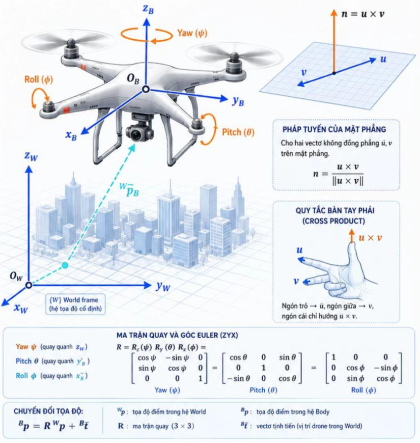

# Drone, Quay 3D và Định hướng không gian

> Drone giữ thẳng bằng, nghiên và đổi hướng bằng mô hình nào?

1. __Bài toán thực tế:__ Drone phải biết nó đang nghiên, quay và hướng về đâu trong không gian 3D.

2. __Mô hình hình học:__ Định hướng của Drone được mô tả bằng ma trận quay, Ma trận quay bảo toàn độ dài, góc và định hướng.

3. __Công thức lõi:__ Ma trận quay mô tả định hướng của drone và bảo toàn độ dài, góc và định hướng.

$$R^T R = I$$

$$det R = 1$$

$$n = \frac {u \times v} {||u \times v ||}$$

4. __Minh họa đúng bản chất:__ Các trục, góc quay và mặt phẳng được biểu diễn rõ ràng theo hệ tọa độ.

5. __Ứng dụng mở rộng:__ Mô hình định hướng giúp drone bay chính xác và mang cảm biến hoạt động ổn định.

## Một số thuộc tính

- __Space (Không gian):__ Hệ tọa độ, vector, frame, phép biển đổi cứng trong 3D.

- __Transform (biến đổi):__ Quay, tịnh tiến, ghép biến đổi đồng nhất.
    - Ví dụ: $T = \begin{bmatrix} R & t\\  0& 1 \end{bmatrix}$

- __Metric (đo lường):__ khoảng cách, góc, độ dài, tích vô hướng bảo toàn qua quay.
    - Ví dụ: $||R\bar p|| = ||\bar p ||$

- __Projection (Chiếu):__ Chiếu điểm 3D lên ảnh 2D bằng mô hình camera.
    - Ví dụ: $x'=PX$

- __Curvature (Độ cong):__ Mật cong, địa hình, quỹ đạo có độ cong và hướng pháp tuyến.
    - Ví dụ: $K = \frac {1} {R_c}$

- __Caution (Lưu ý):__ Gimbal lock khi $\theta = \pm 90^\circ$ cần lọc cảm biến (Kalman) để ước lượng ổn định.