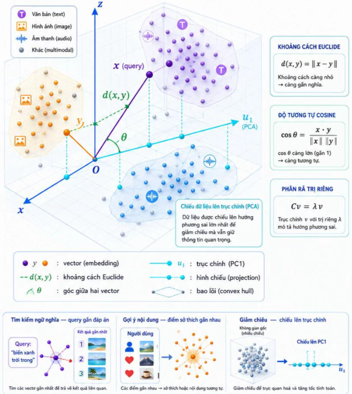

# AI Embedding và hình học dữ liệu

> AI biết hai văn bản, hình ảnh hoặc âm thanh "gần nghĩa nhau" bằng cách nào?

1. __Bài toán thật:__ Dữ liệu phức tạp cần được biến thành điểm hoặc vector để máy có thể so sánh.

2. __Mô hình hình học:__ Embedding đặt dữ liệu vào không gian vector, khoảng cách và góc biểu thị mức gần nhau.

3. __Công thức lõi:__ Embedding biến dữ liệu thành vector, khoảng cách và góc giúp máy so sánh mức gần nhau.

$$d(x, y) = ||x-y||$$

$$\cos \theta = \frac {x \times y} {||x|| ||y||}$$

$$Cv = \lambda v$$

4. __Minh họa đúng bản chất:__ Vector gần nhau $\rightarrow$ ngữ nghĩa gần, góc nhỏ, khoảng cách ngắn $\rightarrow$ tương tự cao.

5. __Ứng dụng mở rộng:__ Nền tảng cho tìm kiếm ngữ nghĩa, gợi ý nội dung, phát hiện bất thường, phân cụm và nhiều hơn.

## Một số thuộc tính

- __Embedding (không gian):__ Ánh xạ dữ liệu vào không gian vector $\mathbb R^d$ để so sánh.

- __Metric (đo lường):__ Hàm đo khoảng cách giữa hai vector.
    - Ví dụ: $d(x, y)=||x - y||$

- __Similarity (độ tương tự):__ Cosine similarity dùng để đo mức tương tự không phụ thuộc độ lớn. 
    - Ví dụ: $\cos \theta = \frac {x \times y} {||x|| ||y||}$

- __Projection (Chiếu):__ Chiếu vector liên tục để giảm chiều.
    - Ví dụ: $proj_{u_1}(x) = (x \times u_1) u_1$

- __Clustering (phân cụm):__ Nhóm các điểm gần nhau thành cụm có ý nghĩa.
    - Ví dụ: K-means, DBSCAN

- __Caution (Lưu ý):__ Chất lượng embedding quyết định chất lượng so sánh và kết quả