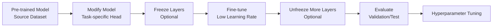
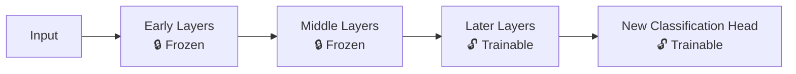

# Fine-Tune Models

__Fine-tuning__ là quá trình lấy một __pre-trained model__ đã học trên tập dữ liệu lớn và tiếp tục cập nhật một phần hoặc toàn bộ trọng số trên __target dataset__ để thích nghi với nhiệm vụ mới. Đây là một kỹ thuật quan trọng của [Transfer Learning]((https://arxiv.org/pdf/1801.06146)).

Mục tiêu là để điều chỉnh các đặc trưng đã học được của mô hình được huấn luyện trước cho một nhiệm vụ mới, có liên quan, dẫn đến hiệu suất tốt hơn với ít dữ liệu hơn và thời gian huấn luyện nhanh hơn so với việc huấn luyện một mô hình từ đầu.

| Câu hỏi    | Giải thích                                                                                                                                                         |
| ---------- | -------------------------------------------------------------------------------------------------------------------------------------------------------------------------- |
| **WHAT?**  | Fine-tuning = **tiếp tục huấn luyện pre-trained model** trên dữ liệu của task mới để điều chỉnh representation đã học.                                                     |
| **WHY?**   | **Tận dụng knowledge/features đã học**, giảm dữ liệu cần thiết, thời gian huấn luyện vì mô hình đã được huấn luyện một phần từ trước nên quá trình hội tụ khi tinh chỉnh xảy ra nhanh hơn và thường cải thiện khả năng tổng quát và độ chính xác cao hơn so với train from scratch. ([arXiv][1])        |
| **WHERE?** | Dùng trong **Transfer Learning**, phổ biến ở Computer Vision, NLP và các mô hình foundation/pre-trained model. ([Journal of Machine Learning Research][2])                 |
| **WHEN?**  | Khi **target dataset nhỏ**, tài nguyên hạn chế hoặc đã có pre-trained model trên domain/task liên quan.                                                                    |
| **WHICH?** | Chọn model có **pre-training data/task càng gần target task càng tốt**. Mức độ tương đồng giữa source và target ảnh hưởng trực tiếp đến hiệu quả fine-tuning. ([arXiv][3]) |
| **HOW?**   | **① Chọn pretrained model → ② thay task-specific head → ③ freeze một số layer → ④ train với learning rate thấp → ⑤ unfreeze dần nếu cần → ⑥ evaluate/tune.**               |

[1]: https://arxiv.org/abs/1801.06146?utm_source=chatgpt.com "Universal Language Model Fine-tuning for Text Classification"
[2]: https://jmlr.org/beta/papers/v21/20-074.html?utm_source=chatgpt.com "Exploring the Limits of Transfer Learning with a Unified Text-to-Text Transformer"
[3]: https://arxiv.org/abs/1903.05987?utm_source=chatgpt.com "To Tune or Not to Tune? Adapting Pretrained Representations to Diverse Tasks"

> Pre-training học representation tổng quát → Fine-tuning điều chỉnh representation đó cho target task.

Không nhất thiết phải freeze layer. Có hai cách phổ biến:
- __Feature Extraction__: freeze toàn bộ backbone, chỉ train classifier/head.
- __Fine-tuning__: mở một phần hoặc toàn bộ backbone và cập nhật weights với __learning rate nhỏ.__ Nghiên cứu cho thấy lựa chọn giữa hai cách phụ thuộc đáng kể vào độ tương đồng giữa __pre-training task__ và __target task.__

## Freeze Layer

Freeze layer = đóng băng layer, nghĩa là không cập nhật trọng số (weights) và bias của layer đó trong quá trình training. Tức là model vẫn forward qua layer đó và tạo feature, nhưng optimizer không thay đổi parameters của layer.

Trong Fine-Tune

Ví dụ trong CNN:

| Layer      | Trạng thái    | Vai trò                                 |
| ---------- | ------------- | --------------------------------------- |
| Conv 1–3   | 🔒 **Freeze** | Giữ feature tổng quát như edge, texture |
| Conv 4–5   | 🔓 **Train**  | Học feature phù hợp dataset mới         |
| Classifier | 🔓 **Train**  | Học mapping sang class mới              |

Ta dùng Freeze vì khi dataset nhỏ thì mô hình dễ bị overfitting nếu cập nhật toàn bộ model. Việc đóng băng các layer đầu giúp:
- giữ lại feature đã học tốt từ pretrained model;
- giảm số trainable parameters;
- giảm computation;
- hạn chế catastrophic forgetting.

# Hugging Face API

__Hugging Face API__ chủ yếu cung cấp model và inference; fine-tuning model lớn thường được thực hiện bằng `Transformers + PEFT/LoRA + TRL` trên GPU, sau đó upload model/adapter đã fine-tune trở lại Hub.