# Convolutional Neural Network (CNN) Architectures

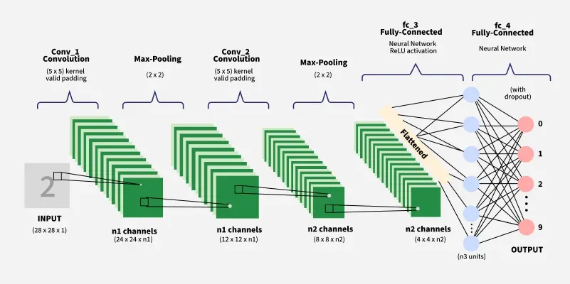

Convolutional Neural Network (CNN) là một trong những kiến trúc học sâu quan trọng nhất trong lĩnh vực Computer Vision. Khác với các mô hình học máy truyền thống phụ thuộc vào quá trình thiết kế đặc trưng thủ công (feature engineering), CNN có khả năng tự động học các đặc trưng phân cấp (hierarchical features) trực tiếp từ dữ liệu ảnh thông qua các phép tích chập (convolution). Điều này giúp CNN trở thành nền tảng của nhiều bài toán như image classification, object detection, semantic segmentation và image recognition.

Sự phát triển của CNN không chỉ dừng lại ở việc tăng số lượng lớp mạng mà còn tập trung vào thiết kế kiến trúc (architecture design) nhằm giải quyết các hạn chế về khả năng biểu diễn, tối ưu hóa mô hình, chi phí tính toán và khả năng mở rộng. Từ LeNet, AlexNet, VGG, GoogLeNet (Inception) đến ResNet, DenseNet và EfficientNet, mỗi kiến trúc đều được đề xuất để khắc phục một hoặc nhiều điểm yếu của các mô hình trước đó, đồng thời cải thiện hiệu năng trên các tập dữ liệu quy mô lớn.

Do đó, việc nghiên cứu CNN Architectures không chỉ nhằm tìm hiểu cấu trúc của từng mô hình mà còn giúp hiểu được vấn đề (problem) mà mỗi kiến trúc giải quyết, nguyên lý thiết kế (design principle) và đánh đổi (trade-off) giữa độ chính xác, số lượng tham số, chi phí tính toán và khả năng tổng quát hóa. Đây là cơ sở để lựa chọn hoặc phát triển kiến trúc CNN phù hợp cho từng bài toán Computer Vision.

> CNN được thiết kế để giải quyết ba hạn chế cốt lõi của mạng Fully Connected khi xử lý ảnh.

| Hạn chế của Fully Connected | Nguyên nhân                                              | Cơ chế của CNN                                                                             |
| --------------------------- | -------------------------------------------------------- | ------------------------------------------------------------------------------------------ |
| **High Dimensionality**     | Kết nối đầy đủ làm số lượng tham số rất lớn              | Local receptive field và weight sharing giúp giảm mạnh số tham số                          |
| **Spatial Relationships**   | Không khai thác mối quan hệ giữa các pixel lân cận       | Convolution bảo toàn cấu trúc không gian và học đặc trưng phân cấp                         |
| **Translation Invariance**  | Phải học lại cùng một đối tượng ở nhiều vị trí khác nhau | Kernel dùng chung trên toàn ảnh và pooling giúp nhận diện đối tượng ở các vị trí khác nhau |

## Mục lục

| Section | Description |
|----------|-------------|
| **[1. Define Problem (5W 1H)](#1-define-problem-5w-1h)** | Giới thiệu về Convolutional Neural Networks |
| **[2. The key components of CNNs](#2-the-key-components-of-cnns)** | Các thành phần cơ bản của CNN |
| **[2.1 Convolution Layer](#21-convolution-layer)** | Lớp tích chập |
| **[2.2 Max-Pooling Layer](#22-max-pooling-layer)** | Lớp Pooling |
| **[2.3 Fully Connected Layer](#23-fully-connected-layer)** | Lớp kết nối đầy đủ |
| **[3. Applications, Advantages and Disadvantages](#3-applications-advantages-and-disadvantages-of-cnns)** | Ứng dụng, ưu điểm và hạn chế của CNN |
| **[3.4 How CNNs Learn](#34-how-cnns-learn)** | Quá trình huấn luyện CNN |
| **[4. Evolution of CNN Architectures](#4-evolution-of-cnn-architectures)** | Tổng quan sự phát triển của các kiến trúc CNN |
| **[5. Representative CNN Architectures](#5-representative-cnn-architectures)** | Phân tích chi tiết các kiến trúc CNN |
| ↳ **[5.1 LeNet-5](#51-lenet-5)** | Kiến trúc CNN đầu tiên |
| ↳ **[5.2 AlexNet](#52-alexnet)** | Deep CNN trên ImageNet |
| ↳ **[5.3 VGG-16](#53-vgg-16)** | Deep CNN với kernel \(3\times3\) |
| ↳ **[5.4 GoogLeNet (Inception-v1)](#54-googlenet-inception-v1)** | Inception Module |
| ↳ **[5.5 Inception-v3](#55-inception-v3)** | Factorized Convolution |
| ↳ **[5.6 ResNet-50](#56-resnet-50)** | Residual Learning |
| ↳ **[5.7 Xception](#57-xception)** | Depthwise Separable Convolution |
| ↳ **[5.8 Inception-v4](#58-inception-v4)** | Improved Inception |
| ↳ **[5.9 Inception-ResNet-v2](#59-inception-resnet-v2)** | Inception + Residual |
| ↳ **[5.10 ResNeXt-50](#510-resnext-50)** | Cardinality |
| ↳ **[5.11 DenseNet](#511-densenet)** | Dense Connections |
| ↳ **[5.12 MobileNet-v1](#512-mobilenet-v1)** | Lightweight CNN |
| ↳ **[5.13 EfficientNet](#513-efficientnet)** | Compound Scaling |
| **[6. Architecture Comparison](#6-architecture-comparison)** | So sánh toàn diện các kiến trúc CNN |
| **[7. Summary](#7-summary)** | Tổng kết và kết luận |

## 1. Define Problem (5W 1H)

Bài toán đặt ra là thiết kế hoặc lựa chọn kiến trúc Convolutional Neural Network (CNN) có khả năng học biểu diễn đặc trưng từ dữ liệu ảnh một cách hiệu quả, đồng thời đạt được sự cân bằng giữa độ chính xác, chi phí tính toán, số lượng tham số và khả năng tổng quát hóa trên dữ liệu chưa quan sát. Các kiến trúc CNN được phát triển nhằm giải quyết các hạn chế của các mô hình trước đó, từ đó nâng cao hiệu năng trên các bài toán Computer Vision.

| Thành phần             | Nội dung                                                                                                                                                                                                                 |
| ---------------------- | ------------------------------------------------------------------------------------------------------------------------------------------------------------------------------------------------------------------------ |
| **What (Là gì?)**      | Nghiên cứu kiến trúc **Convolutional Neural Network (CNN)** nhằm xây dựng mô hình có khả năng tự động học đặc trưng từ dữ liệu ảnh để giải quyết các bài toán Computer Vision như phân loại, phát hiện và phân đoạn ảnh. |
| **Why (Tại sao?)**     | Các kiến trúc CNN khác nhau được đề xuất để cải thiện **độ chính xác**, **khả năng học đặc trưng**, **hiệu quả tính toán** và **khả năng huấn luyện** khi mô hình ngày càng sâu và dữ liệu ngày càng lớn.                |
| **Who (Đối tượng?)**   | Đối tượng nghiên cứu là các **kiến trúc CNN** và dữ liệu ảnh được sử dụng để huấn luyện, đánh giá và so sánh hiệu năng của mô hình trên các tác vụ Computer Vision.                                                      |
| **Where (Ở đâu?)**     | CNN được ứng dụng trong các hệ thống Computer Vision như nhận dạng ảnh, phát hiện đối tượng, phân đoạn ảnh, ảnh y tế, xe tự hành và giám sát thông minh.                                                                 |
| **When (Khi nào?)**    | CNN được sử dụng khi dữ liệu đầu vào có **cấu trúc không gian** (2D hoặc 3D) và yêu cầu mô hình tự động trích xuất đặc trưng thay vì thiết kế đặc trưng thủ công.                                                        |
| **How (Như thế nào?)** | Thiết kế và đánh giá kiến trúc CNN thông qua các lớp **Convolution**, **Activation**, **Pooling** và **Fully Connected**, sau đó huấn luyện bằng **Backpropagation** để tối ưu hàm mất mát trên tập dữ liệu huấn luyện.  |

## 2. The key components of CNNs

Kiến trúc Convolutional Neural Network (CNN) được xây dựng từ ba thành phần cốt lõi: Convolution Layer, Pooling Layer và Fully Connected Layer. Mỗi thành phần đảm nhận một vai trò riêng trong quá trình trích xuất đặc trưng (feature extraction) và dự đoán (prediction).

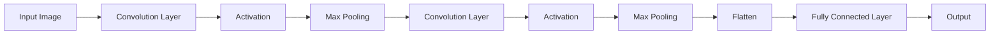

### 2.1 Convolution Layer

Convolution Layer là thành phần quan trọng nhất của CNN, có nhiệm vụ trích xuất đặc trưng cục bộ (local features) từ ảnh đầu vào. Lớp này sử dụng các kernel (filter) có kích thước nhỏ trượt trên toàn bộ ảnh để tính tích chập và tạo ra feature map.

Tại mỗi vị trí, giá trị đầu ra được tính bằng tổng tích của các phần tử tương ứng giữa vùng ảnh và kernel:

$$y(i, j) = \sum^{k-1}_{m=0} \sum^{k-1}_{n=0} x(i + m, j + n) \times w(m, n) + b$$

Trong đó:

- $x$: ảnh đầu vào.
- $w$: kernel (filter).
- $b$: bias.
- $y$: feature map đầu ra.

> Mỗi kernel học một loại đặc trưng khác nhau như cạnh (edge), góc (corner), kết cấu (texture) hoặc hình dạng. Khi số lớp tăng lên, CNN học được các đặc trưng có mức trừu tượng cao hơn.

### 2.2 Max-Pooling Layer

Max-Pooling Layer là lớp giảm kích thước không gian (spatial downsampling) của feature map bằng cách giữ lại giá trị lớn nhất trong mỗi vùng quan sát. (Nếu là avg pooling thì lấy giá trị trung bình.)

> Mục đích giảm kích thước feature map. giảm chi phí và bộ nhớ, giữ lại các đặc trưng nội bật.

### 2.3 Fully-Connected Layer

Sau khi các lớp Convolution và Pooling hoàn thành việc trích xuất đặc trưng, các feature map được Flatten thành một vector một chiều và đưa vào Fully Connected Layer.

Tại lớp này, mỗi neuron được kết nối với toàn bộ neuron của lớp trước để thực hiện quá trình suy luận và đưa ra dự đoán cuối cùng.

Phép biến đổi tuyến tính được biểu diễn bởi:

$$y = f(Wx + b)$$

Trong đó:
- $x$: vector đặc trưng sau Flatten.
- $W$: ma trận trọng số.
- $b$: bias.
- $f(⋅)$: hàm kích hoạt (ví dụ Softmax hoặc Sigmoid).

> Tổng hợp các đặc trưng đã học, ánh xạ đặc trưng sang không gian đầu ra. Thực hiện phân loại hoặc dự đoán cuối cùng.

## 3. Application, Advantages, Disadvantages of CNNs & How CNN Work

### 3.1. Applications of CNNs

Nhờ khả năng tự động học đặc trưng từ dữ liệu có cấu trúc không gian, CNN được ứng dụng rộng rãi trong nhiều lĩnh vực của Computer Vision và một số bài toán học sâu khác. Các ứng dụng phổ biến bao gồm:

| Ứng dụng                        | Mô tả                                                                                                                                           |
| ------------------------------- | ----------------------------------------------------------------------------------------------------------------------------------------------- |
| **Image Classification**        | Phân loại ảnh vào các lớp đã xác định.                                                                                                          |
| **Object Detection**            | Phát hiện và xác định vị trí của nhiều đối tượng trong ảnh.                                                                                     |
| **Image Segmentation**          | Phân đoạn ảnh thành các vùng hoặc đối tượng khác nhau ở mức pixel.                                                                              |
| **Facial Recognition**          | Nhận dạng và xác thực danh tính dựa trên khuôn mặt.                                                                                             |
| **Medical Image Analysis**      | Phân tích ảnh y khoa để phát hiện bệnh, phân đoạn cơ quan và hỗ trợ chẩn đoán.                                                                  |
| **Video Analysis**              | Phân tích nội dung video như nhận dạng hành động và giám sát.                                                                                   |
| **Natural Language Processing** | Được sử dụng trong một số bài toán xử lý văn bản như phân loại văn bản và phân tích cảm xúc, mặc dù Transformer hiện là kiến trúc phổ biến hơn. |

### 3.2. Advantages of CNNs

CNN có nhiều ưu điểm so với mạng Fully Connected khi xử lý dữ liệu ảnh. Các ưu điểm chính gồm:

| Ưu điểm                           | Giải thích                                                                                                                 |
| --------------------------------- | -------------------------------------------------------------------------------------------------------------------------- |
| **Automatic Feature Extraction**  | Tự động học đặc trưng từ dữ liệu đầu vào mà không cần thiết kế đặc trưng thủ công (*feature engineering*).                 |
| **Hierarchical Feature Learning** | Học đặc trưng theo nhiều mức, từ cạnh và texture ở các lớp đầu đến bộ phận và toàn bộ đối tượng ở các lớp sâu.             |
| **Translation Invariance**        | Nhờ phép tích chập và pooling, mô hình ít nhạy cảm với sự thay đổi vị trí của đối tượng trong ảnh.                         |
| **Parameter Sharing**             | Sử dụng cùng một kernel trên toàn bộ ảnh, giúp giảm số lượng tham số, tăng hiệu quả tính toán và giảm nguy cơ overfitting. |

### 3.3. Disadvantages of CNNs

Mặc dù đạt hiệu quả cao trong nhiều bài toán Computer Vision, CNN vẫn tồn tại một số hạn chế.

| Hạn chế                            | Giải thích                                                                                                            |
| ---------------------------------- | --------------------------------------------------------------------------------------------------------------------- |
| **Data Dependency**                | Cần lượng lớn dữ liệu đã gán nhãn để huấn luyện đạt hiệu quả cao.                                                     |
| **Computational Cost**             | Huấn luyện các mô hình CNN sâu đòi hỏi tài nguyên tính toán lớn, đặc biệt là GPU và thời gian huấn luyện dài.         |
| **Black-box Nature**               | Khó giải thích chính xác quá trình mô hình đưa ra quyết định hoặc dự đoán.                                            |
| **Sensitivity to Hyperparameters** | Hiệu năng phụ thuộc đáng kể vào việc lựa chọn siêu tham số như số lớp, số filter, kích thước kernel và learning rate. |

### 3.4. How CNNs Learn

CNN học thông qua quá trình __Backpropagation__, trong đó các tham số của mô hình được cập nhật để giảm sai số dự đoán. Quá trình huấn luyện gồm bốn bước chính:

1. __Forward Pass__: Ảnh đầu vào được truyền qua các lớp của CNN để tạo ra kết quả dự đoán.
2. __Loss Calculation__: Sai số giữa kết quả dự đoán và nhãn thực tế được tính bằng hàm mất mát (Loss Function).
3. __Backpropagation__: Gradient của hàm mất mát được lan truyền ngược để tính mức độ ảnh hưởng của từng tham số đến sai số.
4. __Weight Update__: Các trọng số được cập nhật bằng thuật toán tối ưu (ví dụ: SGD hoặc Adam) nhằm giảm giá trị hàm mất mát.

Quá trình này được lặp lại nhiều lần trên tập dữ liệu huấn luyện (Epochs) cho đến khi mô hình hội tụ hoặc đạt hiệu năng mong muốn.

## 4. Evolution of CNN Architectures

Sự phát triển của **Convolutional Neural Network (CNN)** không chỉ tập trung vào việc tăng số lượng lớp mạng mà còn hướng tới giải quyết các hạn chế của các kiến trúc trước đó. Mỗi thế hệ CNN được đề xuất nhằm cải thiện một hoặc nhiều khía cạnh như **khả năng học đặc trưng (representation learning)**, **khả năng tối ưu hóa (optimization)**, **hiệu quả tính toán (computational efficiency)** và **khả năng triển khai trên thiết bị có tài nguyên hạn chế (resource efficiency)**.

Bắt đầu từ **LeNet-5**, CNN chứng minh hiệu quả của phép tích chập trong nhận dạng ảnh. Sau đó, **AlexNet** mở ra kỷ nguyên Deep Learning trên ImageNet nhờ sử dụng GPU và các kỹ thuật huấn luyện hiện đại. Các kiến trúc tiếp theo như **VGG**, **GoogLeNet**, **ResNet**, **DenseNet**, **Xception**, **MobileNet** và **EfficientNet** lần lượt được phát triển nhằm giải quyết các vấn đề về độ sâu mạng, chi phí tính toán, khả năng lan truyền gradient và tối ưu hóa hiệu năng trên nhiều nền tảng khác nhau. Những cải tiến này đã tạo nên nền tảng cho hầu hết các hệ thống Computer Vision hiện đại.

Quá trình phát triển của các kiến trúc CNN có thể được khái quát theo Hình dưới đây.

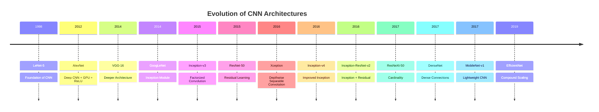
## 4. Evolution of CNN Architectures

| Architecture | Year | Main Limitation Addressed | Core Architectural Idea | Representative Contribution |
|--------------|:---:|---------------------------|--------------------------|-----------------------------|
| **[LeNet-5](#51-lenet-5)** | 1998 | Automatic feature extraction for handwritten character recognition | Convolution + Average Pooling + Hierarchical Feature Learning | Đặt nền tảng cho Convolutional Neural Networks. [[Paper]](https://ieeexplore.ieee.org/document/726791) |
| **[AlexNet](#52-alexnet)** | 2012 | CNN chưa mở rộng hiệu quả trên ImageNet | Deep CNN + ReLU + Dropout + GPU Training | Mở đầu kỷ nguyên Deep Learning trong Computer Vision. [[Paper]](https://papers.nips.cc/paper_files/paper/2012/hash/c399862d3b9d6b76c8436e924a68c45b-Abstract.html) |
| **[VGG-16](#53-vgg-16)** | 2014 | Khả năng biểu diễn của mạng còn hạn chế | Deep Architecture với các convolution \(3\times3\) | Chứng minh việc tăng độ sâu giúp cải thiện độ chính xác. [[Paper]](https://arxiv.org/abs/1409.1556) |
| **[GoogLeNet (Inception-v1)](#54-googlenet-inception-v1)** | 2014 | Chi phí tính toán tăng khi tăng depth và width | Inception Module + \(1\times1\) Convolution | Khai thác đặc trưng đa tỷ lệ với chi phí thấp hơn. [[Paper]](https://arxiv.org/abs/1409.4842) |
| **[Inception-v3](#55-inception-v3)** | 2015 | Chi phí convolution lớn | Factorized Convolution + Batch Normalization | Giảm FLOPs và tăng hiệu quả huấn luyện. [[Paper]](https://arxiv.org/abs/1512.00567) |
| **[ResNet-50](#56-resnet-50)** | 2015 | Vanishing Gradient trong mạng rất sâu | Residual Learning (Skip Connection) | Cho phép huấn luyện mạng sâu trên 100 lớp. [[Paper]](https://arxiv.org/abs/1512.03385) |
| **[Xception](#57-xception)** | 2017 | Convolution truyền thống chưa tối ưu | Depthwise Separable Convolution | Tăng hiệu quả biểu diễn và giảm chi phí tính toán. [[Paper]](https://arxiv.org/abs/1610.02357) |
| **[Inception-v4](#58-inception-v4)** | 2017 | Cần cải thiện hiệu quả của Inception | Redesigned Inception Blocks | Cải thiện độ chính xác và tốc độ hội tụ. [[Paper]](https://arxiv.org/abs/1602.07261) |
| **[Inception-ResNet-v2](#59-inception-resnet-v2)** | 2017 | Huấn luyện Inception còn chậm | Inception + Residual Connections | Kết hợp ưu điểm của Inception và ResNet. [[Paper]](https://arxiv.org/abs/1602.07261) |
| **[ResNeXt-50](#510-resnext-50)** | 2017 | Chỉ tăng depth hoặc width chưa hiệu quả | Grouped Convolution (Cardinality) | Cải thiện hiệu năng mà không tăng đáng kể số tham số. [[Paper]](https://arxiv.org/abs/1611.05431) |
| **[DenseNet](#511-densenet)** | 2017 | Feature reuse và gradient propagation | Dense Connections | Tăng khả năng truyền đặc trưng và giảm số lượng tham số. [[Paper]](https://arxiv.org/abs/1608.06993) |
| **[MobileNet-v1](#512-mobilenet-v1)** | 2017 | CNN quá nặng cho thiết bị di động | Depthwise Separable Convolution | Thiết kế CNN nhẹ cho Mobile và Edge Devices. [[Paper]](https://arxiv.org/abs/1704.04861) |
| **[EfficientNet](#513-efficientnet)** | 2019 | Scaling depth, width và resolution chưa cân bằng | Compound Scaling | Tối ưu đồng thời Accuracy, Parameters và FLOPs. [[Paper]](https://arxiv.org/abs/1905.11946) |

> Bảng trên chỉ cung cấp tổng quan về quá trình phát triển của các kiến trúc CNN và mục tiêu thiết kế của từng mô hình. Các phần tiếp theo sẽ trình bày chi tiết từng kiến trúc theo cùng một cấu trúc phân tích, bao gồm bối cảnh ra đời, vấn đề cần giải quyết, ý tưởng thiết kế, kiến trúc mạng, nguyên lý hoạt động, ưu điểm, hạn chế và các ứng dụng tiêu biểu, bắt đầu từ __LeNet-5__ và kết thúc với __EfficientNet__.

## 5. Representative CNN Architectures

Các kiến trúc CNN đã phát triển qua nhiều thế hệ nhằm cải thiện khả năng học đặc trưng, tối ưu hóa quá trình huấn luyện và giảm chi phí tính toán. Mặc dù có sự khác biệt về cấu trúc, hầu hết các kiến trúc đều được xây dựng dựa trên các thành phần cơ bản của CNN như Convolution Layer, Activation Function, Pooling Layer và Fully Connected Layer.

Một số quy ước về ký hiệu sử dụng cho các kiến trúc.

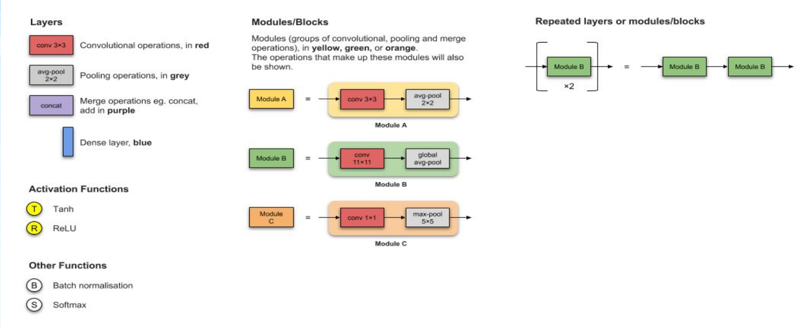

### 5.1. LeNet-5

#### Overview

LeNet-5 được đề xuất bởi Yann LeCun và cộng sự vào năm 1998, là một trong những kiến trúc CNN đầu tiên được ứng dụng thành công cho bài toán nhận dạng chữ số viết tay. Kiến trúc này đặt nền móng cho sự phát triển của các mạng CNN hiện đại thông qua việc sử dụng Convolution và Pooling để tự động học đặc trưng từ ảnh.

#### Architecture Flow

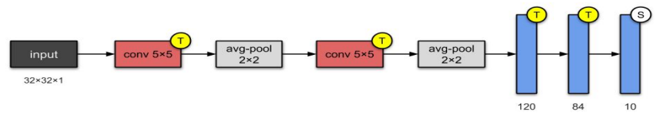

- __Convolution Layer__ trích xuất các đặc trưng cục bộ như cạnh và đường nét.
- __Average Pooling Layer__ giảm kích thước feature map và giữ lại thông tin tổng quát.
- __Fully Connected Layer__ tổng hợp các đặc trưng đã học để thực hiện phân loại.

#### Key Contribution

LeNet-5 giới thiệu các nguyên lý cốt lõi của CNN, bao gồm:

- Sử dụng Convolution để học đặc trưng tự động.
- Giảm số lượng tham số thông qua local receptive field và weight sharing.
- Kết hợp Pooling để giảm kích thước đặc trưng.
- Xây dựng mô hình học đặc trưng theo nhiều mức (hierarchical feature learning).

### 5.2. AlexNNet

#### Overview

AlexNet được đề xuất bởi Alex Krizhevsky, Ilya Sutskever và Geoffrey Hinton vào năm 2012, đánh dấu bước ngoặt của Deep Learning trong lĩnh vực Computer Vision khi chiến thắng cuộc thi ImageNet Large Scale Visual Recognition Challenge (ILSVRC 2012). So với LeNet-5, AlexNet sử dụng mạng sâu hơn và kết hợp các kỹ thuật như ReLU, Dropout và GPU Training để cải thiện hiệu quả huấn luyện trên tập dữ liệu lớn.

#### Architecture Flow

Luồng xử lý của AlexNet được xây dựng theo kiến trúc CNN sâu, bao gồm nhiều lớp tích chập và pooling trước khi thực hiện phân loại.

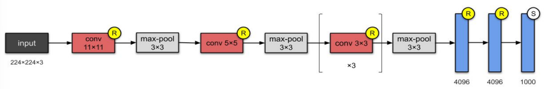

- Convolution Layers trích xuất các đặc trưng từ mức thấp đến mức cao.
- ReLU giúp tăng tốc độ hội tụ và giảm hiện tượng vanishing gradient.
- Max Pooling giảm kích thước feature map và giữ lại các đặc trưng quan trọng.
- Fully Connected Layers tổng hợp đặc trưng để thực hiện phân loại cuối cùng.
- Softmax chuyển đổi đầu ra thành xác suất của các lớp.

#### Key Contribution

AlexNet mang lại nhiều cải tiến quan trọng so với LeNet-5:

- Tăng độ sâu của mạng CNN để học đặc trưng phức tạp hơn.
- Áp dụng ReLU thay cho Sigmoid/Tanh nhằm tăng tốc quá trình huấn luyện.
- Sử dụng Dropout để giảm hiện tượng overfitting.
- Huấn luyện mô hình bằng GPU, giúp xử lý tập dữ liệu ImageNet có quy mô lớn.

### 5.3. VGG-16

#### Overview

VGG-16 được đề xuất bởi Karen Simonyan và Andrew Zisserman thuộc University of Oxford vào năm 2014. Kiến trúc này được phát triển nhằm nghiên cứu ảnh hưởng của độ sâu (depth) đối với hiệu năng của CNN. Thay vì sử dụng các kernel lớn, VGG-16 chỉ sử dụng convolution $3 \times 3$ xếp chồng nhiều lớp để tăng khả năng học đặc trưng mà vẫn giữ kiến trúc đơn giản và đồng nhất.

#### Architecture Flow

VGG-16 gồm 13 lớp Convolution và 3 lớp Fully Connected, với các khối Convolution được xen kẽ bởi các lớp Max Pooling để giảm kích thước feature map.

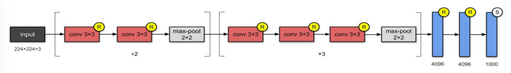

- Convolution $3 \times 3$ được lặp lại nhiều lần để tăng khả năng trích xuất đặc trưng.
- Max Pooling giảm kích thước feature map sau mỗi khối Convolution.
- Fully Connected Layers tổng hợp các đặc trưng đã học để thực hiện phân loại.
- Softmax tạo xác suất cho từng lớp đầu ra.

#### Key Contribution

VGG-16 mang lại những cải tiến quan trọng so với AlexNet:

- Chứng minh rằng tăng độ sâu của mạng giúp cải thiện khả năng học biểu diễn và độ chính xác.
- Chuẩn hóa thiết kế CNN bằng cách sử dụng thống nhất kernel 3×3 trong toàn bộ mạng.
- Cung cấp kiến trúc đơn giản, dễ triển khai và trở thành mô hình nền cho nhiều nghiên cứu và bài toán transfer learning.

### 5.4. GoogleNet (Inception vl)

#### Overview

GoogLeNet (Inception-v1) được đề xuất bởi Christian Szegedy và cộng sự tại Google vào năm 2014. Kiến trúc này được thiết kế nhằm giải quyết bài toán tăng độ sâu và độ rộng của CNN mà không làm chi phí tính toán tăng quá lớn. Điểm nổi bật của GoogLeNet là Inception Module, cho phép trích xuất đặc trưng ở nhiều tỷ lệ (multi-scale features) trong cùng một lớp mạng.

#### Architecture Flow

Khác với VGG chỉ sử dụng một loại kernel, GoogLeNet xử lý dữ liệu thông qua nhiều nhánh song song trong Inception Module, sau đó kết hợp kết quả để tạo feature map đầu ra.

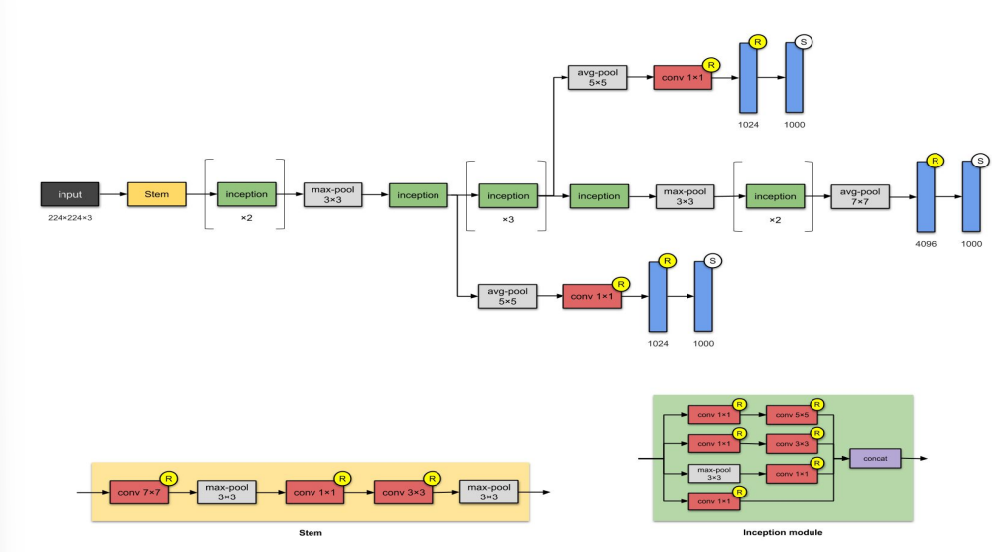

- Ta có thể nhìn thấy ở khu __Inception Module__, dữ liệu được xử lý đồng thời qua nhiều nhánh với các kích thước kernel khác nhau.
     - $1 \times 1$ __Convolution__ được sử dụng để giảm số lượng kênh (dimension reduction), từ đó giảm chi phí tính toán.
     - $3 \times 3$ và $5 \times 5$ __Convolution__ học đặc trưng ở các tỷ lệ khác nhau.
     - __Max Pooling__ giữ lại các đặc trưng nổi bật.
     - Các đầu ra được __Concatenate__ để tạo thành feature map có khả năng biểu diễn phong phú hơn.

#### Key Contribution

GoogLeNet mang đến những cải tiến quan trọng so với VGG:

- Giới thiệu __Inception Module__, cho phép học đặc trưng đa tỷ lệ trong cùng một tầng mạng.
- Sử dụng $1 \times 1$ __Convolution__ để giảm số lượng tham số và chi phí tính toán.
- Thay thế các lớp Fully Connected lớn bằng __Global Average Pooling__, giúp giảm số lượng tham số và hạn chế overfitting.
- Đạt độ chính xác cao trên ImageNet với số lượng tham số ít hơn đáng kể so với các kiến trúc CNN trước đó.

### 5.5. Inception-v3

#### Overview

Inception-v3 được đề xuất bởi Christian Szegedy và cộng sự tại Google vào năm 2015 như một phiên bản cải tiến của GoogLeNet (Inception-v1). Kiến trúc này tập trung vào giảm chi phí tính toán và tăng hiệu quả học đặc trưng thông qua việc factorize convolution (phân tách phép tích chập), Batch Normalization và các kỹ thuật tối ưu hóa quá trình huấn luyện.

#### Architecture Flow

Inception-v3 vẫn sử dụng các Inception Modules, nhưng thay thế các kernel lớn bằng nhiều kernel nhỏ hơn để giảm số lượng phép tính và tham số.

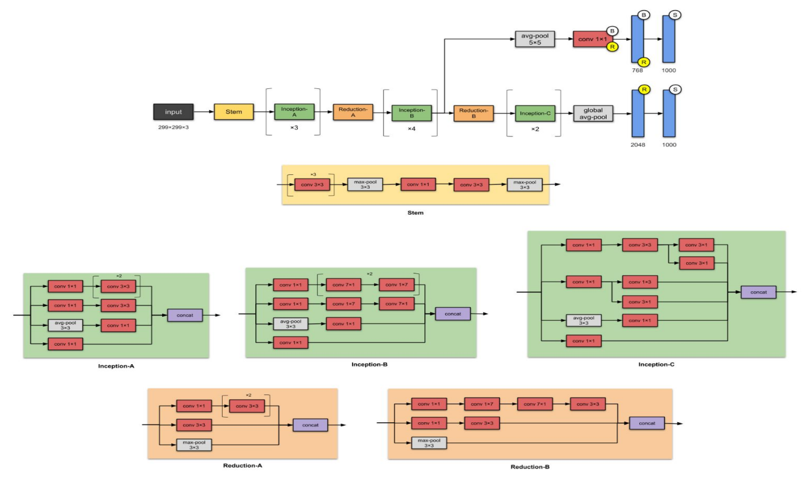

- __Inception Modules__ trích xuất đặc trưng ở nhiều tỷ lệ khác nhau.
- __Factorized Convolution__ thay thế các kernel lớn (ví dụ 5×5) bằng nhiều kernel nhỏ hơn (như 3×3 hoặc 1×3 và 3×1) để giảm chi phí tính toán.
- __Grid Reduction__ giảm kích thước feature map trong khi vẫn duy trì khả năng biểu diễn.
- __Global Average Pooling__ tổng hợp đặc trưng trước khi đưa vào lớp phân loại.

#### Key Contribution

Inception-v3 cải tiến GoogLeNet thông qua các điểm chính:

- Áp dụng __Factorized Convolution__ để giảm số lượng phép tính và tham số.
- Sử dụng __Batch Normalization__ giúp quá trình huấn luyện ổn định và hội tụ nhanh hơn.
- Thiết kế các __Inception Modules__ hiệu quả hơn, tăng khả năng học đặc trưng đa tỷ lệ.
- Cải thiện độ chính xác trên ImageNet trong khi vẫn duy trì hiệu quả tính toán.

### 5.6. ResNet-50

#### Overview

ResNet-50 được đề xuất bởi Kaiming He và cộng sự vào năm 2015 nhằm giải quyết hiện tượng __degradation problem__, khi việc tăng số lượng lớp không còn cải thiện độ chính xác của mô hình. Kiến trúc này giới thiệu __skip connection (identity shortcut)__, cho phép thông tin được truyền trực tiếp qua nhiều lớp, giúp quá trình huấn luyện mạng sâu trở nên ổn định hơn.

#### Architecture Flow

ResNet-50 được xây dựng từ các __Conv Block__ và __Identity Block__, kết hợp với các lớp Convolution, Pooling và Global Average Pooling.

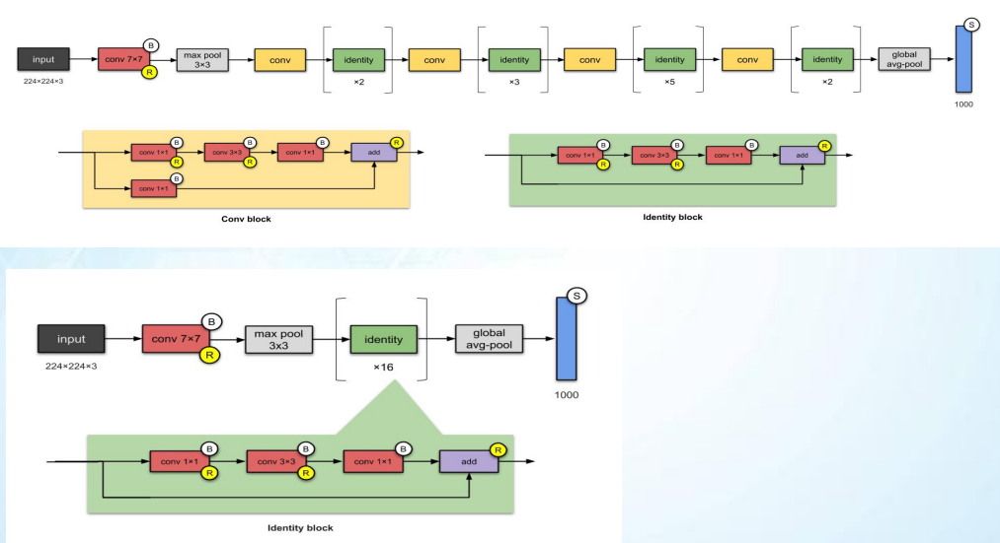

- __Conv Block__ được sử dụng khi cần thay đổi kích thước feature map hoặc số lượng kênh.
- __Identity Block__ giữ nguyên kích thước đầu vào và sử dụng identity shortcut để truyền trực tiếp đặc trưng sang đầu ra của block.
- __Global Average Pooling__ tổng hợp đặc trưng trước khi thực hiện phân loại.

#### Key Contribution

ResNet-50 mang đến những cải tiến quan trọng:

- Giới thiệu __identity shortcut (skip connection)__ giúp cải thiện quá trình lan truyền gradient.
- Cho phép huấn luyện các mạng CNN có độ sâu lớn mà vẫn duy trì hiệu quả.
- Trở thành backbone phổ biến trong nhiều mô hình Computer Vision hiện đại như Faster R-CNN, Mask R-CNN và FPN.

### 5.7. Xception

#### Overview

Xception (_Extreme Inception_) được đề xuất bởi __François Chollet__ vào năm 2017 như một phiên bản mở rộng của kiến trúc Inception. Thay vì sử dụng các nhánh Inception phức tạp, Xception áp dụng __Depthwise Separable Convolution__, trong đó quá trình học __đặc trưng không gian (spatial features)__ và __đặc trưng theo kênh (channel features)__ được tách thành hai bước độc lập. Thiết kế này giúp giảm chi phí tính toán đồng thời vẫn duy trì khả năng biểu diễn mạnh.

#### Architecture Flow

Xception được tổ chức thành ba phần chính: __Entry Flow__ (Conv A), __Middle Flow__ (Conv B) và __Exit Flow__ (Conv C), với các __Depthwise Separable Convolution__ được sử dụng xuyên suốt toàn bộ mạng.

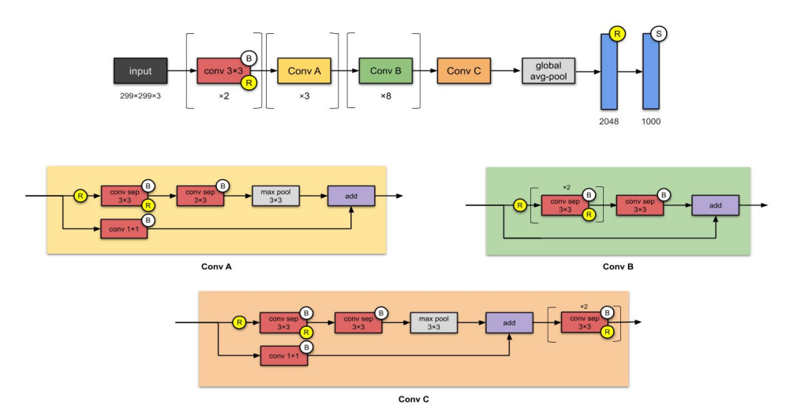

- __Entry Flow__ trích xuất các đặc trưng ban đầu và giảm kích thước feature map.
- __Middle Flow__ gồm nhiều block lặp lại để học đặc trưng sâu hơn.
- __Exit Flow__ tổng hợp đặc trưng trước khi thực hiện phân loại.
- __Depthwise Separable Convolution__ thay thế convolution truyền thống nhằm giảm số lượng tham số và phép tính.

#### Key Contribution

Xception mang đến những cải tiến quan trọng so với Inception-v3:

Thay thế Inception Module bằng Depthwise Separable Convolution với kiến trúc đơn giản hơn.
Tách riêng quá trình học đặc trưng không gian và đặc trưng theo kênh, giúp tăng hiệu quả học biểu diễn.
Giảm số lượng tham số và chi phí tính toán so với convolution thông thường.
Đạt hiệu năng cao trên ImageNet với kiến trúc gọn và dễ mở rộng.

### 5.8. Inception-v4

#### Overview

__Inception-v4__ được đề xuất bởi __Christian Szegedy__ và cộng sự vào năm 2016 nhằm tiếp tục cải tiến họ kiến trúc Inception. Mô hình được thiết kế với cấu trúc đồng nhất và mô-đun hóa, kết hợp nhiều __Inception Modules__ cùng các __Reduction Modules__ để tăng khả năng học đặc trưng trong khi vẫn duy trì hiệu quả tính toán.

#### Architecture Flow

Inception-v4 được tổ chức thành các nhóm __Stem, Inception Modules và Reduction Modules__, giúp trích xuất đặc trưng ở nhiều mức độ khác nhau trước khi thực hiện phân loại.

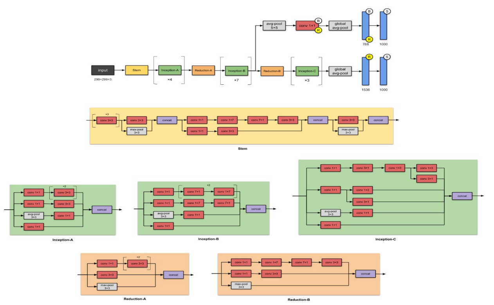

- Stem thực hiện các bước trích xuất đặc trưng ban đầu từ ảnh đầu vào.
- Inception-A, B và C học đặc trưng ở nhiều tỷ lệ thông qua các nhánh Convolution song song.
- Reduction-A và Reduction-B giảm kích thước feature map để tăng hiệu quả tính toán.
- Global Average Pooling tổng hợp đặc trưng trước khi đưa vào lớp phân loại.

#### Key Contribution

Inception-v4 mang lại những cải tiến quan trọng so với Inception-v3:

- Chuẩn hóa và đơn giản hóa thiết kế của Inception Modules.
- Sử dụng các Reduction Modules để giảm kích thước feature map hiệu quả hơn.
- Tăng khả năng học đặc trưng với kiến trúc sâu và đồng nhất.
- Đạt độ chính xác cao hơn trên ImageNet trong khi vẫn duy trì hiệu quả tính toán.

### 5.9. Inception-ResNet-V2

#### Overview

Inception-ResNet-v2 được đề xuất bởi Christian Szegedy và cộng sự vào năm 2016 nhằm kết hợp ưu điểm của Inception và ResNet. Kiến trúc này sử dụng các __Inception Modules__ để học đặc trưng đa tỷ lệ, đồng thời tích hợp __Residual Connections (Skip Connections)__ giúp cải thiện quá trình lan truyền gradient và tăng tốc độ hội tụ khi huấn luyện mạng sâu.

#### Architecture Flow

Inception-ResNet-v2 được xây dựng từ các khối Stem, Inception-ResNet Modules và Reduction Modules, sau đó sử dụng Global Average Pooling để thực hiện phân loại.

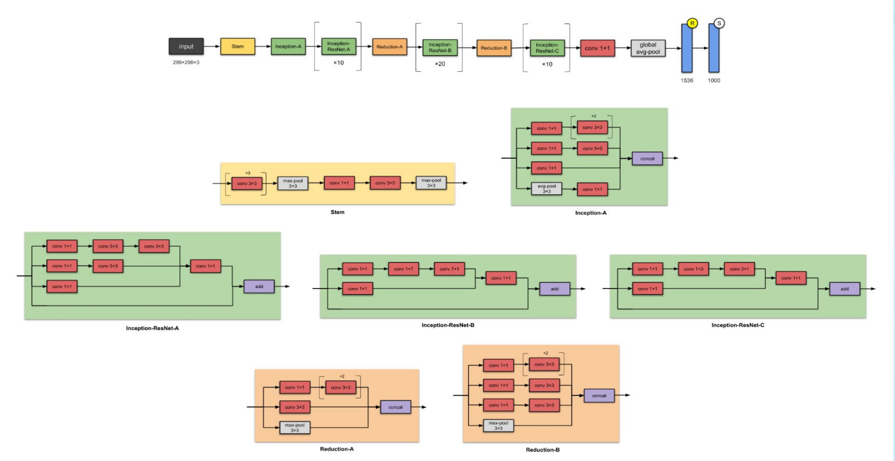

- Stem trích xuất các đặc trưng ban đầu từ ảnh đầu vào.
- Inception-ResNet Modules khai thác đặc trưng ở nhiều tỷ lệ thông qua các nhánh Convolution song song và sử dụng Residual Connection để truyền thông tin trực tiếp đến đầu ra của module.
- Reduction Modules giảm kích thước feature map nhằm tối ưu chi phí tính toán.
- Global Average Pooling tổng hợp đặc trưng trước khi thực hiện phân loại.

#### Key Contribution

Inception-ResNet-v2 kế thừa và kết hợp các ưu điểm của hai kiến trúc trước:

- Kết hợp Inception Modules và Residual Connections trong cùng một kiến trúc.
- Cải thiện quá trình lan truyền gradient, giúp huấn luyện các mạng sâu ổn định hơn.
- Duy trì khả năng học đặc trưng đa tỷ lệ của Inception đồng thời tăng tốc độ hội tụ nhờ cơ chế Residual Learning.
- Đạt hiệu năng cao trên ImageNet và trở thành một trong những kiến trúc CNN tiêu biểu của họ Inception.

### 5.10. ResNetXt-50

#### Overview

ResNeXt-50 được đề xuất bởi Saining Xie và cộng sự tại Facebook AI Research (FAIR) vào năm 2017. Kiến trúc này được phát triển dựa trên ResNet, với mục tiêu tăng khả năng học đặc trưng mà không làm tăng đáng kể số lượng tham số và chi phí tính toán. Điểm nổi bật của ResNeXt là giới thiệu khái niệm __Cardinality__, trong đó nhiều nhánh Convolution giống nhau được xử lý song song bằng __Grouped Convolution__.

#### Architecture Flow

ResNeXt-50 vẫn sử dụng kiến trúc tổng thể của ResNet nhưng thay thế các __Residual Blocks__ bằng __ResNeXt Blocks__, trong đó phép tích chập được thực hiện trên nhiều nhóm (groups) song song.

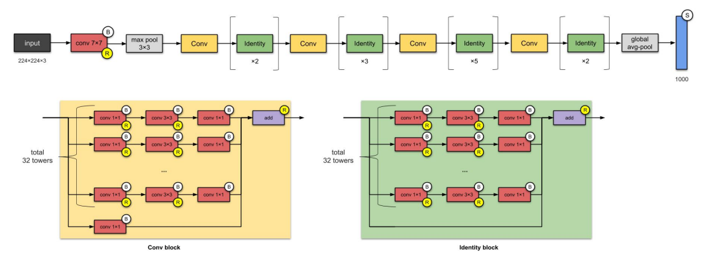

- Bên trong một ResNeXt Block, dữ liệu được chia thành nhiều nhánh thông qua Grouped Convolution, sau đó hợp nhất bằng phép cộng với Skip Connection.

     - __Grouped Convolution__ chia các kênh đầu vào thành nhiều nhóm để xử lý song song.
     - __Cardinality__ là số lượng nhóm Convolution, giúp tăng khả năng học đặc trưng mà không cần tăng quá nhiều độ sâu hoặc độ rộng của mạng.
     - __Skip Connection__ truyền trực tiếp thông tin từ đầu vào đến đầu ra của block để hỗ trợ lan truyền gradient.

#### Key Contribution

ResNeXt-50 mang lại những cải tiến quan trọng so với ResNet-50:

- Giới thiệu khái niệm __Cardinality__ như một chiều mở rộng mới của CNN bên cạnh __Depth__ và __Width__.
- Sử dụng __Grouped Convolution__ để tăng khả năng biểu diễn với chi phí tính toán hợp lý.
- Giữ nguyên thiết kế đơn giản của ResNet nhưng cải thiện hiệu năng trên nhiều bài toán nhận dạng ảnh.
- Trở thành nền tảng cho nhiều kiến trúc CNN hiệu quả trong các bài toán Computer Vision.

### 5.11. DenseNet

#### Overview

__DenseNet (Densely Connected Convolutional Network)__ được đề xuất bởi Gao Huang và cộng sự vào năm 2017. Kiến trúc này được phát triển nhằm cải thiện __feature propagation__, tăng khả năng __tái sử dụng đặc trưng (feature reuse)__ và giảm số lượng tham số của mô hình. Khác với ResNet sử dụng phép cộng (addit_ion) giữa các tầng, DenseNet kết nối trực tiếp mọi tầng với tất cả các tầng phía trước thông qua phép concatenation.

#### Architecture Flow

DenseNet được xây dựng từ nhiều __Dense Blocks__ và __Transition Layers__. Trong mỗi __Dense Block__, đầu ra của một tầng được truyền đến tất cả các tầng phía sau, giúp các đặc trưng được tái sử dụng trong toàn bộ mạng.

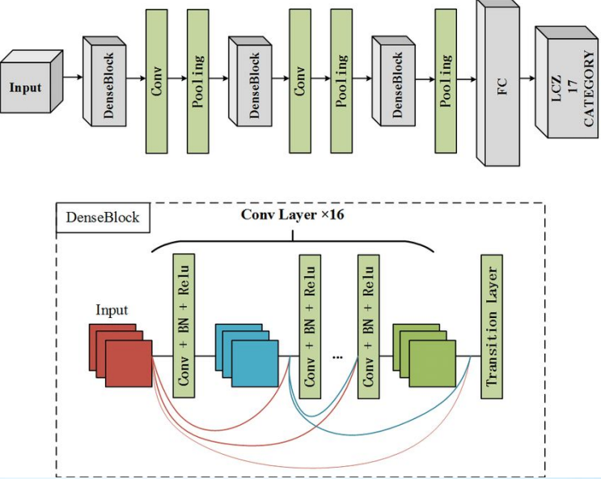

- Bên trong một Dense Block, các feature maps được nối (Concatenate) thay vì cộng như trong ResNet.

- Dense Block kết nối mỗi tầng với tất cả các tầng trước đó thông qua Concatenation.
- Transition Layer sử dụng Convolution và Pooling để giảm kích thước feature map giữa các Dense Blocks.
- Global Average Pooling tổng hợp đặc trưng trước khi thực hiện phân loại.

#### Key Contribution

DenseNet mang lại nhiều cải tiến quan trọng so với ResNeXt:

- Giới thiệu Dense Connectivity, trong đó mỗi tầng nhận đầu vào từ tất cả các tầng trước đó.
- Tăng khả năng feature reuse, giúp mô hình học đặc trưng hiệu quả hơn.
- Cải thiện quá trình lan truyền gradient, giảm hiện tượng vanishing gradient.
- Đạt hiệu năng cao với số lượng tham số ít hơn nhiều so với các kiến trúc CNN có độ sâu tương đương.

### 5.12. MobileNet v1

#### Overview

MobileNet-v1 được đề xuất bởi Andrew G. Howard và cộng sự tại Google vào năm 2017 nhằm xây dựng một kiến trúc CNN nhẹ, hiệu quả và phù hợp với các thiết bị có tài nguyên tính toán hạn chế như điện thoại thông minh, thiết bị nhúng và Edge AI. Điểm nổi bật của MobileNet-v1 là sử dụng __Depthwise Separable Convolution__ để giảm đáng kể số lượng tham số và phép tính so với Convolution truyền thống.

#### Architecture Flow

MobileNet-v1 được xây dựng từ nhiều __Depthwise Separable Convolution Blocks__ (DS Conv), trong đó mỗi block gồm hai bước: __Depthwise Convolution và Pointwise Convolution.__

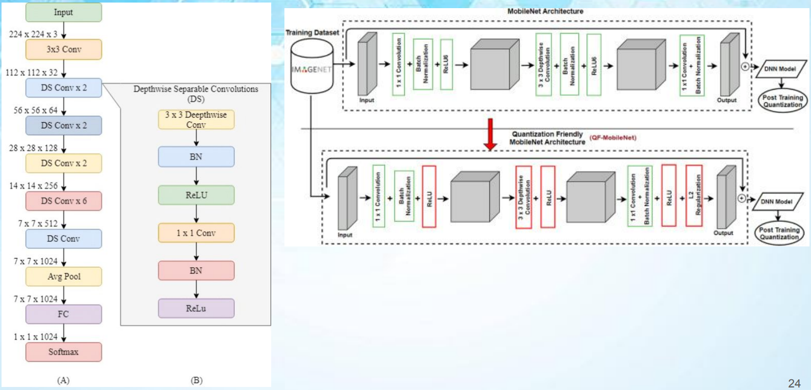

- __Depthwise Convolution__ thực hiện phép tích chập độc lập trên từng kênh đầu vào để học đặc trưng không gian (spatial features).
- __Pointwise Convolution__ ($1 \times 1$) kết hợp thông tin giữa các kênh để tạo feature map đầu ra.
- __Global Average Pooling__ tổng hợp đặc trưng trước khi thực hiện phân loại.

#### Key Contribution

MobileNet-v1 mang đến những cải tiến quan trọng so với DenseNet và các CNN truyền thống:

- Giới thiệu __Depthwise Separable Convolution__ nhằm giảm số lượng tham số và phép tính.
- Giảm đáng kể chi phí tính toán nhưng vẫn duy trì độ chính xác ở mức tốt.
- Được thiết kế cho các thiết bị __Mobile, Embedded Systems và Edge Computing__.
- Trở thành nền tảng cho nhiều kiến trúc CNN nhẹ như __MobileNet-v2, MobileNet-v3__ và các mô hình tối ưu cho thiết bị di động.

### 5.13. EfficientNet

#### Overview

__EfficientNet__ được đề xuất bởi Mingxing Tan và Quoc V. Le tại Google Research vào năm 2019 nhằm giải quyết bài toán mở rộng (scaling) mô hình CNN. Trước đây, các kiến trúc thường chỉ tăng __độ sâu (depth), độ rộng (width) hoặc độ phân giải ảnh (resolution)__ một cách riêng lẻ. EfficientNet giới thiệu phương pháp __Compound Scaling__, cho phép mở rộng đồng thời cả ba yếu tố theo một tỷ lệ cân bằng để đạt hiệu năng cao với chi phí tính toán hợp lý.

#### Architecture Flow

EfficientNet sử dụng __MBConv (Mobile Inverted Bottleneck Convolution) Blocks__ làm đơn vị tính toán chính. Kiến trúc bắt đầu bằng lớp Convolution ban đầu (Stem), tiếp theo là chuỗi các MBConv Blocks, sau đó tổng hợp đặc trưng bằng __Global Average Pooling__ trước khi thực hiện phân loại.

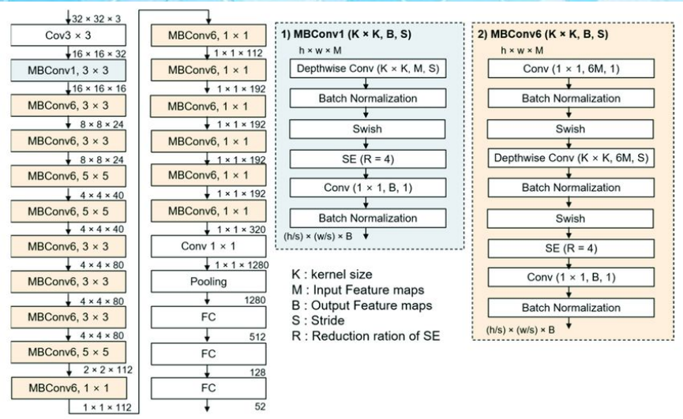

- Stem Conv trích xuất các đặc trưng ban đầu từ ảnh đầu vào.
- MBConv1 được sử dụng ở giai đoạn đầu của mạng.
- MBConv6 là block chính, được lặp lại nhiều lần để học các đặc trưng ở nhiều mức khác nhau.
- Head Conv tổng hợp các feature maps trước khi đưa vào lớp phân loại.
- Global Average Pooling giảm số lượng tham số trước lớp Fully Connected.

#### Key Contribution
- Giới thiệu __Compound Scaling__, mở rộng đồng thời Depth, Width và Input Resolution theo một chiến lược thống nhất.
- Sử dụng __MBConv Blocks__ kết hợp __Squeeze-and-Excitation (SE)__ để tăng khả năng học đặc trưng với chi phí tính toán thấp.
- Áp dụng __Swish Activation Function__, giúp cải thiện khả năng tối ưu so với ReLU trong nhiều trường hợp.
- Đạt hiệu năng cao với số lượng tham số và FLOPs thấp hơn nhiều kiến trúc CNN trước đó.

## 6. Architecture Comparison

Bảng dưới đây tóm tắt các đặc điểm chính của những kiến trúc CNN tiêu biểu đã trình bày. Qua từng thế hệ, các mô hình tập trung giải quyết các vấn đề khác nhau như tăng khả năng học đặc trưng, giảm số lượng tham số, cải thiện quá trình huấn luyện mạng sâu và tối ưu chi phí tính toán.

| Architecture            | Year | Main Innovation             | Solved Problem                  | Main Building Block         | Advantages                          | Limitations                   |
| ----------------------- | :--: | --------------------------- | ------------------------------- | --------------------------- | ----------------------------------- | ----------------------------- |
| **LeNet-5**             | 1998 | Convolution + Pooling       | Automatic feature extraction    | Conv + Avg Pool             | Đơn giản, đặt nền tảng CNN          | Chỉ phù hợp bài toán nhỏ      |
| **AlexNet**             | 2012 | Deep CNN, ReLU, Dropout     | Huấn luyện CNN trên dữ liệu lớn | Conv + ReLU + Max Pool      | Accuracy cao hơn LeNet              | Nhiều tham số                 |
| **VGG-16**              | 2014 | Deep network với kernel 3×3 | Tăng khả năng biểu diễn         | Repeated Conv 3×3           | Kiến trúc đơn giản, dễ mở rộng      | Bộ nhớ và tính toán lớn       |
| **GoogLeNet**           | 2014 | Inception Module            | Giảm chi phí tính toán          | Multi-branch Convolution    | Hiệu quả tham số                    | Kiến trúc phức tạp            |
| **Inception-v3**        | 2015 | Factorized Convolution      | Tăng hiệu quả tính toán         | Improved Inception Module   | Accuracy cao, tối ưu hơn v1         | Thiết kế phức tạp             |
| **ResNet-50**           | 2015 | Skip Connection             | Degradation Problem             | Conv Block + Identity Block | Huấn luyện mạng rất sâu             | Chi phí tính toán vẫn cao     |
| **Xception**            | 2017 | Depthwise Separable Conv    | Giảm phép tính Convolution      | Depthwise Separable Conv    | Hiệu quả và ít tham số              | Phụ thuộc phần cứng để tối ưu |
| **Inception-v4**        | 2016 | Improved Inception          | Chuẩn hóa kiến trúc Inception   | Inception + Reduction       | Accuracy cao                        | Kiến trúc lớn                 |
| **Inception-ResNet-v2** | 2016 | Inception + Residual        | Tăng tốc huấn luyện mạng sâu    | Inception-Residual Block    | Hội tụ nhanh                        | Thiết kế phức tạp             |
| **ResNeXt-50**          | 2017 | Cardinality                 | Tăng khả năng biểu diễn         | Grouped Convolution         | Hiệu năng cao với số tham số hợp lý | Cần hỗ trợ Group Convolution  |
| **DenseNet**            | 2017 | Dense Connectivity          | Feature Reuse                   | Dense Block                 | Gradient tốt, ít tham số            | Tăng bộ nhớ do Concatenation  |
| **MobileNet-v1**        | 2017 | Depthwise Separable Conv    | Mobile/Embedded AI              | Depthwise + Pointwise Conv  | Nhẹ, nhanh                          | Accuracy thấp hơn CNN lớn     |
| **EfficientNet**        | 2019 | Compound Scaling            | Model Scaling                   | MBConv + Compound Scaling   | Accuracy/Computation cân bằng       | Kiến trúc tối ưu hóa phức tạp |

## 7. Sumary

Qua quá trình phát triển, các kiến trúc CNN đều được xây dựng trên nền tảng của __Convolution, Activation, Pooling và Fully Connected__, nhưng mỗi thế hệ tập trung giải quyết một hạn chế cụ thể của thế hệ trước:

- __LeNet-5__ đặt nền móng cho CNN hiện đại.
- __AlexNet__ chứng minh hiệu quả của Deep Learning trên ImageNet.
- __VGG__ khẳng định vai trò của việc tăng độ sâu mạng.
- __GoogLeNet và Inception__ tối ưu chi phí tính toán bằng kiến trúc đa nhánh.
- __ResNet và ResNeXt__ cải thiện khả năng huấn luyện mạng rất sâu thông qua __Skip Connection và Cardinality__.
- __DenseNet__ tăng cường tái sử dụng đặc trưng bằng __Dense Connectivity__.
- __MobileNet__ hướng tới các thiết bị có tài nguyên hạn chế bằng __Depthwise Separable Convolution__.
- __EfficientNet__ tối ưu việc mở rộng mô hình thông qua __Compound Scaling__, cân bằng giữa độ chính xác, số lượng tham số và chi phí tính toán.

Nhìn chung, xu hướng phát triển của CNN chuyển từ tăng độ sâu sang tối ưu hiệu quả tính toán, giảm số lượng tham số và cân bằng giữa hiệu năng và tài nguyên, tạo nền tảng cho nhiều mô hình thị giác máy tính hiện đại.

| Generation          | Representative Models                 | Main Objective                                    |
| ------------------- | ------------------------------------- | ------------------------------------------------- |
| **Foundation**      | LeNet-5                               | Xây dựng nền tảng của CNN                         |
| **Deep CNN**        | AlexNet, VGG                          | Tăng độ sâu để cải thiện Accuracy                 |
| **Efficient CNN**   | GoogLeNet, Inception-v3, Inception-v4 | Giảm chi phí tính toán                            |
| **Residual CNN**    | ResNet, Inception-ResNet, ResNeXt     | Huấn luyện mạng rất sâu                           |
| **Feature Reuse**   | DenseNet                              | Tăng khả năng lan truyền và tái sử dụng đặc trưng |
| **Lightweight CNN** | MobileNet                             | Triển khai trên thiết bị di động                  |
| **Model Scaling**   | EfficientNet                          | Cân bằng Accuracy và Computational Cost           |
