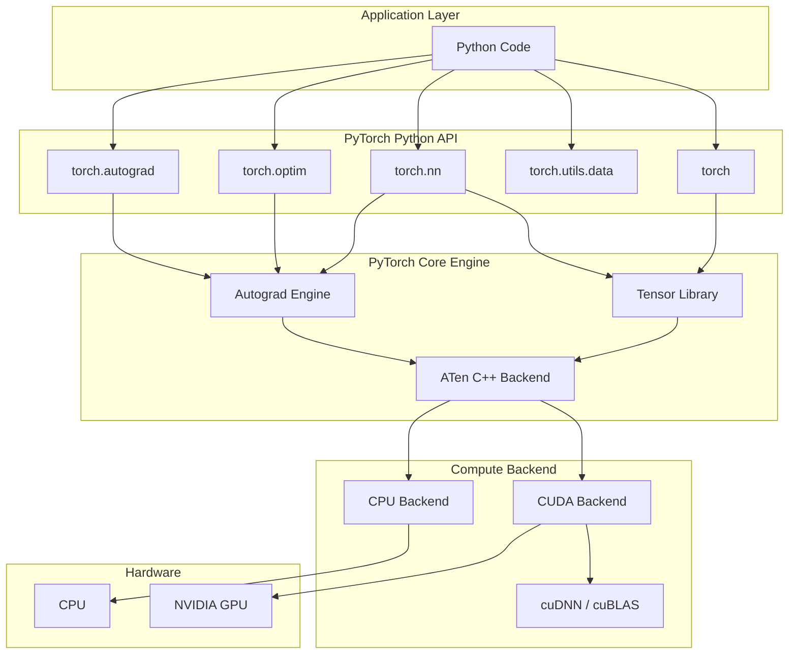
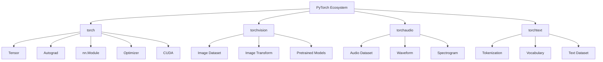

# PyTorch Technical Report

> **Mục tiêu:** Tài liệu học tập và báo cáo kỹ thuật về PyTorch, trình bày theo lộ trình từ cơ bản đến nâng cao, tập trung vào cơ chế hoạt động, Training Pipeline và ứng dụng trong Deep Learning hiện đại.

---

## Mục lục

- [Chương 1. Tổng quan về PyTorch](#chương-1-tổng-quan-về-pytorch)
- [Chương 2. Tensor trong PyTorch](#chương-2-tensor-trong-pytorch)
- [Chương 3. Automatic Differentiation (Autograd)](#chương-3-automatic-differentiation-autograd)
- [Chương 4. Neural Network API](#chương-4-neural-network-api)
- [Chương 5. Dataset và DataLoader](#chương-5-dataset-và-dataloader)
- [Chương 6. Training Pipeline](#chương-6-training-pipeline)
- [Phụ lục](#phụ-lục)
- [Tài liệu tham khảo](#tài-liệu-tham-khảo)

---

## Chương 1. Tổng quan về PyTorch

PyTorch là **framework mã nguồn mở dành cho Machine Learning và Deep Learning**, được phát triển bởi **Meta AI (Facebook AI Research - FAIR)**. Framework này cung cấp các thành phần cốt lõi để xây dựng, huấn luyện và triển khai mô hình học máy như **Tensor**, **Automatic Differentiation (Autograd)**, **Neural Network API (`torch.nn`)**, **Optimizer** và khả năng tăng tốc trên **GPU thông qua CUDA**.

Với thiết kế theo **Dynamic Computational Graph**, PyTorch cho phép xây dựng và thay đổi đồ thị tính toán ngay trong quá trình thực thi chương trình, giúp việc phát triển và thử nghiệm mô hình trở nên linh hoạt hơn. Hiện nay, PyTorch là nền tảng của nhiều mô hình Deep Learning hiện đại như **ResNet, Vision Transformer (ViT), BERT, GPT, LLaMA và Stable Diffusion**.


### 1.1 Giới thiệu PyTorch

| Thành phần | Nội dung |
|------------|----------|
| **What (PyTorch là gì?)** | PyTorch là framework mã nguồn mở dành cho Machine Learning và Deep Learning, được phát triển bởi Meta AI. Framework này cung cấp Tensor, Automatic Differentiation (Autograd), Neural Network API và các công cụ hỗ trợ huấn luyện, đánh giá và triển khai mô hình học sâu. |
| **Why (Tại sao sử dụng PyTorch?)** | PyTorch giúp đơn giản hóa quá trình xây dựng và huấn luyện mô hình Deep Learning thông qua Tensor, Autograd và các API cấp cao. Framework hỗ trợ GPU, dễ mở rộng, dễ debug và là nền tảng của nhiều mô hình hiện đại như ResNet, Vision Transformer, GPT, LLaMA và Stable Diffusion. |
| **Where (PyTorch được sử dụng ở đâu?)** | PyTorch được sử dụng trong nghiên cứu AI, phát triển sản phẩm Machine Learning và các hệ thống Deep Learning thuộc nhiều lĩnh vực như Computer Vision, Natural Language Processing (NLP), Speech Processing, Reinforcement Learning, Graph Neural Networks và Generative AI. |
| **When (Khi nào sử dụng PyTorch?)** | PyTorch được sử dụng khi cần xây dựng, huấn luyện, tinh chỉnh (Fine-tuning), đánh giá hoặc triển khai mô hình Deep Learning. Đây là framework phù hợp cho cả nghiên cứu, thử nghiệm thuật toán và phát triển hệ thống AI trong môi trường sản xuất. |
| **Who (Ai sử dụng PyTorch?)** | PyTorch được sử dụng bởi các nhà nghiên cứu AI, kỹ sư Machine Learning, kỹ sư Deep Learning, nhà khoa học dữ liệu và nhiều tổ chức như Meta, OpenAI, Microsoft, NVIDIA, Hugging Face cùng các trường đại học và phòng thí nghiệm nghiên cứu trên thế giới. |
| **How (PyTorch hoạt động như thế nào?)** | PyTorch xây dựng mô hình bằng các Tensor và `nn.Module`, sử dụng Autograd để tự động tính gradient trong quá trình lan truyền ngược (Backpropagation), sau đó Optimizer cập nhật trọng số nhằm tối ưu hàm mất mát. Toàn bộ quá trình có thể được tăng tốc bằng GPU thông qua CUDA. |

#### chọn PyTorch hay TensorFlow?

Mặc dù PyTorch và TensorFlow đều là những framework Deep Learning phổ biến, PyTorch hiện được sử dụng rộng rãi trong nghiên cứu và phát triển các mô hình AI hiện đại nhờ các ưu điểm sau:

- **Cú pháp gần với Python**, dễ đọc và dễ bảo trì, giúp rút ngắn thời gian phát triển.
- **Dynamic Computational Graph**, cho phép thay đổi cấu trúc mô hình trong quá trình thực thi, thuận tiện cho việc nghiên cứu và thử nghiệm các kiến trúc mới.
- **Hệ thống Automatic Differentiation (Autograd)** tự động tính gradient, giảm đáng kể khối lượng cài đặt thuật toán lan truyền ngược.
- **Khả năng tích hợp mạnh với hệ sinh thái AI hiện đại**, đặc biệt là Hugging Face Transformers, TorchVision, TorchAudio và nhiều thư viện nghiên cứu khác.
- **Được cộng đồng nghiên cứu ưu tiên sử dụng**, do phần lớn các bài báo khoa học và mô hình mã nguồn mở hiện nay đều cung cấp phiên bản PyTorch.

So với **TensorFlow 1.x**, PyTorch có ưu thế rõ rệt về khả năng lập trình và gỡ lỗi nhờ cơ chế Dynamic Graph. Từ **TensorFlow 2.x**, TensorFlow cũng đã chuyển sang cơ chế thực thi linh hoạt (Eager Execution), giúp khoảng cách giữa hai framework được thu hẹp. Tuy nhiên, PyTorch vẫn là lựa chọn phổ biến hơn trong lĩnh vực nghiên cứu AI và phát triển các mô hình Deep Learning tiên tiến.

| Tiêu chí | PyTorch | TensorFlow 2.x |
|----------|----------|----------------|
| Cú pháp Python | Rất trực quan | Trực quan |
| Dynamic Graph | Có | Có (Eager Execution) |
| Debug | Dễ | Tốt |
| Hệ sinh thái nghiên cứu | Rất mạnh | Mạnh |
| Triển khai Production | Tốt | Rất mạnh (TensorFlow Serving, TFLite) |

#### Vai trò và sự tiện lợi của PyTorch trong AI và Machine Learning

PyTorch cung cấp một quy trình thống nhất cho toàn bộ vòng đời của mô hình học máy, từ xử lý dữ liệu đến triển khai. Người phát triển không cần tự xây dựng các thành phần như tính gradient, cập nhật trọng số hay quản lý GPU, mà có thể tập trung vào thiết kế mô hình và giải quyết bài toán.

Nhờ đó, PyTorch được sử dụng trong nhiều lĩnh vực của AI và Machine Learning như:

- **Computer Vision:** Phân loại ảnh, phát hiện đối tượng, phân đoạn ảnh.
- **Natural Language Processing (NLP):** Dịch máy, phân loại văn bản, Large Language Models (LLMs).
- **Speech Processing:** Nhận dạng và tổng hợp giọng nói.
- **Reinforcement Learning:** Học tăng cường.
- **Generative AI:** GAN, Diffusion Models, Text-to-Image.
- **Graph Learning:** Graph Neural Networks (GCN, GAT).

### 1.2 Kiến trúc PyTorch

PyTorch được xây dựng theo kiến trúc nhiều tầng (Layered Architecture), trong đó mỗi tầng đảm nhiệm một nhóm chức năng riêng biệt. Kiến trúc này giúp tách biệt giữa giao diện lập trình Python, các thành phần tính toán của Deep Learning và tầng thực thi trên phần cứng.



---

| Tầng | Thành phần | Chức năng |
|------|------------|-----------|
| **Application Layer** | Python Code | Chương trình do người dùng viết để xây dựng và huấn luyện mô hình. |
| **PyTorch API Layer** | `torch`, `torch.nn`, `torch.optim`, `torch.autograd`, `torch.utils.data` | Cung cấp các API cấp cao để thao tác Tensor, xây dựng mô hình, tối ưu hóa và quản lý dữ liệu. |
| **Core Engine** | Tensor Library, Autograd Engine, ATen | Thực hiện các phép toán Tensor, xây dựng đồ thị tính toán và tự động tính gradient. |
| **Backend Layer** | CPU Backend, CUDA Backend, cuDNN, cuBLAS | Thực thi các phép toán trên CPU hoặc GPU và tận dụng các thư viện tối ưu của NVIDIA. |

#### 1.2.1. Application Layer

Đây là tầng cao nhất, nơi lập trình viên viết mã Python.

```python
model = MyModel()
optimizer = torch.optim.Adam(model.parameters())

for x, y in loader:
    pred = model(x)
    loss = criterion(pred, y)
```

Người dùng chỉ tương tác với API của PyTorch mà không cần quan tâm đến cách Tensor được tính toán ở tầng thấp.

#### 1.2.2. Pytorch API Layer

Đây là lớp giao tiếp giữa người dùng và hệ thống tính toán.

| Module | Vai trò |
|---------|----------|
| `torch` | Tensor và các phép toán số học |
| `torch.nn` | Xây dựng Neural Network |
| `torch.optim` | Thuật toán tối ưu |
| `torch.autograd` | Tự động tính gradient |
| `torch.utils.data` | Dataset và DataLoader |

Đây là các thư viện được sử dụng thường xuyên nhất khi phát triển mô hình Deep Learning.

#### 1.2.3. Core Engine

Đây là "trái tim" của PyTorch.

##### Tensor Library

Quản lý dữ liệu nhiều chiều (Tensor) và thực hiện các phép toán tuyến tính như:

- Matrix Multiplication
- Convolution
- Broadcasting
- Linear Algebra

##### Autograd Engine

Trong quá trình **Forward Propagation**, Autograd xây dựng **Computational Graph**.

Khi gọi `loss.backward()` Autograd tự động:

- duyệt đồ thị tính toán,
- áp dụng Chain Rule,
- tính gradient của mọi tham số cần tối ưu.

##### ATen Backend

ATen là thư viện C++ của PyTorch chịu trách nhiệm triển khai các phép toán Tensor hiệu năng cao.

```python
torch.matmul()
torch.conv2d()
torch.relu()
```
đều được ánh xạ xuống các hàm của ATen để thực thi trên CPU hoặc GPU.

#### 1.2.4. Backend Layer

Backend quyết định nơi các phép toán sẽ được thực hiện.

Nếu Tensor nằm trên CPU: `x = x.to("cpu")` mọi phép toán sẽ chạy trên CPU.

Nếu Tensor nằm trên GPU: `x = x.to("cuda")` PyTorch sẽ chuyển các phép toán sang CUDA Backend.

Đối với GPU NVIDIA, PyTorch còn sử dụng:

- **cuBLAS** để tối ưu các phép nhân ma trận (BLAS).
- **cuDNN** để tối ưu các phép tích chập (Convolution), Batch Normalization và các phép toán của Deep Learning.

Nhờ các thư viện này, tốc độ huấn luyện trên GPU thường nhanh hơn đáng kể so với CPU.

---

### 1.3 Hệ sinh thái PyTorch

PyTorch không chỉ là một thư viện duy nhất mà là **một hệ sinh thái (Ecosystem)** gồm nhiều thư viện được xây dựng xung quanh thư viện lõi `torch`. Mỗi thư viện được thiết kế để giải quyết một nhóm bài toán cụ thể trong lĩnh vực Trí tuệ nhân tạo (Artificial Intelligence - AI) và Học máy (Machine Learning - ML), giúp người phát triển có thể xây dựng toàn bộ quy trình từ xử lý dữ liệu, huấn luyện mô hình đến triển khai ứng dụng.

Thư viện **`torch`** đóng vai trò là nền tảng cốt lõi, cung cấp Tensor, Automatic Differentiation (Autograd), Neural Network API và các thuật toán tối ưu. Dựa trên nền tảng này, PyTorch phát triển thêm các thư viện chuyên biệt như: 
- **`torchvision`** cho Computer Vision
- **`torchaudio`** cho xử lý tín hiệu âm thanh 
- **`torchtext`** cho xử lý ngôn ngữ tự nhiên (NLP).

Kiến trúc hệ sinh thái PyTorch được minh họa như sau:



| Thư viện | Vai trò | Lĩnh vực |
|----------|----------|----------|
| **torch** | Thư viện lõi của PyTorch, cung cấp Tensor, Autograd, Neural Network, Optimizer và CUDA. | Deep Learning |
| **torchvision** | Hỗ trợ xử lý ảnh, tăng cường dữ liệu (Data Augmentation), bộ dữ liệu chuẩn và các mô hình Computer Vision có sẵn. | Computer Vision |
| **torchaudio** | Hỗ trợ đọc, xử lý và biến đổi dữ liệu âm thanh như Waveform, Spectrogram và Mel Spectrogram. | Audio Processing |
| **torchtext** | Hỗ trợ tiền xử lý văn bản, Tokenization, Vocabulary và Dataset cho các bài toán NLP. | Natural Language Processing |


---

## Chương 2. Tensor trong PyTorch

> Tensor là cấu trúc dữ liệu trung tâm của PyTorch. Mọi dữ liệu, tham số của mô hình và kết quả tính toán trong quá trình huấn luyện đều được biểu diễn dưới dạng Tensor. So với mảng NumPy, Tensor hỗ trợ **Automatic Differentiation (Autograd)** và có thể thực thi trên **CPU** hoặc **GPU (CUDA)**, giúp tăng tốc các phép toán trong Deep Learning.


### 2.1 Tensor

#### 2.1.1. Tensor là gì?

Tensor là một mảng nhiều chiều (N-dimensional Array) dùng để lưu trữ và xử lý dữ liệu số.

Tensor có thể được xem là sự tổng quát của:

| Đối tượng | Bậc (Rank) | Ví dụ |
|-----------|-----------:|--------|
| Scalar | 0-D | `5` |
| Vector | 1-D | `[1,2,3]` |
| Matrix | 2-D | `[[1,2],[3,4]]` |
| Tensor | ≥3-D | Ảnh RGB `(3,224,224)` |

#### 2.1.2. Shape

**Shape** là kích thước của Tensor trên từng chiều (Dimension). Và quyết định cách Tensor được lưu trữ và tính toán trong mô hình.

```python
x = torch.randn(32, 3, 224, 224)
print(x.shape)

# output:
torch.Size([32, 3, 224, 224])
```

| Giá trị | Ý nghĩa |
|---------:|----------|
| 32 | Batch Size |
| 3 | Channels (RGB) |
| 224 | Height |
| 224 | Width |

#### 2.1.3. Dimension

**Dimension (Dim)** là số lượng trục của Tensor.

Ví dụ các Dimension phổ biến:

| Tensor | Dimension |
|---------|----------:|
| `5` | 0 |
| `[1,2,3]` | 1 |
| `[[1,2],[3,4]]` | 2 |
| `(3,224,224)` | 3 |
| `(32,3,224,224)` | 4 |

Trong Deep Learning:

- 2-D: Dữ liệu dạng bảng (MLP)
- 3-D: Chuỗi thời gian, Embedding
- 4-D: Ảnh (CNN)
- 5-D: Video hoặc dữ liệu 3D


#### 2.1.4. Data Type

Mỗi Tensor có một kiểu dữ liệu (**dtype**) xác định cách lưu trữ và tính toán.

| Data Type | PyTorch | Ứng dụng |
|------------|----------|-----------|
| Integer 32-bit | `torch.int32` | Chỉ số, đếm |
| Integer 64-bit | `torch.int64` | Label, Index |
| Float 16-bit | `torch.float16` | Mixed Precision Training |
| Float 32-bit | `torch.float32` | Mặc định trong Deep Learning |
| Float 64-bit | `torch.float64` | Tính toán độ chính xác cao |
| Boolean | `torch.bool` | Điều kiện logic |

> **Khuyến nghị:** `torch.float32` là kiểu dữ liệu mặc định và được sử dụng phổ biến nhất khi huấn luyện mô hình Deep Learning vì cân bằng giữa tốc độ và độ chính xác.

### 2.2 Các phép toán Tensor

PyTorch cung cấp nhiều phép toán trên Tensor để xử lý dữ liệu và xây dựng mô hình Deep Learning. Một số phép toán cơ bản được sử dụng thường xuyên gồm:

| Phép toán | Mô tả | Ví dụ |
|-----------|-------|--------|
| **Indexing** | Truy cập một phần tử hoặc một chiều của Tensor theo chỉ số. | `x[0]`, `x[1,2]` |
| **Slicing** | Trích xuất một vùng dữ liệu của Tensor. | `x[:, 1:3]` |
| **Broadcasting** | Tự động mở rộng kích thước Tensor để thực hiện phép toán giữa các Tensor có shape tương thích. | `x + y` |
| **Matrix Multiplication** | Nhân hai ma trận hoặc Tensor theo quy tắc đại số tuyến tính. | `torch.matmul(A, B)` hoặc `A @ B` |
| **Reshape** | Thay đổi Shape của Tensor mà không làm thay đổi dữ liệu. | `x.reshape(2, 6)` |
| **Transpose** | Hoán đổi các chiều (Dimension) của Tensor. | `x.transpose(0, 1)` hoặc `x.T` |

### 2.3 Tensor và NumPy

Tensor trong PyTorch có nhiều điểm tương đồng với `ndarray` của NumPy, nhưng được mở rộng để phục vụ Deep Learning.

| Tiêu chí | Tensor (PyTorch) | NumPy |
|----------|------------------|--------|
| Cấu trúc dữ liệu | N-dimensional Array | N-dimensional Array |
| Automatic Differentiation | ✔️ Có (Autograd) | ❌ Không |
| GPU (CUDA) | ✔️ Hỗ trợ | ❌ Không |
| Neural Network | ✔️ Hỗ trợ | ❌ Không |
| Deep Learning | ✔️ Có | ❌ Không |

> **Kết luận:** NumPy phù hợp cho tính toán số học tổng quát, trong khi Tensor được thiết kế để xây dựng và huấn luyện các mô hình Deep Learning.


### 2.4 CPU và CUDA

PyTorch cho phép Tensor và mô hình thực thi trên **CPU** hoặc **GPU** thông qua **CUDA**.

#### CPU

CPU thực hiện các phép toán tuần tự và phù hợp với:

- Xử lý dữ liệu
- Huấn luyện mô hình nhỏ
- Suy luận (Inference)

---

#### GPU

GPU có hàng nghìn lõi xử lý song song, giúp tăng tốc các phép toán ma trận và Tensor trong Deep Learning.

Phù hợp với:

- Huấn luyện CNN
- Transformer
- Large Language Model
- Diffusion Model

---

#### CUDA Runtime

CUDA là nền tảng của NVIDIA cho phép PyTorch thực thi các phép toán Tensor trên GPU.

```python
device = torch.device("cuda")
```

Nếu không có GPU:

```python
device = torch.device("cpu")
```

---

#### Device Management

Để thực hiện tính toán, **Tensor và Model phải nằm trên cùng một thiết bị (Device)**.

```python
device = torch.device("cuda" if torch.cuda.is_available() else "cpu")

model.to(device)
x = x.to(device)
```

> **Lưu ý:** Nếu Tensor và Model ở hai thiết bị khác nhau (CPU và GPU), PyTorch sẽ phát sinh lỗi `RuntimeError: Expected all tensors to be on the same device`.

---

## Chương 3. Automatic Differentiation (Autograd)

Autograd là cơ chế **Automatic Differentiation** của PyTorch, cho phép tự động tính đạo hàm của hàm mất mát (Loss Function) đối với các tham số của mô hình. Đây là thành phần cốt lõi giúp thực hiện **Backpropagation** và tối ưu hóa mô hình mà không cần tự cài đặt công thức đạo hàm.

### 3.1 Computational Graph

**Computational Graph** là đồ thị có hướng mô tả toàn bộ các phép toán được thực hiện trên Tensor.

Trong quá trình **Forward Propagation**, PyTorch tự động xây dựng đồ thị này. Khi gọi `backward()`, Autograd sẽ duyệt ngược đồ thị để tính gradient của từng tham số.

> **Vai trò:** Lưu lại lịch sử các phép toán để phục vụ quá trình tính gradient.

---

### 3.2 Gradient

**Gradient** là đạo hàm của hàm mất mát theo từng tham số của mô hình.

$$
\frac{\partial L}{\partial \theta}
$$

Gradient cho biết:

- Hướng cần cập nhật tham số.
- Mức độ ảnh hưởng của mỗi tham số đến giá trị Loss.

Sau khi tính Gradient, Optimizer sẽ cập nhật trọng số để giảm Loss.

---

### 3.3 Chain Rule

**Chain Rule** là quy tắc đạo hàm của hàm hợp và là nền tảng của thuật toán **Backpropagation**.

Nếu $L=f(g(x))$ thì: $\frac{dL}{dx}=\frac{dL}{dg}\times\frac{dg}{dx}$

Autograd tự động áp dụng Chain Rule trên toàn bộ Computational Graph để tính gradient của tất cả các tham số trong mô hình.

---

### 3.4 Backpropagation

**Backpropagation** là thuật toán lan truyền ngược dùng để tính Gradient của các tham số trong mô hình.

Quá trình thực hiện:

1. Forward Propagation để tính dự đoán.
2. Tính Loss.
3. Backward Propagation để tính Gradient.
4. Optimizer cập nhật trọng số.

```python
loss.backward()
optimizer.step()
```

> **Vai trò:** Cung cấp Gradient để tối ưu mô hình.

---

### 3.5 requires_grad

`requires_grad` xác định Tensor có cần tính Gradient hay không.

```python
x = torch.tensor([1.0], requires_grad=True)
```

- `True`: Tensor được theo dõi trong Computational Graph.
- `False`: Không tính Gradient.

> **Ứng dụng:** Thường dùng cho các tham số cần huấn luyện.

---

### 3.6 backward()

`backward()` thực hiện lan truyền ngược trên Computational Graph để tính Gradient.

```python
loss.backward()
```

Sau khi gọi:

```python
parameter.grad
```

sẽ chứa Gradient của từng tham số.

> **Lưu ý:** Gradient được cộng dồn sau mỗi lần gọi `backward()`, vì vậy cần gọi `optimizer.zero_grad()` trước mỗi vòng lặp huấn luyện.

---

### 3.7 detach()

`detach()` tạo một Tensor mới tách khỏi Computational Graph.

```python
y = x.detach()
```

Tensor mới:

- Chia sẻ dữ liệu với Tensor gốc.
- Không theo dõi Gradient.
- Không tham gia Backpropagation.

> **Ứng dụng:** Sử dụng khi chỉ cần giá trị Tensor mà không muốn tính Gradient.

---

### 3.8 torch.no_grad()

`torch.no_grad()` tạm thời vô hiệu hóa Autograd trong một khối lệnh.

```python
with torch.no_grad():
    output = model(x)
```

Ứng dụng:

- Validation
- Inference
- Tiết kiệm bộ nhớ và tăng tốc tính toán.

> **Lưu ý:** Chỉ dùng `torch.no_grad()` khi không cần huấn luyện mô hình.

---

## Chương 4. Neural Network API

`torch.nn` là module của PyTorch cung cấp các thành phần để xây dựng mạng nơ-ron. Thay vì tự cài đặt từng phép toán, người dùng có thể sử dụng các lớp (Layer), hàm mất mát (Loss Function) và các module có sẵn để xây dựng mô hình Deep Learning.

### 4.1 nn.Module

`nn.Module` là lớp cơ sở (Base Class) của mọi mô hình trong PyTorch.

Mọi mạng thần kinh đều được xây dựng bằng cách kế thừa `nn.Module` và cài đặt phương thức `forward()`.

```python
import torch.nn as nn

class MLP(nn.Module):
    def __init__(self):
        super().__init__()
        self.fc = nn.Linear(10, 1)

    def forward(self, x):
        return self.fc(x)
```

> **Vai trò:** Quản lý các Layer, Parameter và định nghĩa kiến trúc của mô hình.

---

### 4.2 Parameter

**Parameter** là các tham số có thể học (Learnable Parameters) của mô hình, bao gồm **Weight** và **Bias**.

Trong quá trình huấn luyện:

- Forward Pass sử dụng Parameter để tính đầu ra.
- Backpropagation tính Gradient.
- Optimizer cập nhật Parameter để giảm Loss.

```python
for name, param in model.named_parameters():
    print(name, param.shape)
```

> **Vai trò:** Là các giá trị được tối ưu trong quá trình huấn luyện mô hình.

---

### 4.3 Forward Pass

**Forward Pass** là quá trình dữ liệu đi từ đầu vào qua các Layer để tạo ra dự đoán (Prediction).

Trong PyTorch, Forward Pass được định nghĩa trong hàm `forward()`.

```python
def forward(self, x):
    x = self.fc1(x)
    x = self.relu(x)
    x = self.fc2(x)
    return x
```

> **Vai trò:** Xác định luồng tính toán của mô hình và tạo đầu ra để tính hàm mất mát (Loss).

---

### 4.4 Loss Function

**Loss Function** là hàm đo mức sai lệch giữa giá trị dự đoán (**Prediction**) và giá trị thực (**Target**). Mục tiêu của quá trình huấn luyện là tối thiểu hóa giá trị Loss.

Một số hàm Loss phổ biến:

| Loss Function | Bài toán |
|---------------|----------|
| `MSELoss` | Regression |
| `CrossEntropyLoss` | Multi-class Classification |
| `BCELoss` / `BCEWithLogitsLoss` | Binary Classification |

```python
criterion = nn.CrossEntropyLoss()
loss = criterion(output, target)
```

> **Vai trò:** Cung cấp giá trị lỗi để Backpropagation tính Gradient.

---

### 4.5 Activation Function

**Activation Function** tạo tính **phi tuyến (Non-linearity)** cho mạng nơ-ron, giúp mô hình học được các mối quan hệ phức tạp trong dữ liệu.

Một số hàm kích hoạt phổ biến:

| Activation | Đặc điểm |
|------------|----------|
| `ReLU` | Phổ biến nhất trong CNN và MLP |
| `Sigmoid` | Binary Classification |
| `Tanh` | Giá trị trong khoảng (-1, 1) |
| `LeakyReLU` | Giảm hiện tượng "Dying ReLU" |
| `Softmax` | Chuyển đầu ra thành xác suất cho phân loại nhiều lớp |

```python
relu = nn.ReLU()
x = relu(x)
```

> **Vai trò:** Giúp mô hình biểu diễn các hàm phi tuyến, tăng khả năng học của mạng.

---

### 4.6 Weight Initialization

**Weight Initialization** là quá trình khởi tạo giá trị ban đầu cho các trọng số (**Weight**) trước khi huấn luyện.

Khởi tạo phù hợp giúp:

- Gradient ổn định.
- Hội tụ nhanh hơn.
- Giảm hiện tượng Gradient Vanishing hoặc Gradient Explosion.

Các phương pháp phổ biến:

| Phương pháp | Phù hợp |
|-------------|----------|
| Xavier (Glorot) | Sigmoid, Tanh |
| He (Kaiming) | ReLU, LeakyReLU |

```python
nn.init.kaiming_normal_(layer.weight)
```

> **Vai trò:** Cung cấp giá trị khởi tạo tốt để mô hình học hiệu quả ngay từ đầu.

---

## Chương 5. Dataset và DataLoader

> Trong PyTorch, dữ liệu được quản lý thông qua **Dataset** và **DataLoader**. `Dataset` chịu trách nhiệm lưu trữ và truy xuất dữ liệu, còn `DataLoader` giúp chia dữ liệu thành các mini-batch, trộn dữ liệu và nạp dữ liệu hiệu quả trong quá trình huấn luyện.

### 5.1 Dataset

`Dataset` là lớp cơ sở (Base Class) dùng để quản lý tập dữ liệu trong PyTorch.

Một `Dataset` cần cung cấp:

- Số lượng mẫu (`__len__()`).
- Truy xuất từng mẫu (`__getitem__()`).

```python
from torch.utils.data import Dataset
```

> **Vai trò:** Chuẩn hóa cách truy cập dữ liệu để mô hình có thể đọc từng mẫu trong quá trình huấn luyện.

---

### 5.2 TensorDataset

`TensorDataset` là Dataset có sẵn của PyTorch dùng để kết hợp nhiều Tensor có cùng số lượng mẫu thành một tập dữ liệu.

```python
from torch.utils.data import TensorDataset

dataset = TensorDataset(X, y)
```

Trong đó:

- `X`: Feature.
- `y`: Label.

> **Ứng dụng:** Thích hợp khi dữ liệu đã được lưu dưới dạng Tensor.

---

### 5.3 Custom Dataset

`Custom Dataset` là Dataset do người dùng tự xây dựng bằng cách kế thừa `Dataset`, phù hợp khi dữ liệu nằm trong ảnh, văn bản, CSV hoặc cơ sở dữ liệu.

```python
class MyDataset(Dataset):
    def __len__(self):
        ...
    def __getitem__(self, index):
        ...
```

> **Ứng dụng:** Sử dụng khi cần đọc và tiền xử lý dữ liệu theo yêu cầu của từng bài toán.

---

### 5.4 DataLoader

`DataLoader` là lớp dùng để đọc dữ liệu từ `Dataset` và cung cấp dữ liệu theo từng **mini-batch** trong quá trình huấn luyện.

```python
from torch.utils.data import DataLoader

loader = DataLoader(dataset,
                    batch_size=32,
                    shuffle=True)
```

Chức năng chính:

- Chia dữ liệu thành Batch.
- Trộn dữ liệu (Shuffle).
- Tải dữ liệu theo từng vòng lặp.
- Hỗ trợ đọc dữ liệu song song (`num_workers`).

> **Vai trò:** Cung cấp dữ liệu hiệu quả cho Training Loop.

---

### 5.5 Batch

**Batch** là một nhóm mẫu dữ liệu được đưa vào mô hình trong một lần Forward và Backward.

```python
batch_size = 32
```

Nếu Dataset có 3.200 mẫu:

- Batch Size = 32
- Mỗi Epoch có 100 Batch.

> **Vai trò:** Giảm bộ nhớ sử dụng và tăng hiệu quả huấn luyện.

---

### 5.6 Shuffle

`shuffle=True` sẽ xáo trộn thứ tự dữ liệu trước mỗi Epoch.

```python
loader = DataLoader(dataset,
                    batch_size=32,
                    shuffle=True)
```

> **Vai trò:** Giúp mô hình học tổng quát hơn, giảm nguy cơ học theo thứ tự dữ liệu và hạn chế Overfitting.

---

### 5.7 Data Augmentation

**Data Augmentation** là kỹ thuật tạo thêm dữ liệu bằng cách biến đổi dữ liệu gốc nhưng vẫn giữ nguyên nhãn.

Một số phép biến đổi phổ biến:

- Random Crop
- Random Flip
- Rotation
- Color Jitter
- Resize
- Normalize

```python
from torchvision import transforms

transform = transforms.Compose([
    transforms.RandomHorizontalFlip(),
    transforms.ToTensor()
])
```

> **Vai trò:** Tăng kích thước tập dữ liệu, cải thiện khả năng tổng quát của mô hình và giảm Overfitting.

---

## Chương 6. Training Pipeline

> Training Pipeline là quy trình huấn luyện mô hình Deep Learning trong PyTorch. Mỗi vòng lặp huấn luyện (Training Loop) gồm ba bước chính: **Forward Propagation**, **Loss Computation** và **Backward Propagation**. Sau đó Optimizer sử dụng Gradient để cập nhật các tham số của mô hình.


### 6.1 Forward Propagation

**Forward Propagation** là quá trình dữ liệu đi từ đầu vào qua các Layer để tạo ra giá trị dự đoán (**Prediction**).

```python
output = model(x)
```

> **Vai trò:** Tính đầu ra của mô hình từ dữ liệu đầu vào.

---

### 6.2 Loss Computation

Sau khi có Prediction, mô hình sử dụng **Loss Function** để đo mức sai lệch giữa dự đoán và nhãn thực (**Target**).

```python
loss = criterion(output, target)
```

Một số Loss Function phổ biến:

- `CrossEntropyLoss`
- `MSELoss`
- `BCEWithLogitsLoss`

> **Vai trò:** Đánh giá chất lượng dự đoán và cung cấp giá trị lỗi cho quá trình Backpropagation.

---

### 6.3 Backward Propagation

**Backward Propagation** là quá trình lan truyền ngược để tính Gradient của các tham số dựa trên giá trị Loss.

```python
loss.backward()
```

Autograd tự động:

- Duyệt Computational Graph.
- Áp dụng Chain Rule.
- Tính Gradient cho từng Parameter.

> **Vai trò:** Cung cấp Gradient để Optimizer cập nhật trọng số và giảm Loss trong các bước huấn luyện tiếp theo.

---

### 6.4 Optimizer

**Optimizer** là thuật toán sử dụng Gradient để cập nhật các tham số của mô hình nhằm giảm giá trị Loss.

```python
optimizer = torch.optim.Adam(model.parameters(), lr=0.001)
```

Một số Optimizer phổ biến:

- SGD
- Adam
- AdamW
- RMSprop

> **Vai trò:** Tối ưu các tham số (Weight và Bias) sau mỗi lần Backpropagation.

---

### 6.5 Gradient Update

Sau khi tính Gradient bằng `backward()`, Optimizer cập nhật các tham số theo Gradient.

```python
optimizer.zero_grad()
loss.backward()
optimizer.step()
```

Trong đó:

- `zero_grad()`: Xóa Gradient cũ.
- `backward()`: Tính Gradient.
- `step()`: Cập nhật Weight và Bias.

> **Vai trò:** Điều chỉnh tham số để mô hình học tốt hơn sau mỗi Batch.

---

### 6.6 Training Loop

**Training Loop** là vòng lặp huấn luyện mô hình trên toàn bộ tập dữ liệu.

```python
for x, y in train_loader:
    optimizer.zero_grad()
    output = model(x)
    loss = criterion(output, y)
    loss.backward()
    optimizer.step()
```

1. Đọc Batch dữ liệu.
2. Forward Propagation.
3. Tính Loss.
4. Backward Propagation.
5. Cập nhật tham số.

> **Vai trò:** Huấn luyện mô hình qua nhiều Epoch để tối thiểu hóa Loss.

---

### 6.7 Validation Loop

**Validation Loop** đánh giá mô hình trên tập Validation mà **không cập nhật tham số**.

```python
model.eval()

with torch.no_grad():
    for x, y in val_loader:
        output = model(x)
```

> **Vai trò:** Theo dõi khả năng tổng quát của mô hình và phát hiện Overfitting.

---

### 6.8 Inference Loop

**Inference Loop** sử dụng mô hình đã huấn luyện để dự đoán dữ liệu mới.

```python
model.eval()

with torch.no_grad():
    prediction = model(x)
```

Đặc điểm:

- Không tính Gradient.
- Không cập nhật tham số.
- Chỉ thực hiện Forward Propagation.

> **Vai trò:** Sinh dự đoán trong môi trường triển khai (Production) hoặc khi kiểm tra mô hình.

---

## Phụ lục

### A. TensorBoard

TensorBoard là công cụ trực quan hóa quá trình huấn luyện mô hình Deep Learning. Trong PyTorch, TensorBoard được tích hợp thông qua `torch.utils.tensorboard`, giúp theo dõi các chỉ số như Loss, Accuracy, Learning Rate, Gradient và cấu trúc mô hình theo thời gian.

TensorBoard hỗ trợ:

- Theo dõi Training và Validation Loss.
- Theo dõi Accuracy.
- Quan sát Learning Rate.
- Hiển thị Computational Graph.
- Theo dõi Weight và Gradient.
- Hiển thị ảnh và Embedding.
- So sánh nhiều lần huấn luyện (Experiments).

---

#### A.1 Cài đặt

```bash
pip install tensorboard
```

Khởi tạo:

```python
from torch.utils.tensorboard import SummaryWriter

writer = SummaryWriter("runs/experiment_1")
```

Sau khi huấn luyện:

```python
writer.close()
```

Khởi chạy TensorBoard:

```bash
tensorboard --logdir runs
```

Mặc định giao diện sẽ chạy tại:

```text
http://localhost:6006
```

---

#### A.2 Logging Scalar

Scalar là các giá trị số được ghi lại sau mỗi Epoch hoặc Batch.

Ví dụ:

```python
writer.add_scalar("Loss/train", train_loss, epoch)
writer.add_scalar("Loss/val", val_loss, epoch)
writer.add_scalar("Accuracy/train", train_acc, epoch)
writer.add_scalar("Learning Rate", lr, epoch)
```

Thường theo dõi:

- Training Loss
- Validation Loss
- Accuracy
- Learning Rate

---

#### A.3 Logging Model Graph

Hiển thị kiến trúc mô hình.

```python
writer.add_graph(model, sample_input)
```

Giúp kiểm tra:

- Kiến trúc mạng
- Kích thước Tensor
- Luồng Forward Propagation

---

#### A.4 Logging Histogram

Theo dõi sự phân bố của Weight và Gradient.

```python
for name, param in model.named_parameters():
    writer.add_histogram(name, param, epoch)
```

Ứng dụng:

- Kiểm tra Gradient Vanishing
- Kiểm tra Gradient Explosion
- Quan sát Weight Distribution

---

#### A.5 Logging Images

Hiển thị dữ liệu ảnh hoặc kết quả dự đoán.

```python
writer.add_images("Images", images, epoch)
```

Ứng dụng:

- Quan sát Dataset
- So sánh Prediction và Ground Truth
- Theo dõi Feature Map

---

#### A.6 Logging Embedding

Hiển thị Embedding trong không gian nhiều chiều.

```python
writer.add_embedding(features)
```

Ứng dụng:

- Word Embedding
- Feature Visualization

---

#### A.7 TensorBoard Workflow


---

#### A.8 Tích hợp vào Training Loop

```python
writer = SummaryWriter("runs/exp1")

for epoch in range(epochs):

    train_loss = train(...)

    val_loss = validate(...)

    writer.add_scalar("Loss/Train", train_loss, epoch)
    writer.add_scalar("Loss/Validation", val_loss, epoch)

writer.close()
```

---

#### A.9 Các API thường dùng

| API | Chức năng |
|------|-----------|
| `SummaryWriter()` | Khởi tạo TensorBoard |
| `add_scalar()` | Ghi giá trị số (Loss, Accuracy, LR) |
| `add_graph()` | Hiển thị kiến trúc mô hình |
| `add_histogram()` | Ghi phân bố Weight và Gradient |
| `add_images()` | Hiển thị ảnh |
| `add_embedding()` | Hiển thị Embedding |
| `close()` | Đóng SummaryWriter |

---

## Tóm tắt

TensorBoard là công cụ trực quan hóa quá trình huấn luyện trong PyTorch, giúp theo dõi các chỉ số, kiểm tra kiến trúc mô hình và phân tích Weight, Gradient cũng như dữ liệu đầu vào. Việc sử dụng TensorBoard giúp dễ dàng phát hiện các vấn đề như Overfitting, Gradient Vanishing hoặc Gradient Explosion và hỗ trợ đánh giá hiệu quả của mô hình trong suốt quá trình huấn luyện.

---

## Tài liệu tham khảo

### 1. Official Documentation (Ưu tiên)

1. PyTorch Documentation  
   https://pytorch.org/docs/stable/

2. PyTorch Tutorials  
   https://pytorch.org/tutorials/

3. TorchVision Documentation  
   https://pytorch.org/vision/stable/

4. TorchAudio Documentation  
   https://pytorch.org/audio/stable/

5. TorchText Documentation  
   https://pytorch.org/text/stable/

---

### 2. Sách

1. Goodfellow, I., Bengio, Y., & Courville, A. (2016). *Deep Learning*. MIT Press.

2. Prince, S. J. D. (2023). *Understanding Deep Learning*. MIT Press.

3. Zhang, A., Lipton, Z., Li, M., & Smola, A. *Dive into Deep Learning*. https://d2l.ai/

4. Géron, A. *Hands-On Machine Learning with Scikit-Learn, Keras & TensorFlow*. O'Reilly.

5. Bishop, C. M. (2006). *Pattern Recognition and Machine Learning*. Springer.

---

### 3. Các Paper nền tảng

- LeCun et al. (1998) — LeNet
- Krizhevsky et al. (2012) — AlexNet
- Simonyan & Zisserman (2014) — VGG
- He et al. (2016) — ResNet
- Ioffe & Szegedy (2015) — Batch Normalization
- Srivastava et al. (2014) — Dropout
- Kingma & Ba (2015) — Adam
- Vaswani et al. (2017) — Attention Is All You Need
- Dosovitskiy et al. (2021) — Vision Transformer
- Ho et al. (2020) — Denoising Diffusion Probabilistic Models
