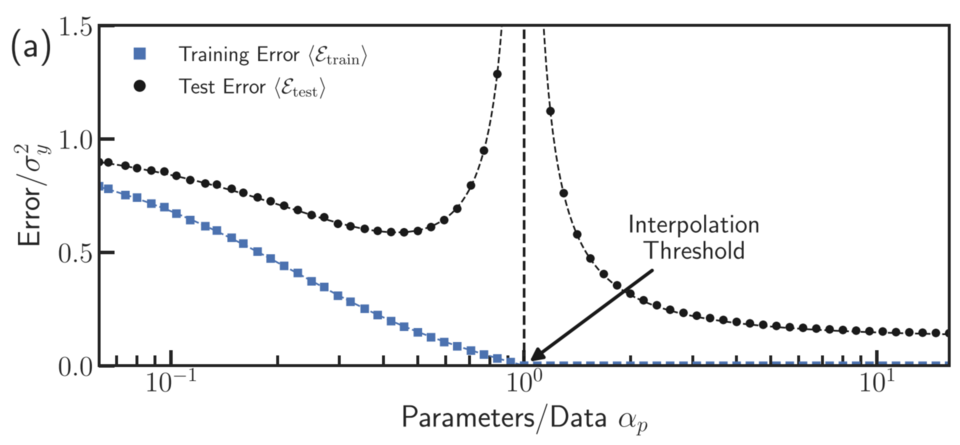
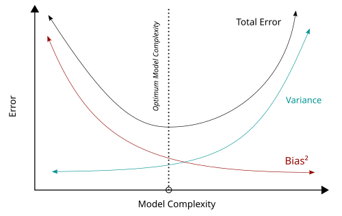
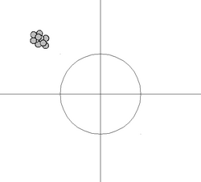
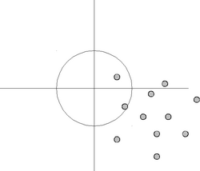
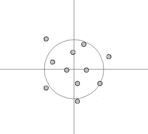
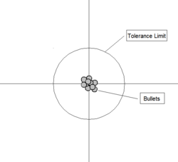

# Double Descent


- __Under-parameterized__: Mô hình có ít tham số hơn mức cần thiết để học dữ liệu.
    - Không thể biểu diễn đầy đủ mối quan hệ trong dữ liệu.
    - __Training error cao, test error cũng cao__.
    - Dễ xảy ra __underfitting__.

- __Over-parameterized__: Mô hình có nhiều tham số hơn số lượng mẫu dữ liệu hoặc lớn hơn nhiều so với mức cần thiết.
    - Có khả năng khớp hoàn toàn dữ liệu huấn luyện (__training error ≈ 0__).
    - Tuy nhiên, trong Deep Learning hiện đại, khi vượt qua __interpolation threshold__, mô hình lớn vẫn có thể __giảm test error__ (hiện tượng Double Descent).

| Bias-Variance Tradeoff                          | Double Descent                                                       |
| ----------------------------------------------- | -------------------------------------------------------------------- |
| Test error có dạng chữ U                        | Test error giảm → tăng → giảm                                        |
| Mô hình quá lớn luôn overfit                    | Mô hình rất lớn vẫn có thể tổng quát hóa tốt                         |
| Tăng tham số sau điểm tối ưu làm hiệu năng giảm | Tăng tham số vượt ngưỡng nội suy có thể tiếp tục cải thiện hiệu năng |


## What

> __Double Descent__ là hiện tượng __lỗi trên tập kiểm tra (test error)__ không còn tuân theo đường cong chữ U của lý thuyết bias-variance cổ điển. Thay vào đó, khi tăng độ phức tạp của mô hình (hoặc số tham số, số chiều dữ liệu, số lượng mẫu), test error có xu hướng:

1. Giảm (mô hình học tốt hơn).
2. Tăng mạnh khi tiến gần ngưỡng nội suy (interpolation threshold).
3. Giảm trở lại khi mô hình trở nên over-parameterized (số tham số lớn hơn nhiều so với số mẫu).

```
Test Error
 ^
 |        /\      ← Peak (Interpolation Threshold)
 |       /  \
 |      /    \_____
 |_____/            \______
 +----------------------------> Model Complexity
      Underfit  Overfit  Over-parameterized
```

## Tại sao?

Hiện tượng này xuất hiện do __khả năng nội suy (interpolation)__ của mô hình. Khi mô hình lớn hơn nhiều __(over-parameterized)__, quá trình tối ưu thường tìm được nghiệm tổng quát hóa tốt hơn __(implicit regularization)__, nên __test error giảm trở lại__.

- Vùng 1 – __Under-parameterized__
    - Mô hình chưa đủ lớn để biểu diễn dữ liệu.
    - Bias cao, test error giảm khi tăng số tham số.
- Vùng 2 – __Interpolation Threshold__
    - Mô hình vừa đủ lớn để đạt __training error ≈ 0__.
    - Mô hình phải học cả __tín hiệu (signal)__ và __nhiễu (noise)__.
    - Variance tăng mạnh nên __test error đạt cực đại__.
- Vùng 3 – __Over-parameterized__
    - Mô hình có rất nhiều nghiệm nội suy.
    - Các thuật toán tối ưu (đặc biệt SGD) thường hội tụ đến nghiệm có __độ phức tạp hiệu dụng thấp (implicit regularization)__, giúp tổng quát hóa tốt hơn.
    - Vì vậy __test error giảm lần thứ hai__.

### Interpolation Threshold



Hình này mô tả __sự thay đổi của lỗi trên tập kiểm tra (Test Error)__ khi __tăng số lượng tham số của mô hình__.

- __Bên trái (Underparameterized)__: Mô hình còn nhỏ, chưa đủ khả năng học dữ liệu → khi tăng số tham số, test error giảm.
- __Đường thẳng đứng (Interpolation Threshold)__: Mô hình vừa đủ lớn để khớp gần như hoàn toàn dữ liệu huấn luyện (__training error ≈ 0__). Tại đây, mô hình dễ học cả nhiễu nên test error tăng lên cao nhất.
- __Bên phải (Overparameterized)__: Mô hình có nhiều tham số hơn số mẫu dữ liệu. Mặc dù rất lớn, mô hình thường tìm được nghiệm tổng quát hóa tốt hơn nên test error lại giảm.

> hiện tượng này được gọi là __Double Descent (Giảm kép): test error giảm → tăng → rồi lại giảm__ khi tăng độ phức tạp của mô hình.

#### Giải thích

Đây là điểm mà mô hình lần đầu tiên có thể khớp gần như hoàn hảo dữ liệu huấn luyện, tức:

$$\text{Training Error} \approx 0$$

Thông thường xảy ra khi:

$$\text{Model Capacity} \approx \text{Training Data Size}$$

hoặc chính xác hơn là khi mô hình đủ khả năng nội suy toàn bộ tập huấn luyện.


## Ý nghĩa
- Giải thích vì sao các __mạng nơ-ron rất lớn__ (Transformer, CNN, LLM) với số tham số vượt xa số mẫu vẫn đạt khả năng tổng quát hóa cao.
- Cho thấy __over-parameterization không đồng nghĩa với overfitting__, trái với quan điểm truyền thống.
- Double Descent có thể quan sát theo __ba trục__:
    - __Model-wise Double Descent__: tăng số tham số mô hình.
    - __Sample-wise Double Descent__: thay đổi số lượng mẫu huấn luyện.
    - __Epoch-wise Double Descent__: thay đổi số epoch trong quá trình huấn luyện.

> Double Descent __không phải hiện tượng phổ quát__. Tùy theo cặp mô hình–dữ liệu, đường cong có thể chỉ có một lần giảm, hai lần giảm hoặc nhiều hơn. Điều này phụ thuộc vào cấu trúc dữ liệu, mức nhiễu và thuật toán tối ưu.

# Bias-Variance Trade-Off



> Bias and variance as function of model complexity

## What

__Bias–Variance Trade-Off__ là nguyên lý mô tả sự __đánh đổi giữa Bias và Variance__ khi tăng độ phức tạp của mô hình. Mục tiêu là tìm mô hình có __khả năng tổng quát hóa (generalization)__ tốt nhất trên dữ liệu mới.

## Tại sao

Khi tăng số lượng tham số hoặc độ phức tạp của mô hình:

- __Bias giảm__: mô hình linh hoạt hơn, học được nhiều quy luật trong dữ liệu.
- __Variance tăng__: mô hình trở nên nhạy cảm hơn với từng tập huấn luyện và dễ học cả nhiễu (noise).

Do đó, __không thể đồng thời giảm cả Bias và Variance__.

### Bias
- Là sai số do __giả định quá đơn giản__ của mô hình.
- Mô hình không học được đúng mối quan hệ giữa đặc trưng và đầu ra.
- Dẫn đến __underfitting__.

> Bias cao → Training error cao, Test error cao.

### Variance
- Là sai số do mô hình __quá nhạy với dữ liệu huấn luyện__.
- Chỉ cần thay đổi nhỏ trong tập huấn luyện, mô hình có thể học rất khác.
- Dẫn đến __overfitting__.

> Variance cao → Training error thấp nhưng Test error cao.

### Bias-Variance Decomposition

Sai số tổng quát hóa (Generalization Error) được phân tích thành:

$$\text{Error} = \text{Bias}^2 + \text{Variance} + \text{Irreducible Eror}$$

Trong đó:
- $\text{Bias}^2$: Sai số do mô hình quá đơn giản.
- $\text{Variance}$: Sai số do mô hình quá phức tạp.
- $\text{Irreducible Error}$: Sai số không thể loại bỏ do __nhiễu (noise)__ vốn có trong dữ liệu.

### Minh họa giữa Accuracy and Precision



> High bias, low variance



> High bias, high variance



> Low bias, high variance



> Low bias, low variance

## Ý nghĩa

Mục tiêu của huấn luyện không phải là __giảm Bias hoặc Variance về 0__, mà là __tìm điểm cân bằng giữa hai thành phần__ để __Test Error nhỏ nhất__ và mô hình dự đoán tốt trên dữ liệu chưa từng thấy.

> Bias–Variance Trade-Off là lý thuyết cổ điển, dự đoán __Test Error__ có dạng chữ U. Tuy nhiên, trong Deep Learning hiện đại, hiện tượng __Double Descent__ cho thấy khi mô hình vượt qua ngưỡng __interpolation threshold, Test Error có thể giảm lần thứ hai__, mở rộng giới hạn của lý thuyết này.

# Gặp phải hiện tượng này khi nào?

> mô hình lớn lại tổng quát hóa tốt, mặc dù theo lý thuyết Bias-Variance cổ điển thì đáng lẽ phải overfit.

Có thể gặp khi nghiên cứu Vision Transformer:

```
ResNet18
↓
ResNet34
↓
ResNet50
↓
ResNet101
↓
ResNet152
↓
ViT-B
↓
ViT-L
```

Khi tăng dần các tham số `Training Loss, Validation Loss, Test Accuracy` ta có thể nhận thấy:

```
Model nhỏ            ->  Interpolation Threshold     ->  Model rất lớn
Validation Error ↓       Validation Error ↑              Validation Error ↓
```
lúc này ta tập chung vào phân tích một số vấn đề sau để làm rõ hơn hiện tượng này:

- Vì sao lại xuất hiện đỉnh?
- SGD đang chọn nghiệm nào?
- Weight decay ảnh hưởng thế nào?
- Data augmentation có làm mất Double Descent không?
- Batch size ảnh hưởng ra sao?


> Khi làm việc trong product ta không quan tâm đến các đường có đó là gì mà chỉ quan tâm Model nào có Accuracy tốt nhất với chi phí, rủi ro và Trade-Off thấp nhất.

- Ví dụ:

| Model     | Accuracy | Latency |
| --------- | -------- | ------- |
| ResNet18  | 92%      | 8 ms    |
| ResNet50  | 94%      | 20 ms   |
| ResNet152 | 94.5%    | 80 ms   |

Dù `ResNet152` có thể đang ở vùng Double Descent, nhưng product vẫn chọn __ResNet50__ vì mô hình nhanh hơn. rẻ hơn và accuracy gần như tương đương.

- Team Model quan tâm đến hiện tượng Double Descent khi _Model mới xây dựng, scale model, training foundation model, benchmark nhiều kích thước model_

_Ví dụ:_

```
Tiny -> Small -> Base -> Large -> XLarge
```

Và thấy `Validation Loss` có hiện tượng Douvle Descent tức giảm tăng rồi lại giảm, thì lúc đó ta sẽ nâng quy mô của Model lên cao hơn chứ không dừng lại ở model cỡ trung và kiểm tra tìm ra các mô hình có acc max với trade-off min.

__Kết luận:__

| Tình huống                          | Cách xử lý                                                                      |
| ----------------------------------- | ------------------------------------------------------------------------------- |
| Validation loss tăng khi tăng model | Không vội kết luận overfit.                                                     |
| Chưa thử model lớn hơn              | Tiếp tục mở rộng quy mô nếu tài nguyên cho phép.                                |
| Product cần triển khai              | Ưu tiên mô hình có Accuracy/Latency tốt nhất, không theo đuổi Double Descent.   |
| Research                            | Thử nhiều kích thước mô hình để xác định có xuất hiện Double Descent hay không. |

- __Trong nghiên cứu__: Double Descent là hiện tượng cần phân tích để hiểu khả năng tổng quát hóa của mô hình hiện đại và đánh giá tác động của kiến trúc, tối ưu hóa, dữ liệu và regularization.
- __Trong Product__: Double Descent hiếm khi là mục tiêu trực tiếp. Điều quan trọng là chọn mô hình có __hiệu năng, chi phí và tốc độ__ phù hợp. Hiểu về Double Descent giúp tránh kết luận sai rằng "mô hình lớn hơn luôn overfit" và biết khi nào nên tiếp tục thử các mô hình có quy mô lớn hơn.
