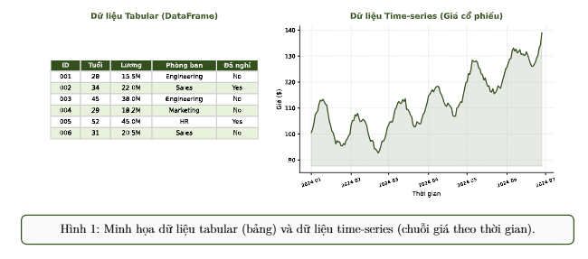
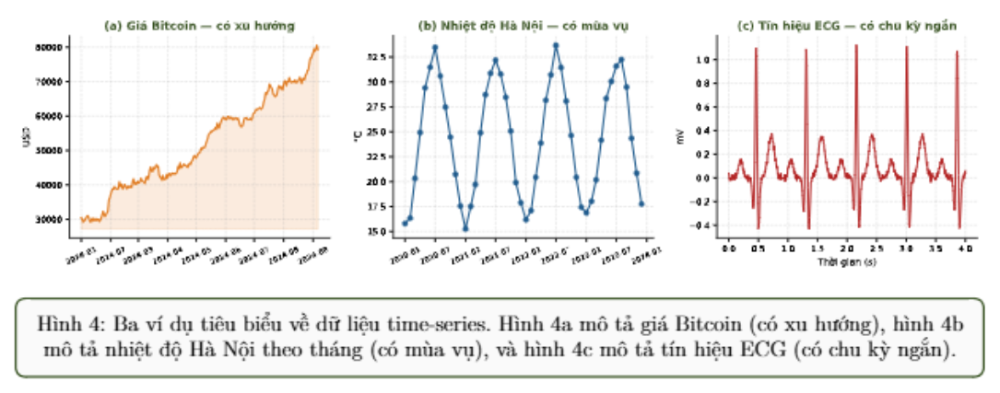
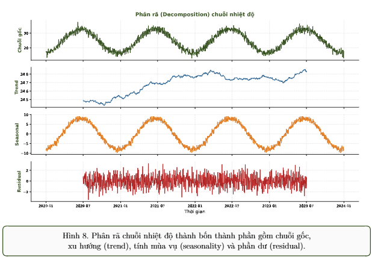

# Tabular and Time-series Data

## 1. Dẫn nhập

> Tabular là dữ liệu thể hiện thông tin dưới dạng bảng với các hàng là sample (quan sát) và các cột là feature (đặc trưng)
>
> Time-series là dữ liệu thêm chiều thời gian rõ ràng, cho phép phân tích xu hướng, mùa vụ và dự báo tương lai

Vì Vậy, việc hiểu đặc điểm và quy trình xử lý dữ liệu tabular và time-series là nền tảng quan trọng cho việc xây dựng các ứng dụng AI cho phân tích và dự báo doanh thu, phát hiện gian lân và cảm biến công nghiệp.



## Mục lục

1. [Dẫn nhập](#1-dẫn-nhập)

2. [Dữ liệu Tabular và Time-series](#2-dữ-liệu-tabular-và-time-series)
   - [2.1. Dữ liệu có cấu trúc](#21-dữ-liệu-có-cấu-trúc)
   - [2.2. Dữ liệu Tabular](#22-dữ-liệu-tabular)
   - [2.3. Dữ liệu Time-series](#23-dữ-liệu-time-series)
   - [2.4. Ứng dụng trong AI](#24-ứng-dụng-trong-ai)

3. [Quy trình xử lý dữ liệu Tabular và Time-series](#3-quy-trình-xử-lý-dữ-liệu-tabular-và-time-series)
   - [3.1. Một số công cụ xử lý](#31-một-số-công-cụ-xử-lý)
   - [3.2. Quy trình xử lý dữ liệu Tabular](#32-quy-trình-xử-lý-dữ-liệu-tabular)
   - [3.3. Quy trình xử lý dữ liệu Time-series](#33-quy-trình-xử-lý-dữ-liệu-time-series)

[Tài liệu tham khảo](#tài-liệu-tham-khảo)

---

## 2. Dữ liệu Tabular và Time-series

### 2.1. Dữ liệu có cấu trúc

> Dữ liệu có cấu trúc là dữ liệu được tổ chức thành các trường (cột) và bản ghi (hàng) có nghĩa rõ ràng, máy tính có thể đọc trực tiếp mà không cần qua bước trích xuất phức tạp. Khác với dữ liệu phi cấu trúc (ảnh, video, văn bản), dữ liệu có cấu trúc thường được lưu trong bảng, cơ sở dữ liệu hoặc file CSV, Excel

Tabular không bắt buộc về thứ tự giữa các hàng, còn time-series có thứ tự thời gian là yếu tố cốt lõi không thể xáo trộn.

### 2.2. Dữ liệu Tabular

> Trong tabular mỗi hàng đại diện cho 1 quan sát (mẫu) và mỗi cột đại diện cho 1 đặc trưng (thuộc tính). Đây là dạng dữ liệu có cấu trúc phổ biến thường được lưu trong các file CSV, Excel,  Parquet hoặc trong cơ sở dữ liệu
>
> Dữ liệu thường được biểu diễn dưới dạng ma trận hai chiều với shape: $n_{samples} \times n_{features}$

Trước khi bước vào tiền xử lý dữ liệu dạng bảng ta cần phân biệt được các kiểu đặc trưng khác nhau. Vì mỗi kiểu cần có 1 cách xử lý riêng, các kiểu phổ biến như dạng số liên tục, dạng số rời rạc, dạng không thứ tự (màu sắc, thành phố), dạng có thứ tự (như rating từ 1 - 5), dạng binary (bit 1 0 / yes no), và datetime (ngày sinh, ngày giao dịch).

Vì Tabular thường trộn lẫn nhiều kiểu giá trị khác nhau và có thang đo khác nhau nên ta cần làm sạch, mã hóa và phân thoại các feature (label encoding, one-hot encoding, ordinal encoding) vầ chuẩn hóa (Standar Scaler, minmax Scaler) các giá trị về cùng một thang đo trước khi đưa vào model.

### 2.3. Dữ liệu Time-series

> Dữ liệu time-series là chuỗi các quan sát được ghi nhận theo thứ tự thời gian. Trong đó mỗi quan sát gắn với một mốc thời gian cụ thể, gọi là timestamp. dữ liệu time-series phụ thuộc rất mạnh vào thứ tự trước sau cảu các quan sát.

ví dụ nếu ta ghi nhận doanh thu của một cửa hàng theo từng ngày, thì doanh thu ngày nay có tương quan đến doanh thu của những ngày trước đó, nếu ta đảo lỗn thứ tự, thì ta sẽ không nhìn thấy đúng xu hướng tăng giảm, chu kỳ lặp lại hoặc các điểm bất thường của dữ liệu. Vì vậy trọng time-series, thời gian không chỉ là một cột dữ liệu thông thường mà là yếu tố cốt lõi quyết định cách phân tích và xử lý.

> Dữ liệu time-series thường được biểu diễn dưới dạng $T \times n_{features}$. Trong đó $T$ là số bước thời gian và $n_{features}$ lf số biến được quan sát tại một thời điểm.

Nếu tại mỗi diểm thời gian chỉ khi nhận 1 biến, ta có dữ liệu __Univariate time-series__ ví dụ chỉ theo dõi giá đống của của một cổ phiếu theo ngày. Nếu tại mỗi thời điểm ghi nhận nhiều biến ta có dữ liệu __multivariate time-series__ ví dụ trong chứng khoáng mỗi ngày có giá mở cửa, giá đóng, giá min và max, khối lượng giao dịch.

#### Một số đặc trưng quan trọng của dữ liệu time-series gồm các khái niệm sau:

- __Timestamp__ mô tả mốc thời gian gắn với từng quan sát, giúp xác định thứ tự trước sau của dữ liệu.
- __Time Step__ mô tả khoảng cách thời gian giữa hai biến quan sát liên tiếp, vd 1 phút, 1 giờ hoặc 1 ngày.
- __Frequency__ mô tả tần suất lất mẫu của toàn bộ chuỗi; ví dụ hourly, daily, monthly.
- __Granularity__ mô tả mức độ chi tiết của dữ liệu theo thời gian. Dữ liệu theo giờ chi tiết hơn dữ liệu theo ngày, nhưng cũng thường nhiễu hơn.
- __Univariate/Multivariate__ mô tả chuỗi đơn biến chỉ có một biến theo thời gian, còn chuỗi đa biến có nhiều biến được ghi nhận đồng thời.

#### Các thành phần chính trong Time-Series

Khi phân tích dữ liệu time-series, ta thường quan tâm đến 3 thành phần chính:

- __Trend (Xu hướng)__ thể hiện chiều hướng dài hạn
- Seasonality (tính mùa vụ) thể hiện các mẫu lặp lại theo chu kỳ. ví dụ, như cầu mua sắm tăng vào dịp lễ, hoặc nhiệt độ tăng vào mùa hè và mùa đông.
- Residual (phần dư hoặc nhiễu) là phần biến động còn lại sau khi đã tách trend và seasonality. Thành phần này thường chứa nhiễu ngẫu nhiên hoặc các biến động khó giải thích.

Ngoài ra, một khái niệm quan trọng khác trong time-series là stationarity (tính dừng). Một chuỗi được gọi là dừng khi các đặc trưng thống kê như trung bình và phương sai không thay đổi nhiều theo thời gian. Một mô hình thống kê truyền thống như ARIMA thường yêu cầu chuỗi có tính dừng trước khi huấn luyện.



#### Các loại time-series data và ứng dụng

Tùy theo nguồn gốc và bản chất, dữ liệu time-series có thể được chia thành nhiều loại tiêu biểu.

* **Dữ liệu time-series tài chính** gồm giá cổ phiếu, tỷ giá, lãi suất, khối lượng giao dịch. Dữ liệu này thường có nhiều nhiễu và chịu ảnh hưởng mạnh bởi tin tức hoặc sự kiện kinh tế. Ứng dụng phổ biến là dự báo giá, quản lý rủi ro và phát hiện giao dịch bất thường.
* **Dữ liệu time-series khí tượng và môi trường** gồm nhiệt độ, độ ẩm, lượng mưa, chất lượng không khí. Loại dữ liệu này thường có tính mùa vụ rõ ràng. Ứng dụng là dự báo thời tiết, cảnh báo thiên tai và phân tích biến đổi môi trường.
* **Dữ liệu time-series cảm biến và IoT** gồm dữ liệu từ máy móc, thiết bị công nghiệp, xe hơi hoặc hệ thống sản xuất. Dữ liệu thường có tần số lấy mẫu cao và khối lượng lớn. Ứng dụng quan trọng là phát hiện lỗi thiết bị sớm và bảo trì dự đoán.
* **Dữ liệu time-series y sinh** gồm ECG, EEG, nhịp tim, huyết áp hoặc đường huyết. Dữ liệu này thường có các chu kỳ ngắn và mẫu lặp lại. Ứng dụng là chẩn đoán bệnh, theo dõi sức khỏe và cảnh báo bất thường.
* **Dữ liệu time-series kinh doanh:** gồm doanh thu theo ngày, số đơn hàng theo tuần, lượng truy cập website theo giờ. Loại dữ liệu này thường có tính mùa vụ theo ngày, tuần, tháng hoặc năm. Ứng dụng là dự báo nhu cầu, lập kế hoạch tồn kho và tối ưu chiến dịch marketing.

#### Nhiễu và bất thường trong dữ liệu time-series

Trong dữ liệu time-series, ta cần phân biệt rõ giữa **noise** (nhiễu) và **anomaly** (bất thường).

* **Nhiễu** là những dao động ngẫu nhiên nhỏ quanh giá trị thực. Nhiễu thường xuất hiện liên tục và không mang nhiều thông tin quan trọng. Ví dụ, cảm biến nhiệt độ có thể dao động nhẹ do sai số đo lường. Khi xử lý nhiễu, mục tiêu thường là làm mượt dữ liệu để xu hướng chính hiện ra rõ hơn.
* **Anomaly** là những điểm hoặc đoạn dữ liệu lệch rõ rệt so với mẫu thông thường. Anomaly thường xuất hiện ít hơn nhưng lại rất quan trọng. Ví dụ, một giao dịch ngân hàng có số tiền rất lớn vào thời điểm bất thường có thể là dấu hiệu gian lận; một đỉnh nhiệt độ bất thường trong dữ liệu cảm biến có thể là dấu hiệu máy móc sắp hỏng.

Sự khác biệt quan trọng là **nhiễu** thường cần được giảm bớt hoặc lọc bỏ, còn **anomaly** cần được phát hiện và phân tích kỹ hơn. Đây là lý do *anomaly detection* là một trong những bài toán quan trọng nhất của time-series trong công nghiệp, tài chính và an ninh.

#### Các loại xu hướng trong Time-series data

Xu hướng (trend) trong chuỗi thời gian có thể xuất hiện dưới nhiều dạng khác nhau.

* **No trend (approximately stationary)** mô tả chuỗi dao động quanh một giá trị trung bình ổn định, không tăng hoặc giảm rõ rệt theo thời gian.
* **Linear trend** mô tả chuỗi tăng hoặc giảm với tốc độ tương đối đều. Ví dụ, doanh thu tăng đều qua từng tháng.
* **Exponential trend** mô tả chuỗi tăng hoặc giảm với tốc độ ngày càng nhanh. Ví dụ, số người dùng của một ứng dụng mới tăng rất nhanh trong giai đoạn đầu.
* **Polynomial trend** mô tả chuỗi có dạng cong, có thể tăng rồi giảm hoặc giảm rồi tăng. Ví dụ, vòng đời của một sản phẩm trải qua các giai đoạn tăng trưởng, đạt đỉnh, sau đó suy giảm.
* **Piecewise trend hoặc structural break** mô tả chuỗi có nhiều giai đoạn xu hướng khác nhau, thường do sự kiện lớn gây ra như thay đổi chính sách, khủng hoảng kinh tế hoặc ra mắt công nghệ mới.

Việc nhận diện đúng loại trend giúp ta chọn cách xử lý và mô hình phù hợp hơn. Ví dụ, chuỗi có mùa vụ rõ ràng có thể cần decomposition, chuỗi có xu hướng dài hạn có thể cần mô hình dự báo có thành phần trend, còn chuỗi có nhiều điểm bất thường có thể cần mô hình anomaly detection.

### 2.4. Ứng dụng trong AI

Dữ liệu tabular và time-series là hai nguồn dữ liệu quan trọng trong rất nhiều hệ thống AI hiện đại. Với **dữ liệu tabular**, các mô hình AI thường được dùng cho phân loại (chấm điểm tín dụng, dự đoán khách hàng rời bỏ hay churn prediction), hồi quy (dự đoán giá nhà, dự đoán doanh thu), hệ thống gợi ý sản phẩm và phát hiện gian lận trong giao dịch.

Đối với **dữ liệu time-series**, các bài toán phổ biến gồm dự báo (forecasting doanh thu, thời tiết, nhu cầu điện), phát hiện bất thường (anomaly detection trong cảm biến công nghiệp, giám sát hệ thống), phân loại chuỗi (chẩn đoán bệnh tim từ tín hiệu ECG), và dự đoán sự kiện trong tương lai. Khác với tabular, time-series còn cho phép phát hiện các mẫu lặp lại theo chu kỳ và dự báo xu hướng dài hạn.

Trong thực tế, nhiều hệ thống AI hiện nay kết hợp cả hai loại dữ liệu này. Ví dụ, một mô hình dự báo doanh thu có thể vừa dùng dữ liệu tabular về khách hàng (hồ sơ, lịch sử mua) vừa dùng time-series về doanh thu theo ngày để đưa ra dự đoán chính xác hơn.

**Pipeline tổng quát của một hệ thống AI**


*Hình 5: Sơ đồ pipeline tổng quát: Dữ liệu thô $\rightarrow$ Tiền xử lý $\rightarrow$ Trích đặc trưng $\rightarrow$ Mô hình AI $\rightarrow$ Kết quả.*

## 3. Quy trình xử lý dữ liệu Tabular và Time-series

### 3.1. Một số công cụ xử lý

### 3.2. Quy trình xử lý dữ liệu Tabular

### 3.3. Quy trình xử lý dữ liệu Time-series

#### Bước 4: Tiền xử lý

Tiền xử lý time-series thường bao gồm ba thao tác chính là xử lý timestamp thiếu, resampling và làm mượt dữ liệu.

* **Xử lý timestamp thiếu** có thể được thực hiện bằng cách nội suy tuyến tính (`interpolate`), điền giá trị trước đó (`ffill`), hoặc giá trị sau đó (`bfill`).
* **Resampling** là thao tác chuyển dữ liệu sang tần số khác, ví dụ gộp lên (`df.resample('D').mean()` để chuyển từ giờ sang ngày) hoặc chia nhỏ (`df.resample('H').interpolate()`).
* **Làm mượt (smoothing)** thường dùng trung bình trượt (`df.rolling(window=7).mean()`) để giảm nhiễu và làm rõ xu hướng.

**Lưu ý rằng `bfill` ít dùng trong forecasting vì có thể dùng thông tin tương lai để điền cho quá khứ, gây rò rỉ dữ liệu (data leakage).**

```python
# B4: Tien xu ly
# Tao day du moc thoi gian va noi suy gia tri thieu
df = df.asfreq('D')
df['temperature'] = df['temperature'].interpolate(method='linear')
# Resample sang trung binh tuan
df_weekly = df.resample('W').mean()
# Lam muot bang trung binh truot 7 ngay
df['temp_smooth'] = df['temperature'].rolling(window=7).mean()
temp_missing = df['temperature'].isnull().sum()
print(f'Sau xu ly missing: {temp_missing} NaN')
print(f'Shape weekly: {df_weekly.shape}')

```

```text
Sau xu ly missing: 0 NaN
Shape weekly: (209, 1)

```

Sau bước này, dữ liệu đã đầy đủ hơn, ít nhiễu hơn và có thể được phân tích ở nhiều mức thời gian khác nhau.

#### Bước 5: Phân rã chuỗi thời gian (Decomposition)

Phân rã chuỗi thời gian, hay **decomposition**, là bước giúp tách chuỗi gốc thành ba thành phần chính là **trend** (xu hướng dài hạn), **seasonality** (mẫu lặp lại theo chu kỳ) và **residual** (phần nhiễu hoặc biến động còn lại). Đây là một trong những bước quan trọng nhất để hiểu cấu trúc của chuỗi. Statsmodels cung cấp `seasonal_decompose` để thực hiện thao tác này. Nếu dùng `period=365`, dữ liệu nên có ít nhất vài năm để tách mùa vụ theo năm ổn định; nếu chuỗi chỉ dài vài tháng thì decomposition theo chu kỳ năm thường không đáng tin cậy.

```python
from statsmodels.tsa.seasonal import seasonal_decompose
# B5: Decomposition
result = seasonal_decompose(df['temperature'], model='additive', period=365)

fig = result.plot()
fig.set_size_inches(12, 8); plt.tight_layout(); plt.show()
print(f'Trend NaN: {result.trend.isnull().sum()}')
print(f'Seasonal range: [{result.seasonal.min():.2f}, '
      f'{result.seasonal.max():.2f}]')

```

```text
Trend NaN: 364
Seasonal range: [-7.85, 8.12]

```

Kết quả decomposition thường được hiển thị thành bốn biểu đồ: chuỗi gốc, trend, seasonal và residual. Với dữ liệu nhiệt độ, phần seasonal thường thể hiện rất rõ chu kỳ theo năm.



## Bước 6: Tạo đặc trưng và chia tập

Bước cuối cùng là tạo đặc trưng đầu vào cho mô hình. Với time-series, đặc trưng thường được tạo từ chính giá trị quá khứ của chuỗi. Một số đặc trưng phổ biến gồm **lag features** (giá trị ở các thời điểm trước đó như `lag_1`, `lag_7`, `lag_30`), **rolling statistics** (trung bình trượt, độ lệch chuẩn trượt, min/max trong một cửa sổ thời gian) và **time features** (ngày trong tuần, tháng trong năm, quý, cuối tuần hay ngày lễ).

```python
import numpy as np
# B6: Tao dac trung
df['lag_1'] = df['temperature'].shift(1)
df['lag_7'] = df['temperature'].shift(7)
df['roll_mean_7'] = df['temperature'].rolling(window=7).mean()
df['roll_std_7'] = df['temperature'].rolling(window=7).std()
df['day_of_week'] = df.index.dayofweek
df['month'] = df.index.month
df = df.dropna()

```

Sau khi tạo đặc trưng, ta chia dữ liệu thành tập train và test. Với time-series, **tuyệt đối không chia ngẫu nhiên**. Ta phải dùng dữ liệu quá khứ để huấn luyện và dữ liệu tương lai để kiểm thử.

```python
# Chia train/test THEO THU TU THOI GIAN, khong ngau nhien
split = int(len(df) * 0.8)
train = df.iloc[:split]
test = df.iloc[split:]
print(f'Train: {train.index.min()} -> {train.index.max()}')
print(f'Test  : {test.index.min()} -> {test.index.max()}')

```

```text
Train: 2020-01-08 00:00:00 -> 2023-03-22 00:00:00
Test  : 2023-03-23 00:00:00 -> 2023-12-31 00:00:00

```

> **Lưu ý quan trọng**
> Khác với tabular, dữ liệu time-series **tuyệt đối không được chia ngẫu nhiên**. Nếu chia ngẫu nhiên, các điểm trong tương lai có thể rơi vào tập huấn luyện, gây ra hiện tượng **rò rỉ dữ liệu (data leakage)**, tức là mô hình sử dụng thông tin tương lai trong quá trình huấn luyện và cho ra kết quả đánh giá không trung thực. Quy tắc đúng là tập huấn luyện luôn ở quá khứ, tập kiểm thử ở tương lai.

## Tài liệu tham khảo