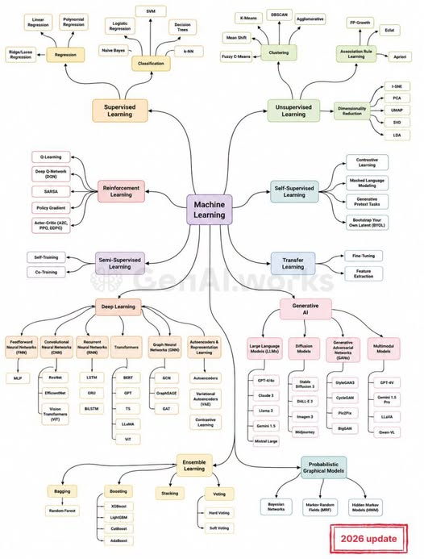

# Machine Learning

__Machine Learning (ML)__ là lĩnh vực cho phép máy tính học một hàm ánh xạ từ dữ liệu thay vì phải lập trình trực tiếp mọi quy tắc.

---

## 1. Supervised Learning
Dữ liệu huấn luyện có input $X$ và label/target $Y$.

$$ X \rightarrow Y $$

Mục tiêu là học một hàm:

$$f_\theta (X)\approx Y$$

### 1.1. Regression
__Regression__ dự đoán một giá trị liên tục.

$$X\rightarrow y \in \mathbb R$$

Ví dụ:

- dự đoán giá nhà
- dự đoán nhiệt độ
- dự đoán doanh thu
- dự đoán lượng điện tiêu thụ

#### Linear Regression
Mô hình giả định quan hệ giữa input và output có dạng tuyến tính.

$$\hat y = w^T x + b$$

#### Polynomial Regression
Mở rộng __Linear Regression__ bằng cách tạo các đặc trưng dạng lũy thừa để mô hình hóa quan hệ phi tuyến.

Ví dụ:

$$\hat y = w_0+w_1x+w_2x^2+\cdots$$

#### Ridge/Lasso Regression
Là Linear Regression kết hợp __regularization__ nhằm kiểm soát độ phức tạp của mô hình.

- __Ridge__: L2 regularization.
- __Lasso__: L1 regularization.

Lasso còn có khả năng đưa một số trọng số về gần hoặc bằng 0, nên thường được liên hệ với __feature selection__.

### 1.2. Classification
Classification dự đoán class/category thay vì giá trị liên tục.

$$ X \rightarrow y \in \{1,2,\ldots,K\} $$

Ví dụ:

$$ \text{Email} \rightarrow \{\text{Spam},\text{Not Spam}\} $$

#### Logistic Regression
Mô hình xác suất cho classification, phổ biến nhất là binary classification.

$$ P(y=1|x) $$

Tên có "Regression" nhưng về bản chất thường được sử dụng cho __classification__.

#### Naive Bayes
Phương pháp classification dựa trên xác suất __Bayes__, với giả định đơn giản rằng các feature độc lập có điều kiện khi biết class.

#### SVM
__Support Vector Machine__ tìm một decision boundary để phân tách các class, với mục tiêu tối đa hóa margin giữa các class.

Có thể sử dụng __kernel__ để xử lý quan hệ phi tuyến.

#### Decision Trees
Mô hình phân loại bằng cách liên tục chia dữ liệu theo các điều kiện trên feature.

Có thể hình dung:

$$ X \rightarrow \text{condition} \rightarrow \text{condition} \rightarrow \text{class} $$

#### k-NN
__k-Nearest Neighbors__ dự đoán dựa trên những điểm dữ liệu gần nó nhất.

Khác với nhiều mô hình khác, k-NN gần như __không xây dựng một hàm tham số rõ ràng trong quá trình training__; phần lớn công việc xảy ra khi prediction.

---

## 2. Unsupervised Learning
Không có label $Y$ được cung cấp. Chỉ có: $ X $ Mục tiêu là tìm ra cấu trúc, pattern hoặc representation ẩn trong dữ liệu.

### 2.1. Clustering
Mục tiêu chia dữ liệu thành các nhóm có đặc điểm tương tự.

$$ X \rightarrow \{C_1,C_2,\ldots,C_K\} $$

Ví dụ:

$$ \text{Customers} \rightarrow \{\text{nhóm 1},\text{nhóm 2},\text{nhóm 3}\} $$

#### K-Means
Chia dữ liệu thành $K$ cluster và đại diện mỗi cluster bằng __centroid__.

#### Mean Shift
Tìm các vùng có __mật độ dữ liệu cao__ thay vì yêu cầu trước số lượng cluster.

#### Fuzzy C-Means
Một điểm dữ liệu có thể thuộc __nhiều cluster với các mức độ membership khác nhau__.

Ví dụ: $ x_i \rightarrow (0.8,0.2,0.0) $ thay vì chỉ thuộc một cluster.

#### DBSCAN
Clustering dựa trên __mật độ dữ liệu__. Điểm mạnh là có thể tìm cluster có hình dạng phức tạp và nhận diện __noise/outlier__.

#### Agglomerative
Hierarchical clustering theo hướng __bottom-up__:

$$ \text{individual points} \rightarrow \text{small clusters} \rightarrow \text{larger clusters} $$

### 2.2. Association Rule Learning
- FP-Growth
- Eclat
- Apriori

### 2.3. Dimensionality Reduction
- t-SNE
- PCA
- UMAP
- SVD
- LDA

---

## 3. Reinforcement Learning
- Q-Learning
- Deep Q-Network (DQN)
- SARSA
- Policy Gradient
- Actor-Critic (A2C, PPO, DDPG)

---

## 4. Self-Supervised Learning
- Contrastive Learning
- Masked Language Modeling
- Generative Pretext Tasks
- Bootstrap Your Own Latent (BYOL)

---

## 5. Semi-Supervised Learning
- Self-Training
- Co-Training

---

## 6. Transfer Learning
- Fine-Tuning
- Feature Extraction

---

## 7. Deep Learning
### 7.1. Feedforward Neural Networks (FNN)
- MLP

### 7.2. Convolutional Neural Networks (CNN)
- ResNet
- EfficientNet
- Vision Transformers (ViT)

### 7.3. Recurrent Neural Networks (RNN)
- LSTM
- GRU
- BiLSTM

### 7.4. Transformers
- BERT
- GPT
- T5
- LLaMA
- ViT

### 7.5. Graph Neural Networks (GNN)
- GCN
- GraphSAGE
- GAT

### 7.6. Autoencoders & Representation Learning
- Autoencoders
- Variational Autoencoders (VAE)
- Contrastive Learning

---

## 8. Generative AI
### 8.1. Large Language Models (LLMs)
- GPT-4/4o
- Claude 3
- Llama 3
- Gemini 1.5
- Mistral Large

### 8.2. Diffusion Models
- Stable Diffusion 3
- DALL-E 3
- Imagen 3
- Midjourney

### 8.3. Generative Adversarial Networks (GANs)
- StyleGAN3
- CycleGAN
- Pix2Pix
- BigGAN

### 8.4. Multimodal Models
- GPT-4V
- Gemini 1.5 Pro
- LLaVA
- Qwen-VL

---

## 9. Ensemble Learning
### 9.1. Bagging
- Random Forest

### 9.2. Boosting
- XGBoost
- LightGBM
- CatBoost
- AdaBoost

### 9.3. Stacking

### 9.4. Voting
- Hard Voting
- Soft Voting

---

## 10. Probabilistic Graphical Models
- Bayesian Networks
- Markov Random Fields (MRF)
- Hidden Markov Models (HMM)