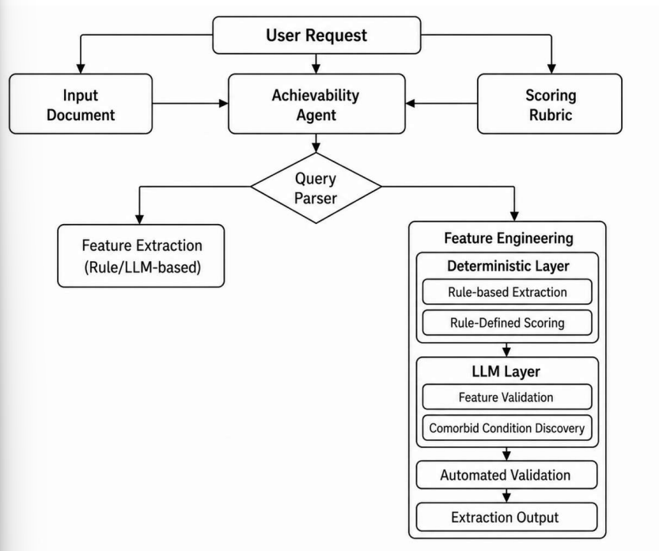

# Tracing the Heart: An Evidence-Linked Pipeline for Heart-Failure Feature Engineering

Link: [paper](https://arxiv.org/pdf/2608.06366)

## Abstract

**Tóm tắt (Abstract)**

Kỹ thuật xây dựng đặc trưng (*feature engineering*) từ hồ sơ bệnh án điện tử (**EHR – Electronic Health Record**) là một nút thắt lớn trong nghiên cứu lâm sàng và AI, chiếm khoảng **39–45% khối lượng công việc của các nhà khoa học dữ liệu**. Vấn đề này đặc biệt rõ rệt đối với **suy tim (heart failure)**, một bệnh ảnh hưởng đến khoảng **6,7 triệu người trưởng thành tại Mỹ**, đồng thời đòi hỏi phải kết hợp dữ liệu EHR bị phân mảnh với các quy tắc lâm sàng dựa trên hướng dẫn chuyên môn.

Các phương pháp hiện tại dựa trên **luật (rule-based)** và **LLM** mới chỉ tự động hóa được một phần, đồng thời còn hạn chế về **khả năng bảo trì** và **truy xuất bằng chứng**.

Nhóm nghiên cứu phát triển **Nimblemind Multi-Agent System (nMAS)** — một pipeline đa tác tử nhằm tự động hóa feature engineering cho bệnh suy tim. Hệ thống sử dụng các đặc trưng có **liên kết bằng chứng (evidence-linked)** và được đánh giá theo **rubric**. nMAS được thử nghiệm trên **500 bệnh nhân giả lập**, sử dụng dữ liệu từ **9 bảng EHR**.

nMAS tạo ra:

* **132 đặc trưng có cấu trúc**
* **70 đặc trưng được chấm điểm theo rubric**

Các đặc trưng được kiểm tra về:

* tính toàn vẹn cấu trúc;
* mức độ tuân thủ rubric;
* nguồn gốc dữ liệu (*provenance*);
* và được kiểm toán bởi một LLM bị giới hạn phạm vi.

Khi thêm các đặc trưng được tổng hợp bởi nMAS vào mô hình, **AUROC** trên tập dữ liệu giữ lại tăng:

* **HFrEF:** `0.895 → 0.963`
* **HFpEF:** `0.870 → 0.910`

Một LLM độc lập đánh giá các đặc trưng dựa trên bằng chứng và tính đúng đắn phương pháp, đạt **81,5% tổng số điểm tối đa**.

Kết quả cho thấy có thể **tự động hóa feature engineering trên dữ liệu EHR phức tạp mà vẫn có khả năng kiểm toán và truy xuất bằng chứng**. Tuy nhiên, nghiên cứu mới chỉ thực hiện trên **một cohort từ một cơ sở**, nên vẫn cần kiểm chứng trên dữ liệu bên ngoài.

---

### Ý chính của Abstract

Bài báo giải quyết một vấn đề rất cụ thể:

> **Làm thế nào tự động biến dữ liệu EHR thô, phân mảnh thành các feature có ý nghĩa lâm sàng để đưa vào mô hình AI?**

#### Pipeline của họ

```text
EHR
 │
 ├── 9 nguồn/bảng dữ liệu
 │
 ▼
nMAS Multi-Agent System
 │
 ├── Extract
 ├── Aggregate
 ├── Apply clinical rubric
 ├── Link evidence
 └── Verify / Audit
 │
 ▼
Clinical Features
 │
 ▼
ML Phenotyping
 │
 ├── HFrEF AUROC: 0.895 → 0.963
 └── HFpEF AUROC: 0.870 → 0.910
```

#### Điểm quan trọng nhất

**1. nMAS không chỉ trích xuất dữ liệu**

Nó biến dữ liệu EHR thành **clinical features có cấu trúc**, đồng thời ghi lại **bằng chứng và nguồn gốc** của feature.

**2. Multi-Agent System được dùng để tự động hóa feature engineering**

Thay vì data scientist phải thủ công:

```text
EHR → đọc dữ liệu → hiểu guideline → tạo feature → kiểm tra
```

nMAS tự động hóa phần lớn quy trình này.

**3. Feature mới thực sự cải thiện mô hình**

Đây là kết quả quan trọng nhất:

```text
HFrEF:  0.895 → 0.963
HFpEF:  0.870 → 0.910
```

Tức là các feature do hệ thống tạo ra có **giá trị dự báo**, không chỉ tạo ra dữ liệu về mặt hình thức.

**4. Có khả năng audit**

Mỗi feature được gắn với:

```text
Feature
   ↓
Evidence
   ↓
Source / Provenance
   ↓
Clinical Rubric
```

Điều này rất quan trọng trong healthcare vì cần biết:

> **Feature này được tạo ra từ đâu và dựa trên bằng chứng nào?**

**5. Hạn chế**

Kết quả chưa thể khẳng định nMAS hoạt động tốt ở mọi bệnh viện vì mới thử nghiệm trên **một cơ sở dữ liệu/cohort**. Cần **external validation** trước khi kết luận về khả năng tổng quát hóa.

## 1. Introduction

Trước khi có thể huấn luyện một mô hình machine learning lâm sàng hoặc thực hiện nghiên cứu trên một nhóm bệnh nhân quy mô lớn, dữ liệu lâm sàng được thu thập thường quy phải được chuyển đổi thành các **biến ở cấp độ bệnh nhân đáng tin cậy và sẵn sàng cho phân tích**.

Quá trình **feature engineering** này bao gồm:

* trích xuất dữ liệu;
* làm sạch;
* đồng nhất dữ liệu;
* tạo ra các biến mới từ nhiều loại hồ sơ lâm sàng khác nhau.

Đây là một phần rất lớn trong quy trình data science y tế. Các data scientist cho biết khoảng **39–45% thời gian làm việc** được dành cho việc tải và làm sạch dữ liệu thay vì phân tích. Chi phí này còn tăng khi quy trình feature engineering phải được xây dựng lại cho các dataset, bệnh viện hoặc câu hỏi nghiên cứu khác nhau. Việc thiếu hạ tầng dữ liệu có khả năng tái sử dụng vì vậy trở thành một rào cản đối với việc triển khai AI trong healthcare.

**Cardiology (tim mạch)** là một lĩnh vực đặc biệt khó vì các biến có ý nghĩa lâm sàng nằm rải rác trong nhiều phần khác nhau của EHR. Ví dụ:

```text
Diagnoses
Medications
Laboratory
Procedures
Imaging
```

thường nằm ở **các bảng dữ liệu khác nhau**.

Do đó, xây dựng feature ở cấp bệnh nhân không đơn giản là lấy từng biến riêng lẻ. Dữ liệu cần được:

```text
Extract → Reconcile → Aggregate theo thời gian → Transform theo clinical definition
```

**Heart Failure (HF – suy tim)** là một ví dụ điển hình vì việc xác định tình trạng bệnh cần kết hợp nhiều nguồn bằng chứng lâm sàng. Khoảng **6,7 triệu người trưởng thành tại Mỹ** mắc suy tim và con số này được dự báo tăng lên **8,7 triệu vào năm 2030**.

---

### HF Phenotyping

Việc **phân loại kiểu hình suy tim (HF phenotyping)** cũng yêu cầu áp dụng các định nghĩa lâm sàng cụ thể lên dữ liệu không đồng nhất.

Ví dụ, phân loại có thể dựa trên:

* **ejection fraction (EF)**;
* kết quả xét nghiệm;
* lịch sử sử dụng thuốc;
* bệnh đi kèm;
* các tiêu chí/chỉ số đặc thù của bệnh.

Điều này tạo ra sự khác biệt giữa:

> **Extract dữ liệu từ EHR**

và

> **Tạo một clinical feature có ý nghĩa.**

Clinical feature phải xác định rõ:

```text
Source variables
      ↓
Cách kết hợp chúng
      ↓
Clinical rule / definition
      ↓
Feature cuối cùng
```

Ngoài ra, trong nghiên cứu, quá trình này phải **reproducible** và **traceable** — tức là có thể tái tạo và truy ngược feature về dữ liệu nguồn.

Để giải quyết vấn đề này, nhóm nghiên cứu đề xuất **Nimblemind Multi-Agent System (nMAS)** — một pipeline feature engineering cho suy tim dựa trên:

* **Evidence-linked:** feature được liên kết với bằng chứng/dữ liệu nguồn.
* **Rubric-grounded:** feature được xây dựng dựa trên các tiêu chí/quy tắc lâm sàng định trước.

Thay vì để LLM tự do tạo ra clinical summary, nMAS sử dụng **các scoring rule xác định trước** dựa trên clinical specifications, sau đó dùng một **LLM bị giới hạn phạm vi** để audit kết quả.

Mỗi feature được tạo ra vẫn liên kết với:

```text
Feature
 ├── Source EHR variables
 └── Predefined scoring criteria
```

Trong nghiên cứu thử nghiệm, nMAS được áp dụng trên:

* **500 bệnh nhân suy tim giả lập**
* dữ liệu từ **9 bảng EHR**

Sau đó đánh giá feature dựa trên:

1. **Structural integrity** — cấu trúc có hợp lệ không.
2. **Rubric compliance** — có tuân thủ tiêu chí đã định nghĩa không.
3. **Clinical coherence** — feature có hợp lý về mặt lâm sàng không.

Mục tiêu chính của nghiên cứu **không phải chứng minh mô hình dự đoán tốt**, mà là kiểm tra xem nMAS có thể tự động tạo ra các feature:

> **hợp lệ về cấu trúc + đúng rubric + hợp lý về lâm sàng + có thể truy xuất nguồn gốc**

hay không.

---

### Giải thích trọng tâm

#### Vấn đề mà bài báo muốn giải quyết

EHR có dạng:

```text
Bảng Diagnoses
Bảng Medications
Bảng Labs
Bảng Procedures
Bảng Imaging
        ↓
   Dữ liệu phân mảnh
        ↓
Feature Engineering thủ công
        ↓
Clinical ML
```

Feature engineering thủ công **tốn thời gian, khó tái sử dụng và khó audit**.

#### Ý tưởng của nMAS

nMAS biến quy trình này thành:

```text
Multiple EHR Tables
        ↓
   nMAS
        ↓
Extract + Aggregate
        ↓
Clinical Rules / Rubric
        ↓
Evidence-linked Features
        ↓
LLM Audit
        ↓
Analysis-ready Dataset
```

**Điểm cốt lõi:** nMAS không đơn thuần dùng LLM để "đọc EHR và tạo feature", mà kết hợp **dữ liệu nguồn + clinical rules + evidence + audit** để tạo feature có thể kiểm tra và truy xuất.

#### Câu quan trọng nhất của phần Introduction

> **Mục tiêu của nghiên cứu là tự động hóa feature engineering cho EHR phức tạp nhưng vẫn giữ được tính đúng đắn, khả năng tái tạo và khả năng truy xuất nguồn gốc của feature.**

Và **đây là pilot study**, nên họ chủ yếu chứng minh **tính khả thi của phương pháp**, chưa chứng minh khả năng tổng quát hóa trên các bệnh viện/dataset khác.

## 2. Related Work — Các nghiên cứu liên quan

### 2.1. Các phương pháp AI hiện tại

AI đã được sử dụng rộng rãi trong:

* chẩn đoán bệnh;
* phân tầng nguy cơ;
* quản lý bệnh.

Tuy nhiên, phần lớn các hệ thống chỉ sử dụng **một loại dữ liệu (single modality)** thay vì tích hợp dữ liệu EHR theo thời gian.

Ví dụ:

* LLM xử lý **clinical documents** không có cấu trúc để tạo clinical features.
* Một số hệ thống tim mạch sử dụng **ECG** để dự đoán nguy cơ suy tim.

Vấn đề của các phương pháp này là chúng **không giải quyết việc tích hợp nhiều nguồn EHR có cấu trúc**, trong khi HF phenotyping cần kết hợp:

```text
Diagnoses
Medications
Laboratory
Imaging
Comorbidities
Procedures
        ↓
HF Phenotype
```

---

### 2.2. Các framework Feature Engineering cho EHR

Một số framework đã tự động hóa một phần quá trình preprocessing:

| Framework                 | Vai trò chính                                  |
| ------------------------- | ---------------------------------------------- |
| **FIDDLE**                | Preprocessing và temporal aggregation          |
| **MIMIC-Extract**         | Chuyển dữ liệu EHR thành representation cho ML |
| **OHDSI**                 | Chuẩn hóa các clinical covariates              |
| **Charlson / Elixhauser** | Tạo feature về bệnh đi kèm từ diagnosis codes  |

Nhưng hạn chế chung là chúng chủ yếu **disease-agnostic** — tức là framework tổng quát, không chứa reasoning chuyên biệt cho một bệnh cụ thể như suy tim.

---

### 2.3. Các phương pháp dựa trên LLM

Các phương pháp mới sử dụng LLM để giảm sự phụ thuộc vào rule-based system.

Ví dụ:

* **FeatEHR-LLM:** sinh code để trích xuất feature dựa trên **dataset schema**.
* **AgentScore:** tìm các scoring rules và xác thực chúng bằng **dữ liệu bệnh nhân**.

Nhưng vấn đề là:

> Chúng chưa thực sự **ground feature engineering vào clinical guidelines và evidence y khoa**.

Do đó, chúng khó tạo ra các feature chuyên sâu cho suy tim như:

* **HF phenotype**
* **Disease severity**
* **Guideline-directed medical therapy (GDMT)**
* **Care gaps**

vì các feature này cần tổng hợp nhiều nguồn dữ liệu và áp dụng **clinical reasoning dựa trên guideline**.

---

### 2.4. Khoảng trống nghiên cứu

HF phenotyping yêu cầu kết hợp dữ liệu **longitudinal EHR**:

```text
Diagnoses
+ Medications
+ Labs
+ Imaging
+ Procedures
+ Behavioral history
+ EF thresholds
        ↓
Clinical Feature
```

Các feature này ảnh hưởng trực tiếp đến:

* **Risk stratification**
* **Cohort eligibility**
* **Treatment assessment**

Vì vậy, feature engineering cần đồng thời có:

1. **Guideline-based clinical reasoning**
2. **Integration of heterogeneous EHR data**
3. **Evidence traceability**
4. **Auditability**

Các framework trước đó thường chỉ giải quyết **một phần** của bài toán.

---

### 2.5. Đóng góp của nghiên cứu này

Nghiên cứu đề xuất **nMAS** để lấp khoảng trống trên.

Điểm khác biệt chính:

```text
Existing approaches
        ↓
Generic preprocessing
OR
Data-driven rule discovery

nMAS
        ↓
Clinical guidelines
        +
Explicit rubric
        +
Heterogeneous EHR
        +
Evidence linkage
        ↓
Clinically meaningful features
```

Mỗi feature được tạo ra có thể **truy ngược về evidence và source records**.

---

> **Các nghiên cứu trước đã giải quyết preprocessing, feature extraction hoặc rule discovery, nhưng chưa giải quyết đầy đủ việc tạo feature cho suy tim dựa trên clinical guideline đồng thời giữ được evidence và khả năng audit. nMAS được đề xuất để giải quyết chính khoảng trống này.**

## 3. Data — Dữ liệu

### 3.1. Dataset

Bộ dữ liệu đánh giá gồm **500 hồ sơ bệnh nhân giả lập (dummy patient records)**, được xây dựng từ một cohort tổng hợp mô phỏng theo một chương trình tim mạch.

Bệnh nhân được đưa vào dataset nếu **EHR có ghi nhận chẩn đoán suy tim (heart failure)**. Không áp dụng thêm tiêu chí lựa chọn hay loại trừ nào khác.

---

### 3.2. Cấu trúc dữ liệu EHR

Mỗi bệnh nhân được biểu diễn qua **9 bảng EHR có cấu trúc**, bao gồm:

1. **Demographics** — thông tin nhân khẩu học
2. **Other diagnoses** — các chẩn đoán khác
3. **Medication orders** — đơn thuốc
4. **Echocardiogram procedures** — thủ thuật siêu âm tim
5. **Surgical procedures** — thủ thuật/phẫu thuật
6. **Laboratory components** — dữ liệu xét nghiệm
7. **External labs** — xét nghiệm bên ngoài
8. **Ejection fraction flowsheet** — dữ liệu phân suất tống máu (EF)
9. **Social history** — tiền sử xã hội

Các **định danh trực tiếp của bệnh nhân** được thay thế bằng ID đã khử định danh trước khi phân tích, nhưng những thông tin lâm sàng cần thiết cho **feature extraction và phenotyping** vẫn được giữ lại.

---

### 3.3. Loại dữ liệu

Mỗi hồ sơ kết hợp hai dạng dữ liệu:

#### Dữ liệu có cấu trúc

Bao gồm:

* tuổi;
* giới tính;
* chủng tộc;
* dân tộc;
* ngôn ngữ;
* dấu hiệu sinh tồn;
* các trường dữ liệu hành chính được mã hóa.

#### Dữ liệu dạng text

Một số thông tin cần được **trích xuất bằng pattern-based extraction**, gồm:

* danh sách mã **ICD-10**;
* tên chẩn đoán;
* tên thuốc và nhóm dược lý;
* tên thủ thuật;
* text về **ejection fraction (EF)**;
* narrative về **social history**.

---

> **Nghiên cứu sử dụng 500 bệnh nhân giả lập, mỗi bệnh nhân có dữ liệu phân tán qua 9 bảng EHR, kết hợp cả dữ liệu có cấu trúc và dữ liệu dạng text. Đây chính là đầu vào để nMAS thực hiện feature engineering và HF phenotyping.**

## 4. Method



        **Hình 1:** Tổng quan pipeline **nMAS** trích xuất và xây dựng feature cho bệnh suy tim. 

### 4.1. Tổng quan Workflow

Pipeline bắt đầu từ **EHR exports** và các feature mục tiêu được định nghĩa trong **versioned rubric**.

```text
EHR Exports → Achievability Agent → Query Parser → Feature Engineering → Audit → Validation
```

* **Achievability Agent:** kiểm tra dữ liệu nguồn có đủ thông tin để tạo feature hay không. Nếu thiếu dữ liệu → đánh dấu **unsupported**, không tự suy đoán. 
* **Query Parser:** định tuyến yêu cầu đến pipeline phù hợp.
* Nghiên cứu này tập trung vào **feature-engineering pipeline**, không tập trung vào feature extraction đơn thuần.

### 4.2. Stage 1 — Chuẩn hóa và hợp nhất EHR

Mục tiêu là biến **9 bảng EHR** thành **một bảng patient-level**.

```text
9 EHR Tables → Standardize → Deduplicate → Temporal Aggregate → Merge → Patient-level Table
```

Cụ thể:

1. **Standardization:** chuẩn hóa whitespace, null values, identifiers và datetime.
2. **Deduplication:** loại bản ghi trùng dựa trên event key có ý nghĩa lâm sàng.
3. **Temporal aggregation:** tổng hợp dữ liệu theo từng bệnh nhân.
4. **Merge:** hợp nhất các bảng thành **một dòng cho mỗi bệnh nhân**. 

### 4.3. Stage 2 — Clinical Feature Engineering

Từ bảng patient-level, nMAS tạo các **composite features** dựa trên rubric lâm sàng.

Các feature được:

* tính điểm theo **clinical rubric**;
* liên kết với **evidence trace**;
* giữ liên kết với **source EHR data**;
* tổ chức thành các nhóm feature lâm sàng. 

Ví dụ các nhóm chính gồm:

```text
Disease Severity
Cardiovascular Risk
Kidney Burden
Lung Burden
Metabolic Burden
Blood Burden
Brain-health Risk
Demographic Vulnerability
```

Các composite feature được xây dựng từ những tín hiệu như **EF, biomarkers, medications, diagnoses, procedures và comorbidities**, theo rubric đã định nghĩa. 

### 4.4. LLM Audit và Validation

Sau khi tạo feature, nMAS sử dụng **LLM auditor** để kiểm tra feature dựa **chỉ trên patient evidence và rubric logic**.

Sau đó pipeline kiểm tra:

* **Structural integrity**
* **Rubric compliance**
* **Monotonicity**
* **Evidence traceability**

Chỉ các feature vượt qua các kiểm tra này mới được đưa ra sử dụng. 

### Ý chính của Method

> **nMAS biến EHR phân mảnh → bảng patient-level → clinical features theo rubric → evidence-linked features → audit và validation.**

Điểm cốt lõi là **clinical reasoning được mã hóa trong rubric**, còn LLM chủ yếu đóng vai trò **kiểm tra/audit**, thay vì tự do quyết định cách tạo feature.


## 5. Results — Kết quả

### 5.1. Kết quả chính

**Stage 1** hợp nhất 9 bảng EHR thành **500 dòng patient-level**, không có duplicate và tạo **132 structured columns**. Tuy nhiên, chỉ **3,0%** bệnh nhân có EF dạng số, nên hệ thống phải sử dụng tên chẩn đoán để hỗ trợ xác định phenotype khi thiếu EF. 

**Stage 2** tạo thêm **70 aggregated features** và toàn bộ 500 bệnh nhân đều được audit bằng **Qwen 2.5-1.5B-Instruct**. Mỗi feature có **evidence trace**, ghi lại thành phần, điểm số, source columns và tình trạng availability của dữ liệu. 

Khi thêm các aggregated features vào XGBoost, hiệu năng tăng ở cả hai bài toán:

| Task      |          Accuracy |             AUROC |             F1 |
| --------- | ----------------: | ----------------: | -------------: |
| **HFrEF** | 0.776 → **0.896** | 0.895 → **0.963** | tăng **0.118** |
| **HFpEF** | 0.752 → **0.809** | 0.870 → **0.910** | tăng **0.054** |

 

**Ý nghĩa:** các feature được tạo bởi nMAS bổ sung thông tin hữu ích vượt lên trên các structured EHR variables ban đầu.

---

### 5.2. Feature Importance

Phân tích **SHAP** cho thấy các feature do rubric tạo ra xuất hiện trong nhóm feature quan trọng nhất của mô hình.

* **HFrEF:** 6/10 feature quan trọng nhất là rubric-derived features.
* **HFpEF:** 2/10 feature quan trọng nhất là rubric-derived features. 

Điều này cho thấy các aggregated features không chỉ làm tăng số lượng feature mà còn đóng góp thông tin cho prediction.

---

### 5.3. LLM-based Evaluation

Một LLM độc lập (**Claude Opus 4.8**) đánh giá feature theo 5 tiêu chí liên quan đến:

* bằng chứng bên ngoài;
* nguy cơ trong xây dựng predictor;
* khả năng tái tạo;
* chất lượng dữ liệu EHR;
* tính hợp lệ về mặt lâm sàng.

Điểm tổng thể đạt **81,5%**. Phần lớn các category đạt trên **85%**, trong khi **demographic vulnerability** và các **gap/care features** có điểm thấp hơn; care recommendation là nhóm thấp nhất với **38,5%**. 

---

### 5.4. Ablation Study

Ablation cho thấy **cách thiết kế rubric quan trọng**, không chỉ đơn thuần là số lượng feature.

Khi thay trọng số lâm sàng bằng trọng số đều:

$$\Delta AUROC_{HFrEF}=-0.060,\quad \Delta AUROC_{HFpEF}=-0.041$$

Khi dùng trọng số ngẫu nhiên:

$$\Delta AUROC_{HFrEF}=-0.058,\quad \Delta AUROC_{HFpEF}=-0.040$$

Khi chỉ sử dụng **direct evidence** và loại supportive evidence:

$$\Delta AUROC_{HFrEF}=-0.065,\quad \Delta AUROC_{HFpEF}=-0.040$$


**Kết luận:** performance improvement đến từ **clinical weighting và việc kết hợp nhiều nguồn evidence**, không đơn giản chỉ do thêm nhiều feature.

---

### 5.5. Phân tích đóng góp của Feature Categories

Khi loại từng category:

* Với **HFrEF**, loại **care-gap features** làm AUROC giảm nhiều nhất:

$$\Delta AUROC=-0.039$$

* Với **HFpEF**, **disease severity** là category quan trọng nhất:

$$\Delta AUROC=-0.033$$

Các feature riêng lẻ khi loại bỏ chỉ gây ảnh hưởng nhỏ hơn, cho thấy hiệu quả chủ yếu đến từ **sự kết hợp của nhiều clinical evidence liên quan** thay vì phụ thuộc vào một feature duy nhất. 

---

### 5.6. Blind-Spot / Comparator Analysis

Khi cho một LLM tự xây dựng feature trực tiếp từ raw EHR, LLM tạo ra nhiều feature có ý nghĩa như:

* ICD-10 phenotype;
* EF;
* medication/GDMT count;
* laboratory abnormalities;
* healthcare utilization.

Nhưng một số feature có vấn đề vì **quá gần với label**, tạo nguy cơ **predictor construction / label leakage**. Các feature dựa trên healthcare utilization cũng phản ánh **mô hình chăm sóc** hơn là mức độ nghiêm trọng bệnh đã được xác nhận. 

> **nMAS thành công trong việc biến EHR phân mảnh thành 132 structured features và 70 rubric-scored features có evidence trace. Các feature này cải thiện rõ rệt khả năng phân loại HFrEF/HFpEF; ablation cho thấy clinical rubric và việc kết hợp nhiều nguồn evidence thực sự tạo ra giá trị, trong khi comparator LLM cho thấy feature “hợp lý” chưa đủ — feature còn phải độc lập, evidence-grounded và tránh leakage.**

## 6. Discussion — Thảo luận

Nghiên cứu cho thấy **nMAS có khả năng biến dữ liệu EHR phân mảnh thành các feature cấp bệnh nhân có cấu trúc, có bằng chứng và có thể audit**. Việc bổ sung các feature này cải thiện rõ rệt hiệu năng phân loại HFrEF và HFpEF; đồng thời các rubric-derived features xuất hiện trong nhóm feature quan trọng của mô hình. 

### 6.1. Ý nghĩa của nMAS

Điểm quan trọng không chỉ là tăng AUROC, mà là nMAS giữ được **traceability**:

```text
EHR Source → Clinical Rule → Feature → Evidence
```

Feature có thể truy ngược về **source variables, scoring criteria và supporting evidence**, giúp quá trình feature engineering có tính **reproducible và auditable**. 

Thiết kế này cũng tách **clinical knowledge** khỏi **data-processing pipeline**, nên rubric có thể được cập nhật mà không cần xây dựng lại toàn bộ pipeline. Vì vậy, cách tiếp cận có tiềm năng mở rộng sang các bệnh mạn tính khác có cùng vấn đề feature engineering. 

### 6.2. Rule-based + LLM

nMAS kết hợp hai ưu điểm:

* **Deterministic rules:** minh bạch và có thể tái tạo.
* **LLM:** hỗ trợ xây dựng và audit rubric nhưng bị giới hạn bởi evidence và các trường được phép sửa.

Cách kết hợp này nhằm tránh hai vấn đề: rule-based system có thể trở nên cứng nhắc khi schema thay đổi, còn LLM có thể tạo ra output không có bằng chứng hỗ trợ. 

### 6.3. Hạn chế

Nghiên cứu vẫn có những hạn chế quan trọng:

* Chỉ đánh giá trên **500 bệnh nhân giả lập từ một cơ sở** → hạn chế statistical power và khả năng generalization.
* HFrEF/HFpEF được so sánh với **phenotype-unknown**, không phải nhóm **non-HF** → đây là bài toán **phenotyping**, không phải disease detection.
* Chưa có **external clinical validation**.
* Một số feature sử dụng thông tin liên quan đến phenotype → có khả năng **feature-label overlap**.
* Chưa đánh giá **clinical impact** và patient outcomes trong thực tế.
* Một số feature comorbidity và behavioral dựa trên **regular-expression matching**, có thể bỏ sót cách diễn đạt khác nhau giữa các cơ sở.
* Clinician review chỉ bao phủ rubric và một số output đại diện, chưa kiểm tra toàn bộ cohort. 

### 6.4. Hướng phát triển

Nghiên cứu đề xuất đánh giá tiếp trên:

```text
Larger cohorts
→ Multi-institutional data
→ Temporal validation
→ HF + Non-HF populations
→ Clinician-adjudicated phenotypes
→ Additional prediction tasks
→ Prospective clinical impact
```

Cho đến khi có các validation này, nMAS nên được xem là **feature-engineering layer phục vụ nghiên cứu và clinical review**, chưa phải hệ thống tự động đưa ra quyết định lâm sàng. 

> **nMAS chứng minh tính khả thi của feature engineering tự động, có guideline, evidence và audit trong EHR. Giá trị lớn nhất không chỉ nằm ở việc tăng prediction performance, mà ở khả năng tạo feature có thể truy xuất và tái tạo. Tuy nhiên, bằng chứng hiện tại mới ở mức pilot và cần external validation trước khi áp dụng rộng rãi.**
