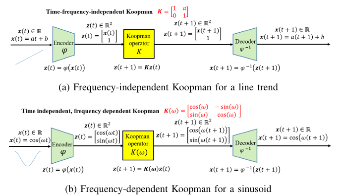
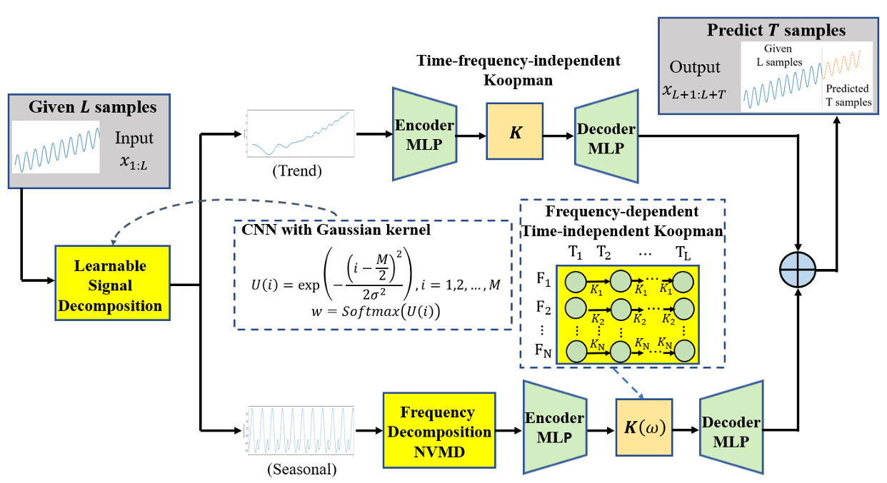
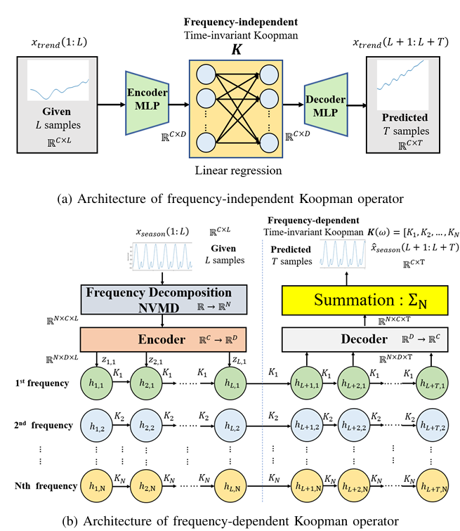

# End-to-End Neural Decomposition with Koopman Operators for Time-Series Forecasting

## Abstract

Lý thuyết **Koopman** biểu diễn động lực phi tuyến dưới dạng một phép tiến hóa tuyến tính trong không gian đặc trưng nâng cao. Tuy nhiên, Koopman operator thường có **vô hạn chiều** và giả định hệ thống **bất biến theo thời gian**, nên khó mô hình hóa các chuỗi thời gian phi dừng và có hành vi phụ thuộc tần số. 

Bài báo đề xuất **Neural Decomposition Koopman (NDKoop)**, một kiến trúc end-to-end kết hợp **signal decomposition** với hai loại Koopman network:

* **Frequency-independent Koopman**: mô hình hóa thành phần **trend**, sử dụng một Koopman operator bất biến theo thời gian.
* **Frequency-dependent Koopman**: mô hình hóa thành phần **periodic/seasonal**, trong đó mỗi thành phần tần số có một Koopman operator riêng.

NDKoop trước tiên tách tín hiệu thành **trend** và **seasonal**, sau đó tiếp tục phân rã thành phần seasonal thành các mode tần số bằng **Neural Variational Mode Decomposition (NVMD)**. Các thành phần này được đưa vào không gian latent, nơi động lực được mô hình hóa bằng các Koopman operator tương ứng. 

Điểm đóng góp chính của bài báo là **kết hợp signal decomposition và Koopman modeling trong một kiến trúc neural end-to-end có thể học được**. Thực nghiệm trên ECL, ETTh2, ILI và ECG cho thấy NDKoop đạt hiệu quả dự báo tốt trên phần lớn các horizon, đồng thời có sự cân bằng tốt giữa **accuracy, computational cost và memory usage**. 

---

## Introduction

Dự báo và phân tích các hệ động lực phi tuyến là bài toán khó trong nhiều lĩnh vực. **Koopman theory** cung cấp một cách tiếp cận bằng cách biểu diễn động lực phi tuyến thành **linear evolution** trong một không gian các measurement functions. Tuy nhiên, không gian này thường có vô hạn chiều nên không thể xây dựng trực tiếp trong thực tế, buộc phải sử dụng các xấp xỉ hữu hạn chiều. 

**Dynamic Mode Decomposition (DMD)** là một phương pháp hiệu quả để xấp xỉ Koopman operator, nhưng có một số hạn chế:

* Nhạy với measurement noise.
* Khó mô hình hóa động lực phi tuyến mạnh hoặc transient.
* Phụ thuộc vào một tập linear observables cố định.

Các phương pháp deep learning như **DLinear** có khả năng dự báo chuỗi thời gian hiệu quả nhưng thường thiếu cơ chế biểu diễn rõ ràng cấu trúc động lực theo thời gian, đặc biệt với **long-range dependencies** và **nonstationary dynamics**. Transformer như **PatchTST** cải thiện dự báo dài hạn nhưng vẫn có chi phí tính toán cao và có thể gặp vấn đề khi dữ liệu thay đổi phân phối. 

Các phương pháp Koopman như **Koopa** có ưu điểm là mô hình hóa trực tiếp động lực của hệ thống và cung cấp latent state transitions có tính diễn giải. Tuy nhiên, Koopa sử dụng **Fourier filtering với các frequency threshold được thiết kế thủ công**, làm giảm khả năng thích nghi giữa các dataset và trong điều kiện nhiễu hoặc nonstationarity mạnh. 

Để giải quyết các vấn đề trên, bài báo đề xuất **NDKoop**, kết hợp:

1. **Neural networks** để học các biểu diễn và phép biến đổi cần thiết.
2. **Signal decomposition** để tách các loại động lực khác nhau.
3. **Koopman operators** để mô hình hóa evolution tuyến tính trong latent space.

Cụ thể, tín hiệu được phân tách thành **trend component** và **seasonal component**. Trend được mô hình hóa bằng **frequency-independent Koopman operator**, trong khi seasonal được phân rã thành nhiều frequency components và mỗi component được mô hình hóa bằng một **frequency-dependent Koopman operator**. 

Ý tưởng cốt lõi của NDKoop là: **thay vì ép toàn bộ chuỗi thời gian vào một Koopman operator duy nhất, mô hình tách các dạng động lực khác nhau trước rồi sử dụng Koopman operator phù hợp cho từng loại**. Điều này giúp mô hình hóa tốt hơn các chuỗi thời gian **nonlinear, nonstationary và frequency-varying**, đồng thời giữ được tính diễn giải của Koopman framework. 

## Proposed Neural Decomposition Koopman (NDKoop) Framework

NDKoop giải quyết bài toán dự báo chuỗi thời gian bằng cách **phân rã tín hiệu trước**, sau đó sử dụng các Koopman operator khác nhau để mô hình hóa từng loại động lực. Framework gồm **learnable signal decomposition**, **NVMD** và hai Koopman NN: frequency-independent và frequency-dependent. 

### A. Problem Statement

Xét một hệ động lực rời rạc tạo ra chuỗi trạng thái ẩn:

$${x_k}_{k=1}^{L}$$

Trạng thái $x_k$ không được quan sát trực tiếp. Thay vào đó, ta quan sát:

$$y_k=g(x_k)$$

Trong đó $g$ là một observation function chưa biết.

Bài toán forecasting là: từ **đoạn quan sát quá khứ**:

$$y_1,y_2,\ldots,y_L$$

dự đoán **$T$ bước tiếp theo**:

$$y_{L+1},y_{L+2},\ldots,y_{L+T}$$

Điểm quan trọng là NDKoop không mô hình hóa trực tiếp toàn bộ tín hiệu bằng một Koopman operator duy nhất mà **phân tách các thành phần động lực trước khi dự báo**. 

---

### B. Fundamentals of Frequency-Independent and Frequency-Dependent Koopman Operators

Koopman operator biến động lực phi tuyến trong observation space thành **động lực tuyến tính trong latent space**.

Có hai trường hợp chính:

#### Frequency-Independent Koopman

Phù hợp với các tín hiệu **trend hoặc biến đổi chậm**, trong đó động lực có thể được mô hình hóa bởi một operator bất biến theo thời gian.

Ví dụ với linear trend:

$$x(t)=at+b$$

Tín hiệu được nâng lên latent space:

$$z(t)=\begin{bmatrix}x(t)\\1\end{bmatrix}$$

và được điều khiển bởi Koopman operator:

$$K=\begin{bmatrix}1&a\\0&1\end{bmatrix}$$

Do đó, cùng một operator $K$ có thể được sử dụng để tiến hóa latent state theo thời gian. 

#### Frequency-Dependent Koopman

Phù hợp với **oscillatory/periodic signals**, trong đó động lực phụ thuộc vào tần số.

Với tín hiệu:

$$x(t)=\cos(\omega t)$$

latent representation là:

$$z(t)=\begin{bmatrix}\cos(\omega t)\\sin(\omega t)\end{bmatrix}$$

và Koopman operator phụ thuộc vào angular frequency $\omega$:

$$K(\omega)=\begin{bmatrix}\cos(\omega t)&-\sin(\omega t)\\sin(\omega t)&\cos(\omega t)\end{bmatrix}$$

Vì vậy, các frequency components khác nhau có thể được mô hình hóa bởi các Koopman operators tương ứng. 

**Ý chính:** frequency-independent Koopman dùng cho **trend/global dynamics**, còn frequency-dependent Koopman dùng cho **periodic/frequency-specific dynamics**.

---

### C. Architecture of the NDKoop System

NDKoop gồm ba thành phần chính:

1. **Learnable Signal Decomposition**
2. **Frequency Decomposition bằng NVMD**
3. **Frequency-Independent và Frequency-Dependent Koopman NNs**

Luồng tổng quát:

$$x(t)\rightarrow\text{Signal Decomposition}\rightarrow{\text{Trend},\text{Seasonal}}\rightarrow\text{Koopman Networks}\rightarrow\hat{x}(t)$$

    Fig. 1. Frequency-independent and frequency-dependent Koopman

#### 1. Learnable Signal Decomposition Module

NDKoop sử dụng một **1D convolutional kernel** để học cách phân tách tín hiệu.

Kernel có:

* stride $S=2$
* kernel size $M=20$
* trọng số được khởi tạo theo Gaussian distribution.

Trọng số kernel được chuẩn hóa bằng Softmax:

$$w=\operatorname{Softmax}(U)$$

Module tạo ra hai thành phần:

$$x_{\text{trend}}(t)=LSD(x(t))$$

$$x_{\text{season}}(t)=x(t)-x_{\text{trend}}(t)$$

Trong đó:

* $x_{\text{trend}}$: thành phần **long-term trend**.
* $x_{\text{season}}$: phần **periodic/seasonal residual**.

So với moving average, Gaussian kernel tạo weighting mượt hơn, tập trung nhiều hơn vào các mẫu trung tâm và giảm boundary artifacts. 

---

#### 2. Frequency Decomposition NVMD Module

Seasonal component tiếp tục được phân rã thành nhiều **frequency modes**.

VMD biểu diễn tín hiệu:

$$x(t)=\sum_{i=1}^{N}u_i(t)$$

trong đó mỗi $u_i(t)$ tập trung quanh một **center frequency** và có dạng gần sinusoidal:

$$u_i(t)=A_i(t)\cos(\phi_i(t))$$

Vấn đề của VMD truyền thống là phải thực hiện **iterative optimization**, dẫn đến chi phí tính toán cao.

NDKoop thay thế VMD bằng **Neural Variational Mode Decomposition (NVMD)**, một neural-network surrogate nhằm xấp xỉ hành vi của VMD nhưng giảm đáng kể computational complexity. 

Kết quả là seasonal signal được phân thành:

$$x_{\text{season}}\rightarrow{u_1,u_2,\ldots,u_N}$$

Mỗi $u_i$ tương ứng với một oscillatory frequency mode và sau đó được đưa vào Koopman network riêng theo frequency. 

    Fig. 2. The propesed NDKoop framework.

    Fig. 3. Frequency-independent and dependent Koopman NNs

---

#### 3. Frequency-Independent and Frequency-Dependent Koopman NNs

NDKoop sử dụng **hai Koopman networks** cho hai loại dynamics.

**Frequency-independent Koopman NN** (Fig. 3. a)

Trend sequence được encoder bằng MLP:

$$x_{\text{trend}}\rightarrow z$$

Trong latent space, dynamics được điều khiển bởi một time-invariant Koopman operator:

$$z_{k+1}=Kz_k$$

Operator $K$ được dùng chung qua các time steps và thực hiện recursive propagation để dự báo trend trong tương lai. Sau đó decoder đưa latent states trở lại signal space:

$$z\rightarrow\hat{x}_{\text{trend}}$$

**Frequency-dependent Koopman NN** (Fig. 3. b)

Seasonal signal sau NVMD tạo ra $N$ frequency components. Mỗi component được encoder vào một latent space chung và được gán một Koopman operator tương ứng:

$$h_{k+1,n}=K_nh_{k,n}+z_{k,n}$$

Trong giai đoạn forecasting, input mới không còn được đưa vào, nên:

$$h_{k+1,n}=K_nh_{k,n}$$

Các latent trajectories của từng frequency được decoder rồi cộng lại để tạo seasonal forecast:

$$\hat{x}*{\text{season}}=\sum*{n=1}^{N}\hat{x}_n$$

Cuối cùng, trend và seasonal forecast được kết hợp:

$$\hat{x}=\hat{x}*{\text{trend}}+\hat{x}*{\text{season}}$$

**Tóm lại:** NDKoop chia bài toán thành **trend → một Koopman operator chung** và **seasonal → nhiều frequency-specific Koopman operators**, sau đó cộng các dự báo lại để tạo forecast cuối cùng.

## D. Forecasting Objective

NDKoop tối ưu **toàn bộ kiến trúc end-to-end** bằng cách đồng thời học:

* Learnable signal decomposition.
* Encoder và decoder.
* NVMD.
* Frequency-independent Koopman operator.
* Frequency-dependent Koopman operators.

Các tham số được tối ưu bằng cách **tối thiểu hóa Mean Squared Error (MSE)** giữa chuỗi dự báo và ground truth:

$$\min_{\theta_{LD},\theta_E,\theta_D,\theta_{NVMD},K,K(\omega)}\mathcal{L}_{MSE}(\hat{y},y)$$

Mục tiêu là để toàn bộ các thành phần của NDKoop cùng học một cách nhất quán, thay vì huấn luyện signal decomposition và Koopman modeling một cách độc lập. 

---

# Experiments

## A. Experimental Setup

NDKoop được đánh giá trên **4 benchmark time-series thực tế**:

* **ECL**
* **ETTh2**
* **ILI**
* **ECG (MIT-BIH)**

Các dataset được xử lý và chia train/test theo thiết lập của **Koopa**. 

Thay vì sử dụng một lookback window cố định, tác giả đặt:

$$L=2T$$

với $T$ là forecasting horizon. Điều này cho phép mô hình sử dụng lịch sử dài hơn khi horizon dự báo tăng.

NDKoop được so sánh với ba nhóm baseline chính:

* **PatchTST** — Transformer-based.
* **DLinear** — MLP/linear-based.
* **Koopa** — Koopman-based.

Mỗi thí nghiệm được chạy với **3 random seeds**, sau đó lấy kết quả trung bình trên test set. 

---

## B. Performance Evaluation Criteria

Hai metric chính được sử dụng là:

### MSE

$$MSE=\frac{1}{T}\sum_{i=1}^{T}(y_i-\hat{y}_i)^2$$

MSE đo **sai số bình phương trung bình** giữa prediction và ground truth.

### MAE

$$MAE=\frac{1}{T}\sum_{i=1}^{T}|y_i-\hat{y}_i|$$

MAE đo **sai số tuyệt đối trung bình**.

Với cả hai metric, **giá trị càng nhỏ thì forecasting càng tốt**. 

Tác giả cũng lưu ý rằng MSE và MAE chưa đánh giá đầy đủ các khía cạnh như **correlation, similarity và signal quality**; các metric này có thể được bổ sung trong nghiên cứu tương lai. 

---

## C. Experimental Results

NDKoop đạt **kết quả tốt nhất trên phần lớn dataset và forecasting horizons**, đặc biệt xét theo MSE. 

### ECL

NDKoop đạt MSE và MAE thấp nhất ở **tất cả các forecasting horizons** từ $T=48$ đến $192$.

Khoảng cách với các baseline tăng khi forecasting horizon dài hơn, cho thấy NDKoop có lợi thế trong **long-term forecasting**.

### ETTh2

NDKoop tiếp tục đạt kết quả tốt nhất ở **tất cả các horizons**.

Khi horizon tăng, lợi thế của NDKoop so với Koopa, PatchTST và DLinear cũng rõ rệt hơn.

### ILI

ILI có mức độ **nonstationarity cao**. NDKoop cho thấy lợi thế đáng kể so với các baseline, đặc biệt trong **long-term forecasting**.

Đây là kết quả quan trọng vì nó cho thấy decomposition + frequency-specific Koopman có khả năng xử lý tốt hơn các temporal dynamics thay đổi theo thời gian. 

### ECG

NDKoop đạt sai số thấp nhất ở **phần lớn forecasting horizons**, cho thấy khả năng mô hình hóa các **complex biomedical time-series dynamics**.

---

### So sánh tổng thể

NDKoop có **13 lần đạt hạng nhất** trên các thiết lập đánh giá trong bảng kết quả, so với:

* Koopa: **3 lần**
* PatchTST: **0 lần**
* DLinear: **0 lần**

Điểm nổi bật của NDKoop là khả năng duy trì accuracy khi horizon tăng. Trong khi đó, **PatchTST và Koopa có xu hướng giảm hiệu năng nhanh hơn ở các horizon dài**.

Về efficiency, NDKoop đạt:

* **MSE thấp nhất**
* **Training time ngắn nhất**
* **Memory usage thấp hơn Transformer-based baselines**

PatchTST có accuracy cạnh tranh nhưng chi phí memory và computation cao hơn do **quadratic attention complexity**. Koopa cũng có computational cost cao hơn do sử dụng nhiều neural operators và frequency decomposition stages. DLinear rất nhẹ nhưng khả năng biểu diễn hạn chế nên accuracy thấp hơn. 

**Kết luận của thực nghiệm:** NDKoop đạt sự cân bằng tốt giữa **forecasting accuracy, computational efficiency và memory usage**, đồng thời decomposition theo frequency giúp mô hình hóa tốt hơn các chuỗi thời gian **nonstationary và phức tạp**.
