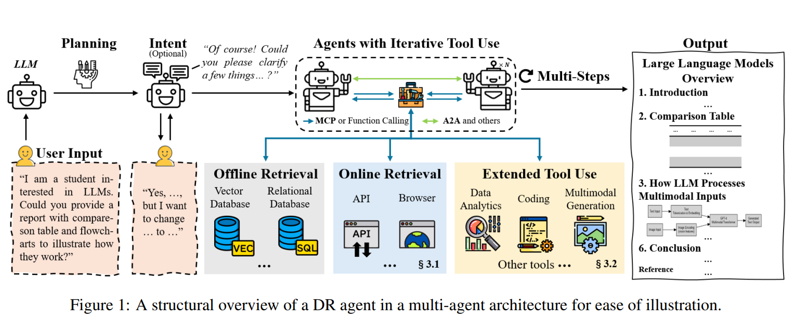
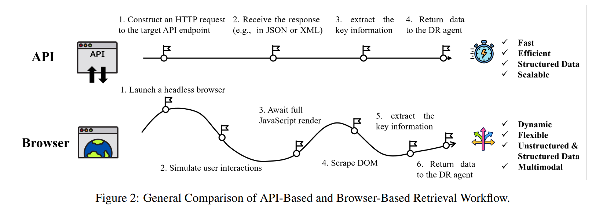
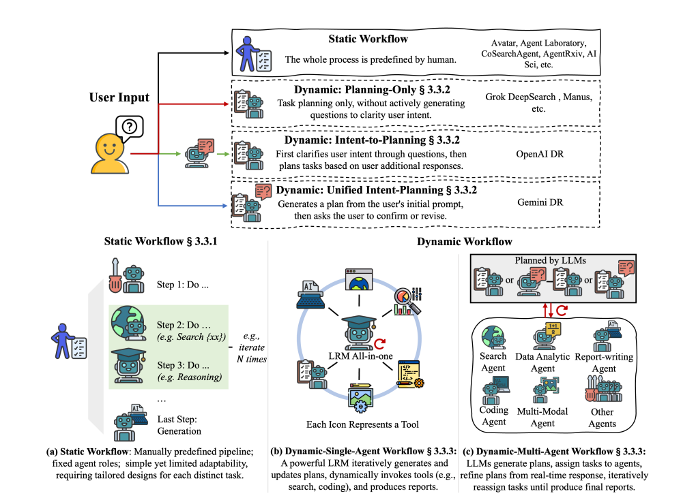
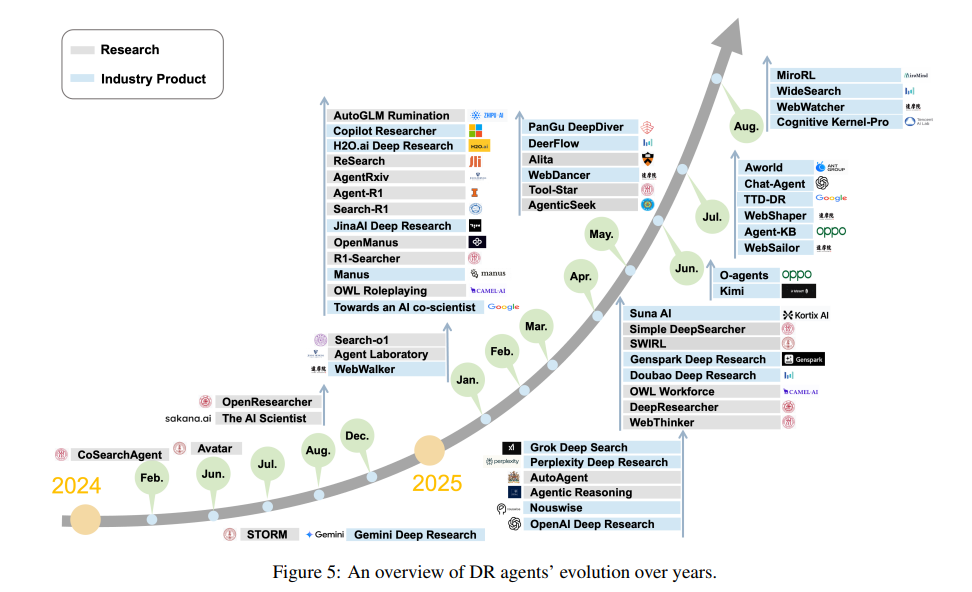

# Deep Research Agents: Cấu trúc, Kiến trúc và Taxonomy

> Dựa trên: Yuxuan Huang et al., *Deep Research Agents: A Systematic Examination and Roadmap*, arXiv:2506.18096.

---

## 1. Tổng quan

Large Language Models (LLMs) ban đầu chủ yếu giải quyết các nhiệm vụ như question answering, generation hoặc reasoning trên thông tin đã được học trong quá trình pre-training.

Tuy nhiên, các nhiệm vụ nghiên cứu thực tế thường có ba đặc điểm:

1. thông tin cần thiết nằm bên ngoài tham số của LLM;
2. câu hỏi có thể yêu cầu nhiều bước reasoning và retrieval;
3. quá trình giải quyết cần thay đổi theo thông tin mới được phát hiện.

Từ đó xuất hiện **Deep Research Agent (DR Agent)**.



Paper định nghĩa DR Agent là một hệ thống sử dụng LLM làm lõi nhận thức, kết hợp:

* dynamic reasoning;
* adaptive planning;
* external information retrieval;
* iterative tool use;
* information synthesis;

để giải quyết các nhiệm vụ nghiên cứu mở và phức tạp.

Khác với một pipeline RAG đơn giản:

$$
\text{Query}
\rightarrow
\text{Retrieve}
\rightarrow
\text{Generate},
$$

Deep Research có thể thực hiện một vòng lặp dài:

$$
\text{Reason}
\rightarrow
\text{Plan}
\rightarrow
\text{Search}
\rightarrow
\text{Observe}
\rightarrow
\text{Reason}
\rightarrow
\text{Tool Use}
\rightarrow
\text{Re-plan}
\rightarrow
\cdots
\rightarrow
\text{Synthesize}.
$$

Do đó, DR Agent nên được xem là **một hệ thống agentic research workflow**, thay vì chỉ là một mô hình language model có khả năng search.

---

# 2. Kiến trúc tổng quát của Deep Research Agent

Có thể mô hình hóa một DR Agent ở mức khái niệm như sau:

```text
                    User Query
                        │
                        ▼
              ┌───────────────────┐
              │ Intent / Planning │
              └─────────┬─────────┘
                        │
                        ▼
                ┌───────────────┐
                │   LLM / LRM   │
                │ Reasoning Core │
                └───────┬───────┘
                        │
             ┌──────────┼──────────┐
             ▼          ▼          ▼
         Retrieval     Tools      Memory
             │          │          │
             ├── API    ├── Code   ├── Context
             ├── Web    ├── Data   ├── Summary
             └── RAG    └── MM     └── Storage
             │          │          │
             └──────────┼──────────┘
                        ▼
                  Observation
                        │
                        ▼
                   Re-reasoning
                        │
                        ▼
                   Re-planning
                        │
                       ...
                        │
                        ▼
                Structured Report
```

Có thể viết vòng lặp agent dưới dạng:

$$
S_t
\overset{\pi_\theta}{\longrightarrow}
A_t
\overset{\mathcal{E}}{\longrightarrow}
O_t,
$$

trong đó:

* $S_t$ là trạng thái nghiên cứu tại bước $t$;
* $\pi_\theta$ là policy của agent;
* $A_t$ là action;
* $\mathcal{E}$ là môi trường bên ngoài;
* $O_t$ là observation thu được sau action.

Trạng thái tiếp theo được cập nhật:

$$
S_{t+1}
=
f(S_t,A_t,O_t).
$$

Do đó, DR Agent không chỉ sinh câu trả lời mà liên tục cập nhật trạng thái nghiên cứu.

---

# 3. Information Acquisition

## 3.1. API-based Retrieval

API-based retrieval cho phép agent truy cập trực tiếp các nguồn dữ liệu có cấu trúc.



Ví dụ:

```text
Agent
  │
  ├── Search API
  ├── Wikipedia API
  ├── arXiv API
  ├── News API
  └── Database API
```

Có thể mô hình hóa:

$$
D_t = R_{\text{API}}(q_t),
$$

trong đó:

* $q_t$ là truy vấn tại bước $t$;
* $R_{\text{API}}$ là retrieval function;
* $D_t$ là dữ liệu thu được.

Ưu điểm chính:

* latency thấp;
* chi phí tính toán thấp;
* dễ kiểm soát;
* dễ mở rộng.

Nhược điểm là API chỉ có thể truy cập những thông tin được expose thông qua interface.

---

## 3.2. Browser-based Retrieval

Browser-based agent có khả năng tương tác trực tiếp với web:

$$
q_t
\rightarrow
\text{Search}
\rightarrow
\text{Open Page}
\rightarrow
\text{Navigate}
\rightarrow
\text{Extract}
\rightarrow
\text{Reason}.
$$

Không giống API retrieval, browser agent có thể:

* mở trang;
* theo hyperlink;
* đọc nội dung động;
* khám phá các nguồn liên quan;
* truy cập thông tin nằm sâu trong website.

Do đó browser retrieval phù hợp với các nhiệm vụ yêu cầu **open-ended exploration**.

Đổi lại, nó có latency và độ phức tạp cao hơn.

---

## 3.3. Hybrid Retrieval

Một kiến trúc thực tế có thể kết hợp cả hai:

$$
R(q)
=
R_{\text{API}}(q)
\cup
R_{\text{Browser}}(q).
$$

API được sử dụng cho retrieval nhanh và có cấu trúc.

Browser được kích hoạt khi:

* API không đủ thông tin;
* cần truy cập nội dung sâu;
* cần thông tin realtime;
* cần navigation.

Đây là một trong những hướng kiến trúc quan trọng mà survey chỉ ra.

---

# 4. Tool Use

DR Agent mở rộng khả năng của LLM thông qua các external tools.

Ba nhóm tool chính gồm:

```text
Tool Use
│
├── Code Interpreter
├── Data Analytics
└── Multimodal Processing
```

## 4.1. Code Interpreter

Agent có thể sinh và thực thi code trong quá trình reasoning:

$$
\text{Reason}
\rightarrow
\text{Generate Code}
\rightarrow
\text{Execute}
\rightarrow
\text{Observe Result}
\rightarrow
\text{Reason}.
$$

Điều này cho phép agent thực hiện:

* tính toán;
* xử lý dữ liệu;
* kiểm chứng giả thuyết;
* mô phỏng;
* phân tích thuật toán.

Code execution biến LLM từ một hệ thống chỉ sinh text thành một hệ thống có khả năng **thực nghiệm trong quá trình suy luận**.

---

## 4.2. Data Analytics

Raw information có thể được chuyển thành structured evidence:

$$
D
\rightarrow
\text{Statistics}
\rightarrow
\text{Visualization}
\rightarrow
\text{Analysis}
\rightarrow
\text{Insight}.
$$

Agent có thể sử dụng:

* statistical analysis;
* SQL;
* bảng;
* biểu đồ;
* quantitative evaluation.

Điều này đặc biệt quan trọng với các nhiệm vụ nghiên cứu có dữ liệu định lượng.

---

## 4.3. Multimodal Processing

Thông tin nghiên cứu không chỉ tồn tại dưới dạng text.

Agent có thể cần xử lý:

$$
X =
\{
X_{\text{text}},
X_{\text{image}},
X_{\text{table}},
X_{\text{code}},
X_{\text{audio/video}}
\}.
$$

Mục tiêu là đưa các modality khác nhau vào cùng một reasoning workflow.

---

# 5. Workflow Architecture

Đây là phần taxonomy quan trọng nhất của paper.

Workflow được chia thành:

$$
\boxed{
\text{Static}
\quad\text{vs.}\quad
\text{Dynamic}
}
$$

---

## 5.1. Static Workflow

Static workflow định nghĩa trước toàn bộ pipeline.

$$
T_1
\rightarrow
T_2
\rightarrow
T_3
\rightarrow
\cdots
\rightarrow
T_n.
$$

Ví dụ:

```text
Literature Search
      ↓
Experiment
      ↓
Analysis
      ↓
Report
```

Ưu điểm:

* dễ triển khai;
* dễ debug;
* hành vi dễ dự đoán.

Nhược điểm:

$$
\text{Fixed Workflow}
\Rightarrow
\text{Low Adaptability}.
$$

Nếu task thay đổi đáng kể, pipeline phải được thiết kế lại.

---

# 6. Dynamic Workflow

Dynamic workflow cho phép LLM tự quyết định:

* cần tìm gì;
* tìm bao nhiêu lần;
* sử dụng tool nào;
* khi nào dừng;
* có cần thay đổi kế hoạch hay không.



Có thể biểu diễn:

$$
P_t
=
f_\theta
\left(
Q,
O_{1:t-1},
M_t
\right).
$$

Sau khi nhận observation mới:

$$
P_t
\rightarrow
A_t
\rightarrow
O_t
\rightarrow
P_{t+1}.
$$

Do đó:

$$
P_{t+1}
\neq
P_t
$$

là hoàn toàn có thể xảy ra.

Đây chính là điểm khác biệt quan trọng giữa **predefined pipeline** và **agentic workflow**.

---

# 7. Planning Strategies

Paper phân loại dynamic planning thành ba kiến trúc.

## 7.1. Planning-only

Agent lập kế hoạch trực tiếp từ user query:

$$
Q
\rightarrow
P
\rightarrow
Execution.
$$

Không có bước clarification riêng.

Ưu điểm:

* đơn giản;
* nhanh;
* phù hợp với task có intent rõ ràng.

Nhược điểm:

* có nguy cơ hiểu sai mục tiêu nghiên cứu.

---

## 7.2. Intent-to-Planning

Agent xác định intent trước:

$$
Q
\rightarrow
I
\rightarrow
P
\rightarrow
Execution,
$$

trong đó $I$ là user intent.

Cách này phù hợp khi câu hỏi ban đầu có nhiều cách diễn giải.

---

## 7.3. Unified Intent-Planning

Agent tạo kế hoạch sơ bộ đồng thời tương tác với người dùng:

$$
Q
\rightarrow
(P_0,I)
\rightarrow
\text{User Feedback}
\rightarrow
P_1
\rightarrow
Execution.
$$

Ưu điểm:

$$
\text{LLM Planning}
+
\text{Human Feedback}.
$$

Nó cho phép giữ tính tự động của agent nhưng vẫn kiểm soát hướng nghiên cứu.

---

# 8. Single-Agent Architecture

Dynamic single-agent tích hợp toàn bộ quá trình vào một LLM/LRM:

```text
             ┌──────────────┐
             │   LLM / LRM  │
             └──────┬───────┘
                    │
        ┌───────────┼───────────┐
        ▼           ▼           ▼
      Plan        Reason       Tool
        │           │           │
        └───────────┼───────────┘
                    ▼
                Observe
                    │
                    ▼
                 Re-plan
                    │
                   ...
```

Có thể mô hình hóa:

$$
S_t
\rightarrow
\pi_\theta(S_t)
\rightarrow
A_t
\rightarrow
O_t
\rightarrow
S_{t+1}.
$$

Toàn bộ workflow có thể được tối ưu end-to-end.

### Ưu điểm

* kiến trúc đơn giản;
* reasoning thống nhất;
* dễ thực hiện end-to-end RL;
* ít overhead giao tiếp giữa các agent.

### Nhược điểm

* phụ thuộc mạnh vào backbone LLM;
* khó specialization;
* khó scale từng chức năng riêng biệt.

---

# 9. Multi-Agent Architecture

Multi-agent phân tách workflow thành nhiều agent chuyên biệt.

$$
Q
\rightarrow
\text{Planner}
\rightarrow
\{A_1,A_2,\ldots,A_n\}
\rightarrow
\text{Coordinator}
\rightarrow
\text{Synthesis}.
$$

Ví dụ:

```text
                  User Query
                       │
                       ▼
                ┌─────────────┐
                │   Planner   │
                └──────┬──────┘
                       │
        ┌──────────────┼──────────────┐
        ▼              ▼              ▼
   Researcher      Coder          Critic
        │              │              │
        └──────────────┼──────────────┘
                       ▼
                  Aggregation
                       │
                       ▼
                     Writer
                       │
                       ▼
                    Report
```

Multi-agent đặc biệt phù hợp khi:

$$
T =
\{T_1,T_2,\ldots,T_n\}
$$

có thể được thực hiện tương đối độc lập:

$$
T_i \parallel T_j.
$$

Do đó có tiềm năng giảm thời gian bằng parallel execution.

### Ưu điểm

* specialization;
* parallelism;
* modularity;
* scalability.

### Nhược điểm

Coordination trở thành vấn đề lớn:

$$
\text{Complexity}
\propto
N_{\text{agents}}
+
N_{\text{interactions}}.
$$

Ngoài ra, multi-agent khó tối ưu end-to-end bằng RL vì reward của toàn hệ thống phải được phân bổ cho nhiều agent.

---

# 10. Memory Architecture

Deep Research thường tạo ra lượng context rất lớn:

$$
D_1,D_2,\ldots,D_T.
$$

Nếu đưa toàn bộ vào context:

$$
C_T
=
[D_1,D_2,\ldots,D_T],
$$

chi phí inference sẽ tăng mạnh.

Paper đưa ra ba hướng xử lý.

## 10.1. Context Window Expansion

Tăng kích thước context:

$$
|C|
\uparrow
\Rightarrow
\text{More Information Preserved}.
$$

Nhưng:

$$
\text{Cost}
\uparrow.
$$

---

## 10.2. Intermediate Compression

Thay vì giữ toàn bộ dữ liệu:

$$
D_{1:t}
\rightarrow
\text{Summary}(D_{1:t})
=
S_t.
$$

Agent tiếp tục reasoning trên $S_t$:

$$
S_t
\rightarrow
\text{Reason}
\rightarrow
A_t.
$$

Ưu điểm là giảm token.

Nhược điểm:

$$
\text{Compression}
\Rightarrow
\text{Potential Information Loss}.
$$

---

## 10.3. External Structured Storage

Thông tin được đưa ra ngoài context window:

```text
Agent
  │
  ▼
External Memory
  ├── File System
  ├── Vector Database
  ├── Knowledge Graph
  └── Shared Knowledge Base
```

Agent chỉ retrieve phần cần thiết:

$$
M
\xrightarrow{\text{Retrieve}(q_t)}
m_t
\rightarrow
\text{Context}.
$$

Đây là cách mở rộng memory mà không yêu cầu toàn bộ lịch sử phải nằm trong context window.

---

# 11. MCP và A2A

Paper xem **Model Context Protocol (MCP)** và **Agent-to-Agent (A2A)** là hai lớp hạ tầng có vai trò khác nhau.

### MCP

MCP giải quyết:

$$
\text{Agent}
\leftrightarrow
\text{External Tools / Services}.
$$

Mục tiêu là chuẩn hóa cách agent khám phá và sử dụng tools.

### A2A

A2A giải quyết:

$$
\text{Agent}_i
\leftrightarrow
\text{Agent}_j.
$$

Nó hỗ trợ agent discovery, delegation và task coordination.

Do đó:

$$
\boxed{
\text{MCP} = \text{Tool Interoperability}
}
$$

$$
\boxed{
\text{A2A} = \text{Agent Collaboration}
}
$$

Hai giao thức bổ sung cho nhau trong hệ sinh thái agent mở rộng.

---

# 12. Optimization

Paper tiếp tục xem xét cách nâng cao năng lực của DR Agent.

Có thể chia thành:

$$
\text{Optimization}
=
\{
\text{Prompting},
\text{SFT},
\text{RL}
\}.
$$

---

## 12.1. Prompt-based Optimization

Không thay đổi tham số LLM:

$$
\theta'=\theta.
$$

Chỉ thay đổi prompt/workflow.

Ưu điểm:

* chi phí thấp;
* triển khai nhanh.

Nhược điểm:

$$
\text{Agent Capability}
\leq
\text{Backbone Capability}.
$$

---

## 12.2. Supervised Fine-Tuning

Agent được học từ demonstration:

$$
\mathcal{D}
=
\{
(Q_i,\tau_i)
\}_{i=1}^{N},
$$

trong đó $\tau_i$ là trajectory mong muốn.

Mục tiêu:

$$
\theta^*
=
\arg\min_\theta
\mathcal{L}_{\text{SFT}}(\theta;\mathcal{D}).
$$

SFT giúp agent học:

* search strategy;
* tool invocation;
* reasoning pattern;
* task decomposition.

---

# 13. Reinforcement Learning

RL xem research workflow như một sequential decision process.

$$
S_t
\rightarrow
A_t
\rightarrow
R_t
\rightarrow
S_{t+1}.
$$

Mục tiêu:

$$
\theta^*
=
\arg\max_\theta
\mathbb{E}_{\tau\sim\pi_\theta}
\left[
\sum_{t=1}^{T}
\gamma^{t-1}r_t
\right].
$$

Reward có thể phản ánh:

* retrieval relevance;
* answer correctness;
* successful tool use;
* research outcome.

Paper chỉ ra một xu hướng đáng chú ý là các nghiên cứu open-source ngày càng sử dụng **GRPO** và các biến thể RL để tối ưu search/reasoning/tool interaction.

---

# 14. Non-parametric Continual Learning

Một ý tưởng khác của paper là agent không nhất thiết phải liên tục cập nhật model weights.

Thay vào đó:

$$
\boxed{
\text{Agent Improvement}
\neq
\text{Weight Update Only}
}
$$

Agent có thể tự cải thiện bằng cách cập nhật:

$$
\{
\text{Memory},
\text{Tools},
\text{Workflow},
\text{Experience}
\}.
$$

Có thể biểu diễn:

$$
M_{t+1}
=
f(M_t,\tau_t),
$$

trong đó $\tau_t$ là trajectory của task vừa hoàn thành.

Như vậy, knowledge và experience có thể được tích lũy bên ngoài model parameters.

Đây là hướng quan trọng để xây dựng agent có khả năng **self-improvement lâu dài**.

---

# 15. So sánh RAG và Deep Research

Sự khác biệt cốt lõi có thể tóm tắt:

| Thành phần        | Conventional RAG       | Deep Research Agent                     |
| ----------------- | ---------------------- | --------------------------------------- |
| Retrieval         | Thường static          | Dynamic / iterative                     |
| Planning          | Hạn chế                | Adaptive                                |
| Reasoning         | Một hoặc vài bước      | Long-horizon                            |
| Tool use          | Hạn chế                | Core capability                         |
| Browser           | Không bắt buộc         | Có thể là thành phần chính              |
| Memory            | Context / vector DB    | Context + compression + external memory |
| Workflow          | Predefined             | Có thể tự thay đổi                      |
| Agent composition | Thường single pipeline | Single hoặc multi-agent                 |
| Output            | Answer                 | Structured research report              |

Có thể cô đọng thành:

$$
\boxed{
\text{RAG}
=
\text{Retrieve}
+
\text{Generate}
}
$$

trong khi:

$$
\boxed{
\text{Deep Research}
=
\text{Reason}
+
\text{Plan}
+
\text{Retrieve}
+
\text{Tool}
+
\text{Observe}
+
\text{Re-plan}
+
\text{Synthesize}
}
$$

---

# 16. Evaluation



Paper chia benchmark thành hai nhóm lớn.

## 16.1. Question Answering

Bao gồm:

* SimpleQA;
* TriviaQA;
* Natural Questions;
* HotpotQA;
* 2WikiMultiHopQA;
* Bamboogle;
* Humanity's Last Exam;
* BrowseComp.

Các benchmark này kiểm tra từ factual recall đến multi-hop reasoning và open-domain research.

Đặc biệt, HLE và BrowseComp vẫn là những bài toán khó đối với các DR Agent hiện tại.

---

## 16.2. Task Execution

Nhóm này đánh giá khả năng hoàn thành một workflow:

$$
\text{Plan}
\rightarrow
\text{Tool Use}
\rightarrow
\text{Execution}
\rightarrow
\text{Result}.
$$

Các benchmark tiêu biểu gồm:

* GAIA;
* AssistantBench;
* Magentic-One;
* SWE-bench;
* MLE-bench;
* ScienceAgentBench.

Điểm quan trọng là DR Agent không nên chỉ được đánh giá bằng **answer accuracy**.

Một hệ thống thực tế còn phải được đánh giá về:

$$
\text{Research Quality}
=
f(
\text{Correctness},
\text{Evidence},
\text{Coverage},
\text{Tool Use},
\text{Efficiency}
).
$$

---

# 17. Kiến trúc thống nhất

Từ taxonomy của paper, có thể tái cấu trúc DR Agent thành kiến trúc khái niệm sau:

```text
                         User Query
                             │
                             ▼
                   ┌──────────────────┐
                   │ Intent / Planner │
                   └────────┬─────────┘
                            │
                            ▼
                 ┌─────────────────────┐
                 │ Reasoning Core      │
                 │ LLM / LRM           │
                 └─────────┬───────────┘
                           │
             ┌─────────────┼─────────────┐
             │             │             │
             ▼             ▼             ▼
        Retrieval         Tools        Memory
             │             │             │
       ┌─────┴─────┐   ┌───┴────┐   ┌────┴────┐
       │           │   │        │   │         │
      API       Browser Code  Data Context External
       │           │   │        │   │         │
       └───────────┴───┴────────┴───┴─────────┘
                           │
                           ▼
                      Observation
                           │
                           ▼
                     Re-reasoning
                           │
                           ▼
                       Re-planning
                           │
                          ...
                           │
                           ▼
                     Evidence Pool
                           │
                           ▼
                       Synthesis
                           │
                           ▼
                  Structured Research Report
```

Trong multi-agent setting, reasoning core được mở rộng:

$$
\text{Planner}
\rightarrow
\{
\text{Searcher},
\text{Researcher},
\text{Coder},
\text{Analyst},
\text{Critic},
\text{Writer}
\}.
$$

Trong single-agent setting:

$$
\text{Planner}
=
\text{Researcher}
=
\text{Tool Caller}
=
\text{Reasoner}.
$$

Như vậy, single-agent và multi-agent không phải hai khái niệm hoàn toàn độc lập; chúng là **hai cách tổ chức execution layer bên trong dynamic workflow**.

---

# 18. Thông điệp cốt lõi của paper

Paper không muốn chứng minh rằng một kiến trúc neural network cụ thể tốt hơn kiến trúc khác.

Thông điệp chính là:

$$
\boxed{
\text{Deep Research}
\neq
\text{LLM + Search}
}
$$

Mà là:

$$
\boxed{
\text{Deep Research Agent}
=
\text{Reasoning}
+
\text{Adaptive Planning}
+
\text{Dynamic Retrieval}
+
\text{Tool Use}
+
\text{Memory}
+
\text{Iterative Execution}
}
$$

Trong đó **dynamic workflow** là trung tâm.

Một DR Agent mạnh cần có khả năng:

1. hiểu mục tiêu;
2. lập kế hoạch;
3. tìm kiếm thông tin;
4. sử dụng tools;
5. đánh giá observation;
6. thay đổi kế hoạch;
7. ghi nhớ thông tin quan trọng;
8. tổng hợp evidence;
9. tạo báo cáo có cấu trúc.

Do đó, sự phát triển của Deep Research đang dịch chuyển từ:

$$
\text{Static LLM Pipeline}
$$

sang:

$$
\text{Adaptive Agentic System}.
$$

---

# 19. Các vấn đề còn mở

Paper xác định một số hướng nghiên cứu quan trọng.

### 19.1. Information Acquisition

Cần mở rộng retrieval vượt ra ngoài các search engine và corpus truyền thống.

$$
\text{Web}
+
\text{API}
+
\text{Database}
+
\text{Specialized Sources}.
$$

### 19.2. Asynchronous Parallel Execution

Multi-agent hiện vẫn thường bị giới hạn bởi sequential coordination.

Cần hướng tới:

$$
T_1
\parallel
T_2
\parallel
\cdots
\parallel
T_n
$$

thay vì:

$$
T_1
\rightarrow
T_2
\rightarrow
\cdots
\rightarrow
T_n.
$$

### 19.3. Benchmark Alignment

Benchmark cần đánh giá toàn bộ research process thay vì chỉ final answer.

### 19.4. Multi-Agent Optimization

Cần giải quyết bài toán:

$$
\text{Coordination}
+
\text{Credit Assignment}
+
\text{End-to-End RL}.
$$

### 19.5. Multimodal Research

Future DR Agent cần xử lý thống nhất:

$$
\text{Text}
+
\text{Image}
+
\text{Table}
+
\text{Code}
+
\text{Other Modalities}.
$$

---

# 20. Kết luận

Đóng góp quan trọng nhất của *Deep Research Agents: A Systematic Examination and Roadmap* là **hệ thống hóa Deep Research thành một kiến trúc agentic nhiều tầng**, thay vì xem nó đơn thuần là một chatbot có khả năng tìm kiếm.

Taxonomy trung tâm có thể rút gọn thành:

$$
\boxed{
\begin{aligned}
\text{DR Agent}
&=
\text{Dynamic Workflow}\\
&\quad+
\text{Planning}\\
&\quad+
\text{Retrieval}\\
&\quad+
\text{Tool Use}\\
&\quad+
\text{Memory}\\
&\quad+
\text{Reasoning}\\
&\quad+
\text{Synthesis}.
\end{aligned}
}
$$

Trong đó:

$$
\boxed{
\text{Static}
\rightarrow
\text{Dynamic}
}
$$

là chuyển dịch về workflow,

$$
\boxed{
\text{Single-Agent}
\leftrightarrow
\text{Multi-Agent}
}
$$

là chuyển dịch về cách tổ chức execution,

và

$$
\boxed{
\text{Prompting}
\rightarrow
\text{SFT}
\rightarrow
\text{RL}
\rightarrow
\text{Continual Self-Improvement}
}
$$

là chuyển dịch về cách tối ưu agent.

Vì vậy, có thể xem paper như một **bản đồ kiến trúc của Deep Research Agent**: nó không đề xuất một model duy nhất, mà chỉ ra những thành phần cần kết hợp để biến một LLM thành một hệ thống có khả năng **tự lập kế hoạch, tìm kiếm, sử dụng công cụ, tích lũy evidence, tự điều chỉnh và cuối cùng tạo ra một báo cáo nghiên cứu hoàn chỉnh**.
